# 理解随机变量和概率分布

> 原文：<https://towardsdatascience.com/understanding-random-variables-and-probability-distributions-1ed1daf2e66>

## 基本原则

# 理解随机变量和概率分布

## 机器学习中为什么要关心概率质量和密度函数？

照片由[阿尔佩伦·亚兹古](https://unsplash.com/@armato?utm_source=medium&utm_medium=referral)在 [Unsplash](https://unsplash.com?utm_source=medium&utm_medium=referral) 上拍摄

概率理论是研究随机现象的一个数学分支，通常被认为是机器学习的基本支柱之一。然而，这是一个很大的领域，很容易迷失，尤其是在自学的时候。

在接下来的章节中，我们将涉及一些与机器学习特别相关的基本方面——随机变量和概率分布。

但是在一头扎进概率论的深度之前，让我们试着回答为什么理解这些概念是重要的，为什么我们首先应该关心这个问题。

# 为什么是概率？

在机器学习中，我们经常处理不确定性和随机量，原因之一是不完全可观测性——因此，我们最有可能使用采样数据。

现在，假设我们想对随机变量的行为得出可靠的结论，尽管我们只有有限的数据，而且我们根本不知道整个人口。

因此，我们需要某种方法从抽样数据中归纳出总体数据，或者换句话说，我们需要估计真实的数据生成过程。

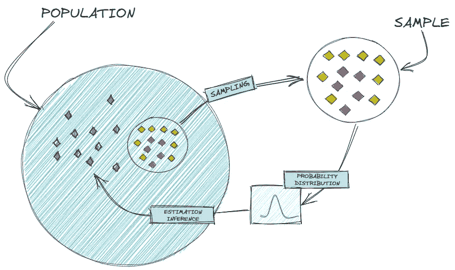

估计数据生成过程[图片由作者提供]

理解了概率分布，我们就可以通过计算结果的可变性来计算某个结果的概率。因此，它使我们能够从样本推广到总体，估计数据生成函数，并更准确地预测随机变量的行为。

# 引入随机变量

不严格地说，随机变量的值取决于随机事件的结果。我们也可以将其描述为从样本空间映射到可测空间(例如实数)的函数。

让我们假设，我们有一个包含 4 名学生`{A, B, C, D}`的样本空间。如果我们现在随机选取`student A`并以厘米为单位测量高度，我们可以把`random variable (H)`想象成以`student`为输入、`height`为输出的实数的函数。

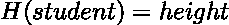

我们可以想象这个小例子如下:

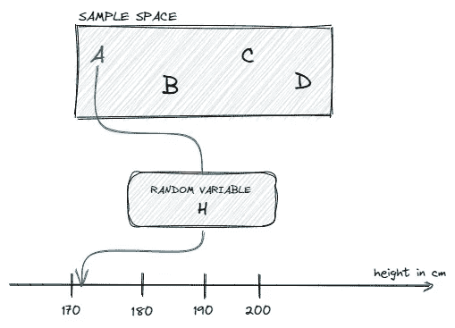

一个随机变量的例子[图片由作者提供]

根据结果——随机选择哪个学生——我们的随机变量(H)可以呈现不同的状态或以厘米为单位的不同身高值。

> 随机变量可以是离散的，也可以是连续的。

如果我们的随机变量只能取有限个或可数无限个不同的值，那么它就是离散的。离散随机变量的例子包括一个班级的学生人数、答对的试题、一个家庭的孩子数量等。

然而，我们的随机变量是连续的，如果在我们的变量的任意两个值之间有无限多的其他有效值。我们可以把压力、高度、质量和距离等量看作是连续随机变量的例子。

当我们把随机变量和概率分布联系起来时，我们可以回答下面的问题:随机变量有多大可能处于特定状态？这基本上和问概率是一样的。

现在，我们剩下一个问题——什么是概率分布？

# 概率分布

随机变量采取其可能状态的可能性的描述可以由概率分布给出。因此，概率分布是一个数学函数，它给出了实验不同结果的概率。

更一般地，它可以被描述为函数

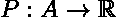

其将输入空间 A(与样本空间相关)映射到实数，即概率。

对于上述描述概率分布的函数，它必须遵循所有的 Kolmogorov 公理:

1.  非否定性
2.  没有概率超过 1
3.  任何可数不相交(互斥)事件的可加性

  

我们描述概率分布的方式取决于随机变量是离散的还是连续的，这将分别产生概率质量或密度函数。

# 概率质量函数

概率质量函数(PMF)描述了离散随机变量的概率分布。换句话说，它是一个函数，返回一个随机变量恰好等于一个特定值的概率。

返回的概率在[0，1]范围内，每个状态的所有概率之和等于 1。

让我们想象一个图，其中 x 轴描述状态，y 轴显示某个状态的概率。以这种方式思考可以让我们把概率或 PMF 想象成一个位于状态顶部的柱状图。

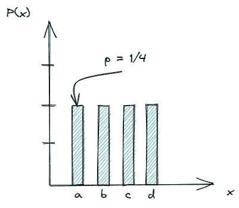

一个例子(制服)PMF[图片由作者提供]

下面，我们将学习三种常见的离散概率分布:伯努利分布、二项式分布和几何分布。

## 二项分布

伯努利分布以瑞士数学家雅各布·伯努利的名字命名，它是一个二元随机变量的离散概率分布，取值为 1 或 0。

不严格地说，我们可以将伯努利分布视为一个模型，它给出了一个实验的一组可能结果，可以用一个简单的是-否问题来回答。

更正式地，该函数可以表述为以下等式

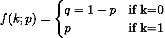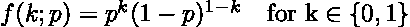

其基本上评估为`p if k=1`或`(1-p) if k=0`。因此，伯努利分布仅由一个`single parameter p`参数化。

假设，我们扔一次公平的硬币。获得人头的概率是`P(Heads) = 0.5`。将 PMF 形象化，我们得到如下的图:

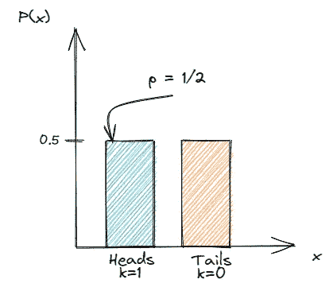

伯努利试验的一个例子[图片由作者提供]

> **注意**:伯努利分布要么取值 1，要么取值 0，这使得它作为一个指标或虚拟变量特别有用。

由于伯努利分布模型只有一次试验，它也可以被看作是二项分布的特殊情况。

## 二项分布

二项式分布描述了一系列 *n* 个独立试验中成功次数的离散概率分布，每个试验都有一个二元结果。成功或失败分别由概率 *p* 或*(1-p)**给出。*

因此，二项式分布由参数来参数化

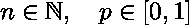

更正式地，二项式分布可以用下面的等式表示:

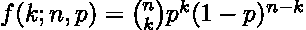

*k* 的成功由概率 *p* 的 *k 次幂*给出，而失败的概率由 *(1-p)* 的 *n 次幂*减去 *k* 给出，这基本上是试验次数减去我们得到 *k* 的一次试验。

由于成功的事件 *k* 可以发生在 *n* 试验中的任何地方，我们有[*【n 选 k】*](https://en.wikipedia.org/wiki/Binomial_coefficient)种方式来分配成功。

让我们拿起之前的抛硬币的例子，并在此基础上进行构建。

现在，我们将抛三次公平硬币，同时对描述获得的人头数的随机变量感兴趣。

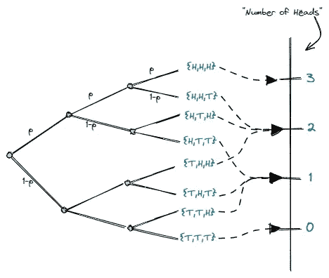

三次抛硬币的正面数量[图片由作者提供]

如果我们想计算硬币两次正面朝上的概率，我们可以简单地使用之前的等式，然后取值

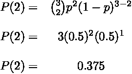

这导致了一个概率`P(2) = 0.375`。如果我们以同样的方式处理剩余的概率，我们得到下面的分布:

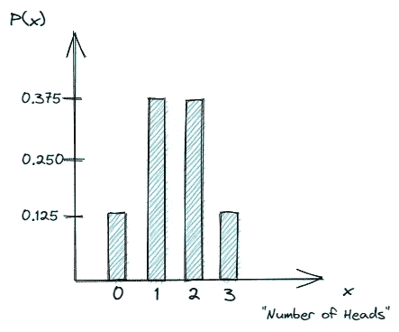

三次抛硬币的二项分布[图片由作者提供]

## 几何分布

假设，我们感兴趣的是，在硬币第一次正面朝上之前，我们要掷多少次。

几何分布给出了第一次成功发生的概率，要求 *n* 次独立试验，成功概率为 *p* 。

更正式的说法是

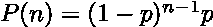

其计算直到并包括成功事件所需的试验次数的概率。

为了计算几何分布，以下假设需要为真:

1.  独立性ˌ自立性
2.  对于每个试验，只有两种可能的结果
3.  每次试验成功的可能性都是一样的

让我们通过回答硬币第一次正面朝上所需的尝试次数的概率来形象化几何分布。

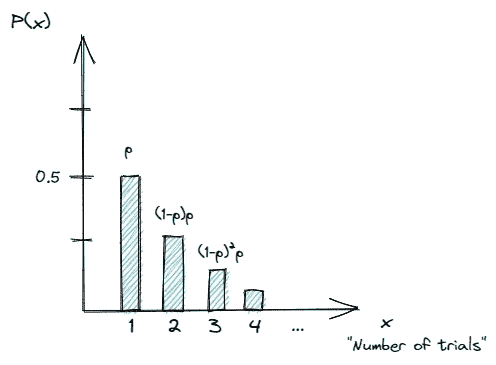

第一次人头落地前的几何分布[图片由作者提供]

# 概率密度函数

在前面的章节中，我们了解到随机变量可以是离散的，也可以是连续的。如果是离散的，我们可以用一个概率质量函数来描述概率分布。

现在，我们正在处理连续变量——因此，我们需要用概率密度函数(PDF)来描述概率分布。

与 PMF 相反，概率密度函数不能直接给出随机变量进入特定状态的概率。相反，它描述了在一个无限小的区域内着陆的概率。换句话说，PDF 描述了一个随机变量位于一个特定范围值之间的概率。

为了找到实际的概率质量，我们需要积分，这产生了在密度函数之下但在 x 轴之上的面积。

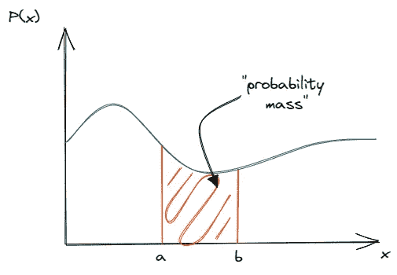

概率密度函数示例[图片由作者提供]

概率密度函数必须是非负的，并且其积分必须为 1。

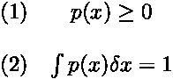

最常见的连续概率分布之一是高斯分布或正态分布。

## 高斯分布

高斯分布通常被认为是代表实值随机变量的明智选择，其分布是未知的。

这主要得益于[中心极限定理](https://en.wikipedia.org/wiki/Central_limit_theorem)，该定理宽松地说，陈述了许多具有有限均值和方差的独立随机变量的平均值本身就是一个随机变量——随着观察次数的增加而呈正态分布。

这尤其有用，因为它允许我们将复杂系统建模为高斯分布，即使单个部分遵循更复杂的结构或分布。

它是对连续变量的分布建模的常见选择的另一个原因是，它插入了最少的先验知识。

更正式地说，高斯分布可以表述为

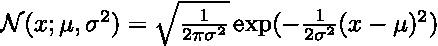

其中参数是平均值，*描述了方差。*

*简单来说，平均值将决定钟形分布的中心峰值，而方差或标准差决定其宽度。*

*我们可以将正态分布形象化为如下形式:*

*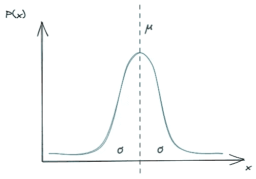*

*正态分布的一个例子[图片由作者提供]*

# *结论*

*在本文中，我们讨论了随机变量、概率分布、它们之间的关系以及我们如何解释它们。我们还通过引入一些最常见的概率质量和密度函数来区分离散和连续随机变量。*

*尽管在不了解概率分布的基础知识的情况下应用学习算法仍有可能获得不错的结果，但对该主题的深入理解将使我们能够对随机变量的真实行为做出更好的选择、假设和预测。*

> *感谢您的阅读！确保保持联系&在 [Medium](https://medium.com/@marvinlanhenke) 、 [Kaggle](https://www.kaggle.com/mlanhenke) 上关注我，或者在 [LinkedIn](https://www.linkedin.com/in/marvin-lanhenke-11b902211/) 上说声“嗨”*

**喜欢这篇文章吗？成为* [*中等会员*](https://medium.com/@marvinlanhenke/membership) *继续无限学习。如果你使用下面的链接，我会收到你的一部分会员费，不需要你额外付费。**

*  

**参考资料/更多资料:**

*   深度学习(Ian J. Goodfellow，Yoshua Bengio 和 Aaron 库维尔)，第三章，麻省理工学院出版社，2016 年。
*   [麻省理工学院决议 6–012 概率介绍，春季](https://www.youtube.com/playlist?list=PLUl4u3cNGP60hI9ATjSFgLZpbNJ7myAg6)*