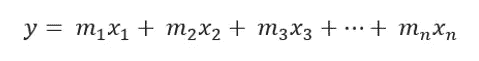
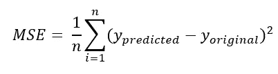
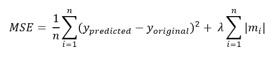
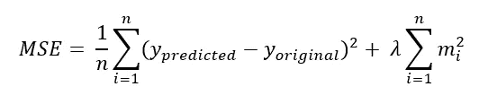

# 用通俗的语言理解正则化:L1 和 L2 正则化

> 原文：<https://towardsdatascience.com/understanding-regularization-in-plain-language-l1-and-l2-regularization-2991b9c54e9a>

迈克尔·佩恩在 [Unsplash](https://unsplash.com?utm_source=medium&utm_medium=referral) 上的照片

## 在数据科学访谈中经常被问到

正规化一词的含义是“改变一种状况或制度，使其符合法律或规则的行为**”。**在机器学习领域也是如此。

**正则化是一种约束或正则化权重的方法。**为什么我们需要约束权重？

机器学习的一个主要问题是过拟合。我们使用正则化来防止过度拟合。**本文将重点讨论过度拟合为什么会发生，如何预防？**

如果多项式回归中多项式的次数太高，或者特征的数量太高，则该算法会学习所有的噪声并很好地拟合训练集，以至于它不会成为一般数据的有效模型。它只对训练集中的数据有好处。**这被称为过拟合问题或高方差问题。**在这种情况下，训练精度非常高，但是验证精度很差。

这个解释我们就拿线性回归公式来说吧。因为这是最简单的公式:

y = mx + c

如果我们只有一个特征，这就是公式。但是在现实世界中，我们几乎不会只处理一个特性。大多数时候我们有几个特点。

所以，公式变成了:

作者图片

我在这里没有包括截距项。因为在本文中我们将重点讨论权重。斜率 m1、m2、m3…mn 在开始时是随机生成的值。在机器学习中，斜率也称为权重。基于输出值的均方误差(MSE ),斜率得到更新。如果你需要复习，这里是 MSE 的公式:

作者图片

为了解决过拟合问题，增加了正则化项。有两种常见的规范化类型。 **L1 和 L2 正规化。**

> **L1 正规化:**

这是 L1 正则化的表达式。当我们在线性回归中使用 L1 范数时，它被称为套索回归:

作者图片

这个公式的第一项是简单的 MSE 公式。但是第二项是正则化参数。如你所见，正则项是所有斜率的绝对值之和乘以项λ。您需要根据交叉验证数据输出来选择 lambda。如果λ越大，MSE 越大。这意味着更大的惩罚。当误差项变大时，斜率变小。

另一方面，如果斜率较大，误差项也会变大。那也是一种惩罚。结果，斜率开始变小。一些斜率可能变得非常接近零，这将使一些特征被忽略。因为每个斜率都乘以一个特征。这样， **L1 正则化也可以用于特征选择。但是缺点是，如果你不想丢失任何信息，不想删除任何特征，你必须小心。**

> L1 正则化的优点是，它比 L2 正则化对异常值更鲁棒。也可用于特征选择。

> **L2 正规化:**

这是 L2 正则化的表达式。这种类型的回归也称为岭回归。

作者图片

从公式中可以看出，我们将所有斜率的平方乘以λ相加。与 L1 正则化一样，如果选择更高的 lambda 值，MSE 会更高，因此斜率会变得更小。此外，如果斜率值较高，MSE 也较高。这意味着更高的惩罚。但是因为**采用斜率的平方，斜率值永远不会降到零。**所以，你在算法中不会损失任何特征贡献。

不利的一面是，它受异常值的影响太大。当我们计算权重的平方时，如果一个值比其他值高很多，它就会因为平方而变得过于强大。

> L2 范数的优点是，更容易得到正则项的导数。因此，它可以更容易地用于梯度下降公式。此外，因为您没有丢失任何信息，因为没有斜率变为零，所以如果异常值不是问题，它可能会为您提供更好的性能。

## 结论

L1 和 L2 正规化各有利弊。根据项目的不同，您可以选择自己的正规化类型。或者，你可以两个都试试，看看哪个效果更好。

请随时关注我的[推特](https://twitter.com/rashida048)、脸书[页面](https://www.facebook.com/Regenerative-149425692134498)，并查看我的新 [YouTube 频道](https://www.youtube.com/channel/UCzJgOvsJJPCXWytXWuVSeXw)

**更多阅读**

         