# 了解有替换和无替换的采样(Python)

> 原文：<https://towardsdatascience.com/understanding-sampling-with-and-without-replacement-python-7aff8f47ebe4>

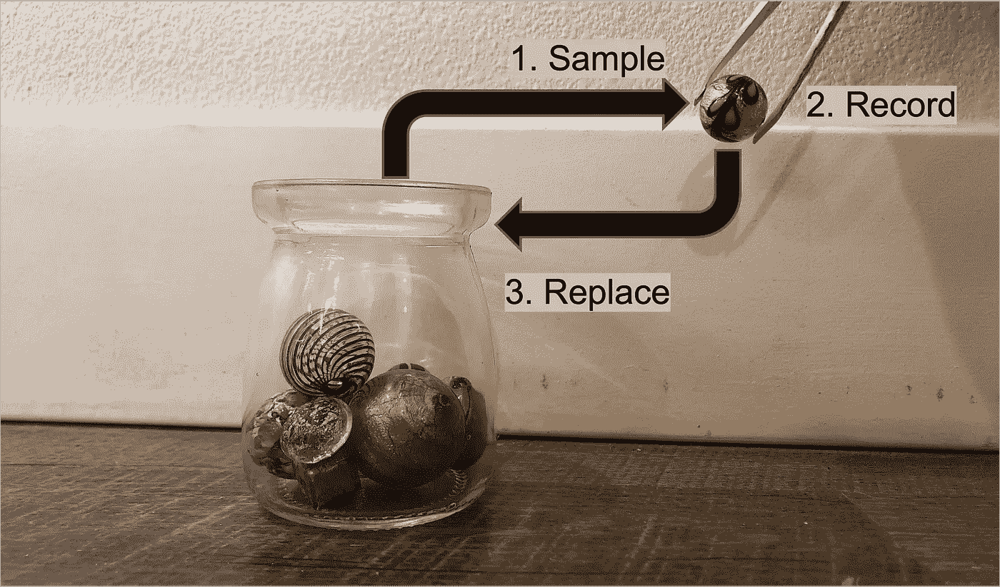

替换程序取样。迈克尔·加拉尼克的图片。

替换抽样可以定义为允许抽样单位出现一次以上的随机抽样。替换取样包括

1.  从总体中随机抽取的一个抽样单位(如玻璃珠或一行数据)(如一罐珠子或一个数据集)。
2.  记录抽取了哪个采样单元。
3.  将抽样单位返回给总体。

在抽取下一个抽样单位之前将抽样单位返回总体的原因是为了确保在以后的抽取中选择任何特定抽样单位的概率保持不变。在整个数据科学中，替换抽样有许多应用。这些应用中的许多应用使用自举，这是一种统计过程，使用数据集上的替换采样来创建许多模拟样本。使用替换采样创建的数据集与原始数据集具有相同数量的样本，称为引导数据集。自举数据用于机器学习算法，如[袋装树](https://youtu.be/urb2wRxnGz4)和随机森林，以及统计方法，如[自举置信区间](https://machinelearningmastery.com/calculate-bootstrap-confidence-intervals-machine-learning-results-python/)等等。

本教程将深入研究有替换和无替换的采样，并将触及这些概念在数据科学中的一些常见应用。和往常一样，本教程中使用的代码可以在我的 [GitHub](https://github.com/mGalarnyk/Python_Tutorials/blob/master/Statistics/Sample_With_Replacement/SampleWithReplacement.ipynb) 上获得。就这样，让我们开始吧！

# 什么是置换取样


替换程序取样。迈克尔·加拉尼克的图片。

替换抽样可以定义为允许抽样单位出现一次以上的随机抽样。替换取样包括

1.  从总体中随机抽取的一个抽样单位(如玻璃珠或一行数据)(如一罐珠子或一个数据集)。
2.  记录抽取了哪个采样单元。
3.  将抽样单位返回给总体。

想象一下，你有一个装有 12 颗独特玻璃珠的罐子，如上图所示。如果你从罐子里取样替换，随机选择任何一个玻璃珠的几率是 1/12。选择一颗珠子后，将它放回瓶子，这样在未来的采样中选择 12 颗珠子中任何一颗的概率都不会改变(1/12)。这意味着，如果你重复这个过程，你完全有可能随机取出同一个珠子(在这种情况下只有 1/12 的机会)。

本节的其余部分将介绍如何使用 Python 库 NumPy 和 Pandas 进行替换采样，还将介绍相关概念，如引导数据集，以及使用替换采样创建引导数据集时需要多少重复样本。

## 使用 NumPy 替换取样

为了更好地理解带有替换的示例，现在让我们用 Python 来模拟这个过程。下面的代码从包含从 0 到 11 的唯一数字的 NumPy 数组中加载 NumPy 和带有替换的样本 12 次。

```
import numpy as np
np.random.seed(3)# a parameter: generate a list of unique random numbers (from 0 to 11)
# size parameter: how many samples we want (12)
# replace = True: sample with replacement
np.random.choice(a=12, size=12, replace=True)
```

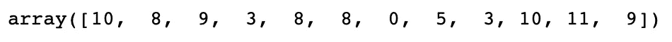

注意有多个重复的数字。

我们在上面的代码中采样 12 次的原因是因为我们采样的原始 jar(数据集)中有 12 个珠子(采样单元)。我们选择的 12 个弹球现在是引导数据集的一部分，该数据集是通过替换采样创建的，其值的数量与原始数据集相同。

## 使用熊猫进行替换取样

由于大多数人对从瓶子中取样珠子的应用不感兴趣，所以重要的是要提到一个取样单元也可以是一整行数据。以下代码使用 Kaggle 的 King County 数据集创建了一个引导数据集，该数据集包含 King County 的房屋销售价格，其中包括 2014 年 5 月至 2015 年 5 月期间的西雅图。你可以从 [Kaggle](https://www.kaggle.com/harlfoxem/housesalesprediction) 下载数据集，或者从我的 [GitHub](https://raw.githubusercontent.com/mGalarnyk/Tutorial_Data/master/King_County/kingCountyHouseData.csv) 加载。

```
# Import libraries
import numpy as np
import pandas as pd# Load dataset
url = '[https://raw.githubusercontent.com/mGalarnyk/Tutorial_Data/master/King_County/kingCountyHouseData.csv'](https://raw.githubusercontent.com/mGalarnyk/Tutorial_Data/master/King_County/kingCountyHouseData.csv')
df = pd.read_csv(url)
# Selecting columns I am interested in
columns= ['bedrooms','bathrooms','sqft_living','sqft_lot','floors','price']
df = df.loc[:, columns]# Only want to use 15 rows of the dataset for illustrative purposes. 
df = df.head(15)# Notice how we have 3 rows with the index label 8
df.sample(n = 15, replace = True, random_state=2)
```

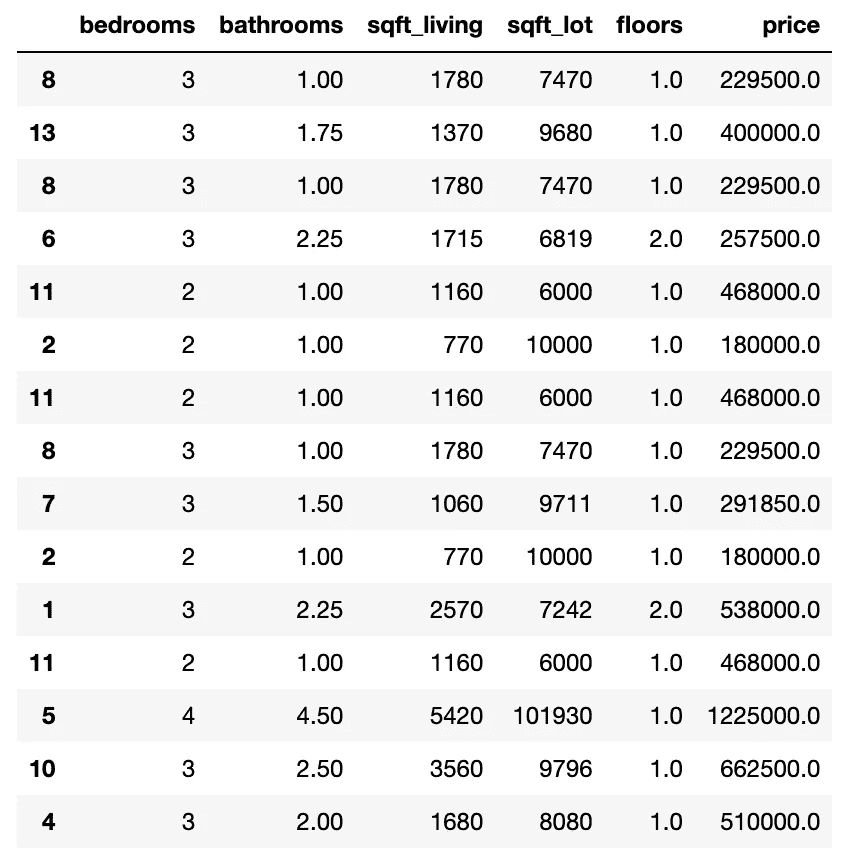

请注意，有多个重复行。

## 在使用替换进行采样以创建引导数据集时，您预计会有多少个重复的样本/行？

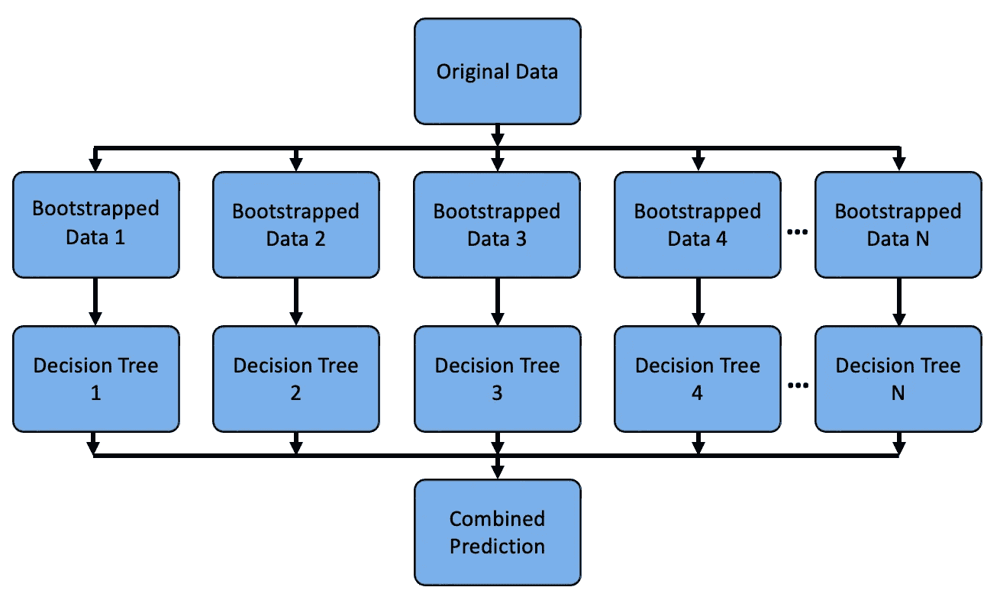

自举数据用于袋装树，通常用于随机森林模型(这可能是袋装树或随机森林的图表，具体取决于决策树与数据的匹配程度)。迈克尔·加拉尼克的图片。

值得注意的是，当您使用替换进行采样以生成数据时，您可能会得到重复的样本/行。实际上，平均引导数据集包含大约 63.2%的原始行。这意味着对于原始数据集中的任何特定数据行，36.8%的引导数据集将不包含它。

这一小节简要地展示了如何通过统计得出这些数字，以及如何通过使用 Python 库 pandas 进行实验来接近这些数字。

**基本统计**

让我们从推导原始数据集中的任何特定数据行，36.8%的引导数据集将不包含该行开始。

假设原始数据集中有 N 行数据。如果要创建引导数据集，需要使用替换进行 N 次采样。

对于带有替换的单个样本，特定数据行不是从数据集中随机抽样替换的概率为

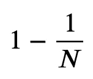

由于引导数据集是通过从大小为 N 的数据集中采样 N 次而获得的，因此我们需要采样 N 次来确定在给定的引导数据集中某一行未被选中的概率。

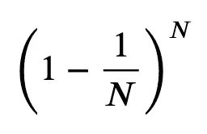

如果我们取 N 趋于无穷大时的极限，我们发现概率是. 368。

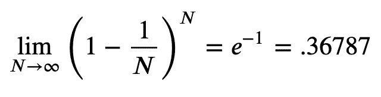

原始数据集中的任何特定数据行将出现在引导数据集中的概率仅为 1-𝑒^-1 = . 63213。注意，在现实生活中，你的数据集越大(N 越大)，你就越有可能接近这些数字。

**利用熊猫**

下面的代码使用 pandas 展示了一个引导数据集将包含大约 63.2%的原始行。

```
# Import libraries
import numpy as np
import pandas as pd# Load dataset
url = '[https://raw.githubusercontent.com/mGalarnyk/Tutorial_Data/master/King_County/kingCountyHouseData.csv'](https://raw.githubusercontent.com/mGalarnyk/Tutorial_Data/master/King_County/kingCountyHouseData.csv')
df = pd.read_csv(url)
# Selecting columns I am interested in
columns= ['bedrooms','bathrooms','sqft_living','sqft_lot','floors','price']
df = df.loc[:, columns]"""
Generate Bootstrapped Dataset (dataset generated with sample with replacement which has the same number of values as original dataset)
% of original rows will vary depending on random_state
"""
bootstrappedDataset = df.sample(frac = 1, replace = True, random_state = 2)
```

在下面的引导示例中，请注意它包含大约 63.2%的原始样本/行。这是因为样本量很大(len(df)是 21613)。这也意味着每个引导数据集将不包括原始数据集中大约 36.8%的行。

```
len(df)
```

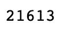

```
len(bootstrappedDataset.index.unique()) / len(df)
```

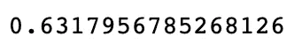

# 什么是无置换取样

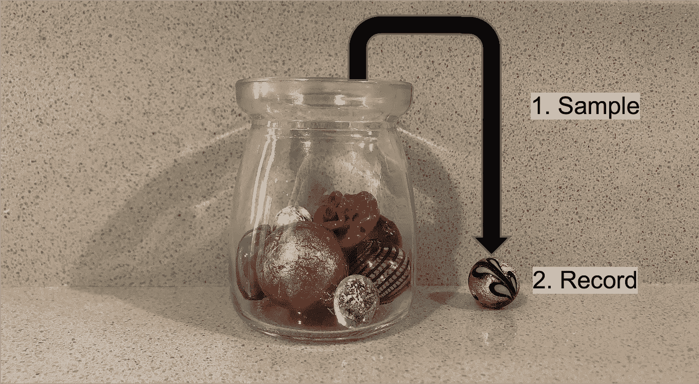

无替换取样。图像由[迈克尔·加拉尼克](https://twitter.com/GalarnykMichael)拍摄。

无替换抽样可以定义为不允许抽样单位出现一次以上的随机抽样。现在让我们来看一个没有替换的采样**如何工作的快速例子。**

想象一下，你有一个装有 12 颗独特玻璃珠的罐子，如上图所示。如果您在没有从广口瓶中替换的情况下对**取样，那么**随机**选择任何一个玻璃珠的几率是 1/12。在选择一个珠子后，它不会返回到瓶子中，因此在将来的采样中选择剩余的 11 个珠子中的任何一个的概率现在是(1/11)。这意味着每抽取一个额外的样品，瓶中的珠粒就越来越少，直到最终不再有珠粒可供取样(12 次取样后)。**

## 使用 NumPy 进行无替换采样

为了巩固这些知识，现在让我们用 Python 来模拟这个过程。下面的代码从包含从 0 到 11 的唯一数字的 NumPy 数组中加载 NumPy 并采样**而不替换**12 次

```
import numpy as np
np.random.seed(3)# a parameter: generate a list of unique random numbers (from 0 to 11)
# size parameter: how many samples we want (12)
# replace = False: sample without replacement
np.random.choice(a=12, size=12, replace=False)
```

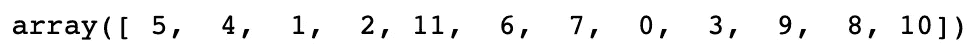

注意没有重复的数字。

请注意，如果您尝试使用比原始样本(在本例中为 12)更长的无替换采样来生成样本，您将会得到一个错误。回到瓶子里的珠子的例子，你不能取样比瓶子里更多的珠子。

```
np.random.seed(3)
np.random.choice(a=12, size=20, replace=False)
```

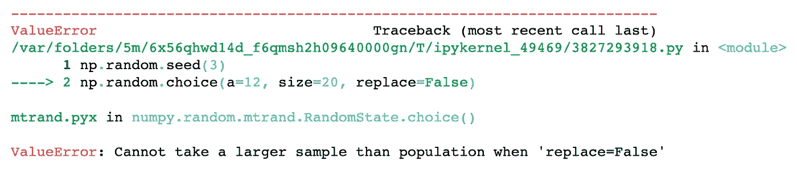

你不能取样(不替换)比瓶子里更多的珠子。图像由[迈克尔·加拉尼克](https://twitter.com/GalarnykMichael)拍摄。

## 数据科学中无替换抽样的例子

数据科学中使用无替换抽样。一个非常常见的用途是在模型验证程序中，如[训练测试分割](https://builtin.com/data-science/train-test-split)和[交叉验证](https://scikit-learn.org/stable/modules/cross_validation.html)。简而言之，这些过程中的每一个都允许您模拟机器学习模型如何对新的/看不见的数据执行。

下图显示了训练测试拆分过程，该过程包括将数据集拆分为两部分:训练集和测试集。这包括随机抽样而不替换大约 75%的行(您可以改变这一点)，并将它们放入您的训练集，将剩余的 25%放入您的测试集。请注意，“特征”和“目标”中的颜色表示特定训练测试分割的数据去向(“X_train”、“X_test”、“y_train”、“y_test”)。

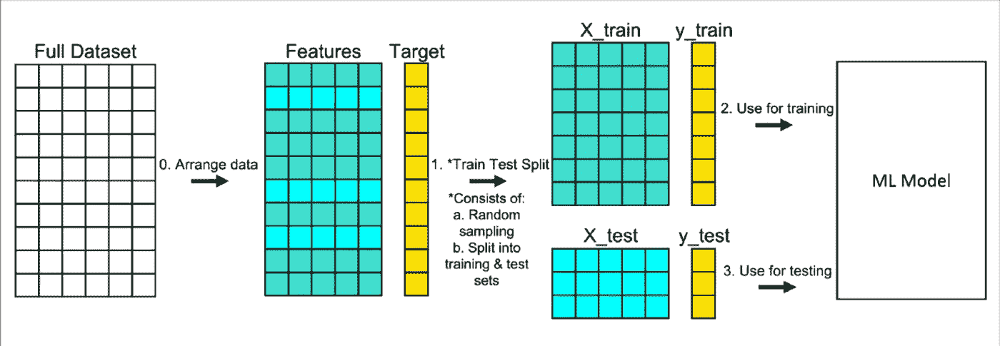

列车测试分离程序。迈克尔·加拉尼克的图片。

如果你想了解更多关于列车测试拆分的信息，你可以看看我的博客文章[了解列车测试拆分](https://builtin.com/data-science/train-test-split)。

# 结论

理解有替换和无替换抽样的概念在统计学和数据科学中很重要。自举数据用于机器学习算法，如[袋装树](https://youtu.be/urb2wRxnGz4)和随机森林，以及统计方法，如[自举置信区间](https://machinelearningmastery.com/calculate-bootstrap-confidence-intervals-machine-learning-results-python/)等。

未来的教程将会介绍一些这方面的知识，并讨论如何应用这些知识来理解袋装树和随机森林。如果您对本教程有任何问题或想法，请在下面的评论中或通过 [Twitter](https://twitter.com/GalarnykMichael) 联系我们。