# 理解分类问题中的 Sigmoid、Logistic、Softmax 函数和交叉熵损失(对数损失)

> 原文：<https://towardsdatascience.com/understanding-sigmoid-logistic-softmax-functions-and-cross-entropy-loss-log-loss-dbbbe0a17efb>

## 分类问题中关键概念的实用数学

在 [Unsplash](https://unsplash.com/) 上由 [Camylla Battani](https://unsplash.com/@camylla93) 拍摄的照片

[1。简介](#179d)
[2。乙状结肠函数(逻辑函数)](#9017)
[3。逻辑回归中的逻辑函数](#650b)
∘ [3.1 线性回归综述](#8365)
∘ [3.2 逻辑函数与逻辑回归](#2ecb)
[4 .多类分类和 Softmax 函数](#afd8)
∘ [4.1 多类分类的方法](#a4ef)
∘ [4.2 Softmax 函数](#07ba)
[5 .交叉熵损失和对数损失](#3f76)
∘ [5.1 对数损失(二元交叉熵损失)](#699a)
∘ [5.2 对数损失的推导](#d9dc)
∘ [5.3 交叉熵损失(多类)](#7ca5)
∘ [5.4 交叉熵损失 vs 负对数似然](#af53)
[6。结论](#7b40)
[关于我的](#4dd4)
[参考文献](#2896)

# 1.介绍

当学习逻辑回归和深度学习(神经网络)时，我总是会遇到以下术语:

*   Sigmoid 函数
*   物流功能
*   Softmax 函数
*   原木损失
*   交叉熵损失
*   负对数似然

每次我看到它们时，我并没有真的试图去理解它们，因为我可以使用现有的库为我做任何事情。例如，当我建立逻辑回归模型时，我将直接使用来自 [Scikit-Learn](https://scikit-learn.org/stable/modules/generated/sklearn.linear_model.LogisticRegression.html) 的`sklearn.linear_model.LogisticRegression`。当我使用 PyTorch 处理深度学习分类问题时，我知道我需要在输出层添加一个具有[二进制交叉熵损失](https://pytorch.org/docs/stable/generated/torch.nn.BCELoss.html)的 [sigmoid 激活函数](https://pytorch.org/docs/stable/generated/torch.nn.Sigmoid.html)用于二进制分类，或者添加一个具有[负对数似然损失](https://pytorch.org/docs/stable/generated/torch.nn.NLLLoss.html)的 [(log) softmax 函数](https://pytorch.org/docs/stable/generated/torch.nn.LogSoftmax.html)用于多类分类问题(或者只添加[交叉熵损失](https://pytorch.org/docs/stable/generated/torch.nn.CrossEntropyLoss.html#torch.nn.CrossEntropyLoss))。

最近，当我重新审视这些概念时，我发现研究数学并理解隐藏在下面的东西是很有用的。因此，在这篇文章中，我从不同的来源收集了一些材料，我将展示一些解释的数学公式。

我还给自己做了一个小抄，可以在我的 [GitHub](https://github.com/zhouxu-ds/ds-tools/blob/master/math/math_cheatsheet.pdf) 上访问。

# 2.Sigmoid 函数(逻辑函数)

[**Sigmoid 函数**](https://en.wikipedia.org/wiki/Sigmoid_function) 是通用的数学函数，具有相似的性质:具有 S 形曲线，如下图所示。

Sigmoid 函数家族的成员，来自[维基百科](https://en.wikipedia.org/wiki/Sigmoid_function#/media/File:Gjl-t(x).svg)

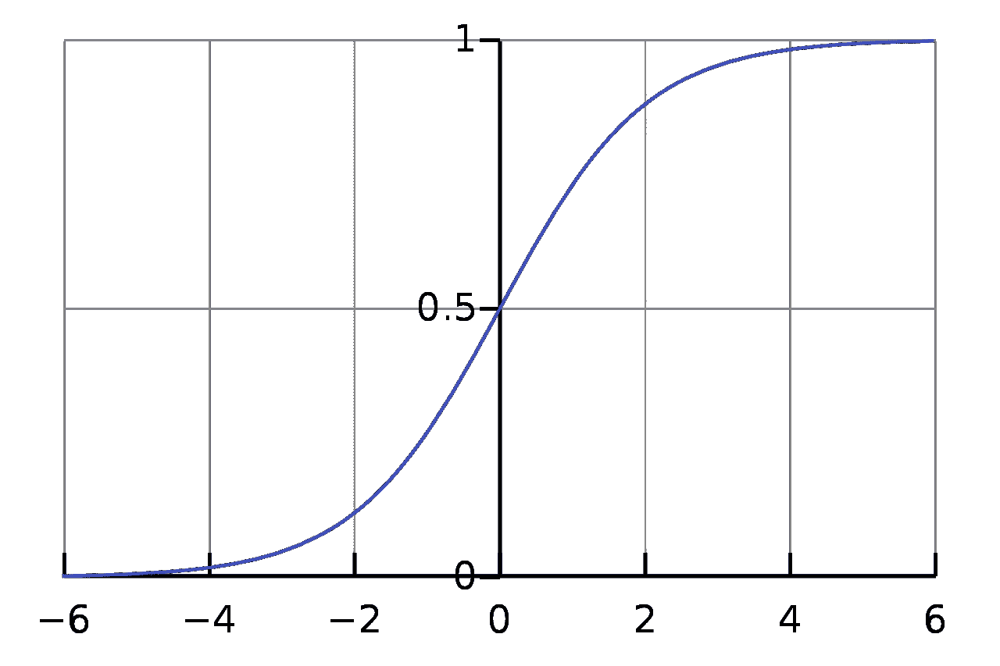

一个逻辑函数的曲线，来自[维基百科](https://en.wikipedia.org/wiki/Sigmoid_function#/media/File:Logistic-curve.svg)

机器学习中最常用的 sigmoid 函数是**逻辑函数**，如下式。

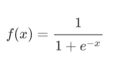

作者图片

这个公式很简单，但是非常有用，因为它为我们提供了一些很好的特性:

1.  **将特征空间映射成概率函数**
2.  **它使用指数**
3.  **它是可微的**

对于属性 1，不难看出:

*   当 x 非常大(趋于无穷大)时，输出将接近 1
*   当 x 非常小时(趋于-无穷大)，输出将接近于 0
*   当 x 为 0 时，输出将为 1/2

对于属性 2，非线性关系确保大多数点要么接近 0，要么接近 1，而不是卡在中间的模糊区域。

性质 3 也非常重要:当在一般的 ML 问题中使用梯度下降或者在神经网络中使用反向传播来从误差更新权重时，我们需要函数是可微分的以计算梯度。

逻辑函数的性质很好，但是如何在逻辑回归中使用逻辑函数来解决二元分类问题呢？

# 3.逻辑回归中的逻辑函数

## 3.1 线性回归综述

在深入之前，让我们回顾一下回归模型的概念。回归长期以来一直用于统计建模，并且是监督机器学习方法的一部分。它是对因变量与一个或多个自变量之间的关系进行建模的过程。

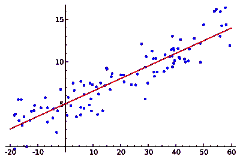

简单线性回归的例子，来自[维基百科](https://simple.wikipedia.org/wiki/Linear_regression)

最常用的回归模型是[线性回归](https://en.wikipedia.org/wiki/Linear_regression)，它使用特征的线性组合来预测值。上图是线性回归的最简单形式，称为[简单线性回归](https://en.wikipedia.org/wiki/Simple_linear_regression)。它有两个参数β_0 和β_1，每个参数代表截距和斜率，以定义数据点之间的红色最佳拟合线。有了使用现有数据训练的两个参数，我们将能够在给定未知的 *x* 值的情况下预测新的 *y* 值。

简单线性回归，作者图片

定义了最简单的形式，就可以把线性回归公式推广到容纳 *x* 的多个维度，也可以叫做多元线性回归(多元回归)。基本上，它扩展到多个维度并使用多个特征(例如，房屋大小、年龄、位置等。)进行预测(例如，销售价格)。

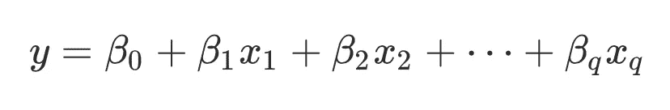

广义线性回归模型，作者图片

## 3.2 逻辑函数和逻辑回归

除了预测回归的实际值之外，线性回归模型还可以通过预测对象在特定类别中的概率来用于分类问题，这可以通过用 *p* 替换 *y* 来简单地完成:

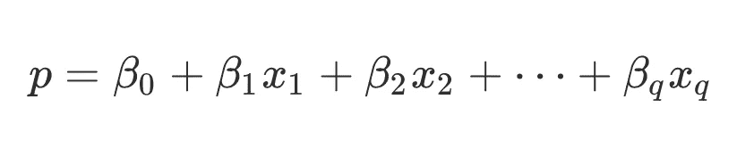

作者图片

问题是这里的概率 p 是无界的——它可以是任何值。因此，为了将概率范围限制在 0 和 1 之间，我们可以使用上一节中介绍的逻辑函数并映射它:

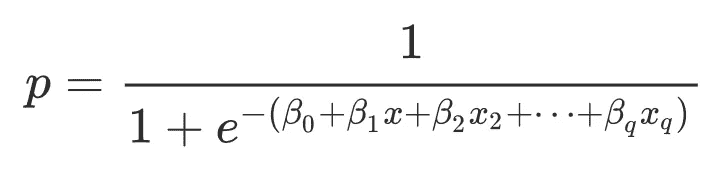

作者图片

这将确保无论预测值是多少，概率 p 将在 0 和 1 之间的范围内，具有前面介绍的所有优点。但是，指数形式并不容易处理，所以我们可以使用 odds 函数重新排列公式。 *Odds* 是概率的兄弟，代表“成功”与“不成功”的比率。当 p=0 时，赔率为 0；当 p=0.5 时，赔率为 1；当 p=1 时，赔率为∞。这些关系如下所示:

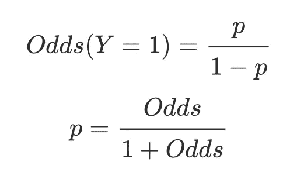

赔率和概率的关系，作者图片

随着*赔率函数*的定义，我们得到:

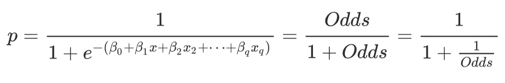

作者图片

很容易看出这两个方程之间的相似性，因此我们有:

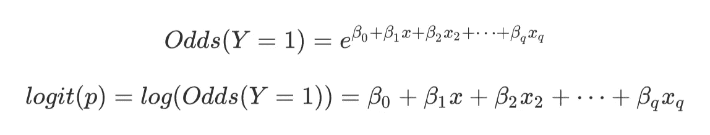

作者图片

我们用 *log* 去掉指数关系，所以最后又回到我们熟悉的那一项。等号右边的部分仍然是输入 *x* 和参数β的线性组合。等号左边的部分现在变成了几率的对数，或者给它一个新的名字:概率的对数。因此，整个等式变成了对数函数的定义，它是标准逻辑函数的反函数。通过使用 logit 函数建模，我们有两个优势:

1.  我们仍然可以把它当作一个线性回归模型，使用我们熟悉的预测值的线性函数
2.  我们可以使用它来预测某类主题的真实概率——通过使用逆 logit 函数转换预测值。

这就是逻辑回归使用逻辑函数在幕后工作的方式，并且非常适合于进行二元分类(2 类):对于 A 类和 B 类，如果成为 A 类的预测概率高于我们设置的阈值(例如，0.5)，则它被分类为 A 类；另一方面，如果预测概率低于(例如，0.5)，则将其分类为 b 类

我们刚刚介绍了使用逻辑回归的二元分类。那么，超过 2 节课怎么办？

# 4.多类分类和 Softmax 函数

## 4.1 多类分类方法

使用二元分类器处理多类分类问题有几种方式，常见的有:**一对一**和**一对一**。

一对其余的方法训练 K-1 个二进制分类器来将每个类从其余的类中分离出来。然后，被所有分类器排除的实例将被分类为 k 类。这在许多情况下都有效，但一对其余方法的最大问题是**模糊区域**:其中一些实例可能被放入多个类中。

另一方面，我们有一对一的方法，在每个类之间训练一个二元分类器。类似于“一个对其余的”,**模糊区域**也存在于此，但是这次存在未被分类到任何类别的实例。更糟糕的是**效率**:我们需要为 n 个类选择 2 个(组合)分类器，如下式所示。例如，如果我们有 10 个类，我们需要 45 个分类器来使用这种方法！

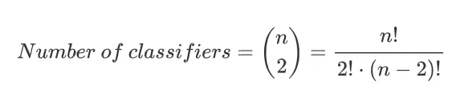

一对一方法所需的分类器数量，按作者分类的图像

有了这些对一对一和一对一方法的限制，我们如何进行多类分类呢？答案是使用 softmax 函数。

## **4.2 Softmax 功能**

**Softmax 函数**是上述二进制分类部分介绍的逻辑函数的推广形式。下面是等式:

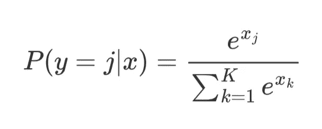

Softmax 函数，作者图片

来解读一下，我们可以看做:将实例归类为 *j* 的概率可以计算为输入的第 *j 个*元素的指数除以所有输入元素的指数之和。为了更好地理解它，我们可以看下面的例子:

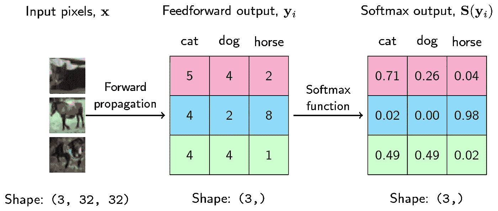

将 Softmax 函数应用于模型输出的示例，由 [Sewade Ogun](https://ogunlao.github.io/2020/04/26/you_dont_really_know_softmax.html) (公共许可证)提供

图像分类器在通过神经网络前馈后给出数字输出，在这种情况下，我们有一个 3×3 的数组，其中行是实例，列是类。第一行包含第一幅图像的预测:类别 cat、dog 和 horse 的得分分别为 5、4 和 2。这些数字没有意义，所以我们将它们输入到 softmax 函数中。把这三个数字代入方程，我们可以得到图像是猫、狗、马的概率分别是 0.71、0.26、0.04，加起来就是 1。

与逻辑函数类似，softmax 函数也具有以下优点，因此人们广泛地将其用于多类分类问题:

1.  **它将特征空间映射成概率函数**
2.  **它使用指数**
3.  **它是可微的**

解释 softmax 函数的另一种方法是通过著名的[贝叶斯定理](https://en.wikipedia.org/wiki/Bayes%27_theorem)，其中:

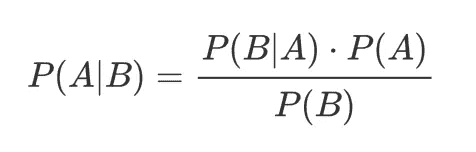

贝叶斯定理，作者图片

将它应用到 softmax 的例子中，所有的项都可以解释为概率:

作者图片

在哪里

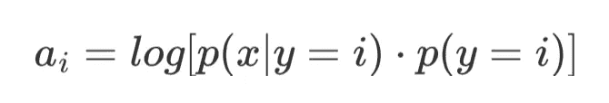

作者图片

# 5.交叉熵损失和对数损失

当我们训练分类模型时，我们最有可能定义一个损失函数来描述预测值偏离真实值的程度。然后，我们将使用梯度下降法来调整模型参数，以降低损失。这是一种优化问题，也称为深度学习中的反向传播。

在我们开始之前，我强烈推荐丹尼尔·戈多伊的文章:[理解二元交叉熵/对数损失:一个直观的解释](/understanding-binary-cross-entropy-log-loss-a-visual-explanation-a3ac6025181a)。它很好地解释了下面的实用数学概念，并以可视化的方式展示出来。在这篇文章中，我使用了一点不同的惯例，更像维基百科。

我们开始吧！

## 5.1 对数损失(二元交叉熵损失)

在分类问题中使用的一种常用损失函数被称为交叉熵损失，或二进制情况下的对数损失。我们先把表达式放在下面:

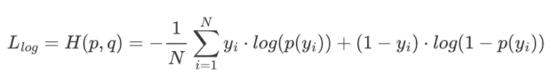

对数损失(二元交叉熵)，按作者分类的图像

由于对数函数具有当 y 为 0 时，其对数趋向于-无穷大的性质；当 y 为 1 时，它的对数为 0，我们可以用它来非常有效地模拟损失。对于具有真标签 0 的实例:

*   如果预测值为 0，则上面的公式将返回 0 的损失。
*   如果预测值是 0.5，那么上面的公式将返回 0.69 的损失
*   如果预测值为 0.99，则上述公式将得出损失为 4.6

正如我们在这里看到的，日志放大了分类中的错误，因此与任何线性损失函数相比，错误分类将受到更严重的惩罚。预测值越接近真实值的对立面，损失就越高，最终会变成无穷大。这正是我们想要的损失函数。那么日志丢失的定义从何而来？

## 5.2 测井曲线损失的推导

交叉熵是源于信息论的一个概念，它度量两个概率分布之间的差异，在信息论中它在真实概率分布 *p* 和估计概率 *q* 之间的定义是:

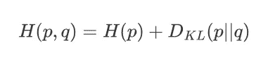

交叉熵，作者图片

其中 *H(p)* 是分布熵 *p，*和 *D_KL(p||q)* 是*kull back-lei bler 散度，从 *q* 的一个散度 *p* 。它也被称为相对熵，即 *p* 相对于 *q* 。*

*熵和 Kullback-Leibler 散度的定义如下:*

*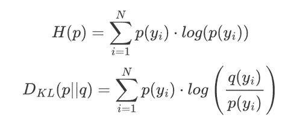*

*熵和 Kullback-Leibler 散度的定义，作者图片*

*将它们代入，很容易得到交叉熵的表达式:*

*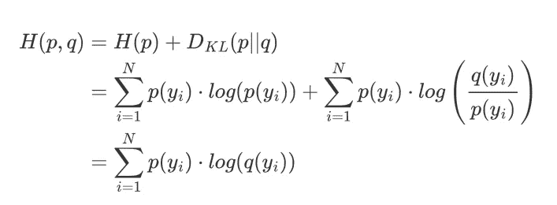*

*作者图片*

*对于二进制分类问题，只有两个类，所以我们可以显式表达:*

*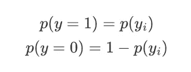*

*作者图片*

*注意这里的 *p* 是概率函数而不是分布 *p* 。此外，我们可以将真实分布 p(y)表示为 1/N，因此二进制交叉熵(对数损失)可以表示为:*

**

*对数损失(二元交叉熵)，按作者分类的图像*

*注意，减号放在开头，因为 0 到 1 之间的值的对数函数给出的是负值。我们想翻转符号，使损失为正——我们想最小化损失。*

*如果我们愿意，可以进一步扩展该公式的表达式，以包括与模型参数θ的关系，如下所示，但它本质上与上面的相同。*

*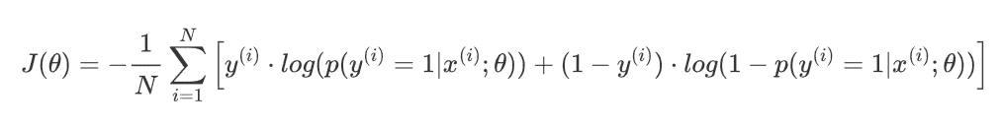*

*相对于模型参数的对数损失，按作者分类的图像*

## *5.3 交叉熵损失(多类)*

*在推导了上面的二元情况之后，我们可以很容易地将其扩展到多类分类问题。下面是交叉熵损失函数的一般形式。它只对实例类为 *k* 时的概率的对数求和，类似于二进制情况，其中总是只考虑表达式的一部分，而其他部分都是 0。*

*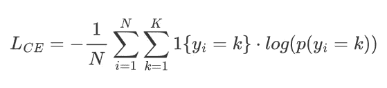*

*交叉熵损失(广义形式)，作者图片*

*同样，它也可以用模型参数θ来表示，但本质上是同一个等式:*

*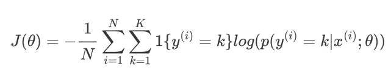*

*相对于模型参数的交叉熵损失，作者提供的图像*

## *5.4 交叉熵损失与负对数似然*

*交叉熵损失总是与负对数似然进行比较。事实上，在 PyTorch 中，对于多类分类问题，[交叉熵损失](https://pytorch.org/docs/stable/generated/torch.nn.CrossEntropyLoss.html#torch.nn.CrossEntropyLoss)相当于 [(log) softmax 函数](https://pytorch.org/docs/stable/generated/torch.nn.LogSoftmax.html)加上[负对数似然损失](https://pytorch.org/docs/stable/generated/torch.nn.NLLLoss.html)。那么这两个概念到底是怎么联系起来的呢？*

*在深入研究之前，我们必须了解概率和可能性之间的区别。简而言之:*

*   *概率:在给定数据样本分布的情况下，找出某个事件发生的概率*
*   ***可能性**:在给定样本数据的情况下，找到数据的最佳分布*

*因此，我们本质上是使用不同的表达式对相同的问题进行建模，但它们是等价的:*

*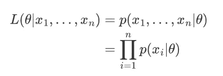*

*可能性的表达，作者的图像*

*以上是给定数据(从 x_1 到 x_n)的参数θ的似然的定义，相当于给定参数θ得到这些数据(x_1 到 x_n)的概率，可以表示为各个个体概率的乘积。*

*知道 *p* 是真实的概率分布，我们可以使用估计的概率分布进一步改写乘积如下:*

*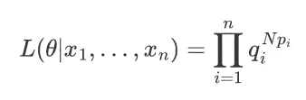*

*作者图片*

*其中 q_i(估计概率分布)和 p_i(真实概率分布)为:*

*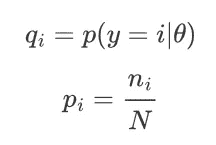*

*作者图片*

*其中 n_i 是训练数据中 *i* 出现的次数。然后通过对可能性取负对数，我们可以得到:*

*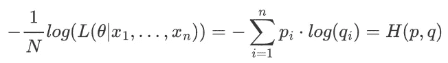*

*负对数似然相当于交叉熵，作者图像*

*假设乘积的对数变成对数的和，我们可以很容易地得到上面的等式。神奇的是，负对数似然性变成了交叉熵，就像上面几节介绍的那样。*

# *6.结论*

*总结一下到目前为止本文中介绍的概念:*

*   ***Sigmoid 函数**:具有 S 形曲线或 Sigmoid 曲线的一般数学函数，该曲线是有界的、可微的和实的。*
*   ***逻辑函数**:在使用逻辑回归的二元分类问题中广泛使用的某个 sigmoid 函数。它将从-无穷大到无穷大的输入映射为从 0 到 1，旨在模拟二元事件的概率。*
*   ***Softmax 函数**:用于多类分类问题的逻辑函数的一般化形式。*
*   ***对数损失(二元交叉熵损失)**:损失函数，表示预测概率偏离真实概率的程度。它用于二进制情况。*
*   ***交叉熵损失**:对数损失的广义形式，用于多类分类问题。*
*   ***负对数似然**:使用最大似然估计概念对交叉熵损失的另一种解释。相当于交叉熵损失。*

*感谢您的阅读！如果你喜欢这篇文章，请**关注我的频道**和/或 [**成为我今天的推荐会员**](https://zhouxu-ds.medium.com/membership) (非常感谢🙏).我会继续写下去，分享我关于数据科学的想法和项目。如果你有任何问题，请随时联系我。*

*  

# 关于我

我是赛诺菲的数据科学家。我拥抱技术，每天都在学习新技能。欢迎您通过[媒体博客](https://zhouxu-ds.medium.com/)、 [LinkedIn](https://www.linkedin.com/in/zhouxu-ds/) 或 [GitHub](https://github.com/zhouxu-ds) 联系我。我的观点是我自己的，而不是我雇主的观点。

请看我的其他文章:

*   [利用空气质量传感器数据进行时间序列模式识别](/time-series-pattern-recognition-with-air-quality-sensor-data-4b94710bb290)
*   [使用 Elasticsearch 的实时类型预测搜索(AWS OpenSearch)](/real-time-typeahead-search-with-elasticsearch-aws-opensearch-88410d5b31a1)
*   [使用 Python 和 Flask-RESTful 为机器学习模型构建 REST API](/build-rest-api-for-machine-learning-models-using-python-and-flask-restful-7b2cd8d87aa0)
*   [利润最大化的贷款违约预测](/loan-default-prediction-for-profit-maximization-45fcd461582b)
*   [使用 Berka 数据集进行贷款违约预测](/loan-default-prediction-an-end-to-end-ml-project-with-real-bank-data-part-1-1405f7aecb9e)

# 参考

*   西格蒙德函数(维基百科):[https://en.wikipedia.org/wiki/Sigmoid_function](https://en.wikipedia.org/wiki/Sigmoid_function)
*   线性回归(维基百科):[https://en.wikipedia.org/wiki/Linear_regression](https://en.wikipedia.org/wiki/Linear_regression)
*   数据科学家实用统计:[https://www . oreilly . com/library/view/practical-Statistics-for/9781491952955/](https://www.oreilly.com/library/view/practical-statistics-for/9781491952955/)
*   普林斯顿 ML 基础讲座:[https://www . cs . Princeton . edu/courses/archive/spring 16/cos 495/slides/ML _ Basics _ Lecture 7 _ multi class . pdf](https://www.cs.princeton.edu/courses/archive/spring16/cos495/slides/ML_basics_lecture7_multiclass.pdf)
*   Softmax 分类器:[https://datascience.stackexchange.com/a/24112](https://datascience.stackexchange.com/a/24112)
*   了解二元交叉熵/对数损失:一个可视化的解释:[https://towards data science . com/understanding-binary-cross-entropy-log-loss-a-visual-explain-a3ac 6025181 a](/understanding-binary-cross-entropy-log-loss-a-visual-explanation-a3ac6025181a)
*   交叉熵(维基百科):https://en.wikipedia.org/wiki/Cross_entropy
*   Kullback-Leibler Divergence(维基百科):[https://en . Wikipedia . org/wiki/kull back % E2 % 80% 93 lei bler _ Divergence](https://en.wikipedia.org/wiki/Kullback%E2%80%93Leibler_divergence)
*   交叉熵损失:[https://stats.stackexchange.com/a/262746](https://stats.stackexchange.com/a/262746)
*   负对数似然比交叉熵:[https://stats . stack exchange . com/questions/468818/machine-learning-negative-Log-Likelihood-vs-Cross-Entropy/468822 # 468822](https://stats.stackexchange.com/questions/468818/machine-learning-negative-log-likelihood-vs-cross-entropy/468822#468822)*