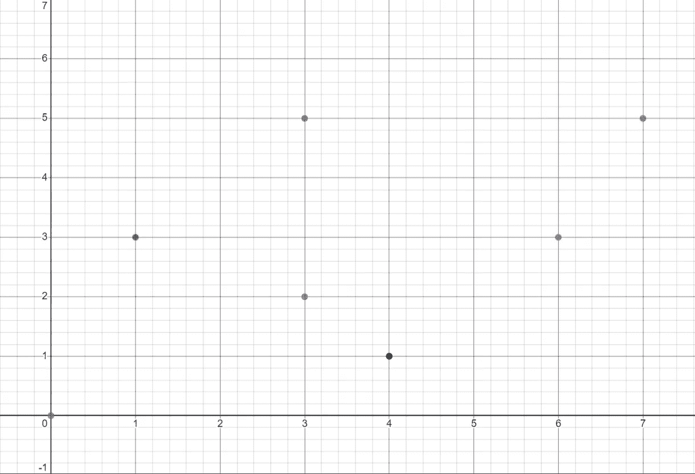

# 了解统计数据类型

> 原文：<https://towardsdatascience.com/understanding-statistical-data-types-2993dafcac86>

## “数据是新的石油”——但是正如存在几种类型的石油一样，也存在几种类型的数据

马库斯·斯皮斯克在 [Unsplash](https://unsplash.com?utm_source=medium&utm_medium=referral) 上的照片

# 介绍

“数据是新的石油”——这是 2006 年创造的一个短语，风靡全球。

想要一些[令人震惊的事实](https://cloudnine.com/ediscoverydaily/electronic-discovery/date-fun-facts-big-data-ediscovery-trends/)？世界上超过 90%的数据是在过去两年中创建的。如果你把一天中产生的所有数据都刻录到 CD 上，这个堆栈可能会达到平均值的两倍。数据庞大而宝贵，因此知道如何操作数据至关重要。要做到这一点，了解不同类型的数据以及它们代表什么是至关重要的。我们开始吧！

# 定性与定量

现在，在你的一生中，你可能已经经历过几次了，所以我就长话短说。定性数据(也称为分类数据)是不能用数字来衡量的数据。对分类数据进行排序时，人们只能将它们分成不同的类别。分类数据的常见例子有性别(男性/女性)、种族和教育水平。

定量数据就是你可能猜到的东西——可量化的(数字)数据。可以对定量数据进行排序(从大到小)，绘制图表，并用于数学分析。一些常见的定量数据示例有时间、重量、温度和等级。

我们可以将这两种类型的数据(定性和定量数据)视为我们将要探索的其他四种数据类型的基础。

# 定性数据的类型

## 标称数据

名义数据是一种分类数据，其中每个数据变量都不能相互比较。虽然每个变量各不相同，但它们彼此之间并无相对差异。例如，眼睛颜色是名义数据的一个例子。虽然存在几种眼睛颜色(黑色、棕色、绿色、蓝色)，但我们不能说它们彼此不同——它们只是描述一种属性的标签。如果我们改变它的顺序，前面提到的眼睛颜色列表的意义不会改变。

## 序数数据

顺序数据是指每个数据变量都与其他变量自然相关的数据。每一个都与另一个相对不同，无论是在大小、长度、持续时间等方面。例如，教育水平(在本例中为大学学位)是一种有序数据。我们可以说，副学士、学士、硕士和博士学位彼此都相对不同，因为每个学位需要不同的时间。理论上，我们可以量化序数数据(准学士=2 年，学士=4 年，等等)并对其执行数学运算，因此它有时被认为处于定性和定量数据之间的灰色区域。

虽然序数数据也只是标签，但标签背后的背景信息可以相互比较。因此，如果我们颠倒上述大学学位列表的顺序，其顺序将从最少时间→最多时间变为最多时间→最少时间。

# 定量数据的类型

## 离散数据

你可能在初中和高中数学课上听说过离散数据。很有可能，您会通过这样的图表来可视化离散数据:

图片由作者提供。

仅包含彼此离散(或分离)的整数的数据。例如，房间里的人数就是离散数据的一个例子。只能用整数来衡量——毕竟你不可能拥有一个人的零头！离散值可以被计数，因为它们有一个精确的集合，但是它们不能被测量。

## 连续数据

连续数据是涉及分数或非整数的数据。你很可能通过一条线来想象它:

图片由作者提供。

连续数据由时间、高度和商品价格等值组成。每个值可以被分割或变小，但仍然有效。例如，我们可以将一个人完成一场比赛所用的时间除以 2，它仍然有效——即使数字变成毫秒和微秒。另一方面，我们不能总是把一个房间里的人数除以 2。再说一次，你不能拥有一个人的一小部分！你可以*测量*任何连续的值，但是你不能*计算*它(有无穷多个点可以计算)。

# 结论

图片由作者提供。

虽然本文中提到的这 4 种数据类型确实构成了统计数据类型的主干，但是在已经提到的数据类型之下还存在几个子类型。如果你想了解更多，我强烈推荐[这篇由尼克拉斯·东格斯](/data-types-in-statistics-347e152e8bee)撰写的文章，这篇文章更有深度。

感谢您的阅读！我希望您非常喜欢这篇文章，并且现在对统计数据类型更加熟悉了。