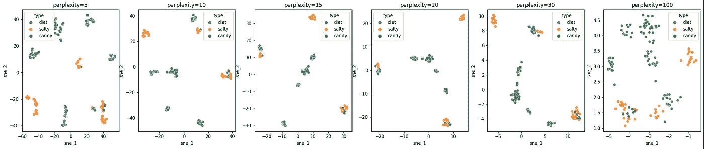
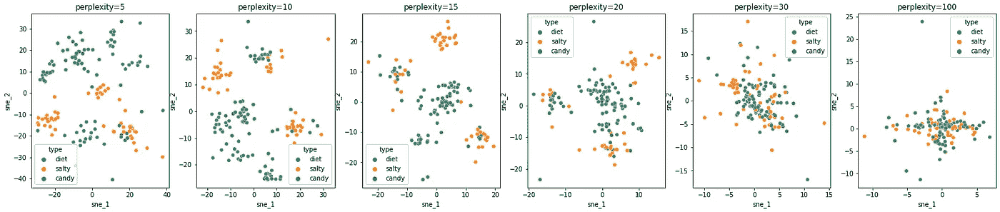
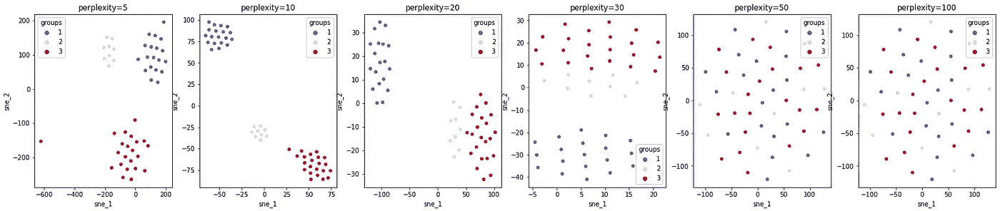
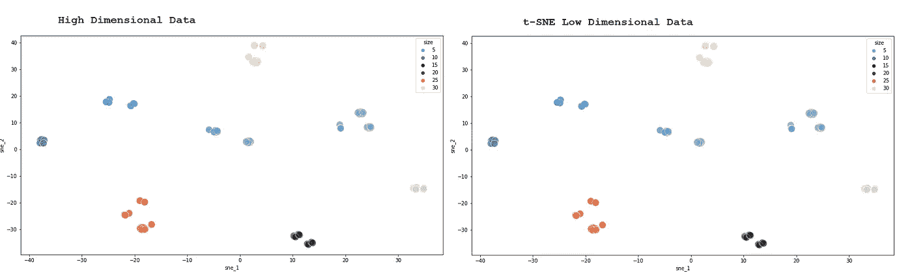

# 理解 Python 中的 t-SNE

> 原文：<https://towardsdatascience.com/understanding-t-sne-in-python-8a3286fd3ea6>

## 查看邻居并使用 t 分布 SNE 对数据进行分组

由 [Clark Van Der Beken](https://unsplash.com/@snapsbyclark?utm_source=unsplash&utm_medium=referral&utm_content=creditCopyText) 在 [Unsplash](https://unsplash.com/s/photos/patterns?utm_source=unsplash&utm_medium=referral&utm_content=creditCopyText) 拍摄的照片

## t-随机邻居嵌入

t-SNE 算法是查看高维数据的一个很好的资源。想想看:可视化二维以上的数据会变得非常具有挑战性。我的意思是超过 2，因为即使现在有很好的 3D 图像，我们的大脑仍然很难理解 3D 图像。毕竟，我们的显示器或屏幕仍然是平面好老 2D，对不对？

所以我们想出了这个好的资源。t 分布随机近邻嵌入。这个花里胡哨的名字是什么意思？

这意味着算法将查看数据集，检查数据点之间的相似性，并将它们转换为联合概率(*两个事件在同一时间点同时发生的可能性*)。然后，它将尝试最小化低维嵌入和高维数据的联合概率之间的 Kullback-Leibler 散度(两个概率分布之间的差异)。

> 检查数据点，计算低维和高维数据中事件同时发生的概率。

## 困惑

如果我们查看文档，困惑是"*与在其他流形学习算法中使用的最近邻的数量相关"*。它还说“*更大的数据集通常需要更大的困惑度*”。

这是一个可调参数。该参数可以理解为每个点的近邻数量的估计值。我还看到这里的[是计算 t 分布标准差的参数之一。根据文档，考虑选择一个介于 5 和 50 之间的值。](https://medium.com/towards-data-science/understanding-t-sne-by-implementing-2baf3a987ab3)

还要考虑用不同的值创建一个测试，因为不同的值会导致明显不同的结果。

请看这个测试，它使用了我为了学习而创建的一个假数据集:

图 1: t-SNE 有不同的困惑值。图片由作者提供。

如果我们强制迭代的数量`n_iter=250`，那么结果如下。注意，在这种情况下，我们没有看到高复杂度的明确分离，因为该算法需要不同次数的迭代才能收敛到最佳解。

图 2:在 n_iter=250 的情况下，具有不同困惑值的 t-SNE。图片由作者提供。

由于我的数据集很小，您可以看到，在相邻点数量较少的情况下，较小的数字会产生更好的结果。

如果我用 50 个均匀分布的变量创建另一个数据集，并将其呈现给 t-SNE，看看不同`perplexity` 数的结果。

图 3:高度困惑> 50 不是很有效。图片由作者提供。

在这种情况下，30 之后的`perplexity`参数开始变得非常随机。正如我们在文档中看到的，它不应该在 50 以上使用，因为结果不会如此精确。

## 其他考虑

从这篇好文章[中，我们可以考虑如何有效地使用 t-SNE](https://distill.pub/2016/misread-tsne/)的其他注意事项有:

*   SNE 霸王龙图中的集群大小没有任何意义:SNE 霸王龙不会关心每个集群的大小。
*   星团之间的距离可能没有任何意义。t-SNE 并不总是能反映出星团之间的距离。记住这一点。
*   随机噪声看起来并不总是随机的:如果你创建一个随机数据集并将其提交给 t-SNE，你仍然可以看到一些低值`perplexity`的模式。这并不意味着存在集群。
*   你可以看到一些形状，有时:`perplexity`会拨出小值的局部方差或高值的全局方差。这导致了形状的出现。

t-SNE 的结果也许可以用于聚类，因为结果矩阵将是数据的低维版本，因此结果应该是相似的。您可以在本文末尾提供的代码测试中看到，KMeans 使用矩阵或 one hot 编码的高维数据显示了相同的结果。

在高维或低维数据集上使用 KMeans 得到相同的结果。图片由作者提供。

## 在你走之前

这里展示的是 SNE 霸王龙。使用 T 分布，这个好的算法帮助我们可视化 2D 的高维数据。

您必须找到`perplexity`和`n_iter`超参数的微调，以便能够获得数据的最佳分离度和相似度。尝试使用循环和绘图以获得最佳效果。

本练习使用的数据集[可以在我的 GitHub 中找到。](https://github.com/gurezende/Studying/tree/master/Python/t-SNE)

## 参考

        

如果这些内容有用，请关注我的博客。

  

考虑使用此推荐代码[注册为中级会员。](https://gustavorsantos.medium.com/membership)

代码: