# 理解 Sigmoid 函数的导数

> 原文：<https://towardsdatascience.com/understanding-the-derivative-of-the-sigmoid-function-cbfd46fb3716>

## 如何找到神经网络的 Sigmoid 函数的导数—简单的逐步演练

照片由[马修·休姆](https://unsplash.com/@matthewhume?utm_source=medium&utm_medium=referral)在 [Unsplash](https://unsplash.com?utm_source=medium&utm_medium=referral) 拍摄

我最近在 Medium 上读到了一篇很棒的帖子，向我展示了如何从头开始实现自己的神经网络。这对我理解机器学习，尤其是神经网络的内部工作是有价值的。

我学习实现的网络使用了 Sigmoid 函数。然而，那篇文章并没有详细讨论 Sigmoid 函数的数学原理。这让我挠头，作为一个想了解我所使用的工具的一切的人，我不得不钻研数学，找出发生了什么。

如果你也对 Sigmoid 函数及其在神经网络中的应用感到好奇，那么请继续阅读。在这篇文章中，我将带你一步一步地了解它，并试图让它尽可能容易理解。

这篇文章的主要内容是如何找到 Sigmoid 函数的导数，到最后你也能理解它了！

## 如何在神经网络中使用 Sigmoid 函数

首先，Sigmoid 函数接受一个数字作为输入，并返回一个介于 0 和 1 之间的新值。

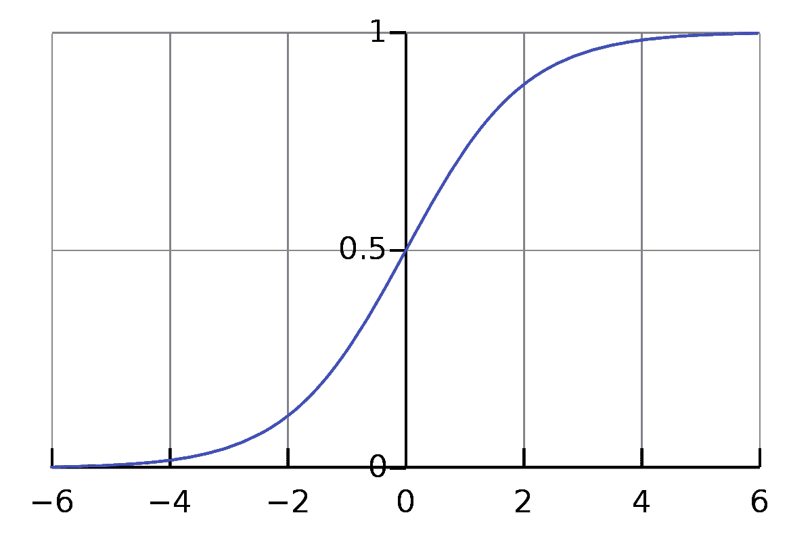

Wikipedia.com 的 Sigmoid 函数图

正如您在上面的图表中看到的，x 值为 0 将返回 y 值为 0.5，更大的正 x 值将 y 值向 1 移动，最终更大的负 x 值将导致 y 值更接近 0。

Sigmoid 函数通常用作神经网络各层中的激活函数。简而言之，这意味着它决定一个节点是否应该被激活，从而决定该节点是否应该对网络的计算做出贡献。

## 为什么 Sigmoid 函数在神经网络中如此重要

神经网络的训练阶段由两部分组成。

1.  前馈
2.  反向传播

**前馈**是数据通过神经网络从输入节点流向输出节点的过程。换句话说，这就是网络试图做出预测的地方。

然后，将这些预测值与实际值进行比较，对其进行评估。误差可以通过两个值之间的差值来确定。

`error = actual_value - predicted_value`

**反向传播**接着发生，这是神经网络中“学习”或“调整”发生的地方。现在，误差值以与之前相反的方向流回网络，然后与 Sigmoid 函数的**导数结合使用，以调整网络各层中所有节点的权重。**

使用 Sigmoid 函数的导数是因为它允许我们通过梯度下降进行调整。函数的导数会给我们函数描述的图形的角度/斜率。这个值将让网络知道是否要增加或减少网络各层中各个权重的值。在反向传播过程中，激活函数的导数要计算很多次，这就是 Sigmoid 函数真正的亮点。

Sigmoid 函数看起来像这样

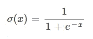

Sigmoid 函数

Sigmoid 函数的导数就是

Sigmoid 函数的导数

换句话说，Sigmoid 函数的导数是 Sigmoid 函数本身乘以 1 减去 Sigmoid 函数。

酷的事情是，在**反向传播**期间，我们已经计算了在**前馈**步骤期间 Sigmoid 函数的导数的所有部分，因此没有什么新的要计算。相反，我们可以简单地将 Sigmoid 函数的结果应用于导数方程的两个点。

这使得神经网络不必进行大量的计算，否则在使用其他激活函数时就需要进行大量的计算。能够避免如此多的额外计算是 Sigmoid 函数对神经网络非常有用的原因之一。

现在到了我很难理解的部分，为什么 Sigmoid 函数的导数是 Sigmoid 函数本身乘以 1 减去 Sigmoid 函数。

正如介绍中所解释的，我发现要准确理解 Sigmoid 函数的导数是如何找到的有点困难，因此在下一节中，我将尝试遍历所有的数学步骤，以便您也可以学习它！

## Sigmoid 函数导数背后的数学

为了获得 Sigmoid 函数的导数，我们需要两条规则，[链式规则](https://en.wikipedia.org/wiki/Chain_rule)，以及[商规则](https://en.wikipedia.org/wiki/Quotient_rule)。

我们将一步一步地进行计算，我会指出何时应用规则。

Sigmoid 函数

因为 Sigmoid 函数是一个分数，分子和分母都是可微的，所以我们可以使用商法则来计算整个函数的导数。

商法则说，我们可以用下面的方法得到一个函数的导数:

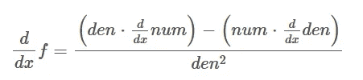

商数法则

> den 是分母的简称，num 是分子的简称。

取 Sigmoid 函数的分子和分母，以及分子的导数和分母的导数，并将它们放入上述函数中，我们得到:

Sigmoid 函数的商规则

分子的导数变成 0，因为分子是常数。

分母的导数变成:

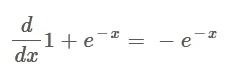

Sigmoid 函数分母的导数

这就是使用链式规则的地方，我认为这一步可能需要更多的解释和详细的演练。

链式法则告诉我们，复合函数(内部包含另一个函数的函数)的导数按以下方式计算:

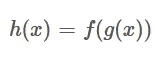

合成函数的一个例子

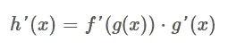

使用链式法则的合成函数的导数

换句话说，这可以理解为:合成函数的导数是包含内部函数 *g* 的外部函数 *f* 的导数乘以内部函数的导数。

既然这样

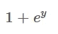

被认为是外部函数(y 代表内部函数)。那么内部函数是-x。当对 Sigmoid 函数的分母应用链式法则时，我们得到以下等式:

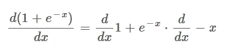

应用于 Sigmoid 函数分母的链式法则

如果我们从寻找外部函数的导数开始，那么 1 变成 0，并且 *e* 对某物的幂的导数保持不变，如下式所示。

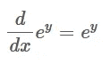

e 对某物的幂的导数也是一样的

此时我们有了外函数的导数，下一步是求内函数的导数。内部函数就是-x，它的导数变成了-1。
将所有这些放在一起，我们得到:

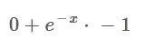

应用于 Sigmoid 函数分母的链式法则

这个表达式可以简化为:

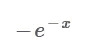

Sigmoid 函数分母的导数

这是第一个困难的部分，现在我们可以回到商法则，理解我们如何得到分母的导数。

请记住，这是我们停止的地方:

商数法则

Sigmoid 函数的商规则

我们现在可以通过去掉乘以 0 的部分来简化上面的表达式。这给了我们以下内容:

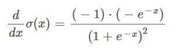

Sigmoid 函数第一次约化后的商规则

接下来，我们可以将分子中的两个括号相乘，得到:

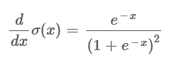

Sigmoid 函数第二次约化后的商规则

我们现在已经非常接近了，但是函数还没有达到预期的形式。为了达到这个目的，我们首先需要使用一个小技巧，在分子中加减 1。这样做对等式的结果没有实际影响，但是它使下面的步骤成为可能。像这样:

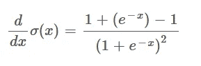

从分子中加减 1

这样，我们可以将函数分成两个独立的部分，如下所示:

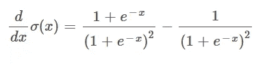

将函数分成两部分

通过这样表示函数，我们能够在第一个分数中抵消`e^-x`。从而给我们提供了以下内容:

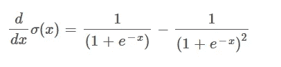

抵消了左分数中的 e^-x

现在可以将它重写为

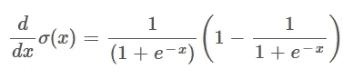

重写了上一步

我认为这是很难立即理解的步骤之一，但是如果你试图通过将这两个分数相乘来逆向计算，你应该会得到上一步的结果。如果您首先将最左边的分数与右边括号中的值 1 相乘，您将得到左边的分数本身(对应于前面等式中的第一个分数)。接下来，将左分数乘以圆括号中的负分数**，从而得到分母为平方的结果(上一个等式的第二个分数)。**

现在到了最后一步。如果你看看我们刚刚得出的方程，你可能会发现它实际上包括了 Sigmoid 函数本身。提醒一下，看起来像这样:

Sigmoid 函数

因此，我们可以将 Sigmoid 函数换成上面的等式，这使我们得到所需的形式:

Sigmoid 函数的导数

就是这样！这就是为什么 Sigmoid 函数的导数就是 Sigmoid 函数本身乘以 1 减去 Sigmoid 函数背后的数学原理。

恭喜你完成了所有这些方程。

莱昂纳多和我祝贺你——GIF

## 摘要

你现在已经学会了如何求 Sigmoid 函数的导数。这样做的全部原因是因为它在神经网络的**反向传播**步骤中使用，以便向上或向下调整权重。由于在**前馈**步骤中已经找到了 Sigmoid 函数的导数所需的所有方程，这为我们节省了大量计算，并且这是使用 Sigmoid 函数作为神经网络层中的激活函数的好处之一。

我希望这篇文章对你有所帮助，并且现在已经很清楚为什么 Sigmoid 函数的导数是这样的了。

如果您喜欢您所阅读的内容，那么如果您能支持我，使用我下面的推荐链接注册 Medium，我将不胜感激:

<https://jacobtoftgaardrasmussen.medium.com/membership>  

如果你对我在介绍中提到的展示如何从零开始制作神经网络的帖子感到好奇，那么你可以使用下面的下一个链接来查看:

</how-to-build-your-own-neural-network-from-scratch-in-python-68998a08e4f6> 