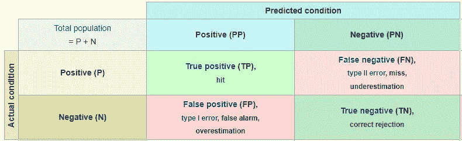
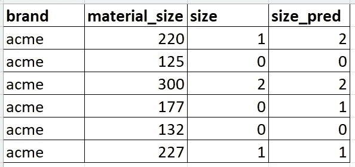

# 理解回归和分类之间的区别

> 原文：<https://towardsdatascience.com/understanding-the-differences-between-regression-and-classification-bc957f4f641a>

# 理解回归和分类之间的区别

## 对于初学者来说，这是一个非常棘手的问题

由 [Unsplash](https://unsplash.com?utm_source=medium&utm_medium=referral) 上的 [Element5 数码](https://unsplash.com/@element5digital?utm_source=medium&utm_medium=referral)拍摄

我的职业生涯之一是作为兼职教授教授本科生数据科学。以这种身份，在预测分析(这是对数据科学所有意图和目的的基本概述)中，我在学生中发现了一个一致且令人惊讶的模式:

他们努力理解回归和分类问题之间的区别。我认为这是我作为一名教师的错误，所以我想尽我所能，以尽可能简短的方式澄清这些差异。

## 基础

对于不熟悉回归这个词的人来说，它并不意味着什么。一开始谈论回归有点像告诉某人杂货店在警察局以南两个街区。

但是一个小小的定义可以让它变得有意义。回归从字面上看就是一个因变量和一个或多个自变量之间的关系(哦，所以警察局离公园一个街区)。更实际的是，它表示一个连续数值变量和一个或多个其他数值变量之间的关系强度。

那么，杂货店就在前面两个街区的地方…

连续数值变量是一组不可数数值的一部分。考虑一只股票的价格。实际上，有一个最小值/最大值，在这个最小值/最大值之间可以有无数个值。将这个定义与*离散*数值变量相对照，离散数值变量是有限的或者*可数*数值集合的一部分。

## 定义的回归问题

回归预测一个*连续的数值变量*。我们用回归预测的一些例子:

*   一升汽油的价格
*   道琼斯工业指数的价值
*   钻石的价格
*   Q1 2022 年的收入

有许多与回归相关的算法。它们通常以“回归者”或类似的词结尾。以下是 scikit-learn 中的一些算法:

*   [sklearn.linear_model。线性回归](https://scikit-learn.org/stable/modules/generated/sklearn.linear_model.LinearRegression.html?highlight=regression#sklearn.linear_model.LinearRegression)
*   [sk learn . linear _ model . ridge _ regression](https://scikit-learn.org/stable/modules/generated/sklearn.linear_model.ridge_regression.html?highlight=regression#sklearn.linear_model.ridge_regression)
*   [sklearn.linear_model。ARDRegression](https://scikit-learn.org/stable/modules/generated/sklearn.linear_model.ARDRegression.html?highlight=regression#sklearn.linear_model.ARDRegression)
*   [sklearn.linear_model。套索](https://scikit-learn.org/stable/modules/linear_model.html#lasso)

如你所料，输出或预测(到目前为止)是一个连续的数字——就像石油价格一样，给出一堆与石油价格相关的数据。

## 回归度量

在 ML 中，术语“模型准确性”是一个重载的术语(像许多其他术语一样)，它有字面上和概念上的定义。当我谈到分类问题时，我会进一步说明，“准确性”是一个等式:

**(总正面预测+总负面预测)/总预测**

这可以简化为**总正确预测/总预测**

在回归问题的背景下考虑这个等式。你可能不知道的是，准确猜出一个连续数字的可能性相当低(即使有非常好的 ML)。对于数字来说，足够接近通常就足够好了。因此，准确性度量几乎没有意义，因为无论模型预测得多好，准确性分数都可能非常低。

相反，我们依赖于告诉我们预测与实际值有多接近的度量标准(与准确性度量标准相反，准确性度量标准告诉我们有多少次我们得到了正确或错误的预测)。

我们使用的一些指标是 R2 和 MSE。Scikit-learn 有一个很棒的页面，显示了分类、聚类和回归的评估指标。例如，R2，“[……是从自变量中可预测的因变量变化的比例。术语“变化的比例”更符合连续变量。](https://en.wikipedia.org/wiki/Coefficient_of_determination)

[MSE](https://en.wikipedia.org/wiki/Mean_squared_error) 让这一点变得更加清楚(就像这样的事情可以被*弄清楚*)；它代表均方误差，是实际值和预测值之差的平方的平均值。

好吧，让我换个说法。对于预测值列表中的每个预测值，首先计算该值与该观察值(或电子表格中的行)的实际值之间的差异；这是绝对的错误。然后对每个*差*求平方。然后取所有这些平方差的平均值。

清澈如泥。

MSE 越低，预测越好，因为预测值和实际值之间的差异(通过平方值来消除负号)越低。这对于一个连续的数来说几乎是直观的。

## 定义的分类问题

分类问题比回归问题更快地切入正题，预测一个*分类目标。*分类变量就像一个下拉列表框，包含可供选择的值列表。这些值可以是数字或文本，尽管它们通常以文本开头。

一些例子:

*   一周中的几天
*   衬衫尺码(小号、中号、大号)
*   对或错(是或否)——这是一个非常特殊的情况

分类算法通常以“分类器”结尾(但不总是如此)，例如:

*   决策树分类器
*   近邻分类器
*   随机森林分类器
*   AdaBoost 分类器

来自这些算法的结果(即预测)是一个值，即分类变量的可能值列表中的一个值。这与目标是连续数字的回归问题有着本质的不同。

我认为，真正的困惑是，每个目标值都是一个数字，因为在数据科学过程中，我们将文本转换为数字。例如，true/false 转换为 1 和 0，小号/中号/大号(针对衬衫尺码)转换为 0、1 和 2。

> **但是记住，在一个回归问题中，目标是一个*连续的*数。**对于分类，目标最初是一个分类变量，然后被转换成一个离散的数字。如果你忘记了这篇文章中的其他内容，请记住这一点。

## 分类指标

回到我写的关于度量的文章，尤其是准确性，这对于分类问题更有意义。算法预测有限选项列表中的一个。不管是对是错，都不算“接近”

再次关注准确性:

**正确预测总数/预测总数**

这个数字越大越好，因为算法预测正确的次数越多。如果预测“接近”实际值，就没有价值或奖励。

这给我们带来了一个分类评估的概念(很恰当地)，叫做混淆矩阵。矩阵的混乱对于它自己的文章来说是足够的材料，但简而言之，混乱矩阵帮助我们理解我们猜对的频率和猜错的频率。**注意**:不要一字不差地记住混淆矩阵，因为事实上它里面的所有东西都可以重新排列，而不会丢失相同的信息(就像我说的，这很混乱)。

来源:[维基百科](https://en.wikipedia.org/wiki/Confusion_matrix)

然而，这个想法带来了类似 [*精度*和*召回*](https://en.wikipedia.org/wiki/Precision_and_recall) 的概念。虽然我不会在这里深入讨论这些概念，但重点是这些指标与回归有很大的不同，因为分类指标关注的是对与错，而回归关注的是实际值和预测值之间的差异。

MSE 或 R2 对分类目标有意义吗？这是因为实际值和预测值之间没有差别(从概念上来说)。以衬衫尺寸预测为例，假设我们有以下结果:

图片作者。

您可以看到 size 列从 small/medium/large 转换为值 0、1 和 2。该算法得到了 4 个正确的和 2 个错误的。准确率为 66.7% (4/6)。说预测的和实际的衬衫尺码相差 1(或者别的什么)真的没有意义。

分类度量关注对与错，而回归关注实际与预测之间的差异。

## 非常混乱的分类

所以现在清楚了，让我把水搅浑。一个非常特殊的情况是当你有一个二元分类问题(例如，真/假，是/否)。在它是什么(二进制分类变量的分类)或我们用来评估它的度量标准方面，它并不令人困惑。

令人困惑的是，这类分类问题最常见的算法叫做 **LogisticRegression** 。我是说，还有比这更让人困惑的吗？

虽然在这种情况下严格来说会令人困惑，但在机器学习之外进行逻辑回归时就不会困惑了。[这里有一篇文章](https://turbofuture.com/industrial/Why-Logistic-Regression-Why-not-Logistic-Classification)很好地阐述了这种细微差别。

当考虑二进制分类问题时，只需忽略算法的“回归”部分，就此打住。这仍然是一个分类问题，您仍然使用分类问题模型度量来评估它。

既然我们知道去杂货店的路，你能告诉我去加油站的路吗？

## 参考

[1]维基百科。(2021 年 12 月 11 日。)*连续或离散变量*。[https://en . Wikipedia . org/wiki/Continuous _ or _ discrete _ variable](https://en.wikipedia.org/wiki/Continuous_or_discrete_variable)。

[2] Scikit-learn。Scikit-learn 网站。[https://scikit-learn.org/stable/](https://scikit-learn.org/stable/)。

[3] Scikit-learn。(未注明)*量化预测质量的指标和评分。*[https://scikit-learn . org/stable/modules/model _ evaluation . html](https://scikit-learn.org/stable/modules/model_evaluation.html)。

[4]维基百科。(2021 年 10 月 18 日。)*精度和召回*。[https://en.wikipedia.org/wiki/Precision_and_recall](https://en.wikipedia.org/wiki/Precision_and_recall)。

[5]维基百科。(2021 年 12 月 3 日。)*混淆矩阵*。https://en.wikipedia.org/wiki/Precision_and_recall[。](https://en.wikipedia.org/wiki/Confusion_matrix)