# 了解固定效应回归模型

> 原文：<https://towardsdatascience.com/understanding-the-fixed-effects-regression-model-d2fccc2cc27e>

## 以及关于如何在真实面板数据集上构建和训练固定效果模型的 Python 教程

**固定效应回归模型**用于估计**面板数据集**中个体内在特征的效应。这种内在特征的例子有遗传、敏锐和文化因素。这些因素无法直接观察或测量，但需要找到一种方法来估计它们的影响，因为忽略它们会导致训练的回归模型不理想。固定效应模型就是为了解决这个问题而设计的。

本文是面板数据分析系列文章的第二部分:

1.  [如何为面板数据建立混合 OLS 回归模型](/how-to-build-a-pooled-ols-regression-model-for-panel-data-sets-a78358f9c2a)
2.  **了解固定效应回归模型**
3.  [随机效应回归模型的实用指南](/the-no-nonsense-guide-to-the-random-effects-regression-model-be899ce415a5)

# 面板数据入门

面板数据集包含在特定数量的**时间段**内为一个或多个唯一可识别的**单元**收集的数据。单位的例子有动物、人、树、湖、公司和国家。数据面板被称为**平衡**或**不平衡**面板，这取决于是否所有单元都被跟踪了相同数量的时间段。如果在整个研究过程中跟踪同一组单位，它被称为**固定面板**，但是如果在研究过程中单位发生变化，它被称为**旋转面板**。

面板数据集通常来自**纵向研究**。弗雷明汉心脏研究可能是自 1948 年以来最著名的纵向研究的例子。

在本文中，我们将研究一个真实世界的面板数据集，其中包含 7 个国家从 1992 年到 2014 年的人均 GDP 年增长率。除了 GDP 增长数据，该面板还包含每个国家总资本形成的同比增长:


a 小组数据集(来源:[世界发展指标](https://databank.worldbank.org/metadataglossary/world-development-indicators/series)数据 [CC BY 4.0 license](https://www.worldbank.org/en/about/legal/terms-of-use-for-datasets) )(图片由作者提供)

上述数据集中，**单位**为国家，时间框架为 1992 年至 2014 年( **23 个时间段**，面板数据为**固定**和**平衡**。

属于一个单位(一个国家)的一组数据点称为**组**。在上面的数据面板中，有七组**。**

假设我们希望调查总资本形成年同比增长对 GDP 年同比增长的影响。

我们的**因变量**或**响应变量** ***y*** 是 *Y-o-Y %的人均 GDP 增长率*。**自变量**或**解释变量** ***X*** 为*年-年资本形成总额增长率*。

在符号形式中，人均国内生产总值的年同比增长率*可以表示为总资本形成*年同比增长率*的函数，如下所示:*


在时间周期 t，国家 I 的 GDP 增长是国家 I 在时间周期 t 的总资本形成增长的函数

在上面的回归方程中， *ϵ_i_t* 是回归的残差，它捕捉到了 *i* 国家在 *t* 年期间人均 GDP 同比增长的方差，这是模型无法“解释”的。

让我们创建一个 ***y*** 对 ***X*** 的散点图，看看数据是什么样子的。

我们将从导入所有必需的 Python 包开始，包括我们稍后将用来构建固定效果模型的包。

```
**import** pandas **as** pd
**import** scipy.stats **as** st
**import** statsmodels.api **as** sm
**import** statsmodels.formula.api **as** smf
**from** matplotlib **import** pyplot **as** plt
**import** seaborn **as** sns
```

让我们将数据集加载到一个[熊猫](https://pandas.pydata.org/)数据框中。该数据集可从这里 下载 [**。**](https://gist.github.com/sachinsdate/c40651e9e4bc13a696780462209f1992)

```
df_panel = pd.**read_csv**('wb_data_panel_2ind_7units_1992_2014.csv', **header**=0)
```

我们将使用 [Seaborn](https://seaborn.pydata.org/) 来绘制所有时间段和所有国家的人均 GDP 增长与每个国家总资本形成增长的关系图:

```
colors = [**'blue'**, **'red'**, **'orange'**, **'lime'**, **'yellow'**, **'cyan'**, **'violet'**]sns.**scatterplot**(**x**=df_panel[**'**GCF_GWTH_PCNT**'**], 
                **y**=df_panel[**'**GDP_PCAP_GWTH_PCNT**'**],
                **hue**=df_panel[**'**COUNTRY**'**],
                **palette**=colors).
                **set**(**title**='Y-o-Y % Change in per-capita GDP versus Y-o-Y % Change in Gross capital formation')plt.**show**()
```

我们看到下面的情节:

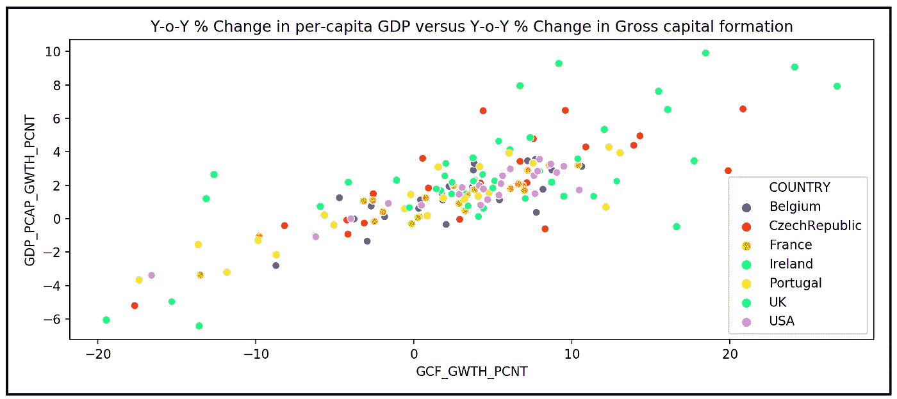

国内生产总值同比增长%与总资本形成同比增长%的国家散点图(图片由作者提供)

人均国内生产总值的同比增长似乎与总资本形成的同比增长呈线性相关，因此，我们将为每个单位(国家)的回归模型假定以下线性函数形式 *i* :

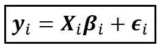

国家 I 的线性模型(图片由作者提供)

上式中，所有变量都是某维的矩阵。假设 *n* 个单位， *k* 个回归变量每单位， *T* 个时间段每单位，上式中每个矩阵变量的维数如下:

*   ***y*** *_i* 为单位 *i* 的响应变量(人均 GDP 增长)。它是一个大小为*【T×1】*的列向量。
*   ***X****_ I*是大小*【T X k】*的回归变量矩阵。
*   ***β****_ I*是大小为*【k×1】*的系数矩阵，包含***×*_ I .*中 *k* 回归变量系数的**总体值*****
*   ***ϵ****_ I*是大小为*【t×1】*的列向量，包含误差项，每个 *T* 时间段一个误差。

以下是单元 *i* 的上述方程的矩阵形式:

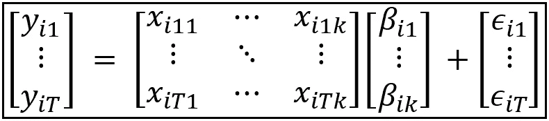

国家 I 的线性回归模型的矩阵形式(图片由作者提供)

在我们的例子中， *T=23，k=1* 和 *n=7* 。

让我们把注意力集中在模型的误差项上，**_ I*。以下是错误的重要来源:*

1.  *由于**随机环境噪声**或测量仪器引入误差。M **测量误差**由实验者引入，因为他们不正确地使用测量仪器。*
2.  *由于**省略了可观察和可测量的解释变量**而引入了误差。这些变量本来能够“解释”响应变量*y 中的一些方差，因此，它们从*矩阵中的省略会导致无法解释的方差“泄漏”到回归模型的误差项中。***
3.  ***由于**不正确的函数形式**或**缺少某些回归变量或响应变量的变量转换**而引入误差。例如，假设我们需要回归总资本形成变化的 GDP 变化的对数，但我们未能记录转换响应变量。***
4.  ***总有可能我们对回归模型的**选择是错误的**。例如，如果正确的模型碰巧是非线性最小二乘模型，但我们使用 OLS 线性回归模型，这将导致额外的回归误差。***
5.  ***最后，由于**遗漏了*不可测*T5 的变量，会引入误差。这些变量代表了被测单位的内在质量。对于以国家为单位的“我们的国家”数据面板，特定单位变量的一个示例可以是在不同环境条件下促进或抑制 GDP 增长的国家的**社会经济结构**，以及该国数百年来演变的企业和政府决策的**文化方面**。所有这些因素都会影响 GDP 的同比变化，但无法直接测量。然而，从回归矩阵 ***X*** 中省略这些因素具有与(2)中相同的效果，即，它们的效果泄漏到在误差项中观察到的附加方差中。*****

**记住上面的注释，我们可以将国家 *i* 的线性回归模型的一般形式表示如下:**

**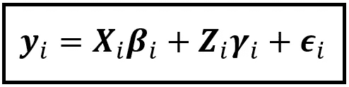**

**国家 I 的线性模型的一般形式(图片由作者提供)**

**在上面的等式中:**

*   *****y****_ I*是一个大小为*【T×1】*的矩阵，包含国家 *i* 的 *T* 观察值。**
*   *****X****_ I*是一个大小为*【T X k】*的矩阵，包含 *k* 回归变量的值，所有这些值都是可观察的和相关的。**
*   *****β****_ I*是一个大小为*【k x 1】*的矩阵，包含 *k* 回归变量的回归系数的总体(真)值。**
*   *****Z****_ I*是一个大小为*【T x m】*的矩阵，包含了所有变量的(理论)值(数量为 *m* )和无法直接观察到的效应。**
*   *****γ****_ I*是一个大小为*【m x 1】*的矩阵，包含 *m* 个不可观察变量的回归系数的(理论)总体值。**
*   *****ε****_ I*是一个大小为*【T×1】*的矩阵，包含与国家 *i* 的 *T* 观测值相对应的误差。**

**下面是矩阵乘法和加法的样子:**

**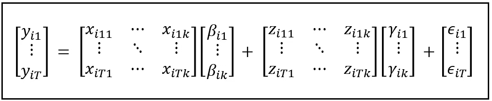**

**矩阵格式的国家 I 线性模型的一般形式(图片由作者提供)**

**所有特定于单元的效应都被假设为由术语***Z****_ I****γ****_ I .*矩阵***Z****_ I*及其系数向量***γ****_ I*是纯理论术语，因为它们所代表的内容实际上无法观察和测量。**

**我们的目标是找到一种方法来估计**_ I*对*y**_ I**γ**_ I*项对*的影响******

**为了简化估算，我们将把所有国家特有的不可观测效应的影响合并到一个变量中，对于国家 *i* ，我们称之为***z****_ I*。***z****_ I*是一个大小为*【T×1】*的矩阵，因为它只包含一个变量 *z_i* 并且它有 *T* 行对应于*T*z _ I 对 *T* 的“测量”数**

**由于***z****_ I*不是直接可观测的，为了衡量 ***z_i*** 的效果，我们需要将省略 ***z_i*** 的效果形式化。幸运的是，在统计学中有一个被充分研究过的概念叫做**省略变量偏差**，我们可以用它来达到这个目的。**

## **省略可变偏差**

**在面板数据集上训练模型时，如果我们从模型中遗漏掉**_ I*，就会造成所谓的**遗漏变量偏差**。可以看出，如果在不考虑 ***z_i*** 的情况下估计回归模型，那么系数**_ I*的估计值***β****_ cap _ I*会有如下偏差:****

**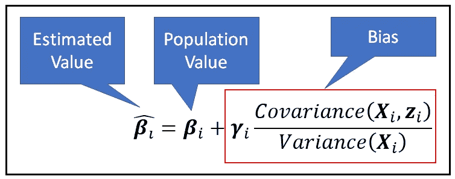**

**省略变量偏差:由于变量 ***z*** *_i(图片由作者提供)*的省略而在 ***β*** *_i 的估计中引入的偏差***

**可以看出，估计值***β****_ cap _ I*中引入的偏差与省略变量***z****_ I*和解释变量***X****_ I*之间的协方差成正比。**

**上述等式建议了一种方法，用于根据上述等式中的协方差项是否为零，即不可观察效应 ***z_i* 是否与回归变量**相关，来构建以下两种模型—**固定效应模型**和 [**随机效应模型**](/the-no-nonsense-guide-to-the-random-effects-regression-model-be899ce415a5) 。**

**在本文的其余部分，我们将关注固定效果模型，而在我下周的文章中，我将解释如何构建和训练[随机效果模型](/the-no-nonsense-guide-to-the-random-effects-regression-model-be899ce415a5)。**

# **固定效应回归模型**

**在这个模型中，我们假设**不可观察的个体效应 *z_i* 与回归变量**相关。实际上就是说上式中的*协方差(****X****_ I、****z****_ I)*非零。**

**在许多面板数据研究中，这种关于相关性的假设是合理的。例如，在股票交易场景中，交易者的交易敏锐度或获利的“诀窍”是不可测量的，并且是个人独有的。这种敏锐或诀窍可以被认为随着可测量的因素如年龄和教育水平而变化。有人可能会(正确或错误地)提出，获得高等学位的过程增强了一个人在执行某些任务时的内在敏锐度或诀窍。**

**在固定效应模型中，我们还假设由于忽略单位特定因素而引入的**偏差是群体特定的。****

**为了补偿这种偏差，**我们将在模型中引入一个特定于组的截距，称为*c****_ I***。** *假设 c_i* 的作用方向与省略变量偏差的作用方向相反(在矢量意义上)。**

**有了这两个假设，我们将固定效应回归模型的等式表示如下:**

**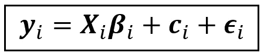**

**固定效应回归模型(图片由作者提供)**

**下面是矩阵形式:**

**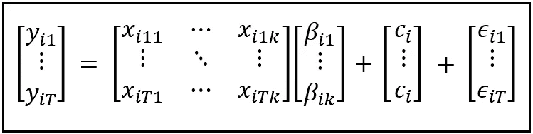**

**固定效应回归模型(图片由作者提供)**

**请注意，我们已经用代表不可观察因素影响的***c****_ I*替换了前面等式中的***z****_ I****γ****_ I*项，这是一个大小为*[T×1】的单位特定矩阵。*对于给定的单位 *i* ，该矩阵的每个元素具有相同的值 *c_i* 并且 *c_i 被假定为在所有时间段*都是恒定的。**

**对于特定时间段 *t* ，固定效果模型的等式可以表示如下:**

**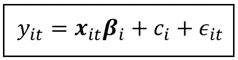**

**时间周期 t 时单位 I 的固定效应回归模型(图片由作者提供)**

**这是矩阵形式:**

**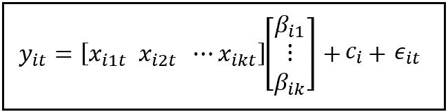**

**时间周期 t 时单位 I 的固定效应回归模型(图片由作者提供)**

**在这种形式中， *y_i_t* 、 *c_i* 和 *ϵ_i_t* 是标量，因为它们属于在时间 *t* 的特定观察，并且***x****_ I _ t*是在 ***中大小为*【1 x k】*的第 *t 个*行向量*****

## *单位效应 c_i 的估计 c_cap_i 是随机变量*

*请注意， *c_i* 不携带时间下标 *t* ，因为它对于给定国家的所有时间段 *T* 都是相同的。说到这里，国别效应 *c_i* 的**估计值** *c_cap_i* 和估计系数矩阵**_ cap _ I*中的任何一个系数一样，都是一个随机变量。要了解原因，想象一下固定效应模型被训练了数百次，每次都是在面板数据集的一个不同的、随机选择的(但连续的)子集上。在每次训练运行之后，所有估计的系数***β_ cap****_ I*和估计的单位特定效应 *c_cap_i* 将获得稍微不同的一组值。如果我们从不同的训练运行中绘制所有这些 c_i 的估计值，它们的频率分布将具有某种形状，具有某个平均值和某个方差。例如，我们可以推断它们正态分布在**I*和 *c_i* 中各个系数的真实总体水平值周围。因此，估计的单位特定影响 *c_cap_i* 表现得像具有某种概率分布的随机变量。***

**在固定效应模型中，我们假设所有单位特定效应的估计值具有相同的恒定方差 *σ。*假设正态分布 *c_cap_i 也很方便(尽管不是必需的)*因此，我们有:**

***c_cap_i ~ N(c_i，σ )***

**下图说明了假设面板数据集中三个单位的 *c_i* 的概率分布:**

**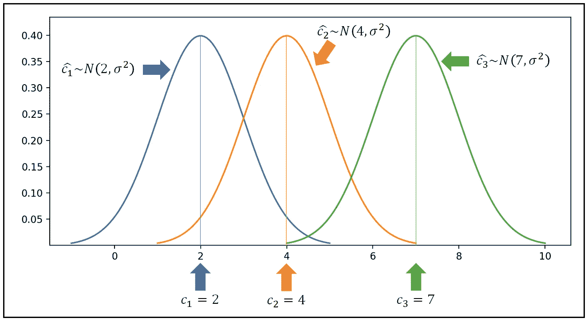**

**面板数据集中三个不同单位的单位特异性效应 c_i 的概率分布(图片由作者提供)**

## **如果还有一些可观测变量被省略了呢？**

**实际中， ***X*** 矩阵往往是不完整的。出于各种原因，人们可能从模型中遗漏了一个或多个可观察变量。也许测量一个变量 w.r.t .的成本及其对 ***y*** 的假定影响是令人望而却步的。也许不测量某些变量有道德上的原因。或者一个变量可能被遗漏掉了, ***X*** 仅仅是因为实验者的疏忽。**

**在这种情况下，它们的省略将使拟合模型*的所有参数估计产生偏差，包括所有单元*的单元特定因子 c_i 的估计值。**

# **估计固定效应回归模型**

**固定效应模型的估计包括估计系数***【β_****I*和每个单元 *i* 的单元特定效应 *c_i* 。**

**在实践中，我们通过添加对应于 *n* 个单元或组的单元特定虚拟变量 *d_1，d_2，…，d_n* ，将所有单元的模型汇集成一个通用回归模型，如下所示:**

**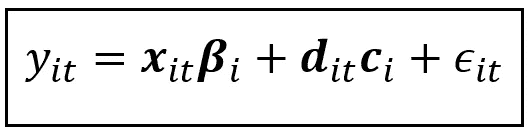**

**包含虚拟变量的固定效应模型(图片由作者提供)**

**在上面的等式中:**

*   ***y_i_t* 是一个标量，包含在时间 *t.* 对单元(国家) *i* 的特定观察**
*   *****x****_ I _ t*是一个大小为*【1 x k】*的行向量，包含时间 *t* 时单元 *i* 的所有 *k* 回归变量的值。**
*   *****β****_ I*是*【k x 1】*的列向量，包含 *k* 回归变量的回归系数的总体(真)值。**
*   *****d****_ I _ t*是一个大小为*【1 x n】*的行向量，包含一个热编码的虚拟变量 *d_i_j_t* ，其中 *j* 从 1 到 *n* —数据面板中的每个 *n* 单元一个虚拟变量。例如:***d****=[0 1 0 0 0 0 0]*是单元#2 的虚拟矢量。其思想是当 *j=i* 时，虚拟向量的第 *j 个*元素应该是 1，否则应该是 0。**
*   *****c****_ I*是一个大小为*【n×1】*的列向量，包含与 *n* 个单位相关联的单位特定效果的总体值。**
*   ***ϵ_i_t* 是一个标量，包含单元 *i* 在时间 *t* 的回归误差项。**

**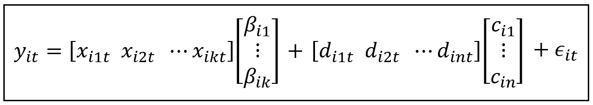**

**用矩阵符号表示的固定效果模型(图片由作者提供)**

**上述模型是一个线性模型，可以很容易地使用 OLS 回归技术进行估计。这种带有虚拟变量的线性回归模型称为**带有虚拟变量的最小二乘**(简称 **LSDV** )。**

**模型培训包括以下内容:**

1.  **将单位特定矩阵***y****_ I****，X*** *_i* ***，β****_ I****，d****_ I****，c****_ I***
2.  ***训练合并的模型以生成对应于 *k* 回归变量的*【k×1】*大小的系数向量**的估计，以及数据中包含的 *n* 单位的*【n×1】*大小的单位特定效应向量**的估计*******

## ***公共系数假设***

***在汇集模型中，我们做了一个隐含的重要假设，即*估计系数****β****_ cap 对于所有 n 个单位*是共同的。 [Chow 测试](https://en.wikipedia.org/wiki/Chow_test)可以用来测试这个假设(虽然我们在这里不会深入探讨)。***

**对于世界银行国家数据面板，可集合性假设的意思是，每个国家总资本形成变化(GCF_GWTH_PCNT)的斜率( *β* ***)*** 的人口值是相同的。换句话说，GCF_GWTH_PCNT 的单位变化预计会转化为每个国家 GDP 的相同变化量。因此，正是国别效应 *c_i* 和误差项 *ϵ_i_t* 有可能导致不同国家的总 GDP 百分比变化*因 GCF_GWTH_PCNT 中的每个单位变化而不同。***

**这种行为是共同系数假设的直接结果，它恰好是固定效应模型的一个重要但不明显的特征。**

**在我们深入本文的教程部分之前，这里是关于 FE 模型需要记住的最后一件事:**

**通过训练固定效应回归模型生成的估计值仅适用于面板数据集中的单位。来自固定效应模型的**估计值不会将**推广到群体中具有相同性质的其他单位。**

**这对国家数据面板来说意味着 *β* 和 *c_i* 的估计值仅适用于数据面板中的 7 个国家。人们不应该通过训练数据集上的有限元模型来概括特定国家的影响 *c_cap_i* ，以任何方式表示数据集中没有表示的任何国家的特定国家影响。**

**如果我们想让特定单位的效应延续到相似单位的群体，随机效应模型(下周讨论)可能更合适。**

# **如何使用 Python 和 Statsmodels 构建固定效应回归模型**

**让我们为世界银行数据面板建立和训练一个固定效应模型。**

**我们将继续使用文章开头的熊猫数据框架。我们将在展平的面板数据集上构建和训练有限元模型，如下所示:**

****

**展平面板数据(作者提供的图片)**

**请注意，在这个扁平化的版本中，有一个单位(国家)列和一个时间段(年)列。**

**打印熊猫数据帧揭示了这种结构:**

**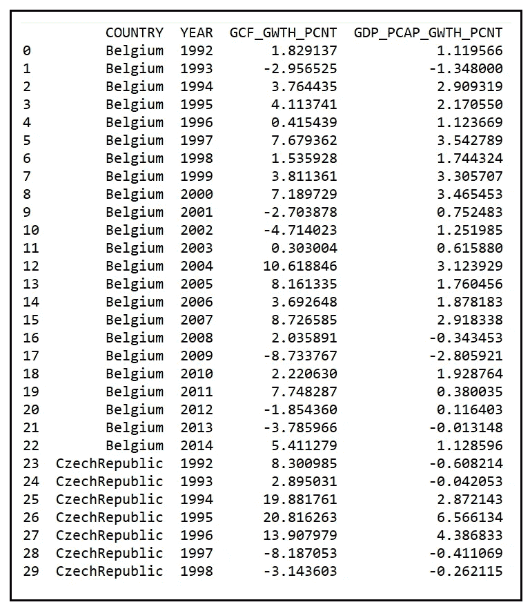**

**熊猫数据框显示了世界银行数据面板的前 30 行**

**让我们创建特定于国家的虚拟变量:**

```
**unit_col_name=**'COUNTRY'** time_period_col_name=**'YEAR'

*#Create the dummy variables, one for each country*** df_dummies = pd.**get_dummies**(df_panel[unit_col_name])**
```

**将假人数据框连接到面板数据集:**

```
**df_panel_with_dummies = df_panel.**join**(df_dummies)**
```

**下面是带有虚拟对象的数据面板的样子:**

**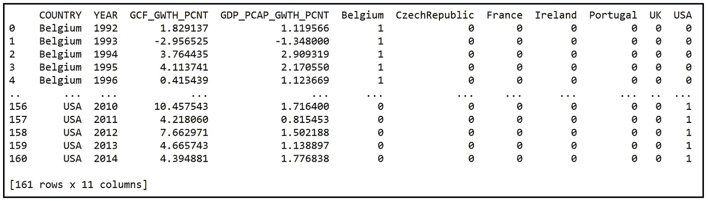**

**带有特定国家虚拟变量的数据面板(图片由作者提供)**

**定义 ***y*** 和 ***X*** 变量名:**

```
**y_var_name = **'GDP_PCAP_GWTH_PCNT'** X_var_names = [**'GCF_GWTH_PCNT'**]**
```

**定义感兴趣的单位(国家):**

```
**unit_names = [**'Belgium'**, **'CzechRepublic'**, **'France'**, **'Ireland'**, **'Portugal'**, **'UK'**, **'USA'**]unit_names.sort()**
```

**构建回归方程。请注意，我们遗漏了一个虚拟变量，以避免 7 个虚拟变量之间的完全[多重共线性](https://en.wikipedia.org/wiki/Multicollinearity)。回归模型的截距将保存忽略的美国虚拟变量的系数值。**

```
**lsdv_expr = y_var_name + **' ~ '** i = 0
**for** X_var_name **in** X_var_names:
    **if** i > 0:
        lsdv_expr = lsdv_expr + **' + '** + X_var_name
    **else**:
        lsdv_expr = lsdv_expr + X_var_name
    i = i + 1
**for** dummy_name **in** unit_names[:-1]:
    lsdv_expr = lsdv_expr + **' + '** + dummy_name

print(**'Regression expression for OLS with dummies='** + lsdv_expr)**
```

**我们看到以下输出:**

```
**Regression expression for OLS with dummies=**GDP_PCAP_GWTH_PCNT ~ GCF_GWTH_PCNT + Belgium + CzechRepublic + France + Ireland + Portugal + UK****
```

**在包含假人的面板数据上构建和训练 LSDV 模型:**

```
**lsdv_model = smf.**ols**(**formula**=lsdv_expr, **data**=df_panel_with_dummies)lsdv_model_results = lsdv_model.**fit**()print(lsdv_model_results.**summary**())**
```

**我们看到以下输出:**

**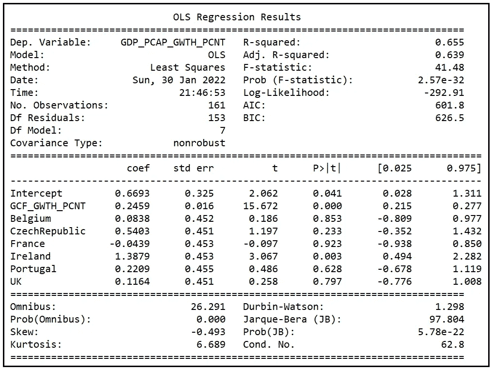**

**LSDV 模型的训练总结(图片由作者提供)**

# **如何解释固定效果模型的训练输出**

## **估计系数的统计显著性**

**首先要看的是拟合模型的系数:**

**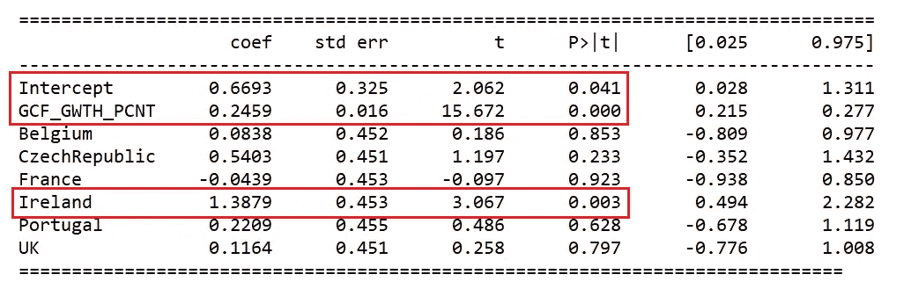**

**经过训练的有限元模型的回归系数(图片由作者提供)**

**我们看到，总资本形成的 Y — o — Y %变化系数(GCF_GWTH_PCNT)在 p < .001 as indicated in the P > |t|列中是显著的。这是好消息。**

## **国别影响的估计值**

**接下来，让我们看看代表特定国家影响的 7 个虚拟变量的系数——这就是我们建立这个模型的全部原因。**

**我们观察到，代表美国特定国家效应的回归截距(省略变量)为 0.6693，在 p 值为 0.041 时具有统计显著性(即，其人口值估计为非零)。**

**爱尔兰虚拟变量的系数为 1.3879，p 值为 0.003 时显著。爱尔兰的实际国别影响计算为 0.6693+1.3879 = 2.0572。**

**代表其余国家(比利时、捷克共和国、法国、葡萄牙和英国)的虚拟变量的系数在 p 值为 0.05 时没有统计学意义。这意味着它们的国别效应 *c_i* 可以被认为与美国的相同(0.6693)。**

**下表列出了数据面板中所有 7 个国家的预计国别影响( *c_cap_i* ):**

**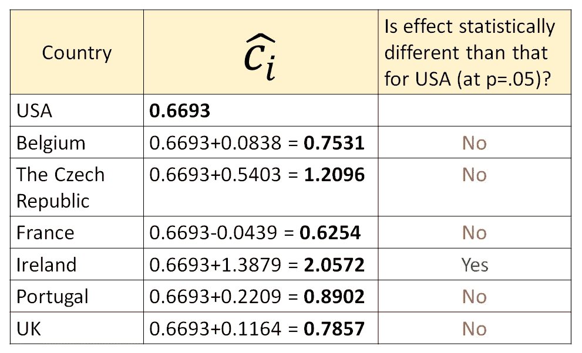**

**特定国家影响的估计值(图片由作者提供)**

## **固定效应模型的拟合优度**

**现在让我们从各种角度分析有限元模型的拟合优度，看看它的符合程度如何。**

****调整后的 R 平方****

**我们首先要看的是 [**调整后的 R 平方**](/the-complete-guide-to-r-squared-adjusted-r-squared-and-pseudo-r-squared-4136650fc06c) 值，报告为 0.639:**

**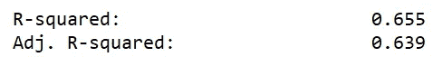**

**经过训练的有限元模型的 R 平方和调整的 R 平方(图片由作者提供)**

**调整后的 R 平方测量响应变量 ***y*** 中方差的分数，该模型在考虑了由于回归变量的存在而损失的自由度后能够解释*(该模型有 7 个这样的变量)。调整后的 R 平方值为 0.639(或约 64%)，表明拟合度不错，但不是很好。在我关于[**混合 OLS 回归模型**](/how-to-build-a-pooled-ols-regression-model-for-panel-data-sets-a78358f9c2a) 的文章中，我们在同一个面板数据集上拟合了一个混合 OLS 模型，其调整后的 R 平方为 0.619。就拟合优度而言，有限元模型似乎比混合 OLS 模型略有改进。我们将很快以另一种方式证实这一事实。***

****F 统计量****

**接下来，让我们看看训练总结中报告的 F 统计量:**

**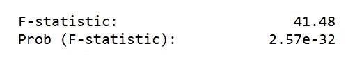**

**经过训练的有限元模型的 f 检验统计量和 p 值(图片由作者提供)**

**用于回归分析的 [**F 检验**](/fisher-test-for-regression-analysis-1e1687867259) 检验是否所有模型系数都*共同*显著，因此 FE 模型的拟合优度是否优于仅截距(又称平均值)模型。我们看到 f 检验的统计值 41.48 在 p < .001 处是显著的，从而暗示模型的拟合优度确实比均值模型的好。**

****对数似然和 AIC 分数****

**现在让我们看看对数似然和 [**AIC 得分**](/the-akaike-information-criterion-c20c8fd832f2) 度量:**

**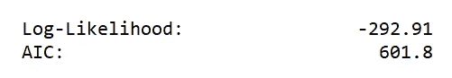**

**经过训练的有限元模型的对数似然和 AIC 分数(图片由作者提供)**

**这些价值本身毫无意义。我们需要将它们与竞争模型的相应值进行比较。我们的竞争模型是 [**混合 OLS 回归模型**](/how-to-build-a-pooled-ols-regression-model-for-panel-data-sets-a78358f9c2a) ，我们已经在同一 WB 面板数据集的早期文章中对其进行了训练。下面是这两种模型的 Log-LL 和 AIC 分数的对比:**

**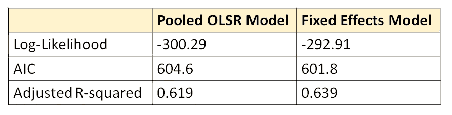**

**混合 OLSR 模型和固定效应模型的拟合优度比较(图片由作者提供)**

**有限元模型的对数-11 和 AIC 分别略大于和略小于汇集 OLSR 模型的对数-11 和，这表明有限元模型的拟合优度略好于汇集 OLSR 模型，尽管差距不大。**

****使用 f 检验测试固定效应的显著性****

**最后，让我们直接测试固定效应模型的零假设，即所有国家特定效应 *c_i* 共同为零，这意味着，实际上，在这个数据集中没有固定效应在起作用。我们可以通过在两个模型 之间运行 [**F 检验来做这个测试——一个受限模型和一个非受限模型:**](/fisher-test-for-regression-analysis-1e1687867259)**

1.  **受限模型(变量较少的模型)是之前文章中提到的 [**集合 OLSR 模型**](/how-to-build-a-pooled-ols-regression-model-for-panel-data-sets-a78358f9c2a) ，**
2.  **无限制模型是**固定效果模型**。**

**f 检验的检验统计量计算如下:**

**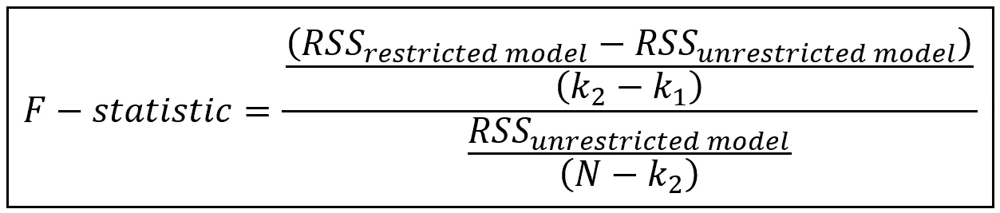**

**F 统计量的公式(图片由作者提供)**

**其中:**

*   ***RSS_restricted_model* =受限(参数数量较少)模型的残差平方和。**
*   ***RSS_unrestricted_model* =未受限(参数数量较大)模型的残差平方和。**
*   ***k1*=受限模型的自由度**
*   ***k2*=无限制模型的自由度。所以，*k2*必然大于*k1*。**
*   ***N* =数据样本数**

**F 统计量服从自由度为*(k2—k1，N—k2)*的 [**F 分布**](https://en.wikipedia.org/wiki/F-distribution) 。**

**让我们进行 f 检验。我们将从设置用于计算 f 检验的变量开始:**

```
****#n=number of groups**
n=len(unit_names)**#T=number of time periods per unit**
T=df_panel.shape[0]/n**#N=total number of rows in the panel data set**
N=n*T**#k=number of regression variables of the Pooled OLS model including the intercept**
k=len(X_var_names)+1**
```

**获取混合 OLS 模型的残差平方和:**

```
**ssr_restricted_model = pooled_olsr_model_results.**ssr****
```

**获得固定效应模型的残差平方和:**

```
**ssr_unrestricted_model = lsdv_model_results.**ssr****
```

**获得集合 OLSR 模型的自由度:**

```
**k1 = len(pooled_olsr_model_results.**params**)**
```

**获取固定效果模型的自由度:**

```
**k2 = len(lsdv_model_results.**params**)**
```

**计算 F 统计量:**

```
**f_statistic = ((ssr_restricted_model - ssr_unrestricted_model) /ssr_unrestricted_model) * ((N-k2)/(k2-k1))
print(**'F-statistic for FE model='**+str(f_statistic))**
```

**计算α= 0.05 时 F 分布的临界值:**

```
**alpha=0.05f_critical_value=st.**f**.**ppf**((1.0-alpha), (k2-k1), (N-k2))print(**'F test critical value at alpha of 0.05='**+str(f_critical_value))**
```

**我们看到以下输出:**

```
**F-statistic for FE model=**2.448840073192174**
F test critical value at alpha of 0.05=**2.158306686033669****
```

**我们看到，在α= 0.05 时，F 统计量大于临界值，这使我们得出结论，LSDV 固定效应模型的拟合优度优于集合 OLSR 模型。**

**以下是本文中使用的完整源代码:**

# **参考文献、引文和版权**

## **数据集**

**[世界发展指标](https://databank.worldbank.org/metadataglossary/world-development-indicators/series)世界银行数据 [CC BY 4.0 license](https://www.worldbank.org/en/about/legal/terms-of-use-for-datasets) 。 [**下载链接**](https://gist.github.com/sachinsdate/c40651e9e4bc13a696780462209f1992)**

## **纸质和图书链接**

**巴蒂·h·巴尔塔吉， [*面板数据的计量经济分析*](https://link.springer.com/book/10.1007/978-3-030-53953-5) ，第 6 版，*施普林格***

**威廉·h·格林， [*计量经济分析*](https://www.pearson.com/us/higher-education/program/Greene-Econometric-Analysis-8th-Edition/PGM334862.html) ，第 8 版*，* 2018，*培生***

## **形象**

**本文中的所有图片版权归 [CC-BY-NC-SA](https://creativecommons.org/licenses/by-nc-sa/4.0/) 所有，除非图片下面提到了不同的来源和版权。**