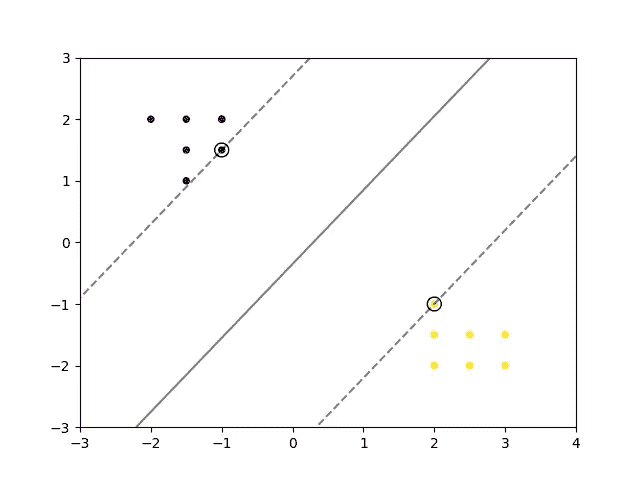
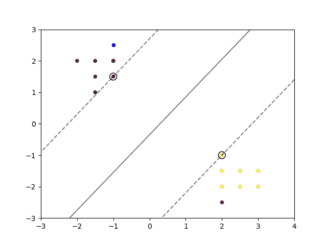

# 理解 scikit-learn 的 SVC 模型的超平面

> 原文：<https://towardsdatascience.com/understanding-the-hyperplane-of-scikit-learns-svc-model-f8515a109222>

## 如何解释 scikit-learn 中线性 SVC 的 coef_ attribute 以解决二元分类问题


由[Lisa vanthornout](https://unsplash.com/@lisawentwandering?utm_source=medium&utm_medium=referral)在 [Unsplash](https://unsplash.com?utm_source=medium&utm_medium=referral) 上拍摄的照片

这篇文章将教你如何解释 scikit-learn 的 SVC 的`coef_`和`intercept_`属性，以及如何使用它们来预测新的数据点。

我最近完成了一个项目，其中我必须用 c 语言部署一个 SVC。我用 Python 训练了一个 SVC，以便用高级语言完成寻找超平面的繁重工作，然后我从那个模型中提取必要的值。

在这个过程中，我发现要准确理解如何解释`**coef_**`和`**intercept_**`属性中的值有点困难，所以这正是我将在这篇文章中向您展示的。

> **注意:**这篇文章将**而不是**包括 SVC 背后的所有数学细节，相反，它旨在让您在使用 scikit-learn 的模型时，对正在发生的事情有一个直观和实际的理解。

## 预测函数

安装 SVC 意味着我们正在解决一个优化问题。换句话说，我们试图最大化超平面和不同标签的支持向量之间的间隔。一旦找到最佳边缘和超平面**，我们可以使用以下等式来预测新数据点的标签:**


预测标签为 1 的等式


预测标签 as -1 的方程式

其中`**w**`是来自拟合模型的`coef_`属性的系数。`**x**` 是我们要分类的新数据点的向量。`**b**`是我们从模型的`intercept_`属性中得到的一个偏差项。

请记住，一个单一的超平面本质上只是一条线，因此它只能分类两类，一边一个。数学上我们可以用 1 和-1 来表示，(或者 1 和 0，这并不重要)，如上面的等式所示。

该等式的工作方式如下:我们取系数和新点的点积，然后加上偏差。如果结果大于或等于 0，那么我们将新点分类为标签 1。否则，如果结果低于 0，那么我们将新点分类为标签-1。

## 示例:二元问题的 SVC

为了演示我们刚刚看到的数学，并初步了解如何从拟合模型中提取系数，我们来看一个例子:

使用 scikit-learn 的 SVC 的二进制分类 scnario 的代码示例—由作者创建

上面的代码片段创建了一些虚拟数据点，这些数据点显然是线性可分的，并被分成两个不同的类。在将 SVC 拟合到变量`clf`中的数据后，还绘制了数据点和带有支持向量的超平面。这是结果图:



二元分类问题的数据点和超平面图——由作者创建

> **注意** : `sklearn.inspection.DecisionBoundaryDisplay`非常酷，可以用来绘制二分类问题(两个标签)的超平面和支持向量。

现在让我们来看看之前装配好的`clf`模型的`coef_`和`intercept_`属性。

```
print(clf.coef_)
print(clf.intercept_)>> [[ 0.39344262 -0.32786885]] #This is the **w** from the equation
>> [-0.1147541]                #This is the **b** from the equation
```

我们将很快回来，但首先让我们介绍两个新的数据点，我们将分类。

```
new_point_1 = np.array([[-1.0, 2.5]])
new_point_2 = np.array([[2, -2.5]])plt.scatter(new_point_1[:, 0], new_point_1[:, 1], c='blue', s=20)
plt.scatter(new_point_2[:, 0], new_point_2[:, 1], c='red', s=20)plt.show()
```

如果我们继续执行帖子中显示的第一个代码要点，那么我们会得到下面的图，其中包括两个新的蓝色数据点(`new_point_1`，左上角)和红色数据点(`new_point_2`，右下角)。



二元分类问题的数据点、超平面和两个新点的绘图—由作者创建

使用拟合的模型，我们可以通过调用`predict`函数对这些点进行分类。

```
print(clf.predict(new_point_1))
print(clf.predict(new_point_2))>> [0] #Purple (result is less than 0)
>> [1] #Yellow (result is greater than or equal to 0)
```

## 模拟预测功能的手动计算

为了进行分类，该模型使用了我们之前看到的等式。我们可以“手动”计算一下，看看是否得到相同的结果。

提醒:
`coef_`被`[[ 0.39344262 -0.32786885]]
intercept_`被`[-0.1147541]
new_point_1`被`[[-1.0, 2.5]]
new_point_2`被`[[2.0, -2.5]]`

计算点积并加上偏差可以这样完成:

```
print(np.dot(clf.coef_[0], new_point_1[0]) + clf.intercept_)
print(np.dot(clf.coef_[0], new_point_2[0]) + clf.intercept_)>> [-1.32786885] #Purple (result is less than 0) 
>> [1.49180328]  #Yellow (result is greater than or equal to 0)
```

瞧啊。我们进行与预测函数相同的分类。

我希望这一点很清楚，容易理解。这并不是对 SVC 模型如何工作的深入研究，但足以在进行分类时获得对正在发生的事情的基本理解。

当分类问题不是二元而是多类时，事情变得更加复杂。我会写一篇后续文章，解释如何解释这种模型的系数。

如果您有任何反馈或问题，请随时联系我。

感谢阅读！