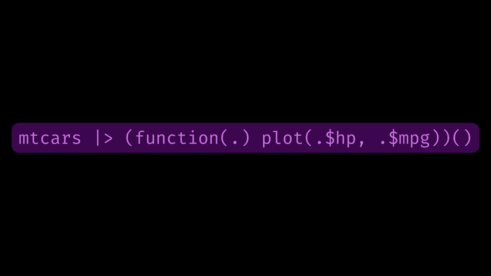

# 了解原生 R 管道| >

> 原文：<https://towardsdatascience.com/understanding-the-native-r-pipe-98dea6d8b61b>

## 或者，为什么 mtcars |> plot(hp，mpg)不行，你能做些什么。



如何用新的原生 R 管出图(自制图)

## 带原生 R 管的功能组合

不久前，我写了[这篇推文](https://mobile.twitter.com/ivelasq3/status/1404947187155574787)展示了许多(不是全部！)使用 R 在数据框中搜索一组特定列的方法。这些方法中有几种使用了{magrittr}管道(`%>%`)和本机 R 管道(`|>`)，后者从 R 版本 4.1.0 开始就可用。{ magrittr }和 native R 管道以不同的方式工作，每个人的心理模型都需要一些维护。这是我如何学会理解原生 R 管的故事。

## 懒惰是如何引发这篇文章的

当我感到懒惰的时候，我用基数 R 进行快速绘图:

```
plot(mtcars$hp, mtcars$mpg)
```

因为与{ggplot2}方案相比，这显然节省了大量时间🤣：

```
library(ggplot2)
library(magrittr)

mtcars %>%
  ggplot(aes(x = hp, y = mpg)) +
  geom_point()
```

有一天，我觉得特别懒，所以我试着用新的原生 R 管`|>`:

```
mtcars |> plot(hp, mpg)
#> Error in get(as.character(FUN), mode = "function", envir = envir) :
#> object 'mpg' of mode 'function' was not found
```

哦不！为什么是错误？

完全是对原生 R 管的误解。我认为用原生 R 管道传输数据将取代对`data$column`符号的需求。原来，这根本不是原生 R 管道所做的。所以，这种偷懒的尝试最终导致了一次冒险，那就是找出为什么这不起作用，以及什么可以替代。

## {马格里特}烟斗`%>%`的工作原理

首先，让我们检查一下您可能更熟悉的管道(如果您使用{tidyverse}方言):来自{ magrittr }包的`%>%`转发管道。

在没有任何点语法(`.`)的情况下，{ magrittr }管道`%>%`是一个[中缀运算符](https://en.wikipedia.org/wiki/Infix_notation)，它将管道左侧(LHS)的内容输送(移动)到管道右侧(RHS)的函数的第一个参数中。由于 R 易于使用带有许多嵌套括号的表达式，管道允许人们从左到右推理代码(如用英语编写时)，而不是从右到左推理带有许多嵌套括号的代码(见下面的例子)。

根据{ magrittr }文档，管道的用法如下:`LHS %>% RHS`。可能更容易将“管道”视为超级马里奥兄弟中著名的“扭曲管道”之一——它将 LHS 中的马里奥扭曲到 RHS 函数的第一个参数中！

所以:

```
mtcars2 <-
  mtcars %>%
  dplyr::mutate(hi_mpg = dplyr::if_else(mpg > 25, "high", "low"))
```

相当于:

```
mtcars2 <-
  dplyr::mutate(mtcars, hi_mpg = dplyr::if_else(mpg > 25, "high", "low"))
```

而且，

```
mtcars %>% plot(hp, mpg)
```

相当于:

```
plot(mtcars, hp, mpg)

# or, more explicitly
plot(x = mtcars, y = hp, type = mpg)
```

这不起作用，并给我们一个错误消息，因为`plot()`的前两个参数应该是 x 轴和 y 轴的对象(`mtcars`是一个奇数 x 轴，但在技术上是可行的)，第三个参数是绘图的类型(`mpg`肯定在那里不起作用)。

如果您希望将 LHS 传递到{ magrittr }管道的第一个参数以外的地方，您可以使用它的点语法(`.` ): `y %>% f(x, .)`相当于`f(x, y)`。

```
mtcars %>%
  lm(mpg ~ hp, data = .)
```

相当于:

```
lm(mpg ~ hp, data = mtcars)
```

那么，我们如何让{ magrittr }管道与`plot()`一起工作呢？我们可以使用点语法作为数据框的占位符。然而，这也不起作用:

```
mtcars %>% plot(.$hp, .$mpg)
#> Error in match.fun(panel) :
#> '.$mpg' is not a function, character or symbol
```

为什么？该错误提示`.$mpg`步骤有问题。[1]默认情况下，{ magrittr }管道将 LHS 传递给 RHS 的第一个参数，因此给出上述错误的调用相当于编写:

```
plot(mtcars, mtcars$hp, mtcars$mpg)

# or, more explicitly
plot(x = mtcars, y = mtcars$hp, type = mtcars$mpg)
```

这不工作，也不是我们想要的(我们想让`mtcars$hp`在 x 轴上，而`mtcars$mpg`在 y 轴上)。让{ magrittr }管道做我们想要的`plot()`的方法是使用它的花括号`{}`语法。通过用花括号将 RHS 括起来，我们可以覆盖将 LHS 传递给第一个参数的规则:

```
mtcars %>% {plot(.$hp, .$mpg)}
```

这个管用！这相当于写了:

```
plot(mtcars$hp, mtcars$mpg)
```

好吧！现在，我们可以将我们所学的应用到原生 R 管道。对吗？…对吗？

## 实际上，我认为在解释`|>`如何工作之前，我们需要绕道来解释匿名(LAMBDA)函数

为什么匿名？因为它们不是包中的命名函数，也不是您编写并存储在函数对象中的函数。匿名函数是动态创建的，可以立即应用，并且在使用后不会持久:`function(x) {}`。

```
function(x) {
  x[which.max(x$mpg), ]
}
```

这是做什么的？如果没有保存到对象中，它会创建一个匿名函数(也称为 lambda 函数)。

在 R 4.1 中引入的匿名函数的快捷方式`\(x) {}`与`function(x) {}`相同:

```
# equivalent to the above
\(x) {
  x[which.max(x$mpg), ]
}
```

你从编写匿名函数中得到的好处是，你可以通过显式地声明输入以及如何在函数中使用它们来引导流量。回到我们对管道的讨论，你可以准确地指出管道的 LHS 在 RHS 中的位置。

## 原生 R 管如何工作

像{ magrittr }管道`%>%`一样，本机 R 管道`|>`将 LHS 管道到 RHS 上函数的第一个参数:`LHS |> RHS`。

你可以写:

```
mtcars |> sqrt() |> head()
```

这相当于:

```
head(sqrt(mtcars))
```

一个重要的注意事项:在`|>`的 RHS 上，您需要将函数作为函数调用包含进来，这意味着在函数名的末尾附加一个`()`，而不仅仅是它的名字。例如，通过编写`sqrt()`来调用平方根函数。如果你试图运行`mtcars |> sqrt`而不运行最后的`()`，你将得到一个错误:`Error: The pipe operator requires a function call as RHS`。

因此，本机 R 管道将 LHS 通过管道传递到 RHS 上函数的第一个参数中(额外要求需要 RHS 上的函数调用)。**但仅此而已！**如果你想做任何事情*而不是*将 LHS 引入 RHS 函数的第一个参数，那么你需要上面介绍的特殊匿名函数语法。

这里的一个问题是，我们还需要在匿名函数周围写括号，这样上面的伪代码版本就是`mtcars |> (anonymous-function-definition)()`。这样做的原因是第二组`()`正确地指向第一组`()`内部的复杂表达式作为被调用的函数。[2] [3]

```
mtcars |> (\(x) {
   x[which.max(x$mpg), ]
})()
```

回想我们对{ magrittr }管道`%>%`的了解，您可能会尝试使用点语法(`.`)。最后一个重要注意事项是，点语法不适用于原生 R 管道`|>`,因为点语法是{magrittr}的特性，而不是 base R 的特性。例如:

```
mtcars %>% plot(.$hp)
```

但是这并没有，因为本地 R 管道不支持点语法:

```
mtcars |> plot(.$hp)
#> Error in pairs.default(data.matrix(x), ...) : object '.' not found
```

但是，如果你创建了一个匿名函数，你可以决定输入参数的名字是什么，是`.`、`x`、`data`，任何东西！因此，如果您受限于{ magrittr }中的点语法，您可以使用`\(.) {}`来“引导”您自己的点语法。

总之，本机 R 管道不支持点语法，除非您明确定义了自己的语法。

## 找到解决方案

最后，我们得到了解决方案:要让原生 R 管道做我们想用`plot()`做的事情，我们需要使用一个匿名函数，并为我们自己引导点语法(或任何其他参数名):

```
# verbosely
mtcars |> (function(.) plot(.$hp, .$mpg))()

# using the anonymous function shortcut, emulating the dot syntax
mtcars |> (\(.) plot(.$hp, .$mpg))()

# or if you prefer x to .
mtcars |> (\(x) plot(x$hp, x$mpg))()

# or if you prefer to be explicit with argument names
mtcars |> (\(data) plot(data$hp, data$mpg))()
```

就是这样！🎉这是可以做到的，但是最初偷懒的尝试最终花费的时间比最初预计的要多得多。俗话说，“一管及时省九”。

## 真正的懒惰方式

这是对`%>%`和`|>`管道如何工作的探索，但是我们还有另一个选择！{ magritter }**exposition pipe**`%$%`将 LHS 中的名字“暴露”给 RHS 表达式。

所以，像我这样懒惰的{ magrittr }用户的赢家是:

```
mtcars %$% plot(hp, mpg)
```

没有点语法，没有花括号，没有匿名函数，没有终端函数调用，只有管道和列名！它有效地模拟了如果`plot()`是一个{tidyverse}函数，它将如何工作。

说真的，所有 pipe 用户都是赢家！正如排列图 tweet 中所示，我们有许多选择来做我们想用 r 做的事情。

## 更多资源

*   [{马格里特}前钻杆操作员帮助文档](https://magrittr.tidyverse.org/reference/pipe.html)(或 R 控制台中的`?"%>%"`)
*   [前钻杆操作员帮助文件](https://stat.ethz.ch/R-manual/R-devel/library/base/html/pipeOp.html)(或 R 控制台中的`?pipeOp`
*   [高级 R 中的功能章节](https://adv-r.hadley.nz/functions.html)

## 那些走到这一步的人会得到额外的奖励

如何用提议的原生 R 管道绑定`=>`语法做到这一点？一旦你有了答案，请回复我关于这篇博文的推文。

[1]在没有参数`mtcars %>% plot(.$hp)`的情况下运行同一行，确实没有错误(但是这不是我们想要的图，因为它使用`mtcars`作为第一个参数，如上所述)。

【2】第一个表达式的花括号，`{}()`，工作太:`mtcars |> {\(x) {x[which.max(x$mpg),]}}()`。参见 Ronak Shah 在这个 [StackOverflow 线程](https://stackoverflow.com/questions/67633022/what-are-the-differences-between-rs-new-native-pipe-and-the-magrittr-pipe/67638063#67638063)中的回复。

[3]或者更多关于这方面的信息，请参见 Q2 及其在[高级研发解决方案](https://advanced-r-solutions.rbind.io/functions.html)的“功能”一章中的回答。

本文原载于 2021 年 1 月 18 日 [% > % dreams](https://ivelasq.rbind.io/blog/understanding-the-r-pipe/) 。