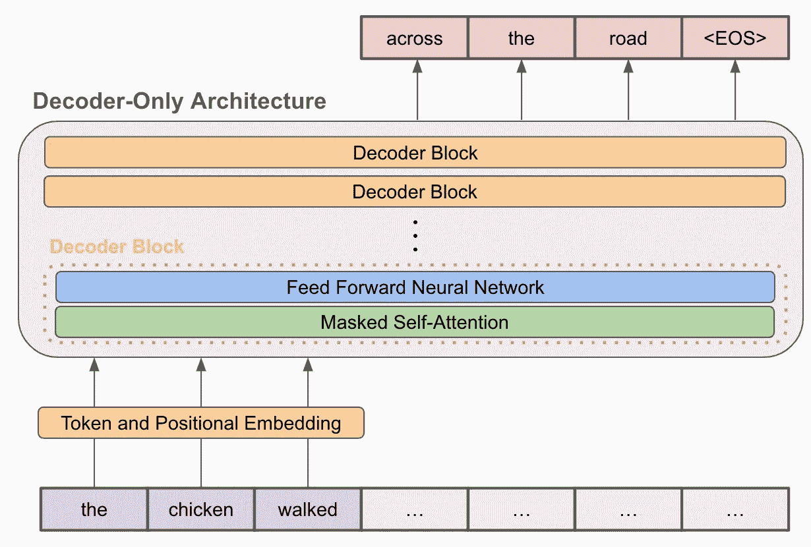
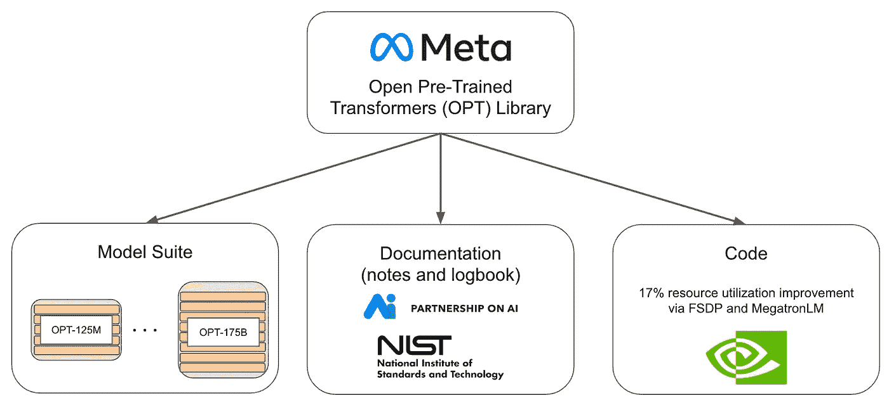
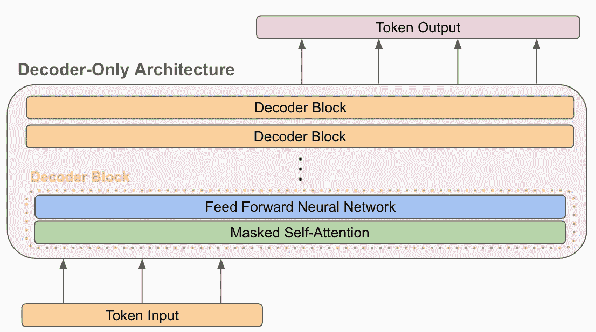
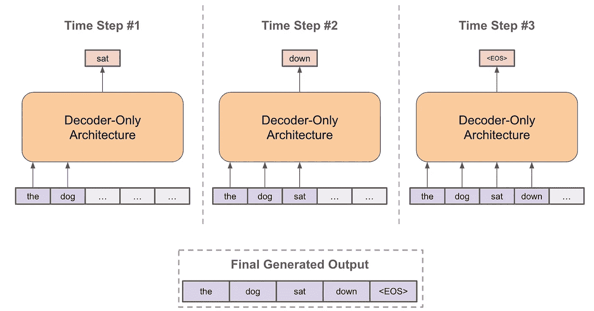
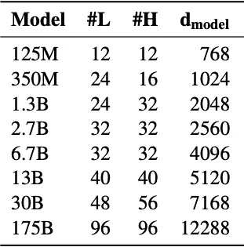
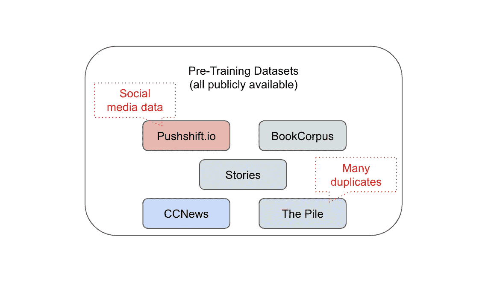
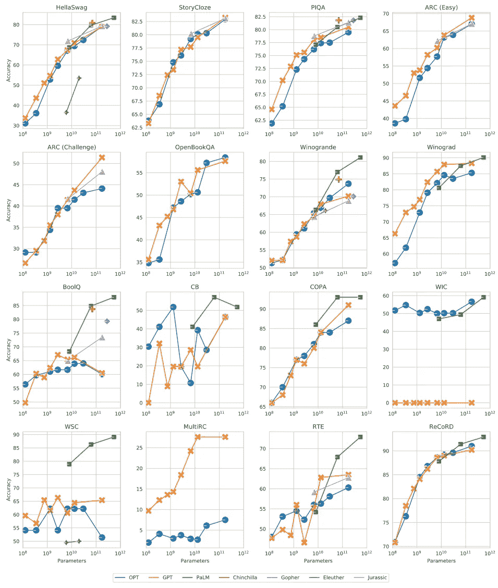
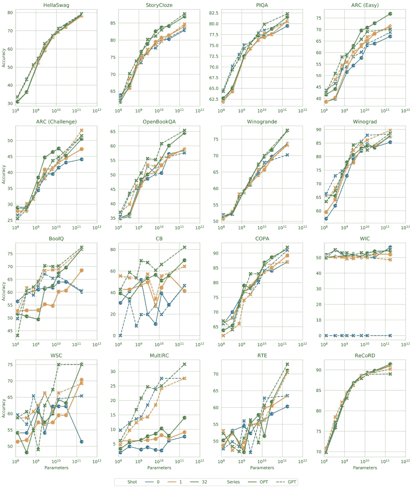
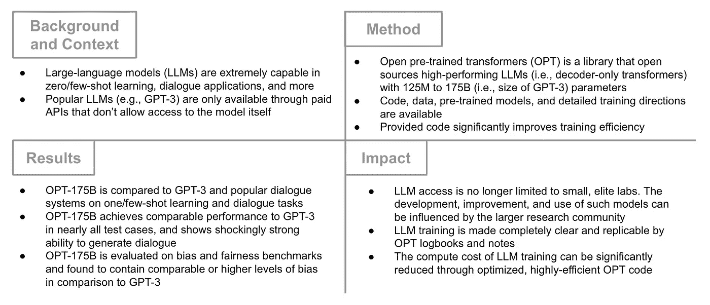

# 了解开放式预训练变形金刚(OPT)库

> 原文：<https://towardsdatascience.com/understanding-the-open-pre-trained-transformers-opt-library-193a29c14a15>

## 走向语言建模中的透明性和包容性…

仅解码器语言建模架构的描述(由作者创建)

最近， [Meta AI](https://ai.facebook.com/) 发布了“OPT:Open Pre-Trained Transformer Language Models”[1]和一个相关的[代码库](https://github.com/facebookresearch/metaseq?fbclid=IwAR1cBNQQwYDqE_DQf40E7oUS4lK_WneMI0aSLlL4JR-3q9a6sq1OS_QcWTY)，旨在向公众开源高性能大型语言模型(LLM)。特别是，OPT 提供了一整套 LLM，参数大小从 1.25 亿到 1，750 亿，以及用于训练这些模型的代码。令人印象深刻的是，最大的 OPT 模型 OPT-175B(不在代码库中，但可根据请求从[获得)的性能与 GPT-3 [3]相似，后者也包含 1750 亿个参数，尽管在开发和训练期间只利用了 GPT-3 碳足迹的 15%。](https://docs.google.com/forms/d/e/1FAIpQLSe4IP4N6JkCEMpCP-yY71dIUPHngVReuOmQKDEI1oHFUaVg7w/viewform)

尽管事实上 LLM 已经在许多任务上表现出令人印象深刻的性能(例如，零次和少次学习)，但它们只能通过 API 提供给公众。从研究的角度来看，这种范式是有问题的，正如论文中概述的那样。

> 这种受限的访问限制了研究人员理解这些大型语言模型如何以及为什么工作的能力，阻碍了改善其鲁棒性和减轻偏见和毒性等已知问题的努力。

随着 OPT 的发布，深度学习研究社区现在可以完全访问整个 LLM 套件(包括更小的模型)，从而进行分析，进一步促进对这些模型如何工作的理解。在这篇文章中，我将概述 OPT 出版物的主要组成部分，以便感兴趣的读者可以了解 OPT 库，它是如何开发的，以及它对未来深度学习研究的影响。

# 为什么这很重要？

OPT 库的组件(由作者创建)

在详细介绍 OPT 库的组件之前，将框架作为一个整体来了解其含义和好处是很有用的。完整的 OPT 版本包括:各种大小的预训练语言模型、用于训练和部署这些模型的代码库，以及详细描述模型开发过程的日志。如上图所示，这些组件共同为研究社区提供了三大优势。

**全型号供货。**在巴勒斯坦被占领土发布预先培训的语言模型标志着这种规模的语言模型首次完全适用于研究社区。以前，这种模型只能通过[付费 API](https://openai.com/api/)访问，只有少数研究实验室可以完全访问模型的来源(即，意味着所有重量和模型组件都是可见的)。特别是，OpenAI 为 GPT-3 创建的 API 提供了几种不同的模型尺寸，[根据生成的令牌数量向用户](https://openai.com/api/pricing/)收费。更进一步，GPT-3 API 还向用户收取微调 LLM 甚至生成文本嵌入的费用。尽管这样的 API 可能最适合商业应用，但 OPT 库使研究团体能够作为一个整体来分析 LLM 的行为，提高它们的健壮性，并通过授予对这些模型的完全访问权来减轻已知的问题，如偏见和毒性。

LLM 培训效率的持续改进。为了在 OPT 中训练模型，研究人员利用了尖端技术，如[完全分片数据并行](https://engineering.fb.com/2021/07/15/open-source/fsdp/) (FSDP)训练和来自 [Megatron-LM](https://github.com/NVIDIA/Megatron-LM?fbclid=IwAR3SvXpTaLseZacJv_Bntwg0czNNYj8hEhcho3R_mo8ABDS8zmszw4mdZ3E) 的张量并行抽象，从而提高了资源利用率(即比英伟达直接发布的研究结果好 17%【3】)，进而大幅降低了计算成本。幸运的是，OPT 代码库公开了所有这些效率改进，这意味着未来的研究可以很容易地采用这些改进，并开始减少培训 LLM 的大量碳足迹[4]。

**对 LLM 培训和发展的深入了解。**OPT 发布包括[笔记](https://github.com/facebookresearch/metaseq/tree/main/projects/OPT/chronicles?fbclid=IwAR3qONxU4mENL_HAVcf9LJCwwqijGCVMk87C8Sm9_q3y6TZS3kZiY6Fd5dY)和[日志](https://github.com/facebookresearch/metaseq/blob/main/projects/OPT/chronicles/OPT175B_Logbook.pdf?fbclid=IwAR1gSseT67AGnNprJRdiW91Pf7eW1b82Z3pYshE4CYGT_-AKVnCUdaIdmm8)，详细说明了模型培训和开发过程(即，这遵循了[合作伙伴就人工智能](https://partnershiponai.org/paper/responsible-publication-recommendations/?fbclid=IwAR2oOB5PXO0AWkZFE86z5HElfHF-oYEWIPrtMTqPwhC1GUv1Hty4kc-6rq0)和 [NIST](https://nvlpubs.nist.gov/nistpubs/SpecialPublications/NIST.SP.1270.pdf?fbclid=IwAR0X3fJxMTO8tb6BxafD-eVq2qfPKl4MasXs0XPO48MD5mfwTZJKCr5as8U) 提出的指导方针)。这些附加组件为高性能 LLM 的生产提供了各种见解，包括总开发成本、必要的“飞行中”训练调整，甚至中断模型开发的硬件故障。这种见解清楚地表明了在这种规模下训练语言模型的难以置信的困难，并为任何必须复制这一过程的从业者提供了详细的指导。

# 了解选项

既然已经解释了 OPT 库的上下文，我将详细说明 OPT 背后的方法论以及这个包中的模型是如何派生出来的。这个概述将主要集中在所使用的语言模型的类型和大小，以及它们是如何被训练的。在整个解释中，将特别强调与生产和利用高性能 LLM 相关的主要要点和发现。

**型号。**OPT 中提供的预训练语言模型套件遵循一种仅支持解码器的 transformer 架构，这种架构随着 GPT-2 的发布而普及，并由 GPT-3 扩展。虽然这种模型架构的细节超出了本文的范围，但只有解码器的转换器架构只是一个移除了整个编码器和编码器-解码器自关注模块(存在于转换器解码器的每一层中)的[转换器模型](https://jalammar.github.io/illustrated-transformer/)。下图描述了这种架构。

仅限解码器的变压器架构(由作者创建)

因此，最终的模型是一个自回归架构(即，意味着时间`t`的输出被用作时间`t + 1`的输入)，给定一些提示或输入，它可以继续生成序列中的下一个令牌，如下所示。

使用自回归、仅含解码器的转换器架构生成句子(由作者创建)

虽然我不会深入讨论语言建模和相关架构的更多细节，但我鼓励任何有兴趣的人阅读更多关于[转换器](https://jalammar.github.io/illustrated-transformer/)、[纯解码器语言模型](https://jalammar.github.io/illustrated-gpt2/)，或者最近取得的一些[最先进的语言建模成果](https://arxiv.org/abs/2005.14165)。

OPT 库中的模型有各种不同的大小，如下图所示，其中`L`代表层数，`H`代表注意头数，`d_model`代表用于注意的向量维数。OPT 中包含了不同尺寸的模型，因此可以很容易地分析模型比例对 LLM 性能的影响。

OPT 中的模型尺寸(来自[1])

**数据。**为了预先训练 OPT 中的语言模型，作者采用了一个大规模的未标记文本数据数据集，该数据集已经被过滤以包含主要是英语的句子。该数据集是通过组合众多公开可用的数据集构建而成的，与用于 RoBERTa [6]预训练的数据集大致相似，但添加了一些组件。用于预训练的每个数据集列举如下:

*   [BookCorpus](https://yknzhu.wixsite.com/mbweb) :一个数据集，将书籍与其电影版本联系起来，以提供丰富的、描述性的视觉内容解释。
*   [故事](https://arxiv.org/abs/1806.02847):基于常识推理任务中的问题(非答案)从 [CommonCrawl](https://commoncrawl.org/) 数据聚合而成的定制文本语料库。
*   CCNews :从全球不同地点收集的新闻文章的数据集。
*   [The Pile](https://arxiv.org/abs/2101.00027) :一个 800Gb 的英语文本数据语料库，从学术或专业来源聚合而来。
*   [pushshift . io Reddit](https://arxiv.org/abs/2001.08435):Reddit 数据的最新集合，从网站的整个历史中收集，并实时更新。

上面概述的数据集被组合在一起以形成大的、未标记的预训练数据的语料库。数据来自许多不同领域的来源(例如，社交媒体、新闻、学术内容、书籍等。)，形成多样化的前期训练集。这种多样性已经被证明对语言模型性能有巨大的积极影响[7]。

OPT 预培训语料库(由作者创建)

在开始训练之前，从组合文本语料库中过滤出所有重复数据，其中使用[散列方法](https://www.pinecone.io/learn/locality-sensitive-hashing/)来识别重复数据。与其他数据源相比，Pile 数据集包含大量重复的文档。

**训练设置。**最终数据集被[标记化](https://nlp.stanford.edu/IR-book/html/htmledition/tokenization-1.html)类似于 GPT-2 [5]，并且在训练期间将 2048 个标记的 50 万到 400 万个序列的批次(即，批次大小取决于模型大小，但在整个训练期间保持不变)馈送给模型。模型权重的初始化类似于 Megatron-LM [8]，在短暂的[预热期](https://stackoverflow.com/questions/55933867/what-does-learning-rate-warm-up-mean)后，学习率在整个训练过程中线性衰减至其最大值。还采用了一些其他的训练技巧，例如下降、梯度削波和添加预除因子以消除计算梯度时的下溢/上溢，并且训练每个模型直到收敛。尽管在整个预训练过程中观察到超过 3000 亿个令牌，但由于前面讨论的硬件利用率和效率的提高，最大的 OPT 模型(OPT-175B)在训练时的碳排放量不到 GPT 的 15%。

这种法律硕士的预备培训是以自我监督的方式进行的。虽然语言模型的预训练细节超出了本文的范围，但我鼓励感兴趣的读者[阅读更多关于这些预训练程序以及如何使用未标记的文本数据来训练强大的模型的](https://jalammar.github.io/illustrated-gpt2/)。自我监督学习极大地改变了自然语言处理的研究，导致了与没有利用这种自我监督预训练程序的前几代模型相比的巨大性能改善[9]。

**其他细节。**需要对 LLM 训练程序进行其他几项“中途”更改(即，必须在训练过程中进行的动态更改),以实现最佳性能。这些变化主要与处理整个培训过程中的损失差异有关，尽管需要其他变化来处理硬件故障等问题(即，由于培训 LLM 所需的计算集群的规模，这些变化很常见)。对于损失发散，作者通过降低学习速率并从较早的点重新开始训练过程来解决问题，从而允许模型恢复并继续训练。训练程序的所有细节和所需的中途改变都详细记录在 OPT [日志](https://github.com/facebookresearch/metaseq/blob/main/projects/OPT/chronicles/OPT175B_Logbook.pdf?fbclid=IwAR2yKtesxDv27HxGqOh8xhKBQNBCpjvhMCX5zuHDKHazYUv7mvmnuu2I844)中，允许练习者精确地复制训练过程。

# OPT 车型表现如何？

OPT 库中最大型号(即 OPT-175B)的性能在多种环境下进行了评估。评估的目标是证明 OPT-175B 的性能与 GPT-3 相似，从而提供一个开源版本的广受欢迎的模型，可以由研究机构进行广泛的分析。因此，大多数评估设置——不包括那些测量模型偏差和毒性水平的设置——都取自 GPT-3，并针对 OPT-175B 重新实施，从而在两个模型之间形成直接比较。下面，我概述了 OPT-175B 的评估设置，并简要描述了它的性能与 GPT-3 的比较。

## 刺激

OPT-175B 经过了 16 个标准的、基于提示的 NLP 任务的评估，包括 [HellaSwag](https://rowanzellers.com/hellaswag/) 、 [StoryCloze](https://cs.rochester.edu/nlp/rocstories/) 、 [ARC Easy and Challenge](https://allenai.org/data/arc-da) 、 [OpenBookQA](https://allenai.org/data/open-book-qa) 、 [WinoGrad](https://cs.nyu.edu/~davise/papers/WinogradSchemas/WS.html) 、 [WinoGrande](https://winogrande.allenai.org/) 和 [SuperGLUE](https://super.gluebenchmark.com/) 。在这种基于提示的任务中，以句子或描述的形式向模型提供初始“提示”,并期望模型基于该提示形成解决方案。例如，HellaSwag 向语言模型提供部分句子并期望该句子被完成[10]，而 StoryCloze 向模型提供部分故事并期望正确的结尾被预测[11]。在所有数据集上，OPT-175B 在零炮(即，预训练模型直接用于评估)和一炮/少炮状态(即，在评估之前，模型在来自目标域的数据上微调一点点)中被评估。

**零距离拍摄。OPT-175B 在平均零炮性能方面与 GPT-3 相似，尽管在某些任务上性能有所不同。特别是，OPT-175B 在十个任务中与 GPT-3 性能相当，但在其余六个任务中要么表现不佳，要么表现不稳定(即，由于验证集较小)。请参见下图，了解在所有设置中模型相对于 GPT-3 的性能。**

OPT-175B 相对于其他语言模型的零射击性能(来自[1])

可以看出，OPT-175B 的平均性能符合 GPT-3 的趋势，尽管在一些任务上不如 GPT-3。然而，作者确实指出，在几项任务中复制 GPT-3 的性能是困难的，这意味着它的优异性能可能是由于评估协议的差异，而不是在某些情况下模型质量的提高。

**多拍。**同样，发现 OPT-175B 在一次和少量发射域中的表现类似于 GPT-3。与零炮域一样，对每个任务的性能进行单独分析表明，OPT-175B 在 10 个任务上与 GPT-3 的性能相当，而其余任务在 OPT-175B 和 GPT-3 之间产生不一致的比较。有关每个单独数据集的结果描述，请参见下图。

OPT-175B 相对于其他语言模型的多镜头性能(来自[1])

虽然 OPT-175B 在某些任务上的表现略差于 GPT-3(例如上图中的 MultiRC)，但两种型号的性能大致相似。因此，OPT 框架内的模型对于分析一般高性能 LLM 的性能和行为似乎是有效的。

## 对话

OPT-175B 在多个开源对话数据集上进行评测，包括: [ConvAI2](https://parl.ai/projects/convai2/) 、维基百科的[向导、](https://parl.ai/projects/wizard_of_wikipedia/)[共情对话](https://github.com/facebookresearch/EmpatheticDialogues)、[混合技能对话](https://parl.ai/projects/bst/)和互联网[向导](https://parl.ai/projects/sea/)。在这样的任务中，模型的评估是基于它们生成开放对话流的能力，这些对话流是现实的和连贯的。这种应用很重要，因为 LLM 已经广泛应用于现代对话系统和聊天机器人[12，13]。与几个开源模型(如 BlenderBot [14])进行比较，这些模型可以是无监督的(如 OPT-175B)或有监督的，这意味着来自目标对话域的数据存在于模型的训练语料库中。

有趣的是，OPT-175B 在对话任务上优于其他非监督模型，甚至与以监督方式训练产生对话的模型表现相似。然而，作者对这一结果犹豫不决，并认为这种相对于监督模型的可比性能可能是由于对话数据集泄漏到 OPT-175B 的预训练语料库中。除了这种令人印象深刻的性能，OPT-175B 还能够在对话会话中保持一致的角色，这种行为在 LaMDA 等其他流行的聊天机器人中也可以观察到[13]。

## 偏见和毒性

超越简单的性能评估，OPT 的创建者通过执行一系列与仇恨言论、刻板印象和有毒内容相关的测试来评估包内 LLM 的潜在危害。用于测量这些属性的基准包括:

*   [ETHOS](https://github.com/intelligence-csd-auth-gr/Ethos-Hate-Speech-Dataset) :评估语言模型检测社交媒体平台上仇恨言论的能力。
*   [CrowS-Pairs](https://github.com/nyu-mll/crows-pairs) :测量语言模型中美国刻板偏见的水平。
*   StereoSet :测量性别、种族、宗教和职业方面的刻板偏见。
*   [RealToxicityPrompts](https://allenai.org/data/real-toxicity-prompts) :用网络上的句子片段评估语言模型中毒性退化的风险。
*   [安全对话](https://arxiv.org/abs/2110.07518):探索语言模型从显式安全故障中恢复的能力(例如，通过道歉或承认错误)。
*   [安全工作台单元测试](https://parl.ai/projects/safety_bench/):测量语言模型对给定提示的响应的安全性或不安全性。

OPT-175B 在这些基准上与 GPT-3 进行了比较。应该指出的是，GPT-3 之前并未根据这些基准进行评估，因为在首次发布之前没有这些基准[2]。

**仇恨言论。作者测量 OPT-175B 和 GPT-3 语言模型识别给定英语句子是否是种族主义或性别歧视的能力。这样的任务以零次、一次和几次的方式执行，并且 OPT-175B 显示出在所有情况下相对于 GPT-3 更准确地检测仇恨句子。**

**偏见。**CrowS-Pairs 数据集用于测量语言模型在性别、种族、性取向、年龄、国籍、残疾、外貌和社会经济地位方面的偏差水平。当在这个数据集上进行评估时，除了宗教之外，OPT-175B 在每个类别上都比 GPT-3 显示出更高水平的偏倚。

**刻板印象。**刻板印象偏见可分为几类，包括职业、性别、宗教和种族。有关具体评估流程的详细信息，请参见出版物本身的第 4.3 节[1]。然而，总的来说，发现 GPT-3 和 OPT-175B 在所考虑的类别方面表现出相当程度的刻板偏见。

**毒性。**作者评估了 OPT-175B 对某些提示产生毒性反应的趋势。有趣的是，与 GPT-3 和棕榈相比，OPT-175B 的毒性水平更高[15]。此外，随着提示的毒性增加，发现所有考虑的语言模型具有更高的毒性反应概率。

**对话安全。** OPT-175B 根据其识别安全故障和避免对某些提示做出不安全反应的能力进行评估。与几种开源对话模型相比，OPT-175B 在对话安全性方面表现出了不相上下的性能。然而，发现在精选数据集上微调的对话模型通常表现出较低的毒性水平。

**这告诉我们什么？**根据偏倚和毒性相关基线对 OPT-175B 进行的评估揭示了现代 LLM 面临的一些局限性。也就是说，在 OPT-175B 预训练语料库中非定制社交媒体数据(即，特别是 Pushshift.io Reddit 数据库)的存在使模型熟悉了与偏见和毒性相关的概念。在某些情况下，这种熟悉是有益的，例如更准确地检测仇恨言论。然而，这种数据也导致在预训练过程中形成偏差，导致模型显示更高水平的刻板偏见和毒性。因此，这些实验揭示了在 LLM 的创建和部署中，有偏见和有害的行为是必须解决和减轻的考虑因素。

# 外卖食品

OPT 的高级摘要(由作者创建)

OPT 库的发布使得 LLM 可以用于整个深度学习研究社区。尽管像 GPT-3 这样的 LLM 在生产语言建模应用程序中很流行，但是这些模型的行为仍然很少被理解，因为它们只能通过付费的抽象 API 来访问。因此，开放与 GPT-3 规模相似的高性能 LLM 源代码的 OPT library，通过将这些模型完全提供给深度学习社区(即，在非商业研究许可下)，迈出了真正理解这些模型的第一步，从而实现了无数的评估和分析途径。

OPT 库中最大的模型——OPT-175B——经过广泛评估，其性能与 GPT-3 相似，表明该模型的分析代表了最广泛使用的 LLM。此外，作者广泛评估了模型中偏见和有害倾向的存在——这是此类 LLM 的首次此类分析——发现预训练语料库中无节制数据的存在确实会导致模型行为中的破坏性倾向。这一发现清楚地表明，需要考虑使用 LLM 的伦理和社会影响，这一点在出版物本身中也很清楚。

> 我们认为，整个人工智能社区——学术研究人员、民间社会、政策制定者和行业——必须共同努力，围绕负责任的人工智能，特别是负责任的大型语言模型，制定明确的指导方针，因为它们在许多下游语言应用程序中处于中心地位。

随着一套 LLM 的发布，OPT 库附带了预培训代码和实现并记录培训过程的详细日志。因此，提供了对 LLM 培训的宝贵见解，允许其他人有效地复制该流程。LLM 训练过程的这种透明性还通过强调获得高性能模型所需的各种硬件故障和飞行中的变化，揭示了训练这种模型的巨大成本和困难。出于这些原因，OPT 库的发布是朝着提高大型语言建模的透明度和一般理解迈出的真正一步，并为整个研究社区提供了巨大的好处。

*结论*

非常感谢你阅读这篇文章！我希望你发现它是有帮助和有见地的。如果你对这篇文章有任何反馈，请随时发表评论或通过 [LinkedIn](https://www.linkedin.com/in/cameron-wolfe-04744a238/) 或 [Twitter](https://twitter.com/cwolferesearch) 与我联系。这篇文章也可以在我的个人博客上看到。为了跟上我未来的博客文章和其他作品，你可以[在这里注册](https://cameronrwolfe.me/signup)接收电子邮件通知，或者访问我的[个人网页](https://cameronrwolfe.me/)。这篇文章是我在 [Alegion](https://www.alegion.com/) 做研究科学家时研究和学习的一部分，Alegion 是一个数据注释平台，具有业界领先的视频和计算机视觉注释功能。

*参考书目*

[1]张，苏珊，等.“开放式预训练转换语言模型.”arXiv 预印本 arXiv:2205.01068 (2022)。

[2]布朗、汤姆等人，“语言模型是一次性学习者。”*神经信息处理系统进展*33(2020):1877–1901。

[3]史密斯、沙登等，“利用 deepspeed 和威震天训练威震天——图灵 nlg 530b，一个大规模生成语言模型。”arXiv 预印本 arXiv:2201.11990 (2022)。

[4] Sharir，Or，Barak Peleg 和 Yoav Shoham。"训练 nlp 模型的成本:简明概述."arXiv 预印本 arXiv:2004.08900 (2020)。

[5]拉德福德、亚历克等人，“语言模型是无人监督的多任务学习者。” *OpenAI 博客* 1.8 (2019): 9。

[6]刘，，等.“Roberta:一种稳健优化的 bert 预训练方法” *arXiv 预印本 arXiv:1907.11692* (2019)。

[7]高，李奥等，“一个 800gb 的多元文本语言模型集”arXiv 预印本 arXiv:2101.00027 (2020)。

[8] Shoeybi，Mohammad 等，“威震天-lm:利用模型并行性训练数十亿参数语言模型。” *arXiv 预印本 arXiv:1909.08053* (2019)。

[9] Devlin，Jacob 等《Bert:用于语言理解的深度双向转换器的预训练》 *arXiv 预印本 arXiv:1810.04805* (2018)。

[10] Zellers，Rowan 等人《HellaSwag:机器真的能完成你的句子吗？." *arXiv 预印本 arXiv:1905.07830* (2019)。

[11]崔，，等.面向故事结局预测的判别式句子建模."*AAAI 人工智能会议记录*。第 34 卷。05 号。2020.

[12] Adiwardana，Daniel，等，“走向类人的开放域聊天机器人” *arXiv 预印本 arXiv:2001.09977* (2020)。

[13] Thoppilan，Romal，等人，“LaMDA:对话应用的语言模型”arXiv 预印本 arXiv:2201.08239 (2022)。

[14] Roller，Stephen，等人,“构建开放域聊天机器人的方法”arXiv 预印本 arXiv:2004.13637 (2020)。

[15] Chowdhery，Aakanksha 等人，“Palm:用通路来扩展语言建模”arXiv 预印本 arXiv:2204.02311 (2022)。