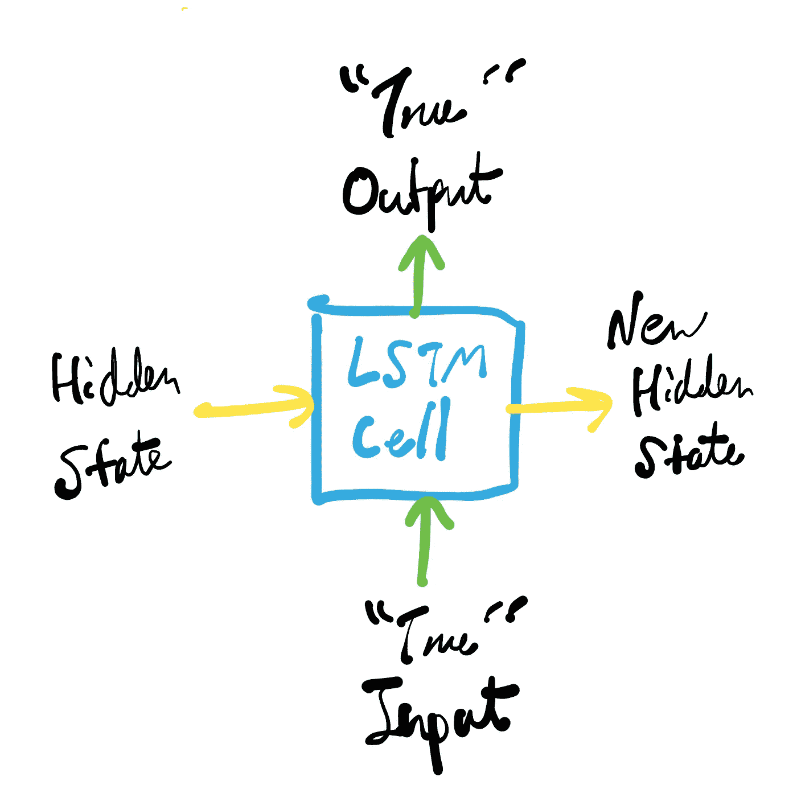
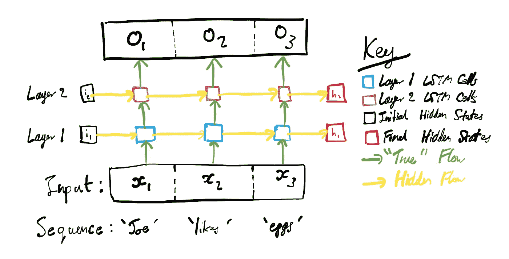
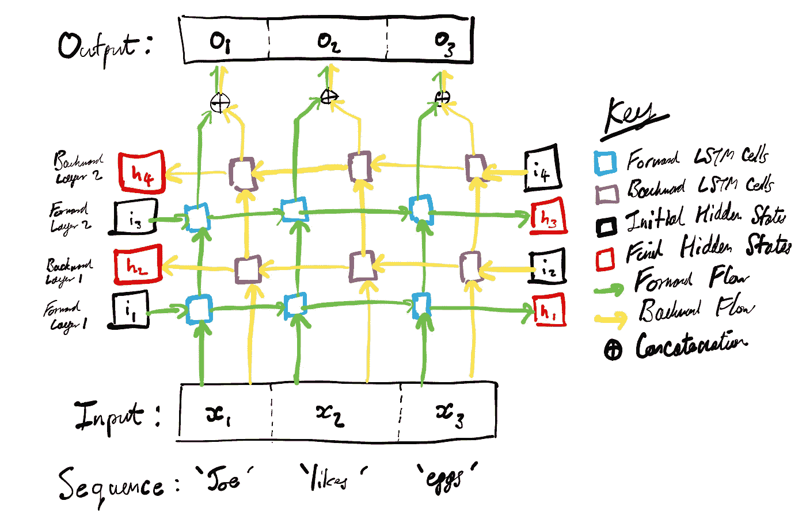
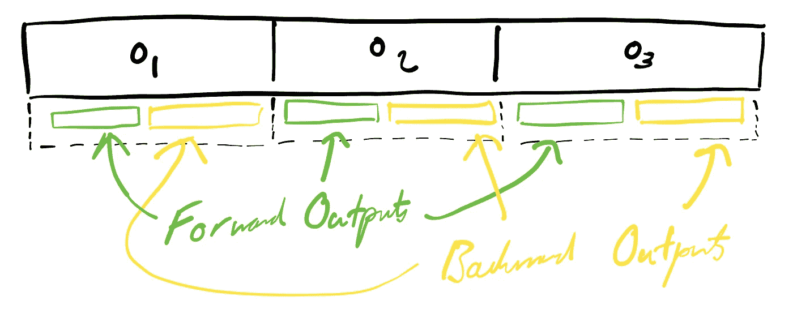
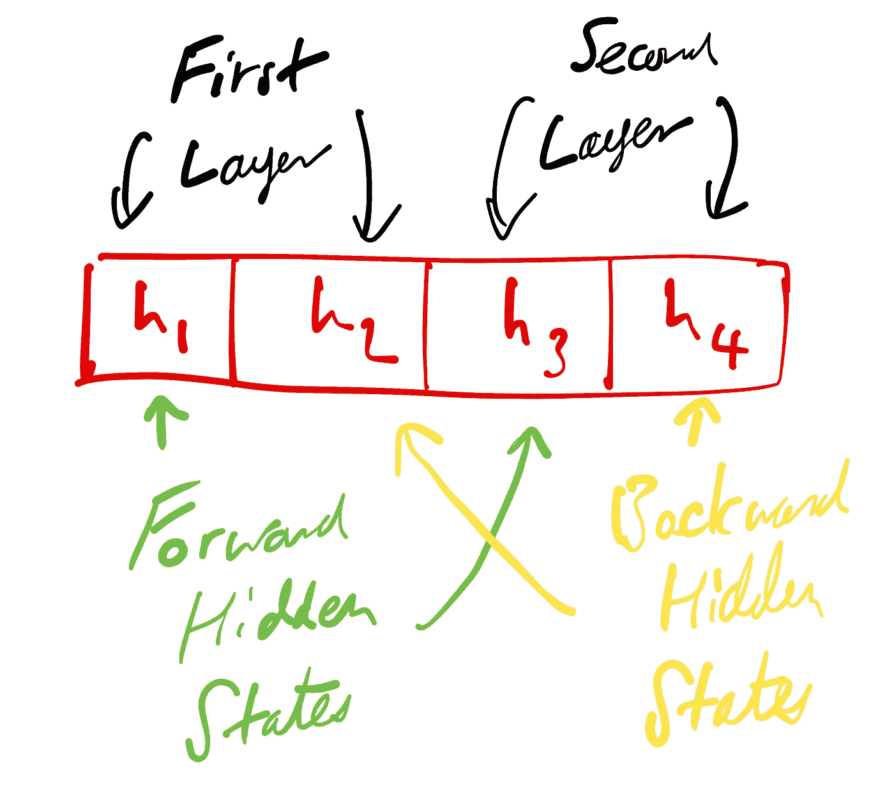

# 理解多层双向 LSTMs 的输出

> 原文：<https://towardsdatascience.com/understanding-the-outputs-of-multi-layer-bi-directional-lstms-13ad99a80dd3>

## 在这个简短的教程中，我分解了多层双向 LSTMs 的输出，并举例说明了如何在 PyTorch 中实现。

有时候，从两方面来看都是有帮助的(由 [Unsplash](https://unsplash.com/s/photos/two-way?utm_source=unsplash&utm_medium=referral&utm_content=creditCopyText) 上的[Pablo garcía saldaa](https://unsplash.com/@garciasaldana_?utm_source=unsplash&utm_medium=referral&utm_content=creditCopyText)拍摄)。

在机器学习的世界里，[长短期记忆网络(lstm)](https://machinelearningmastery.com/gentle-introduction-long-short-term-memory-networks-experts/)是处理数据序列的强大工具，比如**语音、文本和视频**。LSTMs 的循环性质使它们能够**记住它们在序列中较早看到的数据片段**。从概念上讲，这在向前的方向(即开始到结束)上更容易理解，但它对**考虑相反方向的顺序**(即结束到开始)也是有用的。例如，考虑这个句子中填空的任务:

乔喜欢空白的，尤其是油炸、炒制或水煮的。

在向前的方向上，在到达丢失的单词之前唯一可用的信息是“Joe 喜欢<blank>”，这可能有许多种可能性。然而，如果 i **信息也被允许向后传递**，那么从“油炸、炒制或水煮”的上下文中预测单词“鸡蛋”就容易得多。因此，让**信息双向流动会很有用**。这可以通过使用双向 LSTM 来捕获。</blank>

这篇文章并不是双向 LSTMs 的完整指南；已经有[其他关于这个的大文章](https://analyticsindiamag.com/complete-guide-to-bidirectional-lstm-with-python-codes/#:~:text=Bidirectional%20long%2Dshort%20term%20memory,forward(past%20to%20future))了。然而，我最近在**与多层双向 lstm**一起工作，我很难理解他们在 PyTorch 中产生的输出。我真的不能在网上找到一个好的指南，特别是对于多层 LSTMs，所以一旦我解决了它，我决定把这个小教程放在一起。所以，**话不多说**，下面是我理解多层双向 LSTMs 输出的指南。

# 高层次概述

为了理解双向 LSTM 的输出是什么，我们首先需要知道在 LSTM 的引擎盖下发生了什么。LSTM 网络由 LSTM 单元(也称为单元或模块)组成。为了简单起见，我将把 LSTM 细胞视为独立完整的计算单位，而不去探究它们到底是做什么的。为了这项工作的目的，我们只说一个 LSTM 单元接受两个输入:**一个来自数据或另一个 LSTM 单元的“真”输入**，和**一个来自前一时间步(或初始隐藏状态)的“隐藏”输入**。实际上，还有第三种输入(单元格状态)，但是为了概念上的简单，我将它作为“隐藏”状态的一部分。给定这些输入，LSTM 单元产生两个输出:**一个“真”输出**和**一个新的隐藏状态**。我们可以这样表述:

LSTM 细胞/模块/单位的结构。作者绘制的图像。

“真实”和隐藏输入和输出之间的区别在于，**隐藏输出在序列**的方向上移动(即，向前或向后)，而**真实输出被更深入地传递到网络**(即，通过层)。在单层 LSTM 中，真实输出仅形成网络的输出，但是在多层 lstm 中，它们也用作新层的输入。例如，在双层 LSTM 中，第一层的真实输出被传递到第二层，第二层的真实输出形成网络的输出。除了真实输出，我们还得到每一层的最终隐藏状态输出。

双层(单向)LSTM 处理的一个展开的概念性示例。作者绘制的图像。

对于双向 LSTM，我们可以将网络的反向部分视为网络正向部分的**镜像**，即隐藏状态沿与相反的**方向流动(从右到左，而不是从左到右)，但真实状态沿**相同的**方向流动(通过网络更深)。网络的两个方向完全独立地工作，直到最后一层，此时它们的输出被连接起来。**

双层双向 LSTM 处理的一个展开的概念性示例。作者绘制的图像。

有了双向 LSTM，**最终输出现在是向前和向后方向的串联**。这就是事情变得有点复杂的地方，因为两个方向会看到每个输出的不同输入。例如，对于第一个输出(图中的 o1)，向前方向只看到了第一个令牌，但是向后方向看到了所有三个令牌。相反，对于最后一个令牌(图中的 o3)，正向已经看到了所有三个令牌，而反向只看到了最后一个令牌。我们真正想要的输出是网络的前一半已经看到了每个令牌， ***和*** ，而网络的后一半也看到了每个令牌，**，这不是我们实际得到的输出之一！**因此，我们不得不对输出进行一些调整，稍后当我们查看处理输出的实际代码实现时，我会谈到这一点。

双向 LSTM 的“真实”输出。作者绘制的图像。

对于隐藏的输出，LSTM 的双向特性也让事情变得有些混乱。隐藏的状态现在是交替的，而不是连接在一起。同样，我们将不得不争论我们被给予的输出来清理它们。

双向 LSTM 的隐藏输出。作者绘制的图像。

# 在 PyTorch 中处理输出

记住以上内容，现在让我们来看看**在 PyTorch** 中是如何工作的。我将代码作为(某种程度上)独立的 Python 笔记本嵌入如下:

以上是多层双向 LSTMs 输出的快速概览。**如果你有任何问题，请在评论中提问！**