# 理解主题连贯性度量

> 原文：<https://towardsdatascience.com/understanding-topic-coherence-measures-4aa41339634c>

## 从主题建模工具箱中了解这个日常工具背后的细节

艾萨克·史密斯在 [Unsplash](https://unsplash.com?utm_source=medium&utm_medium=referral) 上拍摄的照片

如果你熟悉**主题建模**，你可能已经听说过**主题一致性**或**主题一致性度量。**在大多数关于主题建模的文章中，它被显示为一个代表*整个主题的可解释性*的数字，用于评估主题的质量。

但是，这个指标到底是什么？它是如何衡量“可解释性”的？我们应该不惜一切代价最大化它？

在这篇文章中，我们将深入这个话题来回答这些问题，并让你更好地理解话题连贯性测量。

让我们打开这个黑盒子。

# 摘要

一、记题模式
二、记题。评估主题
三。话题连贯如何起作用
-切分
-概率计算
-确认措施
-聚合
-把所有东西放在一起
四。理解 Gensim 中的模型
五、在一些例子中的应用
六。结论
参考文献

# 一、记忆主题模式

主题建模是最重要的自然语言处理领域之一。它旨在通过将文本数据集分解成两个分布来解释它:主题和单词。

它基于以下假设:

*   一个文本(文档)由几个主题组成
*   一个主题由一组单词组成

因此，主题建模算法是一种数学/统计模型，用于推断哪些主题更好地代表了数据。

为了简单起见，一个主题可以被描述为一个词的集合，像['球'，'猫'，'房子']和['飞机'，'云']，但在实践中，算法所做的是给我们词汇表中的每个词分配一个在给定主题中的'参与'值。具有最高值的单词可以被认为是话题的真正参与者。

按照这种逻辑，我们之前的例子应该是这样的:

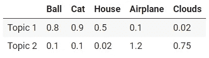

主题示例。作者图片

# 二。评估主题

计算机不是人类。如前所述，主题建模算法依赖于数学和统计学。然而，从人类的角度来看，数学上最优的主题不一定是“好的”。

例如，主题建模算法可以找到以下主题:

*   话题 1:猫，狗，家，玩具。*(大概是个好题目)*
*   话题二:超级，护士，砖头。*(大概是个烂题目)*

从人类的角度来看，第一个主题听起来比第二个更连贯，但对于算法来说，它们可能同样正确。

有时，我们不需要创建的主题遵循一些可解释的逻辑，我们只是想，例如，将数据维度减少到另一个机器学习过程。

当我们寻求数据理解时，创建的主题应该是对人类友好的。因此，仅仅盲目地遵循主题模型算法背后固有的数学会把我们引向误导和无意义的主题。

因此，主题评估通常由定性的人工评估来补充，例如阅读每个主题中最重要的单词，并查看与每个文档相关的主题。不幸的是，这项任务非常耗时，而且对于包含数千个主题的大型数据集来说是不切实际的。它还需要关于数据集领域的先验知识，并且可能需要专家意见。

这就是话题连贯手段试图解决的问题。他们试图用一个独特的、客观的、易于评估的数字来代表人们对主题的“高质量感知”。

# 三。话题连贯性是如何工作的

理解这些指标如何工作的第一个关键点是关注“一致性”这个词。

通常，当我们谈论连贯性时，我们谈论的是一种合作特征。比如，一组论点如果相互印证，就是连贯的。

主题连贯性度量评估的是一个主题被一个文本集(称为参考语料库)支持的程度。它使用从参考语料库中提取的统计数据和概率，特别是集中在单词的上下文中，来给出主题的一致性分数。

这一事实突出了主题一致性度量的一个重要点:它不仅取决于主题本身，还取决于用作参考的数据集。

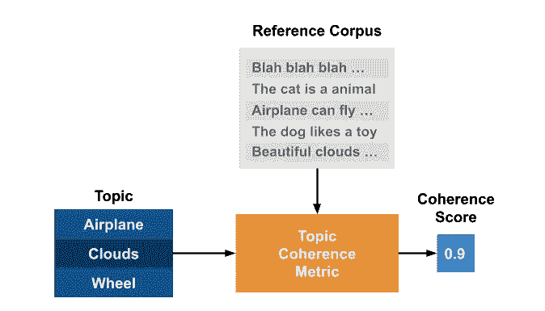

话题连贯性度量的输入和输出。作者图片

Rö der，m .等人在**探索主题一致性度量空间**中提出了主题一致性度量遵循的一般结构:

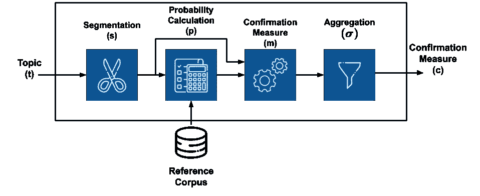

一般话题连贯性衡量结构。图片作者。受 Rö der，m .等人(2015 年)的启发。由 [Freepik](https://www.freepik.com) 创作的图标。

它由不同的独立模块组成，每个模块执行一个特定的功能，这些模块通过一个顺序的管道连接在一起。

也就是说，**主题一致性度量是流水线**，其接收主题和参考语料库作为输入，并输出表示“整体主题一致性”的单个实数值。希望这个过程可以像人类一样评估主题。

那么，让我们来了解它的每一个模块。

## 分割

分割模块负责创建成对的单词子集，我们将使用它们来评估主题的连贯性。

考虑到 **W={w_1，w_2，…，w_n}** 作为主题 **t** 的前 n 个最重要的单词，分段 **S** 的应用从 **W** 产生一组子集对。

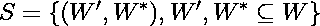

其中该对的第二部分(W*)将用于确认第一部分(W’)。当我们在下一节讨论概率计算和确认措施时，这一点会变得更加清楚，在下一节中，我们将使用这些对。

简单来说，我们可以把分段理解为我们选择如何“混合”我们主题中的单词来评估它们的步骤。

例如，分段 S-one-one，表示我们需要将不同的单词组成单词对。因此，如果 **W** = { '猫'，'狗'，'玩具' }，我们将有:

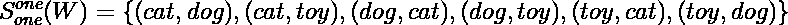

因此，通过使用这种技术，我们可以说，为了计算最终的一致性分数，我们的模型对我们主题中任意两个词之间的关系感兴趣。

另一个例子是分割 S-one-all，这意味着我们需要将每个单词与所有其他单词配对。将其应用于 **W** ，我们发现:

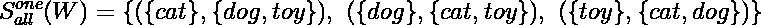

再一次，通过使用这种技术，我们说我们的连贯性分数将基于一个单词和我们主题中其他单词之间的关系。

## 概率计算

如前所述，连贯性度量使用从文本语料库中提取的概率。概率计算步骤定义了如何计算这些概率。

例如，假设我们对两种不同的概率感兴趣:

*   P( *w* ):单词 *w* 的出现概率
*   P( *w1* 和 *w2* ):单词 *w1* 和 *w2* 的出现概率

不同的技术将不同地估计这些概率。

例如，**P***BD*(*BD*代表*布尔文档*)计算 P( *w* )为单词 *w* 出现的文档数除以文档总数，P( *w1* 和 *w2* )为两个单词出现的文档数除以总数。

另一个例子是**P***bs*(*bs*代表*布尔语句*)，这与前面的方法相同，但是它考虑的是语句中的出现次数，而不是整个文档中的出现次数。再比如**P***SW*(*SW*代表*滑动窗口*)，它考虑的是文本上方滑动窗口中的事件。

这些概率是一致性的基础。它们在下一步用来巩固题目的分数。

## 确认措施

确认手段是话题连贯的核心。

使用在 **P** 中计算的概率，在对 **S** 上计算确认测量。它计算每对中子集 W*支持子集 W’的程度。

也就是说，这个步骤试图通过使用从语料库计算的概率来量化这两个子集之间的“关系”。因此，如果 W’的单词与 W*中的单词相关联(例如，通过非常频繁地出现在同一文档中)，则确认度量将是高的。

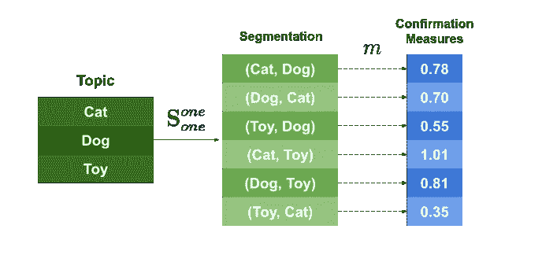

由*作者制作的确认措施 *m.* 图像的应用示例。*

在上图中，我们可以看到这个过程的一个例子。将确认度量 *m* 应用于在分割步骤中创建的每一对，输出确认分数。

有两种不同类型的确认措施，我们将在下面几行中理解。

**直接确认措施**

这些测量通过直接使用子集 W’和 W*以及概率来计算确认值。您可以探索大量的直接测量方法，但我们只举几个例子:

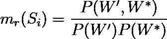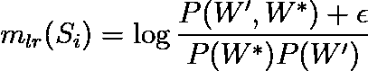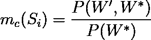

我们不打算深究这些方程背后的数学，但请记住，它们来自许多科学领域，如信息论和统计学。

**间接确认措施**

总之，间接确认措施不直接根据 W '和 W*计算分数。相反，他们对 W’中的单词和 W 中的所有其他单词计算直接确认度量 *m* ，构建度量向量，如下所示:

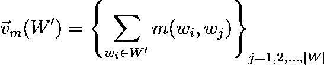

对 W*进行同样的处理。

最后的确认度量是这两个向量之间的相似性(例如，余弦相似性)。

下图显示了如何完成此过程的示例。为了计算对(' cat '，' dog ')中的确认度量，我们首先计算主题中所有单词的每个元素的确认度量 *m* ，创建确认度量向量。然后，最后的确认度量是这两个向量之间的相似性。

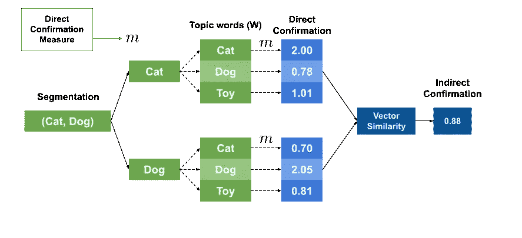

*作者应用间接确认措施 *m.* 图像的示例。*

这个过程背后的想法是强调一些直接方法可能遗漏的关系。例如，单词“猫”和“狗”可能永远不会在我们的数据集中一起出现，但它们可能会经常与单词“玩具”、“宠物”和“可爱”一起出现。使用直接方法，这两个单词将具有较低的确认分数，但是使用间接方法，相似性可以被突出，因为它们出现在相似的上下文中。

计算完这些度量后，我们可以进入下一步。

## 聚合

这是最后也是最简单的一步。

它将上一步计算的所有值聚合成一个值，这就是我们最终的主题连贯性得分。

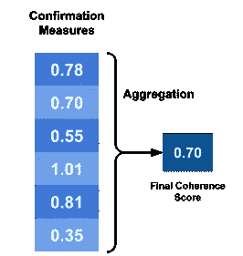

聚合示例。图片作者。

这种聚合可以是算术平均值、中值、几何平均值等等。

## 把所有东西放在一起

所以我们来回顾一下步骤。

*   我们有一个想要评估的主题。
*   我们选择一个参考语料库。
*   找到了主题中前 n 个最重要的单词，我们称它们为 w。
*   使用技术 **s** 将 w**分割**成子集对。
*   使用参考语料库，我们**使用技术 **p** 计算单词概率**。
*   利用分割的单词和概率，我们使用一个**确认度量** **m** 来评估每一对的子集之间的“关系”。
*   上一步的所有测量值都用一个最终的数字**聚合**，这就是我们的主题连贯得分。

下图总结了所有这些步骤:

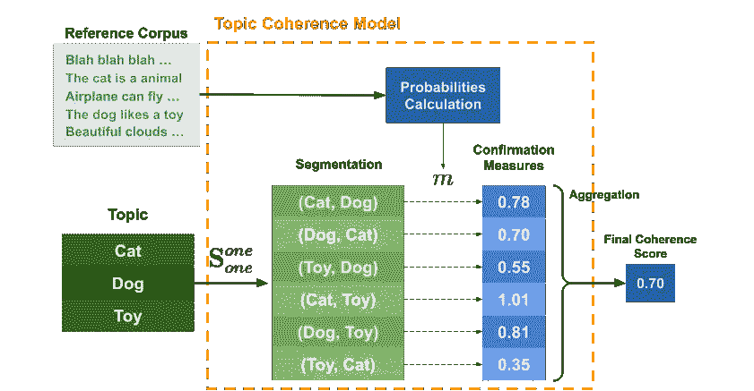

一致性模型的详细示例。图片作者。

在我们有许多话题的情况下(这是最常见的)，最终的结果只是平均的单个话题连贯性。

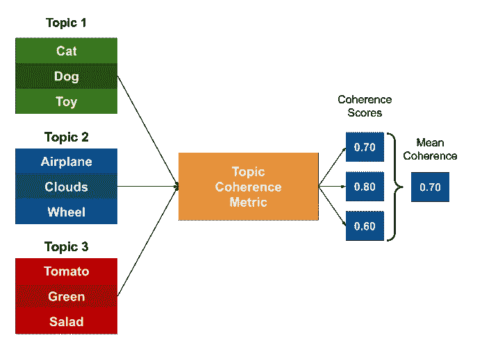

多个主题的连贯分数。图片作者。

# 四。理解 Gensim 中的模型

好了，现在我们已经了解了主题连贯性测量是如何工作的，让我们将我们的知识应用到一个真实的例子中。

Gensim 库提供了一个[类](https://radimrehurek.com/gensim/models/coherencemodel.html)，实现了四个最著名的一致性模型: *u_mass，c_v，c_uci，c_npmi。*那么，让我们把它们分成几个基本部分。

如果我们看看这篇论文(roder 等人，2015 年)，我们会发现作者已经详细描述了这些相干模型是如何构建的。

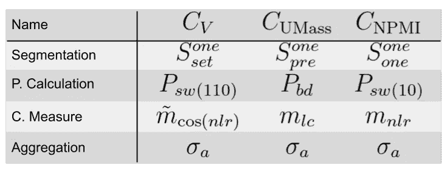

表 2:名题连贯度。图片作者。受 Rö der，m .等人(2015 年)的启发。

所以，要理解一个模型，我们只需要理解它的组成部分。

让我们以 C_NPMI 为例。

*   **分词**:采用一对一的方法，即在成对的词上计算确认度。
*   **概率计算**:使用方法 **P** *sw* (10) *。*在文本上移动的大小为 10 的滑动窗口上计算概率。
*   **确认度量**:每对的确认度量将是归一化的点态互信息(NPMI)。

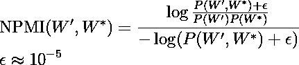

*   **聚合**:最终一致性是确认措施的算术平均值。

我们也来分析一下方法 C_V。

*   **切分**:使用 S-one-set 的方法，即在词和集合 w 的对上计算确认度。
*   **概率计算**:使用方法**P**SW(110)*。*概率是在文本上移动的大小为 110 的滑动窗口上计算的。
*   **确认措施**:采用间接确认措施。使用度量 *m* _nlr 将每对元素的单词与 W 的所有其他单词进行比较。最终得分是两个度量向量之间的余弦相似性。
*   **聚合**:最终一致性是确认措施的算术平均值。

为了更好地理解这些符号，我强烈建议查看原始论文。

# 动词 （verb 的缩写）在一些例子中应用

幸运的是，我们不需要知道所有这些细节来使用 Gensim 的指标。

因此，作为最后的练习，让我们使用数据集*20 个新闻组*作为我们的参考语料库来评估一些主题。

首先，我们导入需要的库。

然后，让我们获取并标记文本。

在 Gensim 中使用 coherence 模型非常简单，我们只需要创建一组主题并传递我们的文本。下面的代码创建了一些我们想要评估的主题。

> 我选择了数据库中我已经知道的特定主题。

方法*。get_coherence_per_topic()* 返回每个主题的一致性值。让我们使用 Seaborn 可视化结果。

结果如下所示。

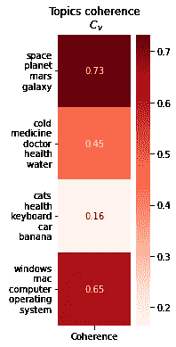

评估结果。图片作者。

# 不及物动词结论

主题建模是自然语言处理中最相关的主题之一，是监督和非监督机器学习应用的有力工具。

话题连贯性是衡量话题质量的一个非常重要的指标。在这篇文章中，我们深入探讨了主题一致性度量背后的基本结构和数学原理。我们探讨了组成主题一致性度量的模块:分段、概率计算、确认度量和聚合，并了解了它们的作用。我们还学习了 Gensim 中实现的主要主题一致性度量，以及一些代码示例。

我希望你发现自己在使用这些方法时更加自信。主题连贯的世界是巨大的，我强烈推荐进一步阅读这方面的内容。

感谢您的阅读。

# 参考

[1]罗德，m .，两者，a .，&欣内堡，A. (2015)。[探索话题连贯度量的空间](http://sss)。在*第八届 ACM 网络搜索和数据挖掘国际会议论文集*(第 399–408 页)。

[2] Rehurek，r .，& Sojka，P. (2011 年)。[Gensim–用于向量空间建模的 python 框架](http://sss)。*捷克共和国布尔诺马萨里克大学信息学院 NLP 中心*， *3* (2)。