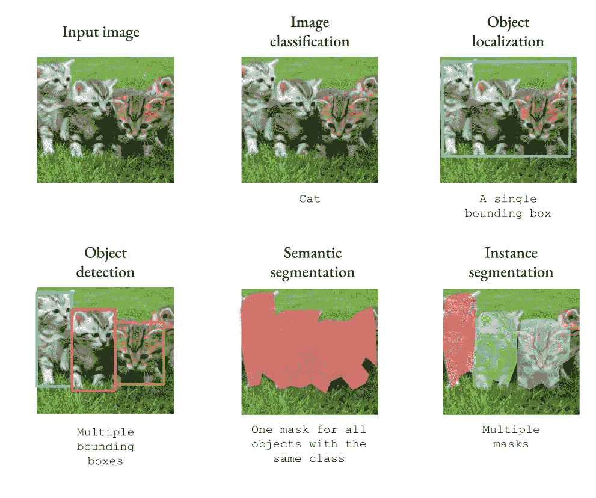
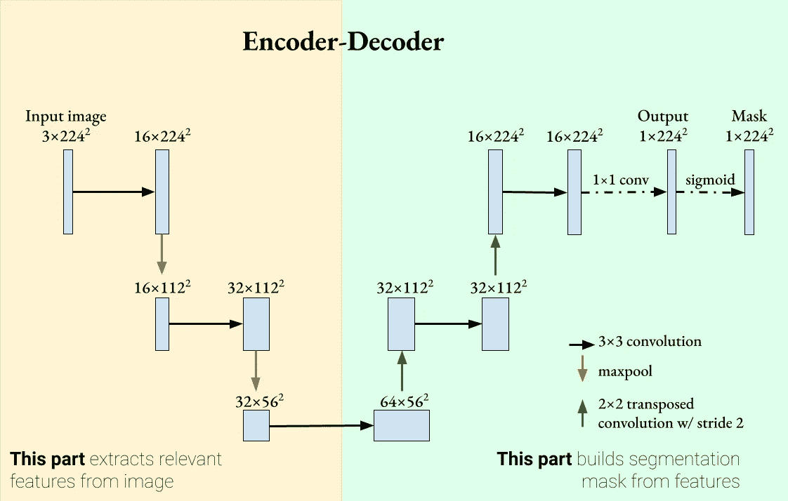
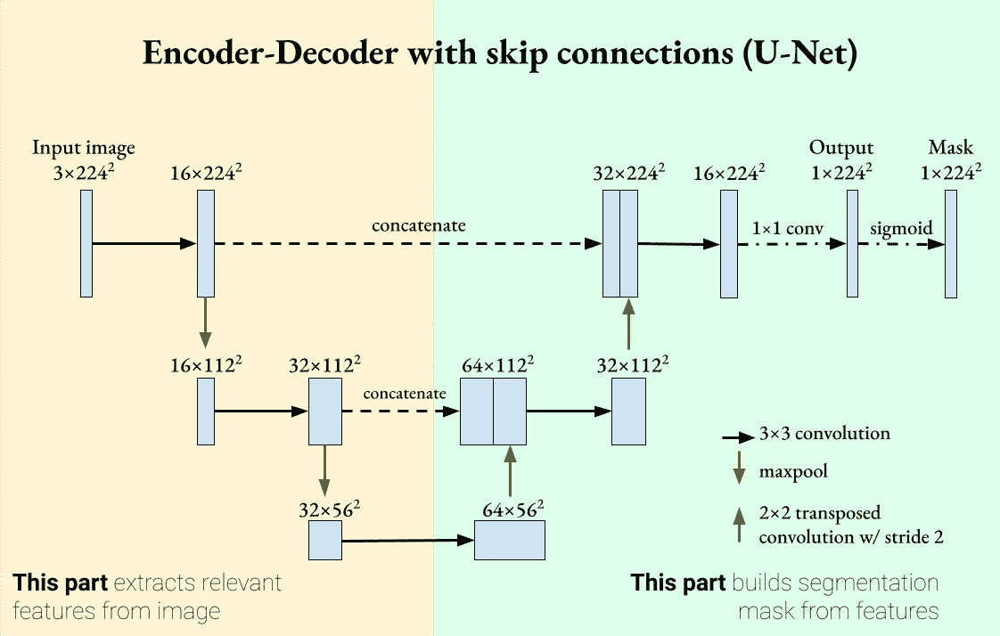
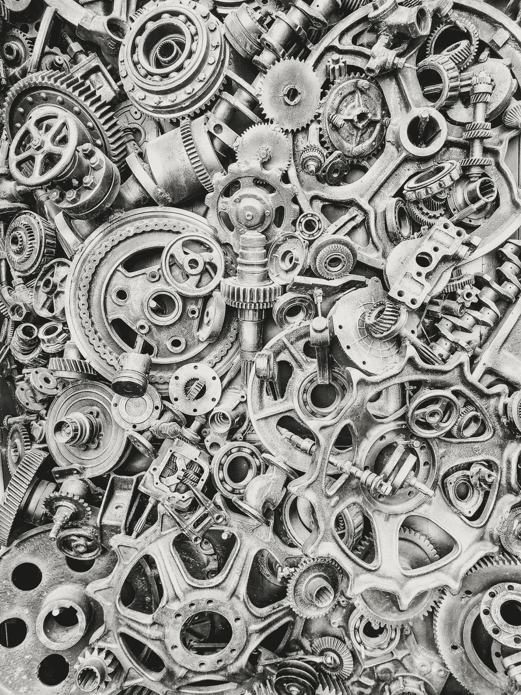
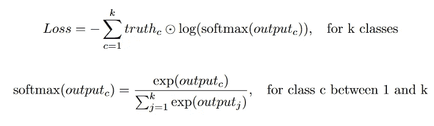
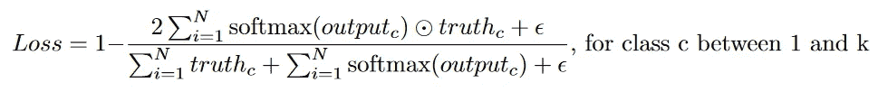
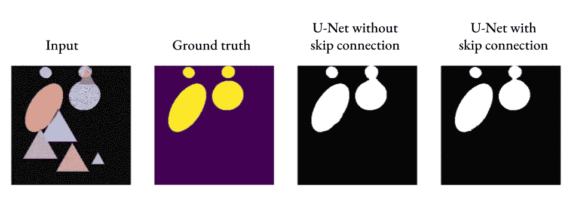

# 了解优信网

> 原文：<https://towardsdatascience.com/understanding-u-net-61276b10f360>

## U-Net 已经成为图像分割的首选方法。但是这是怎么发生的呢？


照片由[格里洛·爱德华](https://unsplash.com/@edouard_grillot?utm_source=medium&utm_medium=referral)在 [Unsplash](https://unsplash.com?utm_source=medium&utm_medium=referral) 拍摄

**目录**
1。手头的任务
2。编码器-解码器
3。跳过连接
4。实现细节
a .损失函数
b .上采样方法
c .去填充还是不去填充？
5。U-Net 在行动

# 手头的任务

U-Net 是为语义切分任务而开发的。当向神经网络输入图像时，我们可以选择对对象进行一般分类或实例分类。我们可以预测图像中是什么对象(图像分类)，所有对象的位置(图像定位/语义分割)，或者单个对象的位置(对象检测/实例分割)。下图显示了这些计算机视觉任务之间的差异。为了简化问题，我们只考虑只对一个类和一个标签进行分类(二元分类)。



单标签的不同计算机视觉任务。[原图](https://www.pexels.com/photo/assorted-color-kittens-45170/)在 Pexels.com 获得创意共同许可。编辑由作者完成。

在分类任务中，我们输出大小为 k 的向量，其中 k 是类别的数量。在检测任务中，我们需要输出定义边界框的向量`x, y, height, width, class`。但是在分割任务中，我们需要输出一个与原始输入维数相同的图像。这代表了一个相当大的工程挑战:神经网络如何从输入图像中提取相关特征，然后将它们投影到分割掩模中？

# 编码器-解码器

如果你不熟悉编码器-解码器，我推荐你阅读这篇文章:

[](/understanding-latent-space-in-machine-learning-de5a7c687d8d) [## 理解机器学习中的潜在空间

### 学习深度学习的一个基本的，但经常是“隐藏的”概念

towardsdatascience.com](/understanding-latent-space-in-machine-learning-de5a7c687d8d) 

编码器-解码器之所以相关，是因为它们产生的输出与我们想要的相似:输出与输入具有相同的维数。我们可以将编码器-解码器的概念应用于图像分割吗？我们可以生成一维二进制掩码，并使用交叉熵损失来训练网络。我们的网络由两部分组成:从图像中提取相关特征的**编码器**，以及提取特征并重建分割掩模的**解码器**部分。



一种用于图像分割的编解码网络。图片由作者提供。

在编码器部分，我使用了卷积层，后面是`ReLU`和`MaxPool`作为特征提取器。在解码器部分，我转置卷积以增加特征图的大小并减少通道的数量。我使用填充来保持卷积运算后特征图的大小不变。

您可能会注意到，与分类网络不同，该网络没有完全连通/线性图层。这是一个**全卷积网络** (FCN)的例子。从 Shelhamer *等人*的论文“语义分割的完全卷积网络”【1】开始，FCN 已经被证明在分割任务上工作得很好。

然而，这个网络有一个问题。随着我们在编码器和解码器层中扩展层数，我们有效地越来越“缩小”特征图。这样，编码器可以丢弃更详细的特征，以支持更一般的特征。如果我们正在处理医学图像分割，被分类为患病/正常的每个像素可能是重要的。我们如何才能确保这个编码器-解码器网络能够吸收通用和详细的功能？

# 跳过连接

[](/introduction-to-resnets-c0a830a288a4) [## ResNets 简介

### 本文基于何等[2](微软研究院)的图像识别深度残差学习…

towardsdatascience.com](/introduction-to-resnets-c0a830a288a4) 

因为深度神经网络可以在连续层传递信息时“忘记”某些特征，所以跳过连接可以重新引入它们，使学习更强。在残差网络(ResNet)中引入了跳过连接，并显示了分类改进以及更平滑的学习梯度。受这种机制的启发，我们可以向 U-Net 添加跳过连接，这样每个解码器都可以从其对应的编码器中合并特征映射。这是 **U-Net** 的一个定义特征。



U-Net 是一个带跳跃连接的编码器-解码器分段网络。图片由作者提供。

U-Net 有两个决定性的特点:

1.  一种编码器-解码器网络，其越深入提取越多的一般特征。
2.  将详细特征重新引入解码器的跳过连接。

这两个特性意味着 U-Net 可以使用详细和一般的特征进行细分。U-Net 最初是为生物医学图像处理而引入的，其中分割的准确性非常重要[2]。

# 实施细节



Pavel Neznanov 在 [Unsplash](https://unsplash.com?utm_source=medium&utm_medium=referral) 上拍摄的照片

前面几节对 U-Net 及其工作原理做了非常全面的概述。然而，细节介于一般理解和实际实施之间。在这里，我概述了 U-Net 的一些实现选择。

## 损失函数

因为目标是二进制掩码(当像素包含对象时，像素值为 1)，比较输出与地面真实值的常见损失函数是**分类交叉熵损失**(或在单标签情况下的二进制交叉熵)。



在最初的 U-Net 论文中，在损失函数中增加了一个额外的权重。这个权重参数做了两件事:它补偿类的不平衡，并且它给予**分割边界**更高的重要性。在我在网上发现的许多 U-Net 实现中，这个额外的权重因子并不经常使用。

另一个常见的损失函数是**骰子损失**。骰子损失通过比较两组图像的相交面积与它们的总面积来测量两组图像的相似程度。请注意，骰子损失与并集交运算(IOU)不同。他们测量相似的东西，但他们有不同的分母。骰子系数越高，骰子损失越低。



这里，添加了一个ε项以避免被 0 除(ε通常为 1)。一些实现，例如 Milletari *等人的实现，*在对分母中的像素值求和之前对它们进行平方[3]。与交叉熵损失相比，dice 损失对不平衡分割掩模非常鲁棒，这在生物医学图像分割任务中是典型的。

## 上采样方法

另一个细节是解码器上采样方法的选择。以下是一些常见的方法:

**双线性插值。**该方法使用线性插值预测输出像素。通常，通过这种方法放大后会有一个卷积层。

**最大卸载量**。这种方法与最大池相反。它使用 maxpool 操作的索引并用最大值填充这些索引。所有其他值都设置为 0。通常，卷积层跟随 max-unpooling 以“平滑”所有丢失的值。

**反卷积/转置卷积。**许多博客文章都是关于反卷积的。我推荐这篇文章作为一个很好的视觉指南。

[](/types-of-convolutions-in-deep-learning-717013397f4d) [## 深度学习中不同类型卷积的介绍

### 让我给你一个快速概述不同类型的卷积和他们的好处。为了…

towardsdatascience.com](/types-of-convolutions-in-deep-learning-717013397f4d) 

去卷积有两个步骤:给原始图像中的每个像素添加填充，然后应用卷积。在原始 U-Net 中，使用步长为 2 的 2x2 转置卷积来改变空间分辨率和通道深度。

**像素洗牌。**这种方法见于 SRGAN 等超分辨率网络。首先，我们使用卷积从`C x H x W`特征图到`(Cr^2) x H x W`。然后，像素洗牌将采取这一点，并“洗牌”的马赛克方式像素，以产生大小`C x (Hr) x (Wr)`的输出。

## 垫还是不垫？

内核大于 1x1 且没有填充的卷积层将产生小于输入的输出。这是优信网的问题。回想一下上一节的 U-Net 图，我们将图像的一部分与其解码后的对应部分连接起来。如果我们不使用填充，那么与编码图像相比，解码图像将具有更小的空间维度。

但是，最初的 U 网纸没有使用衬垫。尽管没有给出理由，我相信这是因为作者不想在图像边缘引入分割错误。相反，他们在拼接之前对编码图像进行中心裁剪。对于输入大小为`572 x 572`的图像，输出将为`388 x 388`，大约 50%的损失。如果你想在没有填充的情况下运行 U-Net，你需要在重叠的瓦片上运行多次，以获得完整的分割图像。

# U-Net 在行动

在这里，我实现了一个非常简单的类似 U-Net 的网络来分割椭圆。U-Net 只有 3 层深，使用相同的填充和二进制交叉熵损失。更复杂的网络可以在每个分辨率下使用更多的卷积层，或者根据需要扩展深度。

```
import torch
import numpy as np
import torch.nn as nn

class EncoderBlock(nn.Module):        
    # Consists of Conv -> ReLU -> MaxPool
    def __init__(self, in_chans, out_chans, layers=2, sampling_factor=2, padding="same"):
        super().__init__()
        self.encoder = nn.ModuleList()
        self.encoder.append(nn.Conv2d(in_chans, out_chans, 3, 1, padding=padding))
        self.encoder.append(nn.ReLU())
        for _ in range(layers-1):
            self.encoder.append(nn.Conv2d(out_chans, out_chans, 3, 1, padding=padding))
            self.encoder.append(nn.ReLU())
        self.mp = nn.MaxPool2d(sampling_factor)
    def forward(self, x):
        for enc in self.encoder:
            x = enc(x)
        mp_out = self.mp(x)
        return mp_out, x

class DecoderBlock(nn.Module):
    # Consists of 2x2 transposed convolution -> Conv -> relu
    def __init__(self, in_chans, out_chans, layers=2, skip_connection=True, sampling_factor=2, padding="same"):
        super().__init__()
        skip_factor = 1 if skip_connection else 2
        self.decoder = nn.ModuleList()
        self.tconv = nn.ConvTranspose2d(in_chans, in_chans//2, sampling_factor, sampling_factor)

        self.decoder.append(nn.Conv2d(in_chans//skip_factor, out_chans, 3, 1, padding=padding))
        self.decoder.append(nn.ReLU())

        for _ in range(layers-1):
            self.decoder.append(nn.Conv2d(out_chans, out_chans, 3, 1, padding=padding))
            self.decoder.append(nn.ReLU())

        self.skip_connection = skip_connection
        self.padding = padding
    def forward(self, x, enc_features=None):
        x = self.tconv(x)
        if self.skip_connection:
            if self.padding != "same":
                # Crop the enc_features to the same size as input
                w = x.size(-1)
                c = (enc_features.size(-1) - w) // 2
                enc_features = enc_features[:,:,c:c+w,c:c+w]
            x = torch.cat((enc_features, x), dim=1)
        for dec in self.decoder:
            x = dec(x)
        return x

class UNet(nn.Module):
    def __init__(self, nclass=1, in_chans=1, depth=5, layers=2, sampling_factor=2, skip_connection=True, padding="same"):
        super().__init__()
        self.encoder = nn.ModuleList()
        self.decoder = nn.ModuleList()

        out_chans = 64
        for _ in range(depth):
            self.encoder.append(EncoderBlock(in_chans, out_chans, layers, sampling_factor, padding))
            in_chans, out_chans = out_chans, out_chans*2

        out_chans = in_chans // 2
        for _ in range(depth-1):
            self.decoder.append(DecoderBlock(in_chans, out_chans, layers, skip_connection, sampling_factor, padding))
            in_chans, out_chans = out_chans, out_chans//2
        # Add a 1x1 convolution to produce final classes
        self.logits = nn.Conv2d(in_chans, nclass, 1, 1)

    def forward(self, x):
        encoded = []
        for enc in self.encoder:
            x, enc_output = enc(x)
            encoded.append(enc_output)
        x = encoded.pop()
        for dec in self.decoder:
            enc_output = encoded.pop()
            x = dec(x, enc_output)

        # Return the logits
        return self.logits(x)
```



任务是:分割椭圆，不分割任何其他形状。图由作者生成。

正如我们所看到的，即使没有跳过连接，U-Net 也可以产生可接受的分段，但是添加的跳过连接可以引入更好的细节(参见右边两个椭圆之间的连接)。

# 结论

如果要我用一句话来解释 U-Net，那就是 U-Net 就像一个图像的编码器-解码器，但通过跳过连接来确保细节不会丢失。U-Net 经常在许多分割任务中使用，近年来也在图像生成任务中使用。

如果你想看我用来产生数字和训练我的 U-Net 的代码，这里有 [Github 链接](https://github.com/mtran5/UNet)。编码快乐！

> 如果你喜欢阅读这篇文章，并希望在未来阅读更多类似的文章，可以考虑在 [Medium](https://medium.com/@minh.tran2_11384) 或 [Linkedin](https://www.linkedin.com/in/minhtran97/) 上关注我。

## 参考资料:

[1] Long，Jonathan，Evan Shelhamer 和 Trevor Darrell。"语义分割的完全卷积网络."IEEE 计算机视觉和模式识别会议论文集。2015.

[2] Ronneberger，Olaf，Philipp Fischer 和 Thomas Brox。" U-net:生物医学图像分割的卷积网络."*医学图像计算和计算机辅助介入国际会议*。施普林格，查姆，2015。

[3] Milletari、Fausto、Nassir Navab 和 Seyed-Ahmad Ahmadi。" V-net:用于体积医学图像分割的全卷积神经网络." *2016 第四届 3D 视觉国际会议*。IEEE，2016。