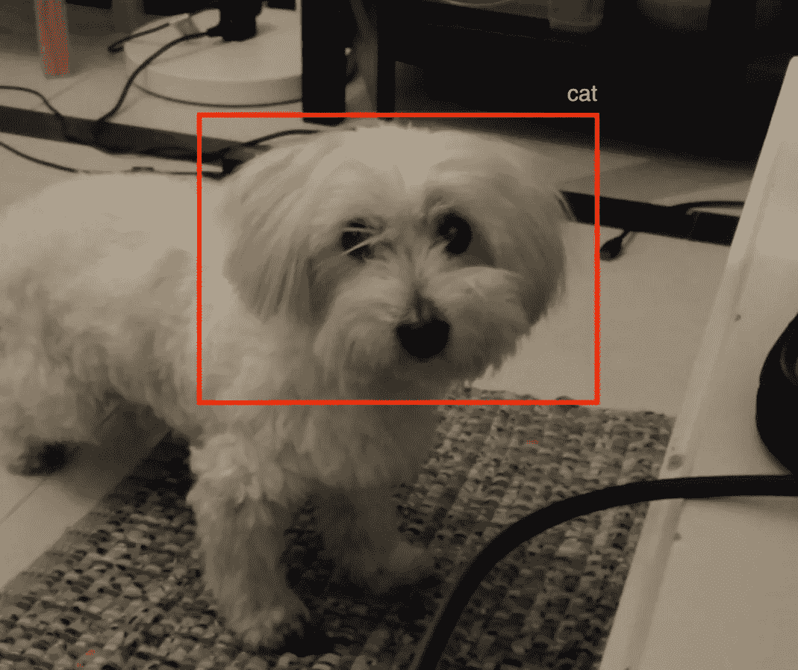
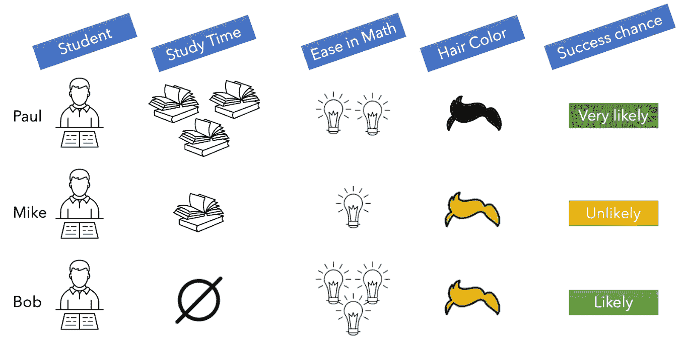
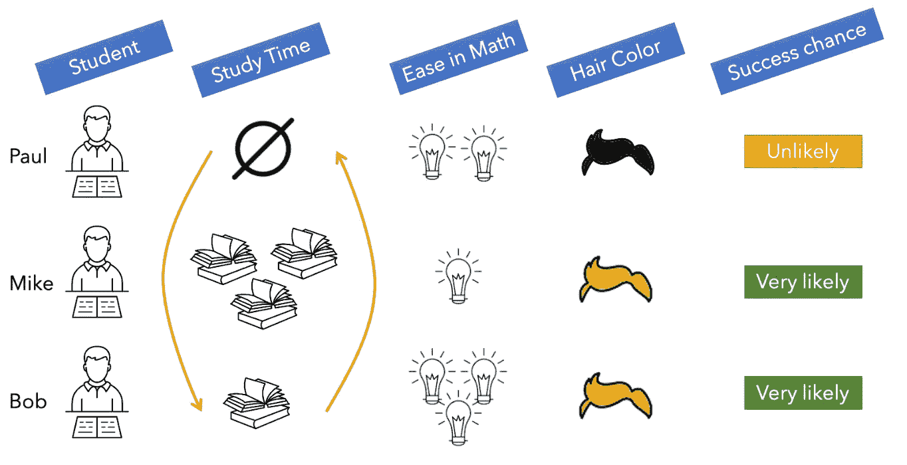
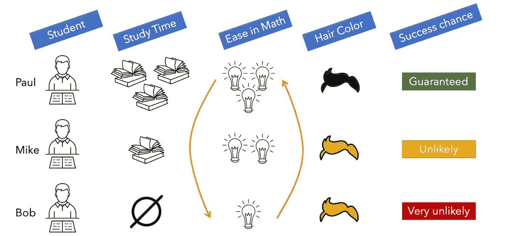
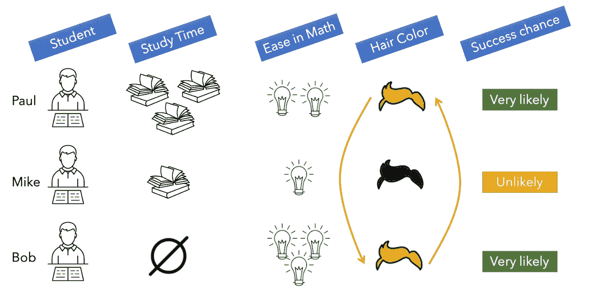
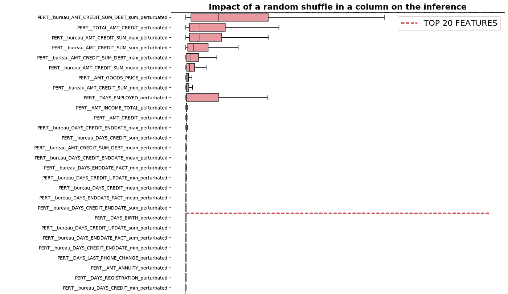

# 理解你的神经网络的预测

> 原文：<https://towardsdatascience.com/understanding-your-neural-networks-predictions-d9290f8b984f>

## 评估神经网络特征重要性的简明指南。



作者图片

神经网络极其方便。它们可用于回归和分类，处理结构化和非结构化数据，非常好地处理时态数据，如果给它们足够的数据量，通常可以达到高性能。

然而，便利性带来的好处却失去了可解释性，当模型被呈现给非技术观众，如客户或利益相关者时，这可能是一个重大的挫折。

例如，去年，我所在的数据科学团队想要说服一个客户从决策树模型转向神经网络，理由很充分:我们可以访问大量数据，其中大部分都是暂时的。客户同意，但希望了解模型决策的基础，这意味着评估其特性的重要性。

# 有意义吗？

这是有争议的。对于决策树或 boosting 模型，对于大多数决策树，可以使用拟合属性`feature_importances_`直接检索特征的重要性，对于 XGBoost 模型，可以使用`get_booster()`和`get_score()`方法。

对于神经网络来说，这些属性和方法是不存在的。每个神经元都被训练成根据它接收到的信号来学习何时激活或不激活，以便每一层都从原始输入中提取一些信息或概念，直到最终的预测层。因此，检索一个更“黑盒”类型的模型的特征重要性的有用性是值得怀疑的。

我甚至听到深度学习专家说，最好让数据说话，不要试图过多地理解模型。基本上，知道猫的皮毛是否比它的眼睛对神经网络更有影响有用吗？也许不是。但是有必要知道，对于这个模型来说，桌子上的猫和地板上的猫是一样的，这就是我们在这里要做的。

# 置换、扰动和评估

我们将使用排列重要性方法。对于经典的机器学习模型，Scikit-Learn 提供了一个函数来做到这一点，甚至在处理高基数特性时推荐它。如果您想要在您的模型上使用这个函数，这个代码片段将计算并显示它的排列重要性:

# 排列重要性背后的原理

假设你有几个学生，你想评估他们通过数学考试的可能性。要做到这一点，你可以使用 3 个变量:他们花在学习考试上的时间，他们在数学上的难易程度，以及他们的头发颜色。



数学考试的学生数据。作者图片

在这个例子中，Paul 学习了很多，并且在数学方面有一定的天赋。他很有可能通过数学考试。迈克，另一方面，学习少得多，不是很有天赋，他不太可能成功。鲍勃根本没有学习，但他非常有天赋，因此他有机会。

让我们重新排列“学习时间”特性的值:



调整第一列的影响。作者图片

保罗从大量学习变成了完全不学习。他在数学上的中等轻松不足以弥补，他现在不太可能通过。同样，其他学生成功的可能性也受到这种干扰的极大影响。

因此，我们可以推断，学习时间是预测考试结果的一个重要特征。

当我们扰动数学中的 ease 特性时，我们得到了相同的结果:



调整第二列的影响。作者图片

鲍勃现在对数学毫无天赋，根本没有学习过。他通过考试的可能性极小。

和前面的推理一样，这个特性也很重要。

现在，当我们改变头发颜色特征时:



调整第三列的影响。作者图片

迈克从金发变成黑发不会增加他考试的机会，头发颜色的改变也不会对任何学生产生任何影响。因此，这个特征对我们的预测并不重要。

# 这种方法的局限性

假设 100 个学生中，我们有一个作弊的人设法拿到了考试科目，这保证了他通过考试。如果我们改变“作弊者”一栏，我们将只有一个学生从作弊者变成非作弊者，另一个学生从非作弊者变成作弊者。100 个学生中，只有两个会受到影响，我们会错误地认为这个特征不重要，因为它的患病率很低。

因此，这种方法对于不平衡的二进制特征和分类特征的罕见模态不能很好地工作。对于这些情况，最好将整个列设置为稀有值，并查看它如何影响预测(在我们的类比中，这意味着将每个学生的“作弊”列设置为 True)。

# 履行

第一步是在测试集上做出不受干扰的推断。然后，对于每一个特征，你将随机洗牌，做出我称之为扰动推断的结论。

一旦所有被干扰的推论都被做出，将它们连接在一个单一的数据框架中，然后计算每个观察值与原始预测值相比有多远的偏差。

在此基础上，一个可视化每个扰动影响的好方法是制作一个所有观测偏差的箱线图。

例如，让我们使用 [Kaggle 数据集进行家庭信用违约风险竞争](https://www.kaggle.com/c/home-credit-default-risk/data)。
在预处理和训练阶段之后，我得到了两个数据集，`X_test`包含测试集的静态数据，`X_test_batch`包含训练集的时态数据。

下面的代码片段遍历了每个特性，并创建了一个受干扰的推论:

然后，这个代码片段将计算每个扰动与原始推断的偏差:

最后，这段代码将打印特性重要性:

你应该得到这样一个图:



如果你想看到整个数据科学管道，我制作了一个公共的 docker 图像，其中包含了从原始数据到功能重要性图的所有步骤:[https://hub . docker . com/r/villatteae/neural net _ feat _ importance/tags](https://hub.docker.com/r/villatteae/neuralnet_feat_importance/tags)

只需运行以下 docker 命令:

docker pull villatteae/neural net _ feat _ importance:最新

```
docker pull villatteae/neuralnet_feat_importance
docker run -p 10000:10000 -d villatteae/neuralnet_feat_importance
```

该映像将在您的 localhost:10000 地址上运行。实例的用户名和密码是 admin 和 admin。注意图像相当重(~17 GB)。