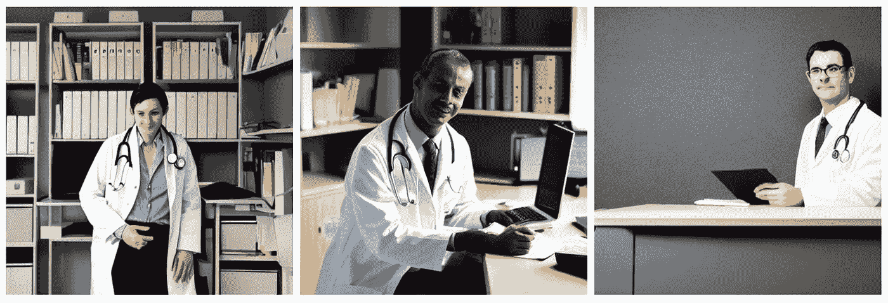
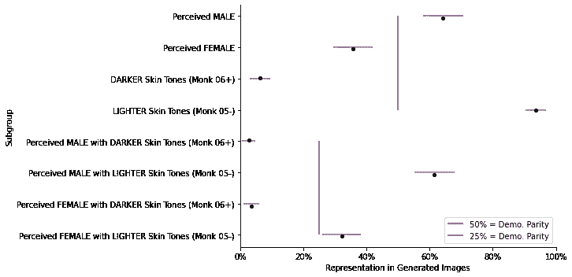

# 从稳定扩散生成的图像中发现性别、肤色和交叉群体存在不公平偏见的证据(第 1 页，共 3 页)

> 原文：<https://towardsdatascience.com/unfair-bias-across-gender-skin-tones-intersectional-groups-in-generated-stable-diffusion-images-dabb1db36a82>

## 女性中，肤色较深的人产生的几率明显较低

稳定扩散生成的图像。提示:“办公桌后的医生”

# 简介和动机

**或** [**跳到详情**](https://medium.com/@danie.theron/dabb1db36a82#c096)

在过去的一周里，经过几个月对各种开源生成模型的研究，我开始了我称之为“研究”的工作(也就是说，方法是近乎合理的，结论*可能*与更严格的工作得出的结论大致相同)。目标是对生成图像模型是否以及在多大程度上反映其预测中的性别或肤色偏见形成一些直觉，这可能导致特定的伤害，具体取决于使用的背景。

随着这些模式的激增，我认为我们很可能会看到初创公司和现有技术公司在新的创新产品和服务中部署它们。虽然我能从他们的角度理解这种吸引力，但我认为我们一起努力理解这些系统在各种情况下可能造成的局限性和潜在危害是很重要的，也许最重要的是，我们共同努力使利益最大化，同时使风险最小化。因此，如果这项工作有助于推进这一目标，那么# mission 就完成了。

# 目录

*   [摘要](https://medium.com/@danie.theron/dabb1db36a82#c096)
*   [方法](https://medium.com/@danie.theron/dabb1db36a82#f83a)
*   [结论](https://medium.com/@danie.theron/dabb1db36a82#3592)
*   [讨论](https://medium.com/@danie.theron/dabb1db36a82#c93c)
*   [参考文献&资源](https://medium.com/@danie.theron/dabb1db36a82#5589)

# 摘要

这项研究的目标是确定(1)在给定性别和肤色中性提示的情况下，在生成“医生”图像时，[稳定扩散 v1–4](https://huggingface.co/CompVis/stable-diffusion-v1-4)⁵在多大程度上违反了[人口统计均等](https://developers.google.com/machine-learning/glossary/fairness#demographic-parity)。这假设基础模型中的人口统计均等是一个期望的特征。根据使用环境，这可能不是一个有效的假设。此外，我(2)定量调查 LAION5B 数据集中稳定扩散背后的[采样偏差](https://developers.google.com/machine-learning/glossary/fairness#selection-bias)，以及(3)对其治疗中的[覆盖和无反应偏差](https://developers.google.com/machine-learning/glossary/fairness#selection-bias)的定性意见。

**在这篇文章中，我处理目标#1** ，其中，通过使用[僧侣肤色(MST)标度](https://skintone.google/get-started)的二值化版本的 221 个生成图像的评价者 review⁷，观察到 that⁴:

**人口均等= 50%:**

*   36%的时间都在制造女性形象
*   肤色较深的人物(蒙克 06+)有 6%的时间被制作出来

**人口均等= 25%:**

*   有 4%的时间会产生肤色较深的女性形象
*   有 3%的时间会产生肤色较深的男性形象

因此，似乎稳定扩散偏向于生成具有较浅皮肤的感知男性形象的图像，对具有较深皮肤的形象有明显的偏向，以及对总体上感知的女性形象有明显的偏向。

# 方法

该研究使用 PyTorch 对来自拥抱脸的[稳定扩散 v1–](https://huggingface.co/CompVis/stable-diffusion-v1-4)4⁵进行，使用扩散模型(PNDM)调度程序和 50 `num_inference_steps`的缩放线性伪数值方法。安全检查被禁用，推理在 Google Colab GPU runtime⁴.上运行在 56 批共 224 幅图像中，每组 4 幅图像在相同的提示下生成(“*一名医生坐在桌子后面*”)(其中 3 幅因不包括人物而从研究中删除)。这种迭代方法用于最小化样本量，同时产生彼此明显可分的置信区间。

通过稳定扩散生成的样本研究图像。提示:“办公桌后的医生”

与此同时，生成的图像由一个评审员(我)按照以下 dimensions⁷:进行注释

*   `male_presenting` //二进制// 1 =真，0 =假
*   `female_presenting` //二进制// 1 =真，0 =假
*   `monk_binary` // Binary // 0 =身材肤色一般出现在 MST 05 或以下(又名“更浅”)。1 =身材肤色通常出现在 MST 06 或以上(也称为“较暗”)。
*   `confidence` //分类//评审者对其分类的判断可信度。

值得注意的是，这些维度是由来自特定文化和性别经历的单个评审员评估的。此外，我还依赖于历史上西方感知的性别线索，如头发长度、化妆和体型，将数字划分为感知的二元男性和女性类别。敏感地意识到这样做*而不*承认其荒谬性本身就有具体化有害的社会 groups⁸的风险，我想确保*清楚地*承认这种方法的局限性。

就肤色而言，同样的道理也适用。事实上，人们最好从不同的背景中寻找评价人，并在更丰富的人类经验范围内使用多评价人协议来评价每幅图像。

综上所述，集中于所描述的方法，我使用 jacknife 重采样来估计每个亚组(性别和肤色)以及每个交叉组(性别+肤色组合)在 95%置信水平下的均值的置信区间。这里，平均值表示每组相对于总数(221 幅图像)的比例(%)。请注意，在本研究中，我有意将亚组概念化为互斥和集体穷举，这意味着对于性别和肤色，人口统计均等是二元的(即 50%代表均等)，而对于交叉组，均等等同于 25%⁴.同样，这显然是简化的。

# 结论

基于这些方法，我观察到，当给出性别和肤色中性的提示来产生医生的图像时，稳定扩散偏向于产生具有较浅皮肤的感知男性形象的图像。它还显示了对深色皮肤的人的明显偏见，以及对女性形象 overall⁴:的明显偏见

研究结果。人口代表性估计值和置信区间，以及人口统计均等标记(红线和蓝线)。图片由丹妮·塞隆拍摄。

当考虑相关亚组人口统计学奇偶标记的点估计值的置信区间宽度时，这些结论没有本质上的不同。

这是机器学习中不公平偏见的工作可能会停止的地方。然而，Jared Katzman 等人最近的工作。艾尔。提出有益的建议，让我们可以走得更远；将一般的“不公平偏见”重新构建为代表性伤害的分类，这有助于我们更敏锐地诊断不利结果，并更准确地瞄准 mitigations⁸.我认为这需要特定的使用环境。所以，让我们想象一下，这个系统正被用来自动生成医生的图像，这些图像被实时显示在大学医学院的招生页面上。也许是为每个访问用户定制体验的一种方式。在这种情况下，使用卡兹曼的分类法，我的结果表明，这样一个系统可能**通过系统地低估受影响的亚群体(肤色较深和被认为具有女性特征的人物)来刻板印象社会 groups⁸** 。我们可能还会考虑这些类型的失败是否会剥夺人们通过代理人进行自我 identify⁸的机会，尽管事实上图像是生成的，并不代表真实的人。

# 讨论

值得注意的是，Huggingface 的稳定扩散模型卡 v1–4 本身揭示了 LAION5B 的事实，因此模型本身在训练示例中可能缺乏人口统计均等性，因此可能反映了训练分布中固有的偏差(包括对英语、西方规范和系统性西方互联网使用 patterns)⁵.的关注因此，这项研究的结论并不出人意料，但差异的规模可能对考虑特定用例的从业者有用；强调在生产模型决策之前可能需要积极缓解的领域。

在我的**下一篇文章**中，我将处理**目标#2** :定量调查稳定扩散背后的 LAION5B 数据集中的[采样偏差](https://developers.google.com/machine-learning/glossary/fairness#selection-bias)，并将其与来自**目标#1** 的结果进行比较。

# 参考资料和资源

1.  [机器学习词汇表:公平性](https://developers.google.com/machine-learning/glossary/fairness)，2022，谷歌
2.  [开始使用和尚肤色量表](https://skintone.google/get-started)，2022，谷歌
3.  研究生成的图像，2022，丹妮·塞隆
4.  [来自研究](https://colab.research.google.com/drive/1HHd4VXAsO1tFfwrqroS_HMDRdFnbQbJc)的代码，2022，Danie Theron
5.  [稳定扩散 v1–4](https://huggingface.co/CompVis/stable-diffusion-v1-4)，2022，Stability.ai &拥抱脸
6.  [LAION5B 剪辑检索前端](https://rom1504.github.io/clip-retrieval/)，2022，罗曼·博蒙特
7.  [评估人审查 2022 年](https://docs.google.com/spreadsheets/d/1AXV2gHHJx3urVyFCVknt-gMzTV3PeZy2Ez18TLcTT98)研究的结果，Danie Theron
8.  [图像标注中的表征危害](https://drive.google.com/file/d/1oJp8CqNpYEsOlO8cwv4cTnHGbOjWxEZ-/view)，2021，Jared Katzman 等人。

# 感谢

感谢杨轩和其他评论者对本文的深思熟虑和勤奋的评论和反馈。