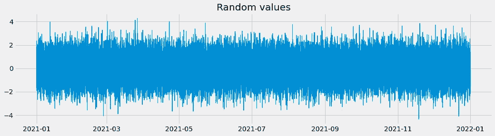
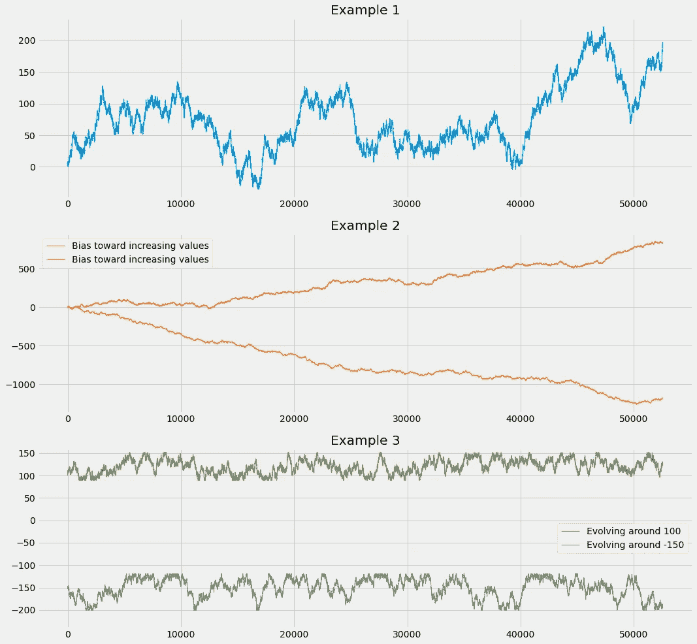
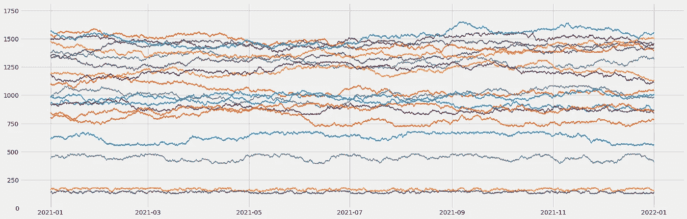
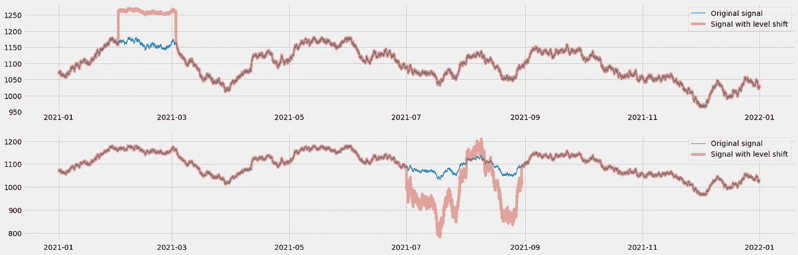
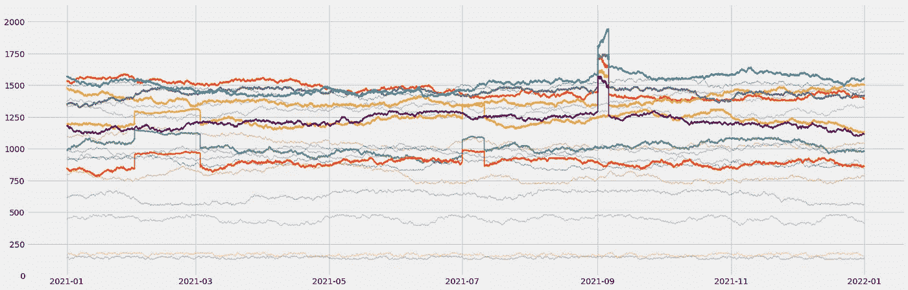
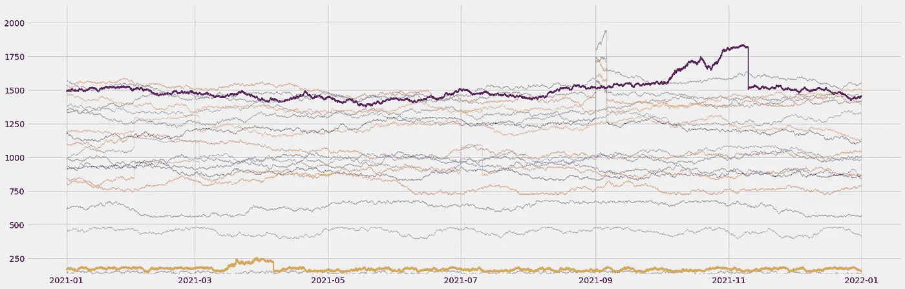
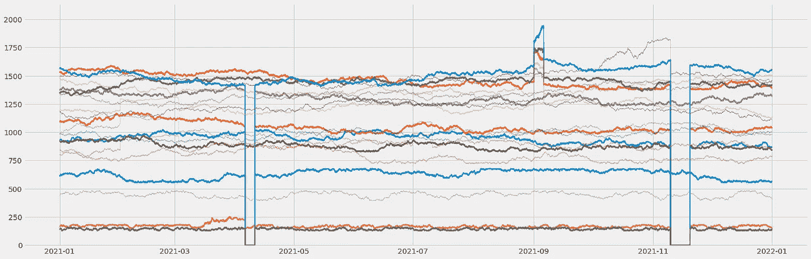

# 对你的时间序列异常不满意？合成他们！

> 原文：<https://towardsdatascience.com/unhappy-about-your-time-series-anomalies-synthesize-them-908495475947>

## 生成您自己的具有真实异常的多元时间序列数据集

照片由[马克西姆·伯格](https://unsplash.com/@maxberg?utm_source=medium&utm_medium=referral)在 [Unsplash](https://unsplash.com?utm_source=medium&utm_medium=referral) 上拍摄

如果您曾经处理过时间序列数据的异常检测问题，您可能已经搜索过包含相关异常的带注释的数据集。而你可能在这个搜索中挣扎过，尤其是在寻找适合研究工业物联网用例的多元时间序列数据时。此外，即使当您处理真实的传感器数据时，您可能仍然很难找到异常，根据定义，这些异常在制造过程中是罕见的。

在写一些关于异常检测的文章时，我搜索了这样一个好的数据集来说明我的思维过程。基本上，我需要:

*   包括多个传感器的多元数据集
*   跨越几个月(最好是一年)
*   以合理的采样率(大约 1 到 5 分钟)
*   包括一些已知的异常来验证我的结果

我找到的唯一满足所有这些标准的数据集是 Kaggle 上的一个 [**水泵数据集**](https://www.kaggle.com/datasets/nphantawee/pump-sensor-data) 。不幸的是，没有与该数据集相关联的许可，这使得它不可能在诸如 Medium 之类的出版物上实际使用，因为这被认为是一种商业用途。

因此，我决定尝试使用我在处理工业传感器和制造过程数据时遇到的异常类型来生成自己的多元数据集…

我鼓励你跟随这篇博文，浏览 GitHub 来获得这个系列的 Jupyter 笔记本**。你可以使用你常用的 Jupyter 环境，或者用 Amazon SageMaker 创建一个。在您克隆了 repo 之后，您可以打开第一个文件(`synthetic_0_data_generation.ipynb`)并按照本文进行操作。**

# **初始化**

**我们将从头开始构建数据集，仅使用基本的 Python 库:**

**这里没有什么特别的:数据处理库(`numpy`和`pandas`)、`random`生成器库和`matplotlib`来可视化我们的时间序列。在处理日期操作时，我喜欢使用`relativedelta`方法:当涉及到在给定信号中组合几种类型的异常时，我们将使用它。**

**有了这个，我们就可以开始了！让我们从生成我们的时间序列的基本信号开始…**

# **生成基线**

**我们将首先定义数据集的范围:**

**我想以 10 分钟的常规采样率生成一年的数据。然后，我用这个日期时间索引生成一个空的数据帧。**

## **随机生成值**

**您的第一反应可能是沿着我们刚刚创建的日期时间轴生成随机值:**

**这段代码产生以下结果:**

****

**随机值生成(图片由作者提供)**

**这种白噪声看起来不真实:没有模式可寻，使用这种方法产生多个信号来合成多变量数据集对于模拟真实过程不是很有用。如果你在测量一台机器的温度，数值不会如此混乱地变化。*这就是随机漫步发挥作用的地方……***

## **利用随机漫步过程**

**真实的数据应该显示模式:在给定的时间点，一个值实际上会与以前的值有某种程度的关系。在概率学中，随机行走是在给定向某个方向移动的概率的情况下，确定对象的可能位置(这里是我们的时间序列的值)的过程。**

**下面是我用来生成随机游走的函数:我的时间序列从一个初始值(`start`)开始，然后我随机添加一个量(`step`)。我可以使用`min_value`和`max_value`参数将我的时间序列约束在一定范围内。我也可以玩概率`probability`来给我的时间序列一个减少或增加的趋势:**

**让我们生成几个图来可视化我们可以获得的行为:**

**这是这段代码的结果图:**

****

**随机漫步生成的时间序列(图片由作者提供)**

**这看起来好多了:这些信号实际上看起来很真实！我现在将使用该函数为位于不同范围内的 20 个信号的多元数据集生成基线**(我对此使用不同的初始值)。这将模拟测量过程不同维度的传感器数据(例如)。这是我得到的结果:****

****

**用随机游走过程生成的多元数据集的基线(图片由作者提供)**

**让我们现在添加一些异常在那里…**

# **添加异常**

## **添加电平转换**

**当一个过程或一系列设备经历不同的操作模式时，可以看到时间序列数据中的电平移动。当环境条件经历突然变化时，这也可能发生。下面是我用来模拟作为 Pandas 系列输入的给定信号电平转换的函数:**

**此功能允许您在给定的时间点(在`start`和`end`之间)向一个方向(`magnitude_shift`)移动给定时间序列的一部分。当一个转变发生时，你的信号也可能更平滑(`magnitude_multiply` < 1.0)或者更混乱(`magnitude_multiply` > 1.0)。**

**这里有两个由该函数产生的电平转换示例:**

****

**电平转换示例(图片由作者提供)**

**在第一个信号上，我们增加了一个正电平移动和一个平滑的信号。在第二种情况下，电平移动是负的，我们在这个时间范围内模拟一个更混乱的行为。**

**以下是生成该图的相关代码:**

**现在，我将使用该函数向随机选择的三个信号添加两个随机电平转换。我还会将另一个随机电平移动添加到五个其他信号中，这些信号也是随机选择的:**

****

**添加了随机等级偏移的多元数据集(图片由作者提供)**

**这种异常很常见，但是很容易发现。现在，让我们看看如何将渐变添加到信号中，以模拟过程的缓慢退化…**

## **添加趋势或渐变**

**为了给时间序列添加渐变，我使用了以下函数:**

**基本上，我生成一个新的随机行走，用一个`degradation_slope`修改随机行走概率，用一个`degradation_speed`修改随机行走步骤。使用此函数，我将对我的多元数据集中随机选择的一些信号添加几个降级(参见下面的紫色和黄色信号):**

****

**添加了缓慢降解的多元数据集(图片由作者提供)**

## **添加灾难性故障**

**通常，在数据集中出现缓慢的退化模式后，灾难性的故障可能随之而来。为了模拟这种情况，我将在退化模式后立即将几个信号设置为 0.0。对此我有一个非常简单的函数:**

**查看我的笔记本，看看我是如何在我们刚刚生成的降级模式之后添加这些故障的:**

****

**添加了突发故障的多元数据集(图片由作者提供)**

**瞧！如果您想查看在这种类型的数据集上训练和评估异常检测模型的示例，请查看以下文章:**

**    

# 结论

在本文中，您了解了如何利用一些合成生成技术来创建具有真实外观的多元时间序列数据。

我希望你觉得这篇文章很有见地:如果你不想错过我即将发布的帖子，请随时在这里给我留下评论，并不要犹豫订阅我的 [**中型电子邮件源**](https://michoara.medium.com/subscribe) ！想支持我和以后的工作？**通过我的推荐链接加入 Medium** :

 **