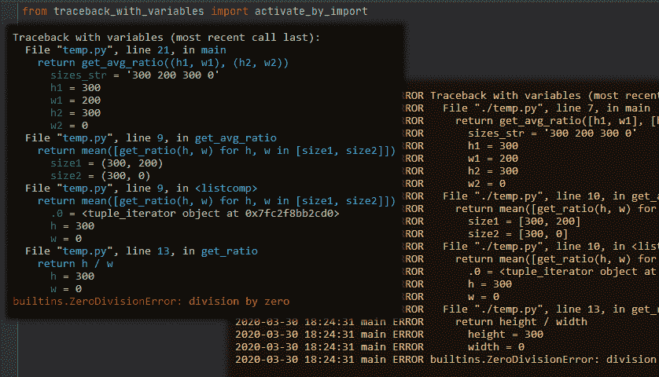
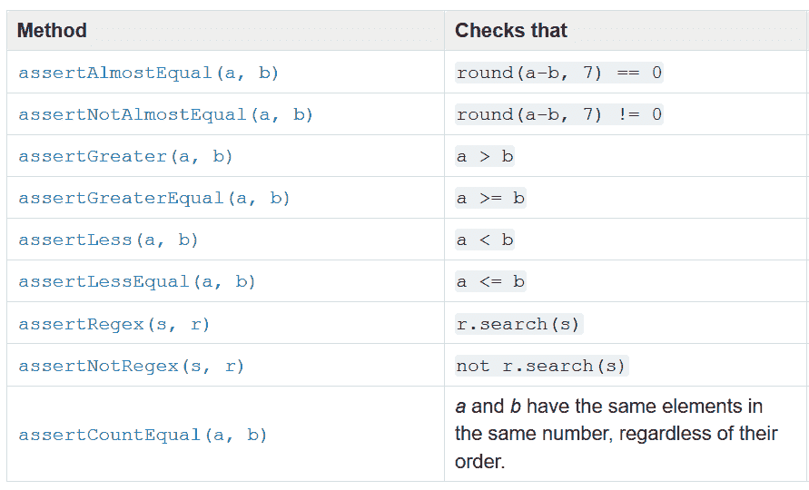
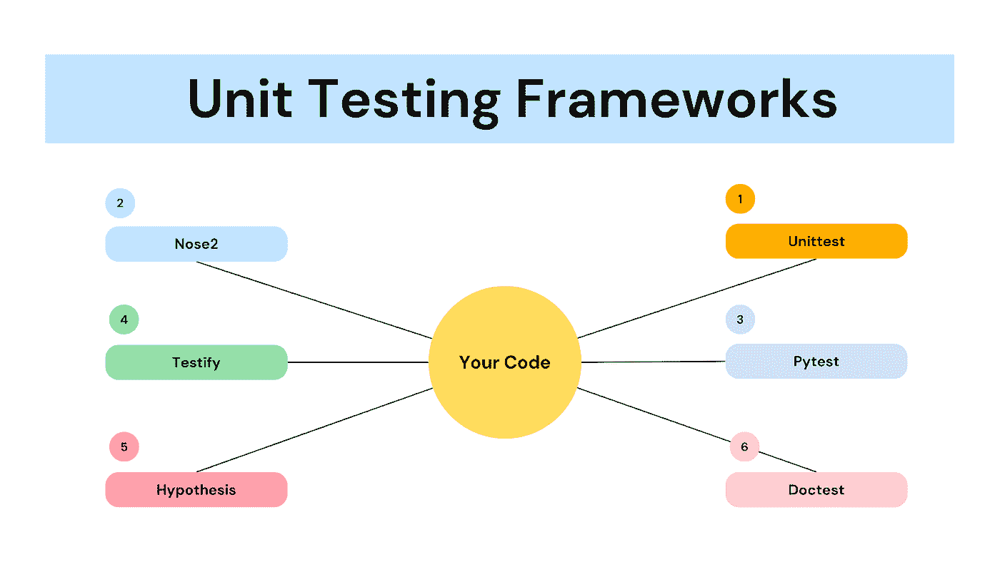
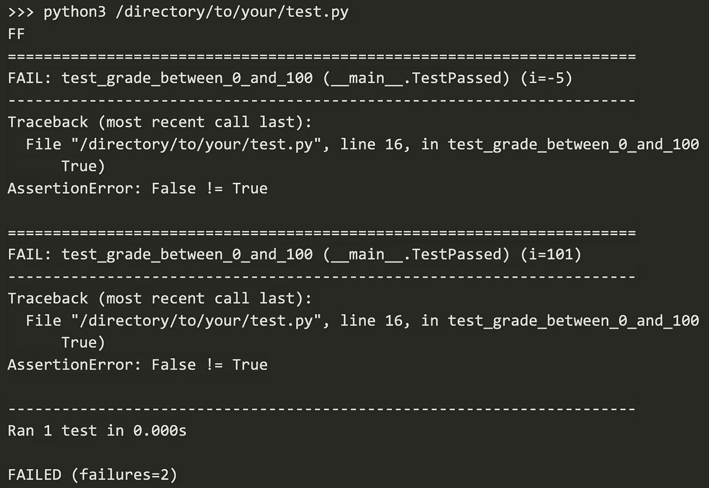

# 用 Python 进行数据科学的单元测试

> 原文：<https://towardsdatascience.com/unit-testing-for-data-science-with-python-16dfdcfe3232>

## 使用 nose2 和参数化测试尽早发现代价高昂的错误

你在工作中部署了一个新的机器学习模型。你终于可以享受周末了，你心想。你一点也不知道，一场迫在眉睫的错误风暴即将摧毁你的模型，毁掉你的周末。



不不不。请现在不要。图片作者。

为什么会这样？错误检查不足。数据科学家被教导执行数据探索和建模，但我们没有被教导执行单元测试，尤其是在边缘情况下。

在这篇文章中，我将介绍一个我发现在日常工作中非常有用的技巧:使用 nose2 进行单元测试。特别是，我会分享

*   什么是单元测试？
*   为什么数据科学家应该执行单元测试？
*   什么是 nose2？
*   如何执行简单的单元测试？
*   什么是参数化单元测试？
*   如何做一个简单的参数化测试？
*   如何进行检查错误的参数化测试？
*   如何用 pandas dataframe 做参数化测试？

# 什么是单元测试？

单元测试是数据科学家能够掌握的最强大的技能之一，它是编程的灵魂。这是一个测试，检查代码的单个组件，通常作为一个功能模块化，并确保它按预期执行

理想情况下，我们希望我们的测试很小。越小越好。这是因为更小的测试不仅从实践的角度来看更有效——因为测试更小的单元将使您的测试运行得更快——而且从概念上来说，它将为您提供粒度代码如何运行的更详细的视图。

# 为什么要执行单元测试？

有很多！这里有一个快速运行通过。

*   您可以**在开发周期中轻松找到 bugs】由于功能/类是模块化/隔离的，因此每次只测试代码的一部分，这导致了效率的提高、停机时间的减少和成本的降低，否则成本会因整个设计过程停滞而增加。**
*   当你单独测试软件的每个组件时，你可以**更容易地重构代码**。早期发现的问题可以被消灭在萌芽状态。
*   做得好的话，你可以把它们作为一种**形式的文档**。

让我们看一个使用 unittest 的简单例子，unittest 是从版本 2.1 开始内置到标准 python 库中的。

创建测试用例是通过子类化 [**unittest 来完成的。测试用例**](https://docs.python.org/3/library/unittest.html) 。下面是一个例子。

```
import unittestdef add(x):
  return x + 1class MyTest(unittest.TestCase):
  def test(self):
  self.assertEqual(add(3), 4)
```

您还可以在这里找到其他 assert 方法。



[来源](https://docs.python.org/3/library/unittest.html)

虽然 unittest 非常适合简单的测试，但在处理更复杂的代码时，它可能会很快变得有点麻烦。因此，开发了 [nose2](https://docs.nose2.io/en/latest/index.html) 来扩展 unittest 以简化测试过程。

# 什么是 nose2？


由[布雷登·安德森](https://unsplash.com/@braydona?utm_source=medium&utm_medium=referral)在 [Unsplash](https://unsplash.com?utm_source=medium&utm_medium=referral) 上拍摄的照片

与 unittest 相比，Nose2 提供了更好的插件 API，并简化了内部接口和过程。Nose2 模块内置了很多插件，这些插件都是默认加载的。一些默认加载的[主要插件](https://docs.nose2.io/en/latest/plugins.html)有助于测试的参数化，将测试设备组织成层，捕获日志消息，提供测试覆盖报告，等等。

以下是 python 中不同的单元测试框架。



现有的单元测试框架。图片作者。

# 如何执行简单的单元测试？

在我们开始之前，您需要在您的系统中安装 Nose2 框架

```
pip install nose2==0.9.2
pip install parameterized
```

我们将从一个简单的例子开始。考虑这样的情况，我们有一个考试的四个分数的列表。分数应该在 0 到 100 之间。

```
+-------+
| score |
+-------+
|    44 |
|    64 |
|    -5 |
|   101 |
+-------+
```

让我们编写一个测试来帮助我们捕捉不符合标准的两个值(-5 和 101)，并告诉 python 运行测试。

现在我们已经创建了 test.py，我们必须运行它。为此，您可以打开终端，并运行以下命令。(请将“/directory/to/your/test.py”替换为存储 test.py 的目录。)

```
python3 /directory/to/your/test.py
```

运行该命令后，您应该会看到以下内容。



不出所料，我们的测试失败了！万岁。

# 什么是参数化单元测试？

开发人员倾向于为每个案例编写一个测试。然后将一些相关案例分组到“套件”中。考虑下面的情况。

```
class CodeTestSuite(TestCase):
    def test_for_int_input(self):
        assert correct_output() def test_for_float_input(self):
        assert correct_output() def test_for_string_input(self):
       assert correct_input() 
```

可想而知，这些案件大部分都是息息相关的。这可能会导致去冗余、大型测试代码库，以及在进行变更时需要偿还的潜在技术债务。

**进入参数化测试**，生成一个*多参数*测试，方便测试。您可以通过测试套件中方法的装饰器来传递参数。

下面的一些代码是建立在 Richard D Jones 的“你应该做参数化测试”之上的。一定要去看看！

# 带装饰器的参数化测试

假设我们想要测试这个简单的函数“compute”。

```
def compute(a, b):
     return (a + b) / (a * b)
```

在下面的例子中，我们使用 compute 函数执行两个参数化测试。特别是:

*   test_int 测试 compute(a=0，b=1)的输出是否为 1。如果是，测试通过。
*   test_float 测试 compute(a=1，b=1)的输出是否为 1。如果是，测试通过。

代码片段如下。

```
class TestSuite(unittest.TestCase):
     @parameterized.expand([
         # each tuple contains 
         # (name     , a  , b  , expected_output
         ("test_int" , 1  , 1  , 2),
         ("test_float", 1\. , 1\. , 2.)
     ])def test_compute(self, name, a, b, expected_output):
     assert compute(a, b) == expected_output
```

注意“@ parameterized.expand”装饰器是如何接受元组列表的。每个元组都是一个测试用例，其输出将被改变。

完整的代码块如下。

您可以使用以下命令运行上述测试。所有的测试都应该通过。

```
python3 /directory/to/your/test_param.py
```

# 如何进行检查错误的参数化测试？

在某些情况下，我们还希望执行单元测试，以确保错误被正确地提出。为此，我们可以指定要引发的错误。

代码片段如下。

```
def test_compute(self, name, a, b, expected_output, expected_error=None):
     # If no error is expected from the test case,
     # check if the actual output matches the expected output
     if expected_error is None:
          assert compute(a, b) == expected_output # If an error is expected from the test case,
     # check if the actual error matches the expected error
     else:
          with self.assertRaises(expected_error):
              compute(a, b)
```

下面的示例“test_divisionbyzero”测试 compute(0，0)是否正确地产生了 ZeroDivisionError。

您可以使用以下命令运行上述测试。所有的测试都应该通过。

```
python3 /directory/to/your/test_params_with_error.py
```

# 如何用 pandas dataframe 做参数化测试？

如果你想为你的测试传入一个熊猫数据帧呢？没问题。

我们可以使用下面的代码片段，其中 load_test_case()是一个接收数据的函数。

您可以使用以下命令运行上述测试。所有的测试都应该通过。

```
python3 /directory/to/your/test_params_with_dataframe.py
```

# 单元测试是无压力周末的关键

单元测试模块可以由 nose2 模块补充，以创建强大的单元测试。特别是，参数化测试提供了一种组织多个单元测试的便捷方式。

我将在接下来的一周分享更多的单元测试策略。敬请期待！

如果你想了解更多关于数据分析、数据科学和机器学习的知识，可以考虑在 Medium 和 LinkedIn 上关注我！