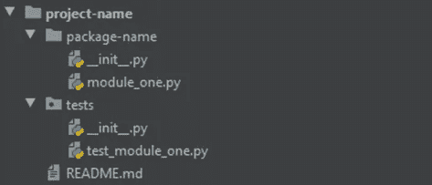

# 10 分钟后模拟单元测试

> 原文：<https://towardsdatascience.com/unit-testing-with-mocking-in-10-minutes-e28feb7e530>

## 使用内置的 unittest Python 包有效地测试您的代码库


照片由[亚历克斯·康德拉蒂耶夫](https://unsplash.com/@alexkondratiev?utm_source=medium&utm_medium=referral)在 [Unsplash](https://unsplash.com?utm_source=medium&utm_medium=referral) 拍摄

顾名思义，单元测试通过测试预期的输出、错误或数据类型，甚至测试函数是否被调用(以及调用了多少次)，来测试单个单元或代码库的一小部分，以确保组件按预期工作。

本文将比较可用的不同单元测试方法、单元测试最佳实践、如何编写和运行单元测试，最后用内置断言、测试的条件跳过和模拟来增强您的单元测试。

***更新*** *:本文是系列文章的一部分。查看其他“10 分钟内”话题* [*此处*](https://medium.com/@kayjanwong/list/in-10-minutes-eeaa9aa67055) *！*

# 目录

1.  [单元测试生态系统](https://medium.com/p/e28feb7e530/#1b08)
2.  [单元测试最佳实践](https://medium.com/p/e28feb7e530/#6ce7)
3.  [单元测试的结构](https://medium.com/p/e28feb7e530/#dc86)
4.  [运行单元测试](https://medium.com/p/e28feb7e530/#cc2e)
5.  [高级:内置断言](https://medium.com/p/e28feb7e530/#f11a)
6.  [高级:跳过单元测试](https://medium.com/p/e28feb7e530/#157f)
7.  [高级:单元测试中的模拟](https://medium.com/p/e28feb7e530/#292d)

# 单元测试生态系统

有几个 python 包可以执行单元测试和其他形式的测试，

*   测试代码覆盖率，以衡量单元测试的有效性
*   `**doctest**`:在函数本身的 docstring 中测试函数的实现，但是测试用例的类型可以是有限的。在我的关于代码文档的文章[中阅读更多信息](https://kayjanwong.medium.com/advanced-code-documentation-with-coverage-and-unit-tests-part-3-3f7b698497fb)
*   `**mypy**`:测试函数的返回类型
*   `**pytest**`:在一个单独的文件中测试函数的实现，写在一个函数中(函数式编程)。这个 python 包需要安装 pip
*   `**unittest**`:在一个单独的文件中测试函数的实现，写在一个类中(面向对象编程)。这是一个内置的 python 包，不需要安装

编写单元测试的两个最常见的包是`pytest`和`unittest`。个人认为用`unittest`写的代码比`pytest`可读性强。然而，`pytest`确实有它的优点，因为它需要更少的代码，因为测试是在函数而不是类中编写的。

# 单元测试最佳实践

无论您决定使用哪一个单元测试 python 包，都会强制执行一些我称之为最佳实践的约定。我将根据以下类别将它们分为强制的和推荐的最佳实践，

## 文件夹结构(强制性最佳实践)



图 1:单元测试文件夹结构——作者图片

测试文件应该保存在一个`tests`目录中，与包目录或源代码处于相同的嵌套层次，并且该目录必须是可导入的。可导入的目录(也称为 python 模块)非常简单，只需向文件夹中添加一个空的`__init__.py`文件，以表明该目录是可导入的。

在`tests`目录中，文件夹结构应该遵循源代码或包目录的结构。

## 命名约定(强制性最佳实践)

文件名、类名和类方法都有命名约定，

*   文件名跟在 snake_case 后面，以`test_`开头，并且应该跟在它正在测试的文件的名称后面(即`test_module_one.py`是文件`module_one.py`的单元测试文件)
*   类名遵循 PascalCase 并以`Test`(即`TestFunction`)开头
*   类方法名跟在 snake_case 后面，以`test_`(即`test_scenario_one`)开头。

## 测试案例(推荐的最佳实践)

单元测试是基于断言的，例如断言结果等于或不等于预定义的预期输出。为了彻底测试断言，一个经过良好测试的函数应该测试

*   糟糕的论点；导致函数引发异常的参数
*   特殊论据；边界值，或者可以使用特殊逻辑的地方
*   正常的争论；测试通常的情况
*   测试返回值/数据类型/异常

# 单元测试的结构

了解了最佳实践之后，让我们来看看单元测试的框架！下面是一个最简单的单元测试的例子，只有 4 行代码。

```
import unittest

class TestFunction(unittest.TestCase):
    def test_function_with_scenario_one(self):
        print("Testing function with scenario one")
        # assert something here

if __name__ == "__main__":
    unittest.main()
```

单元测试是在继承自`unittest.TestCase`的类中编写的；并且每个单元测试都被实现为一个类方法。当运行单元测试时(下一节将详细介绍)，它会查找所有以`test`开头的类方法名，并按顺序运行它们。在上面的例子中，运行测试的顺序是`start > test_function_with_scenario_one > end`。

```
import unittest

class TestFunction(unittest.TestCase):

    def setUp(self):
        print("Set up...")
        self.value = 1

    def tearDown(self):
        print("Tear down...")
        self.value = None

    def test_function_with_scenario_one(self):
        print("Testing function with scenario one")

    def test_function_with_scenario_two(self):
        print("Testing function with scenario two")
```

在某些情况下，可能有一些设置应该在每个单元测试之前运行，例如，当每个单元测试都在相同的数据集或变量上执行操作时，您希望在设置每个单元测试时保持数据集或变量的一致性或减少重复。

您可以使用在每个单元测试之前和之后运行的`setUp`和`tearDown`夹具。这导致执行命令`start > **setUp** > test> **tearDown** > **setUp** > test > **tearDown** > end`。当设置单元测试时，变量可以作为类属性存储，并传递给单元测试(第 8 行)，这些类属性可以在拆卸期间重置为`None`(第 12 行)。

```
import unittest

class TestFunction(unittest.TestCase):

    @classmethod
    def setUpClass(cls):
        print("Set up class...")
        cls.value = 1

    @classmethod
    def tearDownClass(cls):
        print("Tear down class...")
        cls.value = None

    def test_function_with_scenario_one(self):
        print("Testing function with scenario one")

    def test_function_with_scenario_two(self):
        print("Testing function with scenario two")
```

如果设置代码在计算上很昂贵或者很耗时，比如连接到数据库，那么您可以实现`setUpClass`和`tearDownClass`fixture，它们在进入和退出类时运行一次。这导致了执行顺序`start > **setUpClass** > test > test > **tearDownClass** > end`。

与前面的设置和拆除实现相比，这是一个不太理想的实现，因为适当的单元测试应该独立地运行每个测试。当实现多个单元测试时，测试可能会修改类属性，只需一次设置和拆卸。

# 运行单元测试

建议在命令行终端上运行单元测试以彻底测试它，因为在控制台上运行它可能会由于[变量遮蔽](https://en.wikipedia.org/wiki/Variable_shadowing)而不完全可靠。

在官方的`unittest`文档中，它声明转到`tests`目录，并根据您是分别在目录、文件、类还是类方法上运行单元测试来运行下面几行，

```
$ python -m unittest .
$ python -m unittest test_file test_file2
$ python -m unittest test_file.TestClass
$ python -m unittest test_file.TestClass.test_method
```

然而，我发现转到`tests`目录会弄乱我在单元测试中的导入语句，因为基目录现在是`tests`，我不能正确地从我的包目录或源代码中导入函数。我的首选方法是转到基本项目目录并运行下面一行代码，

```
$ python -m unittest discover tests/
```

还有更多定制可以附加到命令中，例如

*   `-f` : fail fast，遇到第一个测试失败就停止所有单元测试
*   `-p "test_*.py"`:指定文件名模式，有选择地运行测试
*   `-s start-dir`:指定运行测试的开始目录
*   `-v`:添加详细度；显示控制台日志的更多信息

# 高级:内置断言

如前所述，有许多场景需要测试(坏的、特殊的或好的输入参数),并且可以测试结果的预期输出、错误或数据类型。这些断言可以用`assert`语句来完成，但是`unittest`中有内置的比较器可以利用。以下是一些比较常见的比较器，完整列表可在[这里](https://docs.python.org/3/library/unittest.html#unittest.TestCase)找到。

## 断言预期输出

*   条件:`self.assertTrue(condition)`或`self.assertFalse(condition)`
*   相等:`self.assertEqual(a, b)`或`self.assertNotEqual(a, b)`
*   成员:`self.assertIn(a, b)`或`self.assertNotIn(a, b)`

## 断言预期误差

```
import unittest

class TestFunction(unittest.TestCase):

    def test_function_raise_error(self):
        self.assertRaises(ValueError, int, "a")

    def test_function_raise_error_with(self):
        with self.assertRaises(ValueError):
            int("a")
```

*   错误:`self.assertRaises(ExceptionName, function, arguments)`或使用如上所示的上下文管理器(第 10 行)
*   警告:`self.assertWarns(WarningName, function, arguments)`

## 断言预期的数据类型

*   数据类型:`self.assertIsInstance(a, dtype)`或`self.assertNotIsInstance(a, dtype)`
*   无类型:`self.assertIsNone(x)`或`self.assertIsNotNone(x)`

# 高级:跳过单元测试

除了利用内置的比较器方法，我们还可以使用内置的装饰器来实现单元测试的条件跳过。这意味着如果不满足某个条件，可以跳过单元测试。例如，由于向后兼容性问题而跳过对旧 Python 版本或包版本的测试，或者由于平台不兼容而跳过对某些系统的测试。

```
import sys
import unittest

class TestFunction(unittest.TestCase):

    @unittest.skip("Skip unit test")
    def test_skipped(self):
        self.fail("This should be skipped")

    @unittest.skipIf(sys.version_info.major < 2, "Skip due to Python version")
    def test_python_version(self):
        print("Test is ran")

    @unittest.skipUnless(sys.platform.startswith("win"), "Skip unless it is Windows")
    def test_python_version(self):
        print("Test is ran")
```

当运行单元测试时，它会在最后的语句中显示跳过的测试数量，比如`OK (skipped=1)`，这样你就不必担心单元测试在你不知情的情况下被编写和跳过了！

# 高级:单元测试中的模拟

单元测试中使用模仿来替换类方法或函数的返回值。这可能看起来违反直觉，因为单元测试应该测试类方法或函数，但是我们正在替换所有那些处理和设置预定义的输出。

模拟对于替换不应该在测试环境中运行的操作很有用，例如，当测试环境没有相同的数据访问时，替换连接到数据库并加载数据的操作。因此，取消处理并用预定义的数据替换输出不仅消除了可能的数据库连接错误，还增加了可预测性，因为对预定义数据进行的单元测试可以确保与您的预期输出完全匹配。

```
import unittest
from unittest.mock import Mock

class SampleClass:
    def __init__(self):
        self.value = 1

    def sample_method(self):
        """Function that returns value 1"""
        return self.value

class TestSampleClass(unittest.TestCase):

    def test_mock_class(self):
        class_object = SampleClass()
        class_object.sample_method = Mock(return_value=2)
        self.assertEqual(class_object.sample_method(), 2), "Mocking does not work"

    def test_mock_function(self):
        sample_function = Mock(return_value=2)
        self.assertEqual(sample_function(), 2), "Mocking does not work"
```

在上面的代码片段中，mocking 是用`return_value`参数实现的，用来替换类方法和函数的预期输出。我们可以看到这个类方法最初返回值`1`，但是我用`2`代替了返回值，并且使用了前一节提到的内置断言`self.assertEqual()`。

但是，将返回值限制为一个固定的预定义输出可能会有很大的局限性。每次调用类方法或函数时，可以使用`side_effect`参数将返回值设置为不同的输出，并传入不同的预期输出列表。`side_effect`参数接受函数、可重复项或异常，示例如下:

```
import unittest
from unittest.mock import Mock

class TestSampleClass(unittest.TestCase):

    def test_side_effect_function(self):
        sample_function = Mock(side_effect=lambda x: x + 1)
        self.assertEqual(class_object.sample_method(1), 2)

    def test_side_effect_iterable(self):
        sample_function = Mock(side_effect=[1, 2, 3])
        self.assertEqual(sample_function(), 1)
        self.assertEqual(sample_function(), 2)
        self.assertEqual(sample_function(), 3)

    def test_side_effect_exception(self):
        sample_function = Mock(side_effect=ValueError())
        with self.assertRaises(ValueError):
            sample_function()
```

`unittest.mock`模块中可用的项目更多，比如`MagicMock`类似于`Mock`但可以改变魔术方法，还有`patch`代替整个函数而不是代替不那么直接的返回值。

希望您已经了解了更多关于不同类型的测试、如何编写和运行单元测试、有用的提示以及单元测试的高级实现。在生产中编写代码时，单元测试很重要；标记出代码中的意外错误，或者防止代码增强破坏代码的其他部分。

作为[持续集成持续交付(CICD)](https://en.wikipedia.org/wiki/CI/CD) 的一部分，单元测试应该在任何代码被推送之前以自动化的方式运行。在[测试驱动开发(TDD)](https://en.wikipedia.org/wiki/Test-driven_development) 的情况下，一些工作流可以在编写源代码之前优先编写单元测试，以考虑代码应该如何工作。

**感谢您的阅读！如果你喜欢这篇文章，请随意分享。**

# 相关链接

*   `coverage.py`文档:[https://coverage . readthedocs . io](https://coverage.readthedocs.io/en/6.4.1/)
*   `doctest`文件:[https://docs.python.org](https://docs.python.org/3/library/doctest.html)
*   https://mypy.readthedocs.io/en/stable/[T2](https://mypy.readthedocs.io/en/stable/)
*   `pytest`文件:[https://docs.pytest.org](https://docs.pytest.org/en/6.2.x/contents.html)
*   https://docs.python.org[T4](https://docs.python.org)