# 数据表单中具有依赖关系的 SQL 脚本的单元测试

> 原文：<https://towardsdatascience.com/unit-tests-for-sql-scripts-with-dependencies-in-dataform-847133b803b7>

## 数据仓库 Gitflow 管道来自动运行它

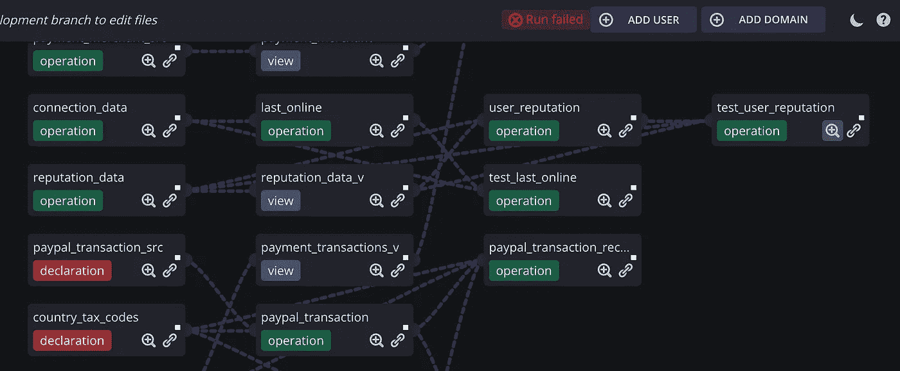

作者图片

## 你对你的数据仓库脚本进行单元测试了吗？

我将谈论复杂 SQL 查询的单元测试，它可能由多个操作(动作)组成。

我在使用 BigQuery 脚本之前尝试过:

</sql-unit-testing-in-bigquery-here-is-a-tutorial-64fc7a6b377>  

> 然而，这里有另一种(也可能是更好的)方法。

[Dataform](https://dataform.co/) 是一个很棒的免费 SQL 数据转换工具。它有助于保持您的数据仓库整洁有序。它有很好的依赖图来解释数据谱系，并且它是那里发生的所有事情的唯一真实来源。

# 什么是好的单元测试？

*   它应该测试预期结果和实际结果
*   应该描述与用例相对应的脚本逻辑。
*   应该是自动化的。
*   保持独立(测试不应该互相设置或拆卸)
*   应该很容易实现。
*   可重复:任何人都应该能够在任何环境中运行它。
*   一旦写好了，就应该留着以后用。

Dataform 支持针对**视图**的 **SQL 单元测试**，您可以在 Dataform docs [1]中阅读相关内容。这的确很简单。

**假设我们有一张桌子:**

**考虑这个视图，想象你总是需要它返回三列，这意味着你想要对它进行单元测试:**

**在数据形式单元测试中，视图很简单:**

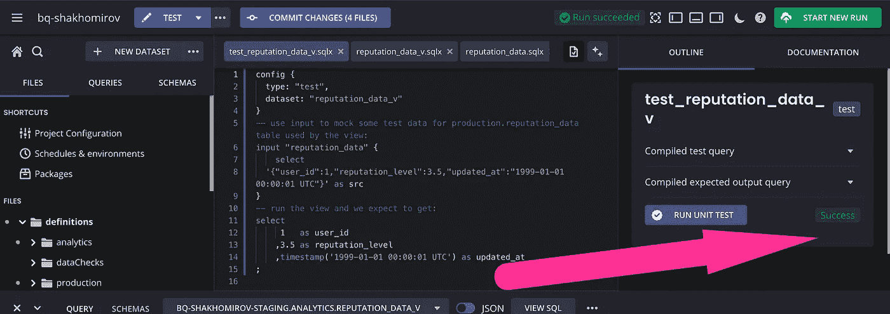

作者图片

因此，单元测试的文件定义如下所示:

然而，通常这是不够的。

> *您可能想要运行和测试*一个定制的 SQL 操作/一个脚本*有多个语句和多个输出。*

事实上，当你想对一个 **SQL 脚本**进行单元测试，而**依赖于一些其他的动作**，也就是视图、脚本、表格等等，这就变得很棘手了。在这种情况下，您可能希望保持它的原子性，并在每次再次运行时对它们进行一次测试。

假设我们每天/每小时对我们的表执行**增量更新**，并且您想要对该脚本进行单元测试:

我以前在这里写过关于合并更新的文章:

</advanced-sql-techniques-for-beginners-211851a28488>  

# 我们如何为此创建一个单元测试？

1.  我将使用 Dataform 在每个依赖项的`*_tests`模式中创建输入，即我将要测试的主脚本中的任何表或视图。根据每个表的模式，它将创建一个**输入**，即`production.reputation_data`的`production_tests.reputation_data`，等等。
2.  我将要求我的单元测试运行我们将要测试的主要操作`user_reputation`(这是一个脚本)，并将实际输出保存在`*_tests`模式中，即`production_tests.user_reputation`。
3.  我将比较我的**预期输出**(我将在单元测试中提供)和我之前得到的实际输出。

让我们为`user_reputation`脚本编写单元测试:

> *如果数据集的实际输出不等于预期输出，则单元测试失败。*

**意思是:**

*   输出行数必须匹配
*   输出列的数量及其名称必须匹配
*   每行的内容必须匹配

**让我们运行它:**

*   运行标签为`unit_tests`的操作。确保你的脚本有它。
*   包括依赖关系。
*   添加模式后缀(`*_tests.any_table`)。

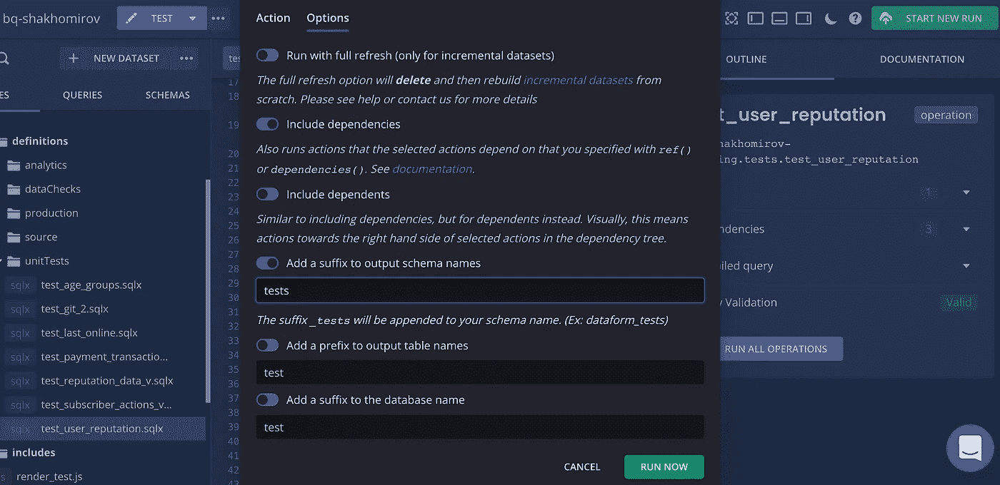

作者图片

…

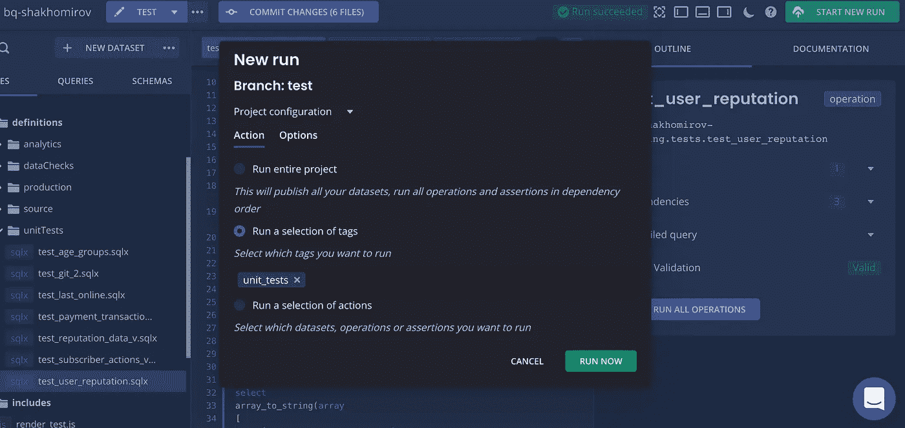

作者图片

**结果我们将看到*通过*我们的单元测试:**

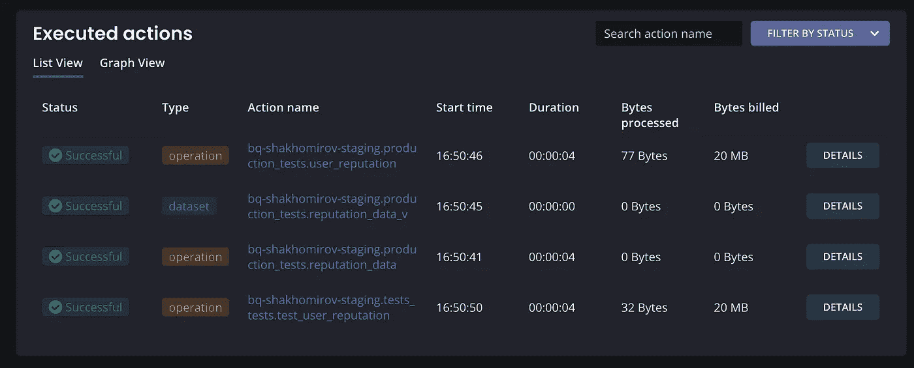

作者图片

那么刚刚发生了什么？我们来看看依赖图:

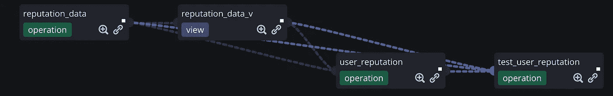

作者图片

Dataform 运行所有的依赖项，但在我的新`production_tests.*`模式中创建了“假”输出，这样最终的脚本(一个单元测试脚本)可以将它们用作**输入**。

让我们看看，如果有人决定改变管道中任何依赖关系的逻辑，会发生什么。我将稍微改变一下`reputation_data_v`:

我将再次运行单元测试(`test_user_reputation.sqlx`):

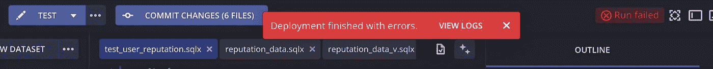

作者图片

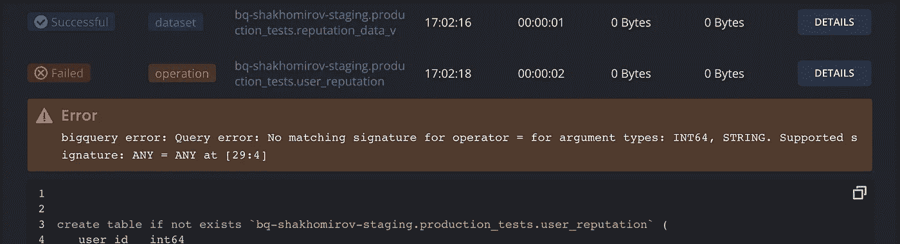

作者图片

**这就是我们如何以数据形式运行 SQL 脚本的单元测试:**

*   运行标签为`unit_tests`的动作。确保你的脚本有它。
*   包括依赖关系。
*   添加模式后缀(`*_tests.any_table`)。

Dataform 有一个命令行界面，因此您可以从命令行运行项目的操作:

在这里阅读更多信息: [2](https://docs.dataform.co/dataform-cli)

Dataform 还有一个 docker 映像，因此您可能希望设置一个 **Gitflow 管道**，以便在每次创建 **Pull 请求**时运行`unit_tests`操作:

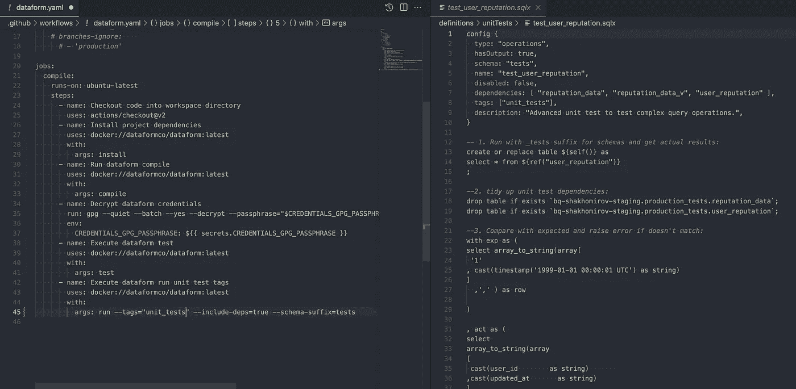

作者图片

> 因此，当您**将变更推送到您的存储库**时，它将运行检查

…让您的管道查看是否有任何逻辑受到影响:

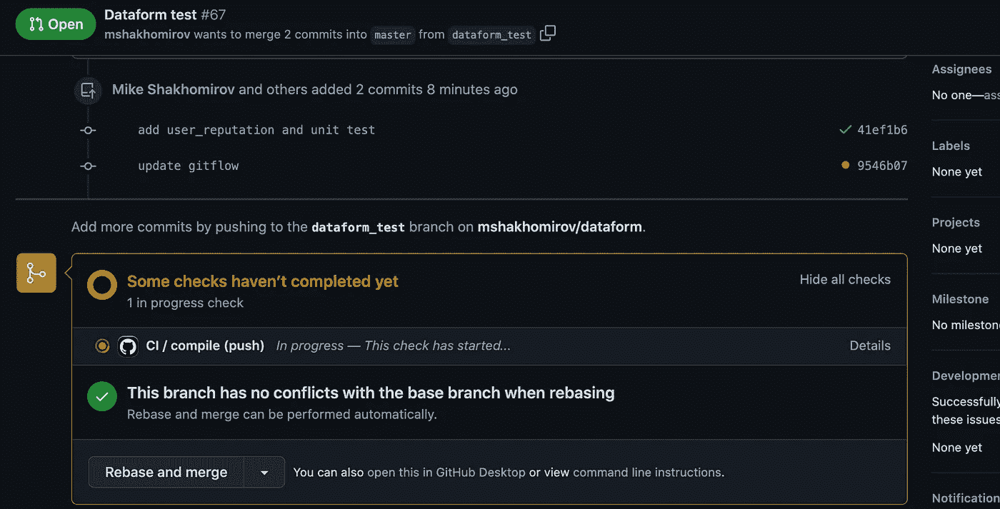

作者图片

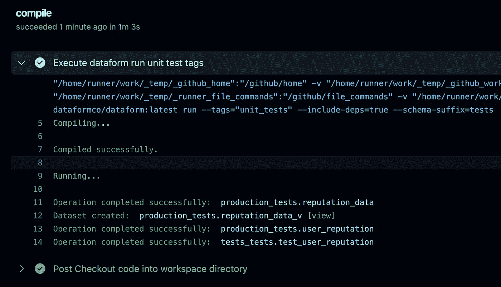

作者图片

# 结论

数据表单是一个很好的数据建模工具。它就像 DBT，但是是用 JavaScript 写的。它具有 Git 和 CI/CD 特性，这使得它非常强大。它**自动记录 SQL 脚本**并创建漂亮的**依赖图**，这使得它作为**真实的单一来源**对于每个将要使用它的人来说非常有用。

目前，新的数据表单注册已经关闭，因为该公司被谷歌悄悄收购。Dataform 现在在**谷歌云平台**的`Preview`模式下可用，这意味着它将在几个月后提供完整的功能列表。我已经在`Preview`尝试了一些东西，但是仍然喜欢在本地使用传统的 Web UI 和控制台包。如果我想将它作为微服务运行，Dataform 有一个`Docker`映像允许这样做。我在 GCP 的`Preview`版本中找不到**依赖图**和其他一些重要特性。

# 推荐阅读:

<https://cloud.google.com/dataform>  </sql-unit-testing-in-bigquery-here-is-a-tutorial-64fc7a6b377>  </advanced-sql-techniques-for-beginners-211851a28488>    

*原载于*[*https://mydataschool.com*](https://mydataschool.com/blog/unit-tests-for-sql-scripts-with-dependencies-in-dataform/)*。*