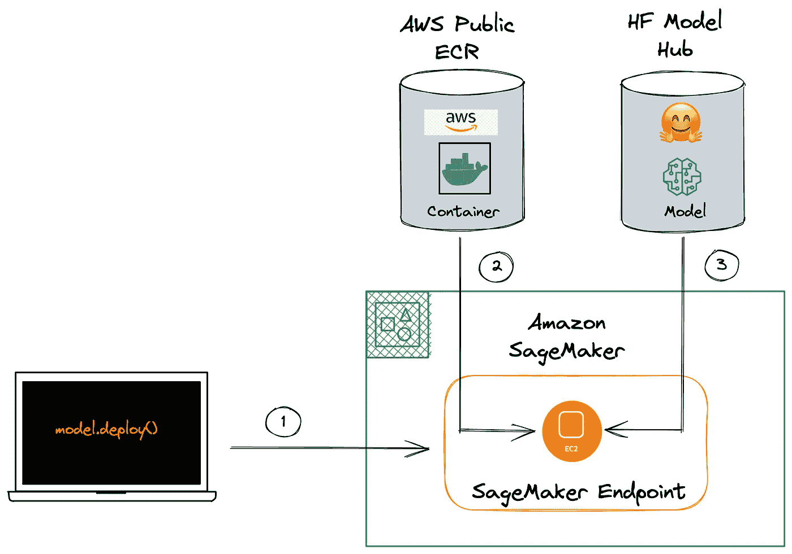
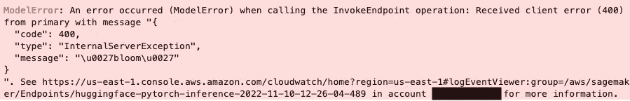
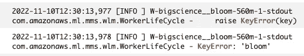
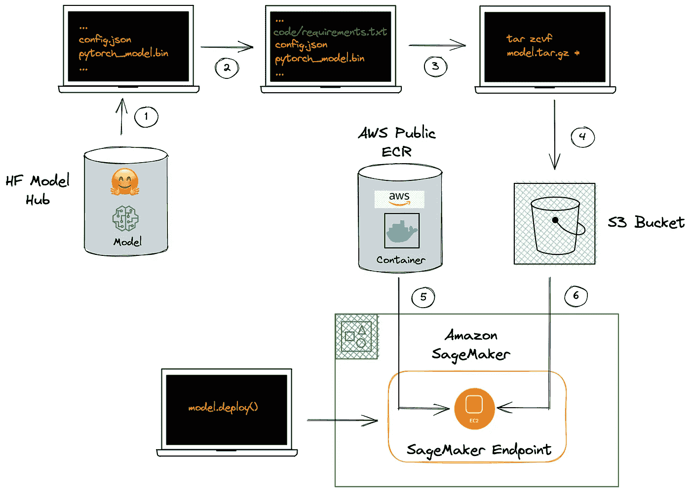
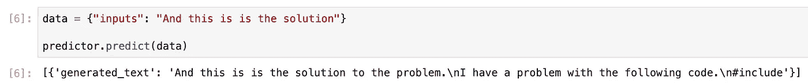
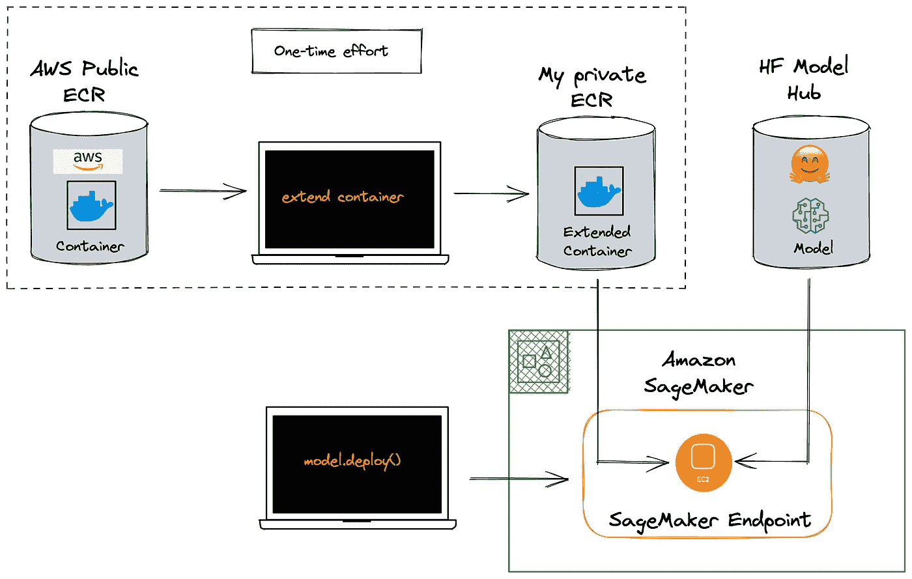

# 使用亚马逊 SageMaker 解锁最新的变压器型号

> 原文：<https://towardsdatascience.com/unlock-the-latest-transformer-models-with-amazon-sagemaker-7fe65130d993>

## 关于扩展和定制 AWS 深度学习容器的快速教程

图片由作者使用 Midjourney 制作

# 这是怎么回事？

由于方便易用，AWS 深度学习容器(DLC)已经成为亚马逊 SageMaker (SM)上训练和部署自然语言处理(NLP)模型的热门选择。然而，有时预构建的 DLC 中没有最新版本的 Transformers 库。在这篇博文中，我们将扩展这些 DLC，在 AWS 上训练和部署最新的拥抱脸模型。无论你是 DLCs 新手还是有经验的用户，这篇文章都将为在 AWS 上运行拥抱人脸模型提供有价值的见解和技术。

本教程的代码可以在这个 [GitHub repo](https://github.com/marshmellow77/sm-extend-container) 中获得。

# 为什么这很重要？

亚马逊 SageMaker 是一个运行 AI 模型的流行平台，但运行最新的变形金刚模型(例如[耳语](https://huggingface.co/openai/whisper-base)、[布鲁姆](https://huggingface.co/bigscience/bloom))需要最新版本的[变形金刚库](https://github.com/huggingface/transformers)。然而，AWS 上最新的可用 DLC 仅支持版本 4.17，而在撰写本文时，最新版本是 4.25.1。当试图将最新的 DLC 用于不受支持的型号时，用户会遇到一条错误消息，例如，参见拥抱脸(HF)论坛上的这个[主题](https://discuss.huggingface.co/t/deploying-open-ais-whisper-on-sagemaker/24761/1)

这个问题的一个解决方法是将 requirements.txt 文件注入到模型中，但是这可能是一个缓慢而乏味的过程。它需要下载模型，添加 requirements.txt 文件，打包模型，并上传到 S3，对于大型模型来说，这可能需要几个小时。在这篇博文中，我们将利用 AWS 的预建 DLC 可以扩展这一事实，从而为用户节省这一变通办法，并因此在他们想要培训或部署新模型时节省许多时间。

# 如何在 SageMaker 上部署 Transformer 模型

在 SM 上部署 Transformer 模型通常是一件轻而易举的事情，尤其是如果您想使用预先构建的模型而无需进一步培训的话。在这种情况下，我们可以将模型直接从 HF 模型中心部署到 SM:

以下是运行这段代码时在后台发生的情况:

作者图片

一旦执行了 deploy()命令，SM 就会启动一个 EC2 实例，并从指定的 DLC 中获取映像，这是由 transformers 和 pytorch 库的版本号决定的。我们可以在这里找到可用 DLC [的列表——这些是从一个特定的](https://huggingface.co/docs/sagemaker/reference#inference-dlc-overview) [AWS 账户](https://github.com/aws/deep-learning-containers/blob/master/available_images.md#huggingface-inference-containers)中获取的，并且是公开可用的，参见[这个例子](https://github.com/aws/deep-learning-containers/tree/master/huggingface/pytorch/inference/docker/1.10/py3)。

正如我们在这个[列表](https://huggingface.co/docs/sagemaker/reference#inference-dlc-overview)中看到的，DLCs 中最新可用的变形金刚版本是 4.17，但许多型号将需要比这更高的版本。

# 最新型号变压器的问题是

当我们试图使用最新的 DLC 运行需要高于 4.17 版本的模型时，我们可以看到这一点。部署将会成功，但是当我们尝试使用该模型时，我们会收到以下错误消息:

作者图片

在 Cloudwatch 日志中，我们可以看到更多信息:

作者图片

这意味着我们试图通过最新的 DLC 部署的模型(在这种情况下是 BLOOM)是不可能的。

# 解决方法—注入一个 requirements.txt 文件

如上所述，有一个解决方法——[HF SM 推理工具包](https://github.com/aws/sagemaker-huggingface-inference-toolkit#-user-defined-codemodules)允许定制推理代码，以及通过 requirements.txt 文件指定所需的附加库的可能性。我们可以通过将最新的 transformers 版本添加到 requirements.txt 文件来使用这种机制，如下所示:

然而，要将这个 requirements.txt 文件注入到模型中，需要一些额外的步骤:

作者图片

在这种情况下，我们首先需要从 HF 模型中心手动下载模型。然后，我们将 requirements.txt 文件添加到模型目录中，并将其打包。然后，模型需要上传到 S3 桶。然后，最后，我们可以部署模型，将端点指向模型的 S3 位置。当启动端点的 EC2 实例时，将读取 requirements.txt 文件并安装最新的 transformers 版本。

如果这是一个相对较小的模型，这是繁琐的，但不会花费太长时间。然而，如果这是盛开的模式，整个过程可能需要 12 个小时(相信我，我试过了😕)

# 解决方案—扩展预构建的数据链路连接器

相反，我们希望直接从 HF 模型中心进行部署，特别是在不需要定制代码或者需要任何模型微调的情况下。在这种情况下，我们可以编写一个 Docker 文件，首先从公共 AWS ECR 中提取最新的 DLC，然后添加我们自己的要求，在这种情况下，只需一个“pip install”命令即可更新到最新的 transformers 版本:

然后，我们可以运行[官方 AWS 教程](https://docs.aws.amazon.com/sagemaker/latest/dg/prebuilt-containers-extend.html)来扩展 DLCs，我们只需要确保我们调整了命名，并且我们运行该脚本的角色拥有读取和写入 ECR 服务的权限:

几分钟后这个脚本完成后，我们应该会在 ECR 中看到新的 DLC。

# 测试新的数据链路连接器

现在新的 DLC 已经准备好了，我们可以再次测试之前的部署，但是这次使用我们的扩展 DLC:

现在，当我们运行一个推理请求时，我们得到一个正确的响应:

作者图片

这是现在在后台发生的事情:

作者图片

我们曾经努力扩展 DLC，但是现在，每当我们想要从 HF Model Hub 部署需要最新版本的 transformers 库的模型时，我们可以重用我们的 DLC，而不是 AWS 的官方 DLC🤗

# 结论

在本教程中，我们扩展了 AWS 的官方 HF DLCs，将变压器库更新到许多新变压器型号所需的更高版本。通过这样做，我们创建了自己的可重用 DLC，使我们能够直接从 HF 模型中心进行部署，从而节省了我们数小时的繁琐工作。

注意，这篇博文主要关注的是扩展推理 DLC，然而，同样的想法也可以用于[训练 DLC](https://huggingface.co/docs/sagemaker/reference#training-dlc-overview)。