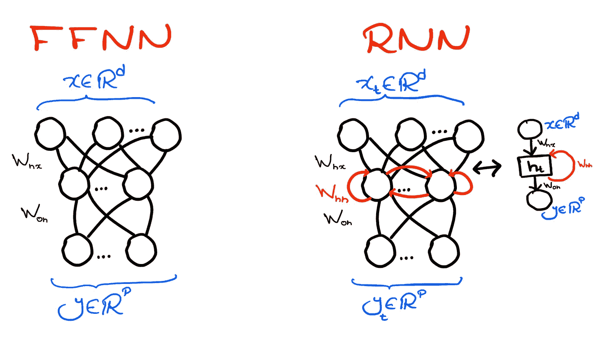
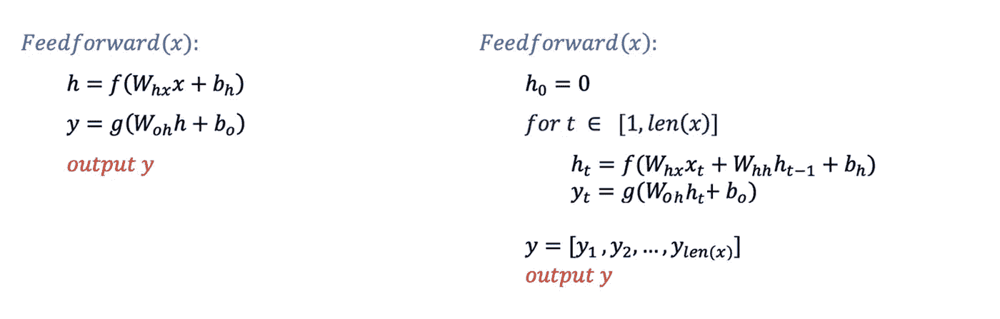
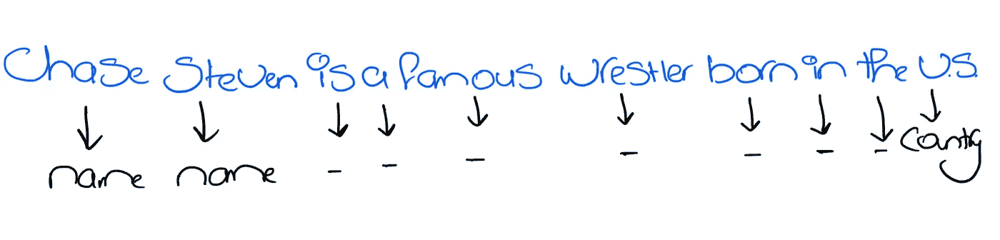
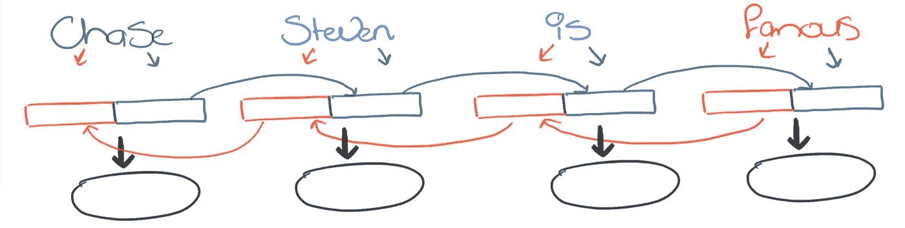

# 深入双向理解 RNNs

> 原文：<https://towardsdatascience.com/unriddling-rnns-with-depth-and-in-both-directions-9ed336c4b392>

## 让我们抽象掉所有的抽象，真正理解它们！

序列模型是深度学习起飞的一个重要原因。他们为我们提供了一种从文本或语音等序列数据中学习的方法，从而极大地推动了技术的发展，为无数有用的应用铺平了道路，否则使用经典的机器学习是不可能轻松实现的。

序列模型(与 Optimus Prime 没有太大关系)的核心是递归神经网络(RNNs)——我们将在这个故事中花足够多的时间来讨论这种神经网络。

## RNNs 有什么新特性？

rnn 帮助我们完成 FFNNs 不容易做到的事情。特别是，从 **到另一个**的一个变长向量序列的近似映射**。这有效地概括了 FFNNs 从**一个固定大小向量** ( *x* ) **到另一个** ( *y* )的近似映射的能力。**

这意味着 RNN 的输入将是一个向量序列(例如，每个单词由一个向量表示的句子)，并且我们期望输出也是一个同样长的向量序列(例如，帮助对输入句子中的每个单词进行分类的概率向量)。

正如我们将进一步阐述的，RNN 逐个处理输入序列中的元素，并为每个元素生成一个输出。

杰克·伦纳德在 [Unsplash](https://unsplash.com?utm_source=medium&utm_medium=referral) 上的照片

## 循环层

作为一种架构，您可以将 RNN 视为一种 FFNN，它允许一种称为“循环层”的新型层。循环层的作用是

1-它接收来自前一层的激活，并将其乘以一个权重矩阵，就像 FFNNs 中使用的密集层一样

2-它获取由于序列中的先前输入而自身产生的**激活，然后将其乘以权重矩阵。**

3-它增加了前两个结果的偏差

4-然后对其应用激活函数，并提供结果作为进一步层的输入，就像 FFNNs 中使用的密集层一样

就是这样。我们也喜欢称这种循环层的激活为“隐藏状态”。用 *h* ₜ来表示由于输入序列中的 tₜₕ向量而导致的隐藏状态。

你可能会想到，“如果序列中的第一个单词没有先前的激活，我们如何计算它的激活？”答案是隐藏状态总是被初始化，全零是最常见的选择。在这种情况下，循环层的行为与序列中第一个输入的密集层完全一样。

## 递归神经网络

我们可以通过将 rnn 与 FFNNs 并列来理解它们，如下图所示。请注意，在 RNN 中有一个额外的权重矩阵(红色连接),在计算循环层激活时，除了由于当前输入而导致的激活之外，该矩阵还使循环层因子成为由于先前输入而导致的激活。这意味着当输出图层(只是一个密集图层)对当前输入做出决策时，它会考虑当前输入以及以相同顺序出现在它之前的所有输入。

作者绘图

现在，根据我们所说的，我们可以用以下等式来表示每个网络的前馈通道

这也使得 RNNs 的训练和推理都将花费更多的时间。尤其是当序列很长的时候。

乔纳斯·阿莱特在 [Unsplash](https://unsplash.com?utm_source=medium&utm_medium=referral) 上拍摄的照片

## 更深入

到目前为止，我们考虑的 RNN 有一个输入层、一个作为隐藏层的递归层和一个输出层。有两种方法可以更深入，一种是添加更多的递归图层(将每个图层都视为黑盒)，另一种是添加更密集的图层(通常在输出附近)。

回想一下，一个递归层学习一个考虑了先前标记的表示，如果你在它上面堆叠另一个递归层，那么它将学习一个更复杂的表示，该表示也考虑了与第一个递归层学习的表示中的元素相关的模式。同时，如果你堆叠一个密集的层，它所学习的任何复杂特征将与来自循环层的序列是否涉及将序列中的一个元素与前一个元素相关联的模式无关。也就是说，堆叠另一个循环层应该被期望利用更多要学习的特征的潜在复杂性。出于这个原因，当提到架构使用多层 RNN 时，通常被称为“多层”的是循环层。

因为与每个递归图层相关的计算量与输入的长度成比例，所以拥有多个递归图层会使您的模型变得迟钝。为此，您可能很少看到使用两个以上循环层的架构。

## 示例应用

我们在经典 RNN 中已经解释过了。它可以帮助你学习从一个序列到另一个序列的映射，但是它们必须总是一样长。这不适合许多复杂的任务，如翻译、摘要等。其中输入和输出序列长度不同，但它可以处理诸如命名实体或语音识别部分(以及无数其他任务)的应用，在这些应用中，输入句子中的每个标记都需要被分类到不同的类别。下面是命名实体识别的一个例子，其中每个单词根据它是否是命名实体以及如果是命名实体则根据实体的类型来分类。

为了处理像翻译或摘要这样的应用，我们需要将 rnn 推广到序列到序列模型，该模型使用两个 rnn 而不是一个，但是放宽了输入和输出序列必须具有相同长度的条件。我们也许可以在另一个故事中讨论这些。

照片由[布伦丹·丘奇](https://unsplash.com/@bdchu614?utm_source=medium&utm_medium=referral)在 [Unsplash](https://unsplash.com?utm_source=medium&utm_medium=referral) 上拍摄

## 双向 RNNs

在某些应用中，了解以前的标记和将来的标记可以极大地提高模型的性能。例如，在上面的例子中，如果不访问句子的其余部分，模型很难分辨 chase 是某人的名字还是动词。如果模型被训练成双向处理句子，这可能就不会发生，这正是 BRNN 通过利用双向递归层所做的。

**双向轮回层**

双向循环层只是两个独立的循环层，其中

1-一个递归层从左到右考虑输入，另一个从右到左考虑输入。这意味着每个单词对应两种隐藏状态，分别来自每一个循环层。

2-当两个递归层都完成时，句子中任何输入标记的双向递归层的整体隐藏状态(将被馈送到其他层)由它的两个相应隐藏状态的串联给出。

这意味着当输出层做出与句子中的一个标记相对应的决定时，它会考虑在它之前和之后的所有标记的存在。这是真的，因为输入到它的是两个隐藏状态的串联，一个考虑单词及其之前的所有内容，另一个考虑单词及其之后的所有内容。

下图显示了一个展开的 BRNN 的例子。我们有两个递归层(一个红色，另一个灰色)，以相反的顺序处理输入。我们将输出提供给 oval，它可以是一个输出分类层。

作者绘图

在 [Unsplash](https://unsplash.com?utm_source=medium&utm_medium=referral) 上由 [Aron 视觉](https://unsplash.com/@aronvisuals?utm_source=medium&utm_medium=referral)拍摄的照片

## 就这些吗？还有新的层吗？

rnn 是通过所谓的时间反向传播来训练的，这是对处理循环层的正常反向传播的扩展。类似于反向传播具有消失梯度问题，其导致权重在网络越深时停止更新，通过时间的反向传播具有序列越长的消失梯度问题。这可能会严重损害模型学习长期依赖性的能力，这对许多应用程序来说是一个严重的限制。

事实证明，如果我们设计一个更复杂的循环层，我们可以克服这个问题。长短期记忆(LSTM)和门控循环单位(GRU)就是这种层次的例子，我们可能会在另一个故事中谈到。

这总结了我们的文章，希望它能让你了解 rnn 是如何工作的，以及为什么他们擅长自己的工作。下次见，再见。