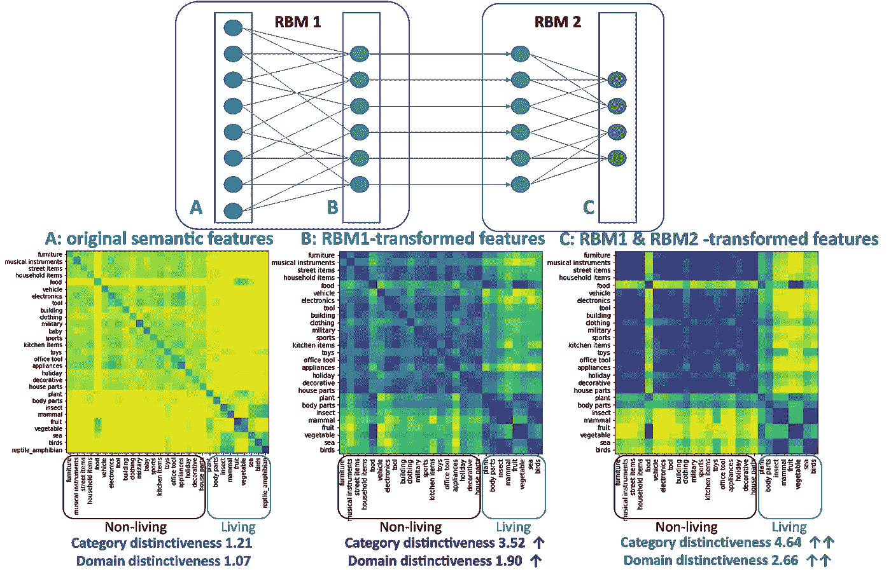

# 基于脑启发算法的无监督分类学习和特征降维

> 原文：<https://towardsdatascience.com/unsupervised-categorical-learning-of-objects-and-feature-dimension-reduction-using-a-brain-inspired-13a3a28f6137>

## 关于无监督学习，经典神经科学理论能告诉我们什么？

作为一名经常将机器学习方法纳入研究的大脑研究人员，我经常提醒自己，人工神经网络和生物大脑之间的类比可能过于简化。尽管如此，我对大脑和人工智能之间的交叉感到非常兴奋。事实上，大脑的许多认知能力在某种程度上可以被概念化为机器学习的目标，反之亦然。

例如，人类具有感知其经验中的规律性和共性的自然倾向，基于此，我们将事物简化为可以用较少参数描述的更抽象的类别(即，降维、聚类)。在神经基础设施的帮助下，这一过程通常会自动发生，没有反馈或反馈很少(即，无监督或半监督，与典型的监督学习问题相反)。你可能已经看到一个蹒跚学步的孩子分享她新学到的知识，即在街道另一边行走的那些四条腿的动物(不管它们的品种、大小、颜色和体型如何)都是“狗”，但很难想象她的能力是通过每天看狗的标签图片获得的。

幸运的是，很少有无监督的分类学习问题实际上需要像大脑一样复杂的人工神经网络。在下文中，我将与您分享常见对象的分类信息是如何从一个非常简单的神经网络中产生的，该网络同时实现了维度缩减。希望这可以作为一个例子，说明大脑计算原理的研究如何转化为有实用价值的东西。

**1。方法和数据集**

目前的分析基于我们研究小组的数据集，其中包含现实世界物体的手动标记特征(可在 CC-BY 4.0 [下获得，此处](https://osf.io/49zej/)，相关研究出版物见[此处](https://link.springer.com/article/10.3758/s13421-020-01130-5))。

在我的[上一篇关于人类对常见物体的认识的文章](/exploring-the-feature-space-of-human-knowledge-about-common-objects-e86940c1638a)中，我展示了现实世界中的每个常见物体都可以用该物体所具有的二进制向量标记特征来描述。例如，冰淇淋的特征向量在指示诸如“尝起来是甜的”、“是冷的”、“融化的”等属性的位置具有“1”。使用这些特征向量，我们能够通过将不同对象视为线性空间(即特征空间)中的点来测量它们的相似性，并且证明特征向量方法揭示了不同对象之间的分类区别，即，属于相同类别的对象倾向于在特征空间中聚集在一起。然后，我展示了使用 t-SNE 之类的降维技术可以在二维散点图上可视化分类差异。

特征向量方法的一个限制是每个对象只包含几个特征，但是我们需要使用非常高维的特征空间来容纳来自所有对象的所有特征，这有些低效。幸运的是，**语义特征可以用机器学习算法进一步提炼和提取，这里我们将研究一个简单而优雅的例子——受限玻尔兹曼机器(RBM)。**

一个**受限玻尔兹曼机器**是一个简单的人工神经网络，由两组神经元组成，“可见单元”和“隐藏单元”。可见单元通常被用作输入单元，而隐藏单元通常被视为输出单元。RBM 的训练机制受到神经科学中著名的[赫布法则](https://en.wikipedia.org/wiki/Hebbian_theory)的启发，该法则由姜懿翔·赫布于 1949 年提出，通常被概括为“*细胞一起放电，连接在一起*”。换句话说，当单元的点火模式与单元之间的布线不一致时(例如，两个单元连接在一起但异步点火)，网络将处于不稳定的“高能量”状态。训练算法的目标是通过迭代调整可见单元和隐藏单元之间的连接来减少能量。实际上，可见单元的数量通常大于隐藏单元的数量。数据被馈送以激活可见单元，而隐藏单元的激活不受约束。以这种方式，RBM 用作无监督的降维算法，因为它给出了从高维向量空间到低维空间的映射。事实上，Hebb 法则通常被认为是无监督学习的[神经基础。](https://www.sciencedirect.com/science/article/pii/S0959438800000763?via%3Dihub)

**2。创造和训练 RBM**

在 python 和 scikit-learn 中使用 RBM 非常简单。在下面的例子中，输入 ***X*** 是一个矩阵，描述了 995 个对象的 655 个二元语义特征(关于数据集的详细描述，参见我的[上一篇文章](/exploring-the-feature-space-of-human-knowledge-about-common-objects-e86940c1638a))。该数据用于训练具有 75 个隐藏单元的 RBM。最后一行代码获得了 75 个隐藏单元的激活，这可以看作是将原始稀疏编码的数据转换成单元数量减少了 88%的更紧凑的表示。就是这样！

现在让我们来看看这种转变的结果。下图显示了原始数据(左)和转换后的压缩数据(右)的 t-SNE 图和分类相异矩阵。在两个 t-SNE 图(左上，右上)中，相同类别的对象以相同的颜色显示。当特征数据通过 RBM 时，类别之间的差异变得更加明显，从而产生更加孤立的类别聚类。值得注意的是，在训练期间，关于物体类别的信息没有提供给 RBM，这意味着 RBM 通过物体的特征向量自己“发现”了类别。此外，生物和非生物之间的差异也变得更加明显(注意右下角相异矩阵中的亮黄色块)。

作者图片

对象类别的独特性可以使用类别间相似性与类别内相似性的比率来量化。有生命/无生命域的独特性也可以量化为域间相似性与域内相似性的比值。**原始特征数据的类别显著性得分为 1.21，领域显著性得分为 1.07。相比之下，RBM 变换的特征数据具有 3.52 的分类独特性得分和 1.90 的领域独特性得分，这证明了 RBM 在当前数据集上揭示分类信息的能力。**

**3。更深的网络，进一步降低维度**

RBM 可用作更复杂的神经网络的构建模块。由于 RBMs 不需要监控信号，这可以如下实现:1)用训练数据的输入维数定义第一 RBM 层，并训练它直到它的连接权值收敛；2)将第二 RBM 层堆叠在第一 RBM 之上，并用第一 RBM 的输出训练它，直到它的连接权值收敛；3)将第三 RBM 层堆叠在第二 RBM 的顶部，并用来自第二 RBM 的输出训练它，直到它的连接权重收敛...这样的过程可以根据需要重复多次，从而形成一个非常深的神经网络。出于演示的目的，这里我创建了一个由 2 个 RBM 组成的三层网络。第一个 RBM 具有与上图相同的配置(655 个可见单元，75 个隐藏单元)，第二个 RBM 具有 75 个可见单元和 30 个隐藏单元。

下图比较了原始语义特征 ***(A)*** 、RBM1 ***(B)*** 、RBM2 ***(C)*** 的隐藏单元激活的范畴相异度。随着原始语义特征向量通过两层关系数据库，对象类别和生物/非生物领域之间的差异变得更加明显。与原始特征向量相比，**Rb m2 的隐单元激活实现了 20 倍的降维**。

作者图片

**4。结论**

在这个玩具示例中，受限玻尔兹曼机器展示了其以无监督方式创建对象特征的低维表示的能力，其中类别信息是集中的。当两个 RBM 组合在一起形成更复杂的神经网络时，这种提取分类信息的能力进一步增强。因此，在我们希望发现隐藏的分类结构或降低数据维数的情况下，RBM 可能是一个合适的候选算法。这个简单的算法也体现了人工智能和神经科学之间的共同点，如果能看到这两个领域之间更令人兴奋的交叉对话，那将会很酷。