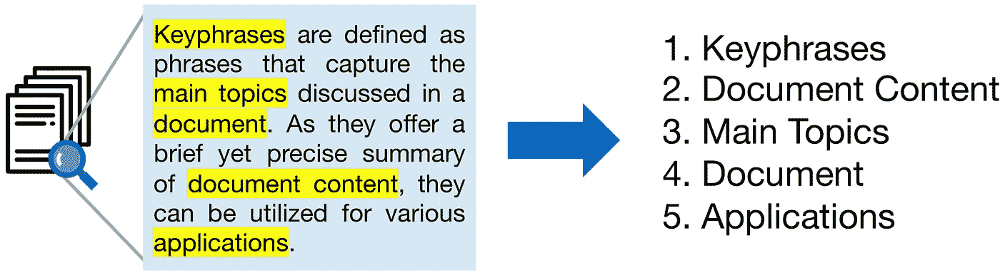
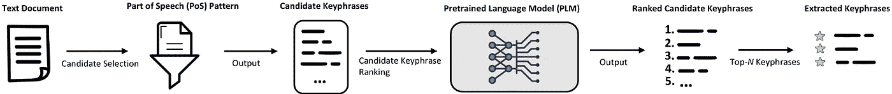
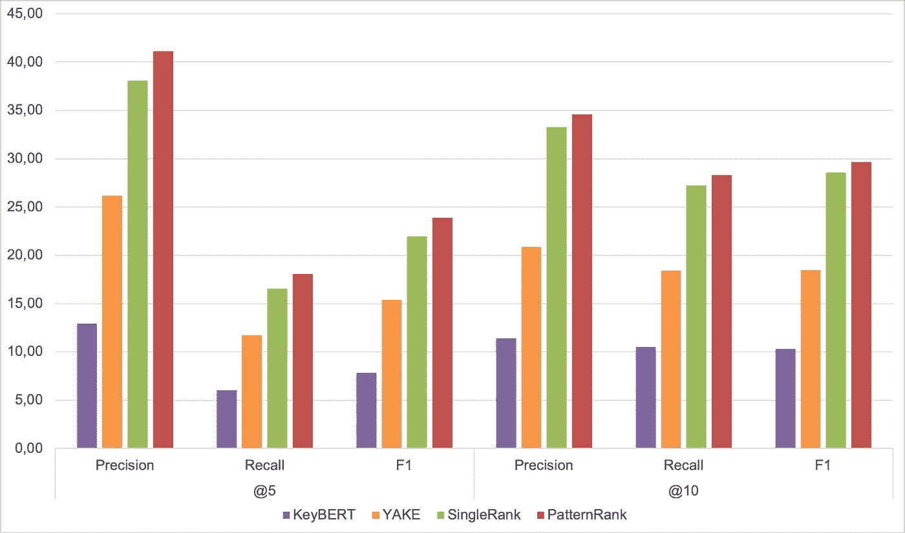

# 基于模式排序的无监督关键词抽取

> 原文：<https://towardsdatascience.com/unsupervised-keyphrase-extraction-with-patternrank-28ec3ca737f0>

## 使用预训练的变压器语言模型和词性进行最先进的关键短语提取

图片作者。

*本帖基于我们的论文*[*“pattern rank:利用预训练的语言模型和词性进行无监督的关键短语提取(2022)”*](https://arxiv.org/abs/2210.05245)*被 KDIR22 接受。您可以在那里阅读更多关于我们方法的详细信息。*

📑为了快速获得文本内容的概述，我们可以使用简明反映其语义上下文的关键短语。关键短语描述了一篇文章最重要的方面。与简单的关键字不同，关键短语不仅仅由单个单词组成，而是由几个复合词组成。如*《足球》*vs*《青少年足球训练》*。关键短语比简单的关键字提供了更准确的描述，因此通常是首选的，不依赖于标记的数据选择。

在这篇文章中，我们介绍了 **PatternRank** ，它利用预先训练的语言模型和词性从单个文档中进行无监督的关键短语提取。我们的方法不依赖于标记数据，因此可以很容易地用于各种不同的领域。我们的实验表明，PatternRank 比以前的方法具有更高的精度、召回率和 F1 值🏆。此外，我们还展示了[keyphrasevectors](https://github.com/TimSchopf/KeyphraseVectorizers)Python 包🐍，这允许容易地修改候选关键短语选择的词性模式，从而使我们的方法适用于任何领域。

# PatternRank 是如何工作的？

下图说明了 PatternRank 的一般关键短语提取过程👇。

**无监督关键短语提取的模式排序**方法。单个文本文档被用作初始过滤步骤的输入，在该步骤中，选择与定义的词性模式相匹配的候选关键短语。随后，基于候选关键短语与输入文本文档的语义相似性，通过预先训练的语言模型对候选关键短语进行排序。最后，提取前 N 个关键短语作为输入文本文档的简明反映。来源:[绍普夫等人](https://arxiv.org/abs/2210.05245)

为了从文本中提取关键短语， ***PatternRank 执行以下步骤:***

1.  输入由正在进行单词标记的单个文本文档组成。
2.  然后用词性标签对单词标记进行标记。
3.  其标签与先前定义的词性模式相匹配的记号被选为候选关键短语。
4.  然后，预训练的语言模型将整个文本文档以及所有候选关键短语作为语义向量表示来嵌入。
5.  随后，计算文档表示和候选关键短语表示之间的余弦相似度，并基于所计算的相似度得分以降序排列候选关键短语。
6.  最后，提取最能代表输入文档的前 N 个排序的关键短语。

在我们的实验中，我们使用预先训练的 [all-mpnet-base-v2](https://huggingface.co/sentence-transformers/all-mpnet-base-v2) 语言模型。这是一个 [SBERT](https://aclanthology.org/D19-1410/) 模型，已经被证明可以为语义相似性任务产生最先进的文本表示。对于这篇博文的范围，我们只使用简单的名词短语作为词性模式。尽管我们在[的论文](https://arxiv.org/abs/2210.05245)中表明，更复杂的词性模式可以带来更好的结果，但在模式排序中使用名词短语是一种简单而有效的方法，可以提取任何领域中有意义的关键短语🏅。

> 名词通常是指一件事或一个人。形容词是描述名词的词。名词短语是围绕一个名词构建的简单短语。它由零个或多个形容词后跟一个或多个名词组成。例如:一棵大树，一些五颜六色的糖果，巨大的皇家城堡。

# 模式排序与以前方法的比较

## 先前的关键短语提取方法

大多数流行的无监督关键短语提取方法可以被描述为基于统计、基于图或基于嵌入的方法，而 *Tf-Idf* 是用于评估的常见基线。在这篇文章中，我们针对三种非常流行的关键短语提取方法来评估 PatternRank。如果您对更多关键短语提取方法的详细比较感兴趣，请查看 Papagiannopoulou 和 Tsoumakas 的论文[(2019)](https://arxiv.org/abs/1905.05044)。

👉YAKE 是一种快速、轻量级的方法，用于基于统计特征从单个文档中无监督地提取关键短语。

👉 [SingleRank](https://aclanthology.org/C08-1122/) 对单词共现图应用排序算法，从单个文档中进行无监督的关键短语提取。

👉 [KeyBERT](https://github.com/MaartenGr/KeyBERT) 使用类似于 PatternRank 的预训练语言模型对候选关键短语进行排名。然而，KeyBERT 使用简单的单词 n-grams 作为候选关键短语，而不是像我们的 PatternRank 方法那样，使用匹配特定词性模式的单词标记。

> *单词 n 元语法范围让用户决定应该从给定文本中提取的连续单词序列的长度。假设我们定义了一个* `*word n-gram range = (1,3)*`。然后，我们将选择从文本中提取一元词(只有一个单词)、二元词(两个连续单词的组合)和三元词(三个连续单词的组合)。将单词 n-gram range 应用到 `*"an apple a day keeps the doctor away"*` *将得到* `*["an", "apple", "a","day", "keeps", "the", "doctor", "away", "an apple", "apple a", "a day", "day keeps", "keeps the", "the doctor", "doctor away", "an apple", "apple a day", "a day keeps", "day keeps the", "keeps the doctor", "the doctor away"]*` *。-* [***德维什帕马尔***](https://www.quora.com/What-is-the-n-gram-range)

为了评估，我们比较了 YAKE、SingleRank、KeyBERT 和 PatternRank 的性能。对于 KeyBERT 和 PatternRank，我们使用相同的预训练的 [all-mpnet-base-v2](https://huggingface.co/sentence-transformers/all-mpnet-base-v2) 语言模型。

## 数据

💾我们在 [Inspec 数据集](https://github.com/LIAAD/KeywordExtractor-Datasets#Inspec)上评估关键短语提取方法。它包括从 1998 年到 2002 年间的科学期刊文章中收集的 2000 篇英语计算机科学摘要。每个摘要都分配了两种不同类型的关键短语。首先，出现在 Inspec 数据集的词库中但不一定出现在摘要中的受控和手动分配的关键短语。第二，不受控制的关键短语，它们是由专业索引器自由分配的，并且不限于同义词库或摘要。在我们的实验中，我们认为这两种关键短语的联合就是黄金关键短语。

## 韵律学

我们基于精确匹配方法进行评估，这意味着真正的肯定是提取的关键短语与黄金关键短语之一具有精确的字符串匹配。我们报告 *Precision@N* 、 *Recall@N* 和 *F1@N* 得分，分别使用前 N 个提取的关键短语( *N=5，10* )。

## 结果

我们的评估结果如下图所示📊。

在 [Inspec 数据集](https://github.com/LIAAD/KeywordExtractor-Datasets#Inspec)上比较 KeyBERT、YAKE、SingleRank 和 PatternRank 关键短语提取结果。

结果显示，在所有基准测试中，PatternRank 优于所有其他方法。KeyBERT 使用与 PatternRank 相同的预训练语言模型对候选关键短语进行排序，但使用简单的 n 元语法来选择候选关键短语，而不是词性模式(在本例中为名词短语)。因此，KeyBERT 在所有方法中表现最差。正如所料，YAKE 是最快的关键短语提取方法，因为它是基于统计特征的轻量级方法。然而，提取的关键短语不是非常准确，并且与 PatternRank 相比，YAKE 在所有评估中的表现明显更差。SingleRank 是与 PatternRank 相比唯一能取得竞争结果的方法。然而，在所有评估中，它的表现始终比 PatternRank 差几个百分点。因此，我们得出结论，PatternRank 实现了最先进的关键短语抽取结果🏆。

# 如何使用 PatternRank？

我们开发了[keyphrasvectories](https://github.com/TimSchopf/KeyphraseVectorizers)Python 包🐍这使得**模式等级**易于使用。将[关键短语分解器](https://github.com/TimSchopf/KeyphraseVectorizers)与 KeyBERT 一起用于关键短语提取产生了[模式排序](https://arxiv.org/abs/2210.05245)方法。其思想是使用 KeyBERT 的实现，通过预训练的语言模型对关键短语进行排序，并利用来自[关键短语分析器](https://github.com/TimSchopf/KeyphraseVectorizers)的词性模式选择候选关键短语，从而产生**模式排序**方法。如何用 Python 实现这种方法在这篇博客文章中有详细的解释💡。

# 摘要

PatternRank 是最近开发的一种方法，可用于从文本文档中提取最先进的关键短语。评估显示，在所有基准测试中，PatternRank 在精确度、召回率和 F1 值方面表现最佳。此外，我们还展示了[keyphrasevectors](https://github.com/TimSchopf/KeyphraseVectorizers)Python 包🐍，这使得 PatternRank 易于使用和定制。

也非常感谢[马腾·格罗腾多斯特](https://www.maartengrootendorst.com/)，他在我们编写[keyphrasevectors](https://github.com/TimSchopf/KeyphraseVectorizers)包时给了我们输入和灵感。

# 来源

   