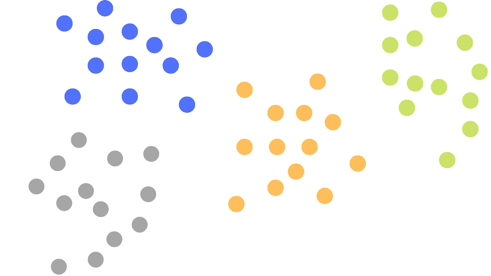
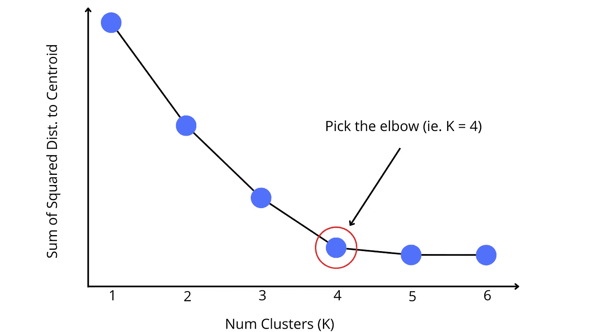
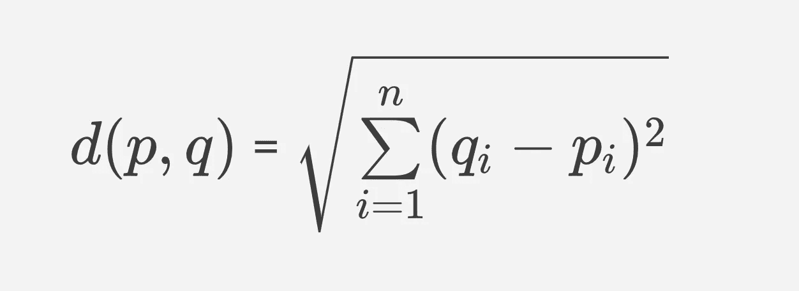
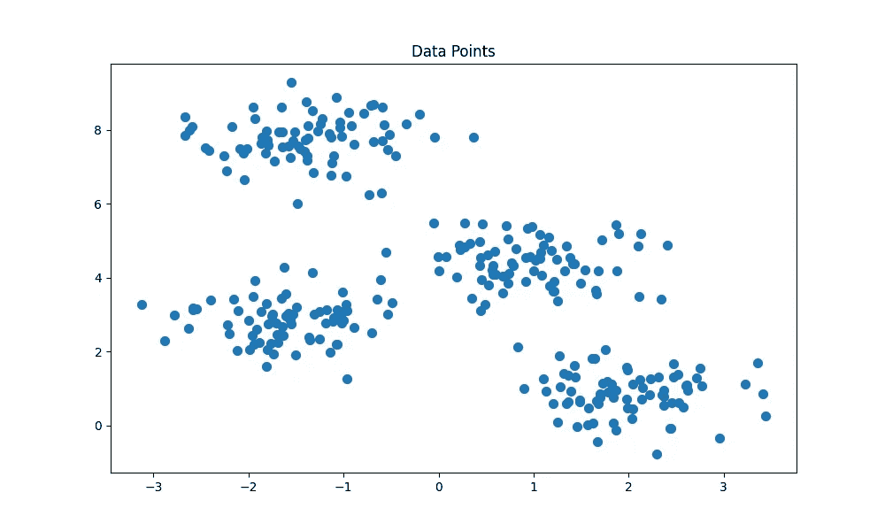
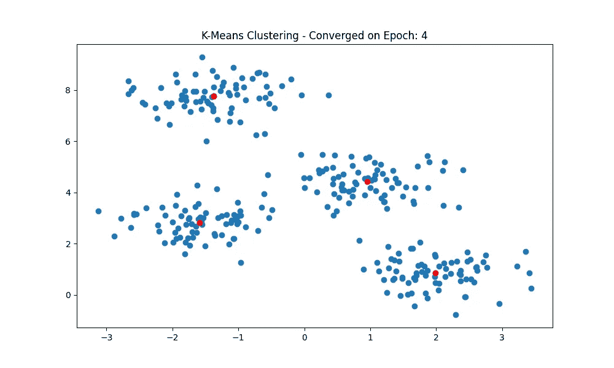
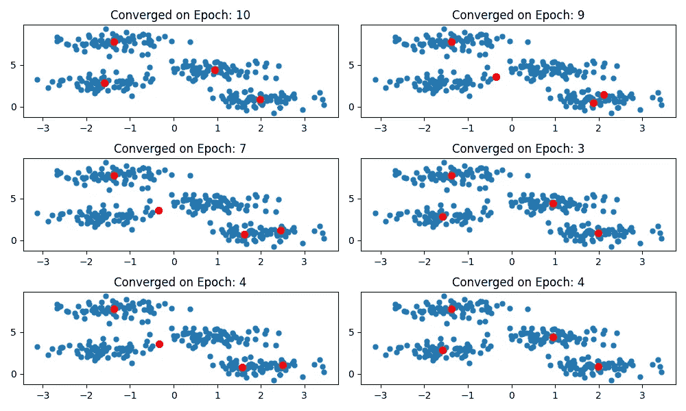
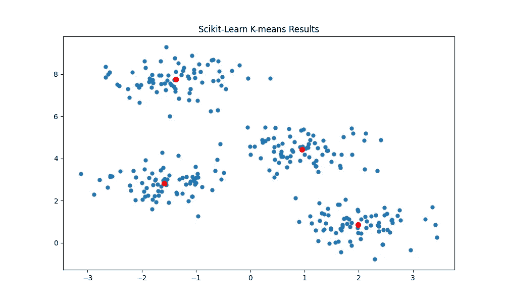

# 无监督学习:K-均值聚类

> 原文：<https://towardsdatascience.com/unsupervised-learning-k-means-clustering-27416b95af27>

## 最快最直观的无监督聚类算法。

群集图像-按作者

在本文中，我们将介绍 k-means 聚类算法。我们将首先开始研究算法是如何工作的，然后我们将使用 NumPy 实现它，最后，我们将研究使用 Scikit-learn 实现它。

# **简介**

K-means 聚类是一种无监督算法，它将未标记的数据分组到不同的聚类中。标题中的 K 代表将要创建的集群数量。这是在模型训练之前应该知道的事情。例如，如果 K=4，那么将创建 4 个集群，如果 K=7，那么将创建 7 个集群。k-means 算法用于欺诈检测、错误检测和确认现实世界中的现有聚类。

该算法是基于质心的，这意味着每个数据点都被分配给质心最近的聚类。当我们使用欧几里德距离计算到质心的距离时，该算法可以用于任何数量的维度。下一节将详细介绍这一点。

k-means 算法的优点是易于实现，可以扩展到大型数据集，总是能够收敛，并且适合不同形状和大小的聚类。该模型的一些缺点是聚类的数目是手动选择的，聚类依赖于初始值，并且对异常值敏感。

## k-均值步长

训练 K 均值模型的步骤可以分为 6 个步骤。

**第一步:确定聚类数(K=？)**

如果在模型训练之前就知道 K 是最好的，但是如果不知道，也有找到 K 的策略。最常见的是肘方法，它随着 K 的增加绘制平方距离的总和。通过观察该图，应该有一个点，在该点处，增加聚类的大小为误差函数提供了最小的增益。这就是所谓的弯头，应该选择它作为 k 的值。如下图所示。

弯头方法图形-作者

**第二步:初始化集群质心**

下一步是初始化 K 个质心作为每个簇的中心。最常见的初始化策略称为 Forgy 初始化。这是每个聚类的质心作为数据集中的随机数据点初始化的时候。这比随机初始化收敛得更快，因为聚类更可能出现在数据点附近。

像 k-means++初始化这样更复杂的策略旨在选择彼此尽可能远的初始点。这种策略已被证明是 k-means 算法的最佳初始化方法。你可以在这里看到 k-means++背后的数学。

**步骤 3:将数据点分配给聚类**

在初始化 K 个聚类之后，每个数据点被分配给一个聚类。这是通过迭代数据中的所有点并计算到每个质心的欧几里德距离来完成的。欧几里德距离公式适用于 n 维欧几里德空间中的任意两点。这意味着具有任意维数的数据点被分配给最近的聚类。

欧几里德距离公式—作者

**步骤 4:更新群集质心**

一旦每个数据点被分配到一个聚类，我们就可以更新每个聚类的质心。这是通过取聚类中每个数据点的平均值并将结果指定为聚类的新中心来实现的。

**第五步:迭代更新**

然后，使用新计算的质心，我们遍历所有的数据点，并将它们重新分配给聚类，并重新计算质心。重复进行此操作，直到质心值不再变化。

k-means 算法的美妙之处在于它保证收敛。这是一个祝福也是一个诅咒，因为模型可能会收敛到局部最小值而不是全局最小值。这个想法将在下一节中说明，在下一节中，我们使用 Numpy 实现该算法，然后在 Scikit-learn 中实现。

# **K-Means: Numpy**

首先，我们将导入必要的 python 包，并使用 Scikit-learn 的 make_blob 函数创建一个二维数据集。对于本文，我们将生成分布在 4 个集群中的 300 个数据点。生成的数据如下所示。

数据示例—按作者

我们可以看到样本中有 4 个不同的聚类，每个聚类中的外围数据点之间有轻微的重叠。接下来，我们将启动两个哈希映射。一个将跟踪聚类质心，另一个将跟踪每个聚类中的数据点。

既然质心已经初始化，我们将定义另外三个函数。第一种方法接收两个数据点，并计算欧几里德距离。第二个函数更新每个聚类的质心，最后一个函数为每个聚类分配数据点。

最后三个函数通过提供一种方法来检查模型是否收敛，拥有一个主训练函数，并可视化模型结果，从而将所有这些放在一起。

因此，将上面的所有函数放在一起，我们可以训练模型，并在两行代码中可视化我们的结果。通过使用函数式编程实现算法，我们能够使代码可读，限制重复，并促进代码的改进。

k-均值结果—按作者

在上面的模型训练中，我们看到模型能够在 4 个时期后收敛，并正确识别我们生成的聚类。这很好，但是生成的簇的结果高度依赖于初始的质心。如果我们用不同的初始质心训练模型多次，我们可以看到模型如何在不同的训练周期收敛到不同的最小值。这就是 K-means++初始化有用的地方，因为它增加了收敛到全局最小值的可能性。

太好了！现在我们能够从头开始实现 k-means 算法，但是这在现实世界中可行吗？不完全是。在现实世界中，您更可能使用现有的模型库，如 Scikit——学习训练、测试和部署模型。

# K-Means: Scikit-Learn

使用现有库的好处是它们被优化以减少训练时间，它们通常带有许多参数，并且它们需要更少的代码来实现。Scikit-learn 还包含许多其他的机器学习模型，并且使用一致的语法来访问不同的模型。

在下面的单元格中，我们实现了与上面相同的 k-means 聚类算法，除了默认情况下我们使用 k-means++初始化质心。所有这些都是在不到 20 行代码中完成的！

sci kit-学习结果—按作者

正如预期的那样，我们能够正确地识别 4 个集群。当 Scikit-learn 实现使用 kmeans++初始化起始质心时，该算法几乎在每次重新运行训练周期时都收敛到全局最小值。

## 最后的想法

K-means 是一种易于实现的无监督聚类算法，几乎不需要任何时间就可以进行训练。由于该模型通过最小化数据点与其相应聚类之间的距离之和来训练，因此它可与其他机器学习模型相关。

这篇文章的代码可以在这里找到。

**资源**

1.  [k means 的利与弊——谷歌](https://developers.google.com/machine-learning/clustering/algorithm/advantages-disadvantages)
2.  [k 意味着初始化方法— Nitish Kumar Thakur](https://medium.com/analytics-vidhya/comparison-of-initialization-strategies-for-k-means-d5ddd8b0350e)
3.  [Scikit-Learn Kmeans 文档](https://scikit-learn.org/stable/modules/generated/sklearn.cluster.KMeans.html)
4.  [肘法—百科](https://en.wikipedia.org/wiki/Elbow_method_(clustering))
5.  [k 均值聚类—Java point](https://www.javatpoint.com/k-means-clustering-algorithm-in-machine-learning)
6.  [StackEdit 降价编辑](https://stackedit.io/app#)