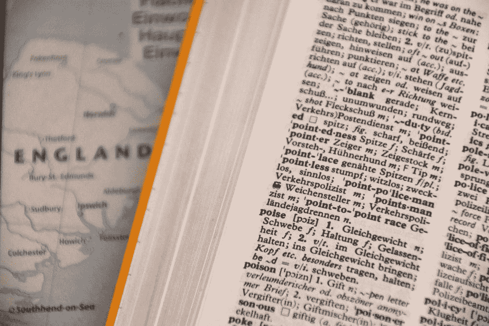
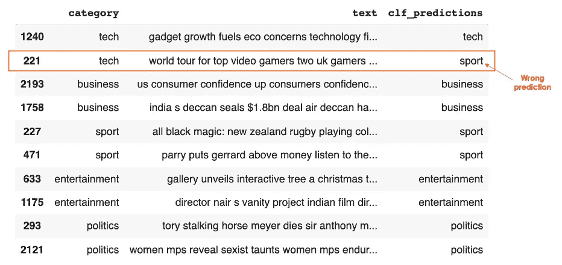
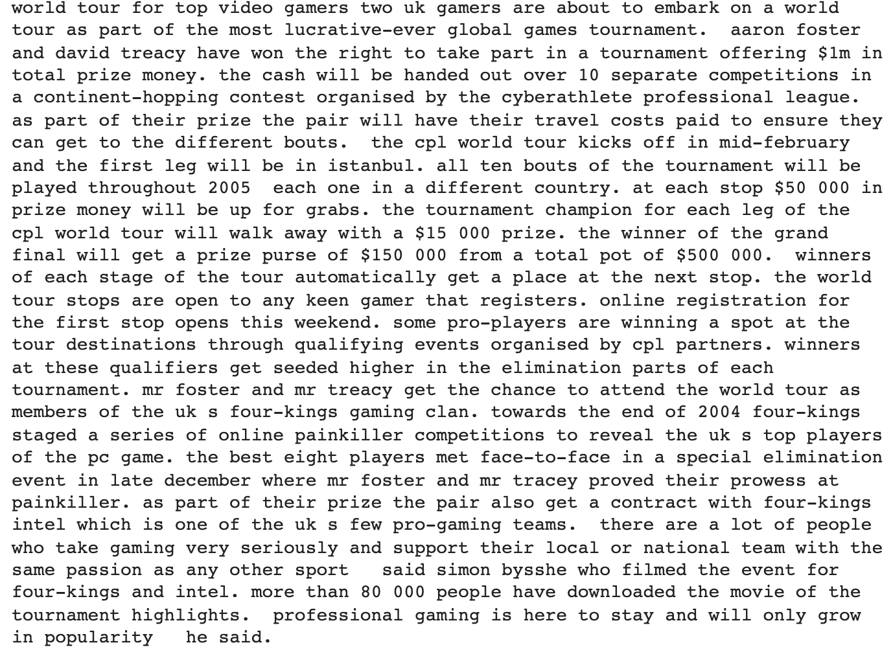
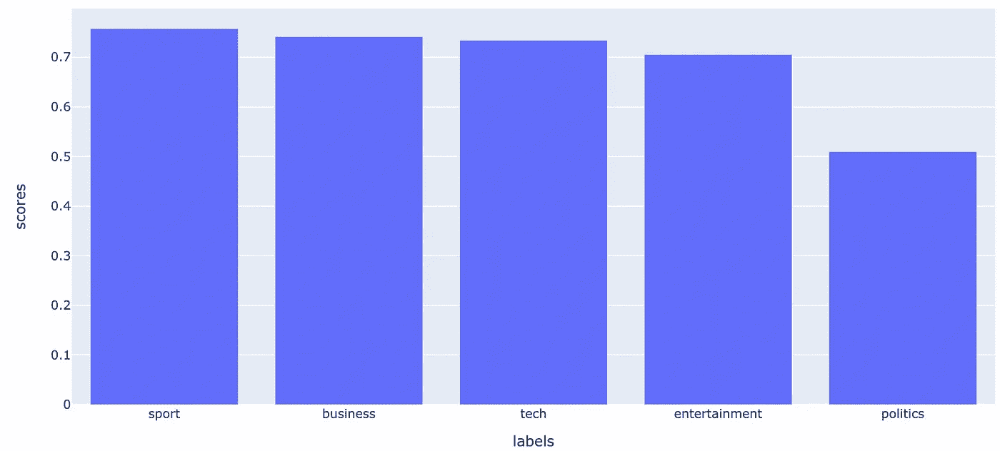
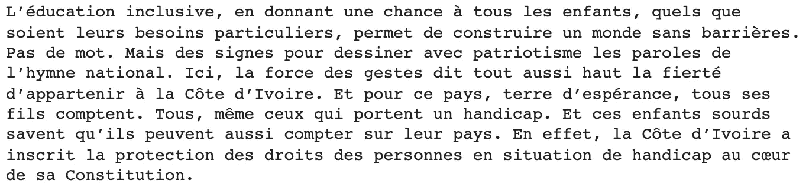
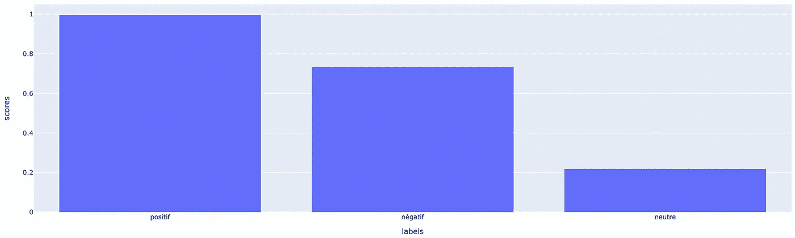

# 基于零触发方法的无监督多语言文本分类

> 原文：<https://towardsdatascience.com/unsupervised-multilingual-text-classification-with-zero-shot-approach-e65bd79b5d0>

## 这篇文章是使用拥抱脸变形金刚的综合概述🤗执行零射击分类



由[瓦尔德马·布兰德](https://unsplash.com/@waldemarbrandt67w)在 [Unsplash](https://unsplash.com/photos/U3Ptj3jafX8) 拍摄的照片

# 介绍

大多数时候，当我们训练一个机器学习模型时，所有的候选标签/目标都是事先知道的，这意味着如果你的训练标签是**科学**、**政治**、**教育**，你将无法预测**医疗保健**标签，除非你重新训练你的模型，考虑到那个标签和相应的输入数据。在本文中，我将介绍我认为是多语言自然语言处理领域中最强大的无监督技术之一:`**Zero-Shot-Classification**`

## 零射击分类——是什么？

这种方法使得在没有看到任何候选标签的情况下预测文本的目标成为可能。

根据[介绍 colab](https://colab.research.google.com/drive/1jocViLorbwWIkTXKwxCOV9HLTaDDgCaw?usp=sharing) :

> 底层模型是在自然语言推理(NLI)任务上训练的，它接受两个序列，并确定它们是否相互矛盾、相互依赖或者都不存在。
> 
> 这可以通过将我们想要分类的序列视为一个 NLI 序列(称为前提)并将一个候选标签变成另一个标签(假设)来适应零射击分类的任务。如果模型预测，构建的前提需要假设，那么我们可以把它作为标签应用于文本的预测。

# 实验

大多数研究都集中在英语上，这使得大多数方法在英语数据上比其他语言更有效。在一个有 6000 多种不同语言的世界中设计工具时，这可能是一个负担。

这个课题已经吸引了研究界好几年，结果相当令人鼓舞。我们的实验将利用乔·戴维森的 XNLI 罗伯塔大型 XNLI 模型的力量。除了对英语非常有效之外，它对相当多的语言也很有效，如法语、西班牙语、德语、斯瓦希里语、乌尔都语等。

简单来说，实验将基于两种主要语言，英语和法语，分别在 [**BBC 新闻数据**](https://www.kaggle.com/balatmak/newsgroup20bbcnews) 和[**Ecole Media CI**](https://www.ecolemedia.ci/actualite/voir_actualite/education-inclusive-le-gouvernement-en-action-pour-une-education-de-qualite-aux-enfants-a-deficience-sensorielle-1257.html)**网站摘录；和的数据都是**两者免检**。还有，文中用到的所有源代码在我的 [**Github**](https://github.com/keitazoumana/Medium-Articles-Notebooks/blob/main/Zero_Shot_Classification_Multi_Lingual.ipynb) 上都有。**

## **先决条件**

**确保安装转换器并导入成功实验所需的库。**

**实验 _ 预准备. py**

**考虑到多语言方面，下面的表达式用于实例化我们的模型。**

**zsmlc_classifier.py**

*   **`zsmlc_classifier`用于零触发多语言分类器。将`model`参数初始化为`joeddav/xlm-roberta-large-xnli`，以便下载预先训练好的多语言模型。**

## **让我们深入分类**

**分类任务使用三个主要参数，它们是**

*   **`sequences`对应要预测的文本/序列。**
*   **`candidate_labels`是我们需要预测的所有候选标签的列表。请记住，这些标签不需要预先知道模型。**
*   **`multi_class` 是二进制值。如果我们要进行多类分类，则 ***为真*** ，在这种情况下，所有的预测概率将是独立的，意味着每个值都在 0 和 1 之间，总和不一定是 1。如果为 False，则概率得分之和为 1。**

****了解单个预测的输出****

**这里的目标是帮助您理解单个预测的输出格式，这对于更好地理解其余部分是必不可少的。**

**显示输出格式**

```
{'labels': ['tech', 'entertainment', 'business', 'sport', 'politics'],  
'scores': [0.8140193223953247,   0.802348256111145,   0.791598916053772,   0.7419557571411133,   0.7163865566253662],  'sequence': 'tv future in the hands of viewers...they want [truncated]
```

**输出是一个包含三个主键的字典:**

*   ***标签*:用于预测的所有候选标签列表。**
*   ***分数*:标签对应的概率分数列表。而我们可以看到，文中已经预测为 ***科技*** (81%信心) ***娱乐*** (80%信心) ***商业*** (79%信心) ***体育*** (74%信心)，以及 ***政治*** (71%信心)。**
*   ***序列*:用于预测的原始序列/文本。为了不显示全部信息，这部分内容被故意截断了。**

**为了用[](https://plotly.com/)**对之前的预测有一个很好的图形化可视化，我们使用两个感兴趣的关键字将结果转换成熊猫数据帧:*标签*和*分数*列。****

****绘图 _ 结果. py****

********

****图 1:预测为 81%可信技术的序列(图片由作者提供)****

****现在我们已经了解了预测格式，让我们通过对一批文本/描述进行预测来进一步分析。****

******案例 1:英语文本的分类******

****本例中的说明是通过使用原始数据的子集来实现的，这样处理速度会更快。为此，我随机对五个标签中的每一个进行了 2 次观察，总共 10 次观察。****

****已经实现了以下帮助器功能:****

*   ****`make_prediction`为了从模型预测中返回概率得分最高的标签。****
*   ****`run_batch_prediction`用于对用户提供的数据集的所有观测值进行预测。****

****实用程序 _ 功能. py****

****最后，我们可以使用下面的表达式执行批量预测，以了解模型的执行情况。****

****run_batch_prediction.py****

********

****图 2:对 10 条随机 BBC 新闻的批量预测(图片由作者提供)****

****从上表中，我们可以观察到，除了第 221 行中的一个预测外，该模型的所有预测都是正确的，被预测为 ***sport*** 而不是 ***tech*** 。让我们看看相应的文本/描述以及所有候选标签的预测概率得分。****

*   ****这是已经分类的原文****

********

****图 3:模型预测的原始文本(图片由作者提供)****

*   ****这是模型的预测****

********

****图 4:预测为 75%置信度的运动的序列(图片由作者提供)****

****我们可以观察到，文中已经预测到 75% ***体育*** ，74% ***商业*** ，74% ***科技*** ，70% ***娱乐*** ，50% ***政治*** 。通读全文，我们可以同意，它确实主要是关于 ***科技*** 而不是其他类别。****

******案例 2:对法文文本的分类******

****我们将以不同的方式处理这个问题。我们将尝试执行情感分类任务，而不是定义主题，这意味着我们将预测下面的文本是正极性、负极性还是中性。****

********

****图片 5:这个摘录没有获得 [Ecolemedia.ci](https://www.ecolemedia.ci/actualite/voir_actualite/education-inclusive-le-gouvernement-en-action-pour-une-education-de-qualite-aux-enfants-a-deficience-sensorielle-1257.html) 的许可(图片由作者提供)****

********

****图片 5:法语序列被预测为“positif”(英语中为阳性)，置信度为 99%(图片由作者提供)****

****该模型以 99% 的置信度预测先前文本为 ***阳性。对于懂法语的人来说，我们可以同意这个预测是完全准确的。*******

# ****结论****

****从之前的用例来看，毫无疑问，零镜头分类对于无监督的文本分类来说是一场革命。它提供了更大的灵活性，并展示了迁移学习对更一般数据的所有威力。然而，当你在处理一个特殊的商业问题(如生物、金融等)时，使用监督培训方法可能更好。).不要犹豫，试一试，不要忘记继续学习！****

****关注我的 YouTube[了解更多互动内容！](https://www.youtube.com/channel/UC9xKdy8cz6ZuJU5FTNtM_pQ)****

# ****额外资源****

****[Github 上的源代码](https://github.com/keitazoumana/Medium-Articles-Notebooks/blob/main/Zero_Shot_Classification_Multi_Lingual.ipynb)****

****乔·戴维森的 XNLI 罗伯塔大型 XNLI****

****[零镜头文本分类的新管道](https://discuss.huggingface.co/t/new-pipeline-for-zero-shot-text-classification/681)****

****[全纳教育:政府致力于为感官障碍儿童提供优质教育](https://www.ecolemedia.ci/actualite/voir_actualite/education-inclusive-le-gouvernement-en-action-pour-une-education-de-qualite-aux-enfants-a-deficience-sensorielle-1257.html)****

****BBC 新数据 Kaggle(T3)****

****曲名 : Bye For Now↓↓****