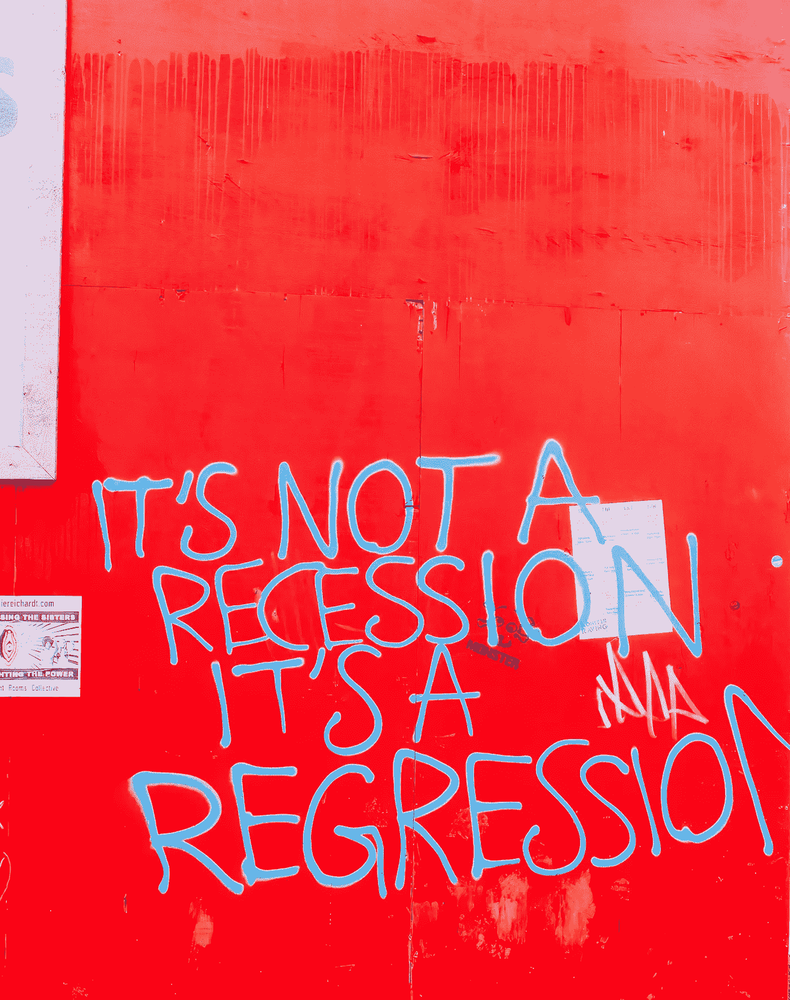
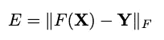
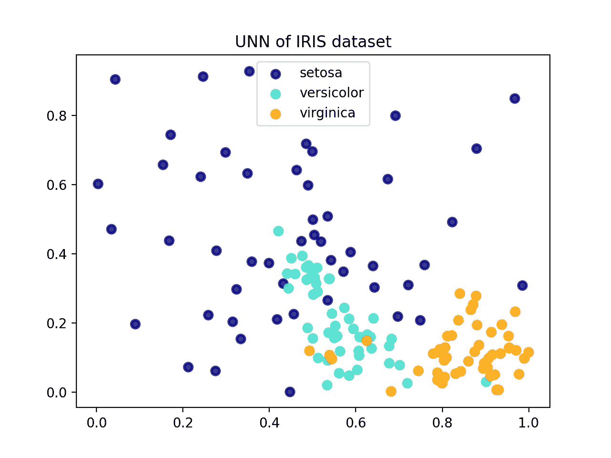

# 无监督回归降维

> 原文：<https://towardsdatascience.com/unsupervised-regression-for-dimensionality-reduction-88bd80bda4bf>

## 使用回归计算低维嵌入

图片由[安妮·斯普拉特](https://unsplash.com/@anniespratt)在 [Unsplash](https://unsplash.com)

每个数据科学和人工智能的一年级学生都知道回归是一种监督学习方法。最初这是正确的，但是我们可以通过无监督回归[1]将事情颠倒过来进行降维。在降维中，我们寻找高维数据的低维嵌入。对于可视化或预处理等特定目的，任务是找到满足距离、密度和邻域保持等约束的低维嵌入。例如，数据空间中的紧密模式应该在低维空间中有紧密的对应关系，而不同模式的嵌入应该相距很远。

# 无监督回归

对于无监督回归，我们需要允许映射到多维标签空间的回归方法。例子是最近邻回归和核回归，即 Nadaraya-Watson 估计量。回归方法从低维潜在空间映射到高维数据空间。问题变成了:低维模式如何映射到高维模式？

想象一下，我们使用核回归从 2 维潜在空间映射到 N 维数据空间。任务是将随机选择的*n*2*2*-维点***x****=****x****【₁,…】，****x****(我们不知道但想得到)用内核回归到*n*-维空间，让优化问题是最小化重建数据***y****=****y****【₁,…】，****y****【ₙ】*我们寻求嵌入，即最小化数据空间重建误差:*

**

*通过改变 *X* 。这里使用的范数是 Frobenius 范数，它是一个矩阵的所有元素之和的平方根。*

*如何改变 ***X*** 使 *E* 最小化？答案是:通过梯度下降或者随机抽样。例如，无监督核回归(UKR) [1]使用梯度下降。具有高斯核的核回归方程是可导的。基于数据空间重构误差 *E* ，可以导出 UKR 的梯度，并在潜在空间 ***X*** 中执行梯度下降。UKR 将主要获得降维结果中的模式密度信息，因为核回归是一种基于密度的方法。空间中图案周围的密度越高，其对预测的贡献就越大。在 UKR 的情况下，模型必须被正则化以避免过度拟合。否则，模型只能重建模式，而没有任何归纳能力。*

# *简单的例子*

*我们在这里更详细地看一个简单的例子是无监督最近邻(UNN) [2]，它基于随机采样而不是梯度下降。k-最近邻用于在潜在空间中以随机采样的方式逐个模式地嵌入数据。让我们假设我们希望我们的嵌入存在于空间 *[0，1】。*第一图案 ***y*** *₁* 嵌入任意位置，例如潜在空间的中间(0.5，0.5)。每个新的图案****y****ᵢ*都是通过随机采样*【0，1】*中的 *ν* 点，并选择图案重构误差最小的 ***x*** *** ，即*与基于**的最近邻预测之差来嵌入的*****

***在 Python 中，UNN 的代码如下所示，使用 scikit-learn 中的 *KNeighborsregressor* 进行 K 近邻预测。***

**在著名而简单的 IRIS 数据集上，该脚本生成了以下嵌入，参见图 1。嵌入的颜色基于类别标签，表明 UNN 将不同的类别区分开来，几乎没有例外。**

****

**图 1:嵌入 UNN 虹膜数据集，K=2，使用 Scikit-learn 虹膜样本脚本进行绘图**

# **结论**

**无监督回归不仅是一种有趣的用于解决降维问题的回归变体，而且还被证明能够产生良好的嵌入。结果取决于所采用的回归方法的特征:最近邻将一个模式放置在已经嵌入的模式的邻域中。核回归考虑了相邻模式的密度信息。核 PCA、ISOMAP、LLE、T-SNE 和自动编码器等经典的降维竞争对手始终是不错的选择，但对于下一个嵌入任务，您可能希望尝试无监督回归。**

***除特别注明外，所有图片均为作者所有。***

# **参考**

**[1] P. Meinicke，S. Klanke，R. Memisevic，H. J. Ritter，无监督核回归的主表面。IEEE Trans。模式分析与机器智能 27(9):1379–1391(2005)**

**[2] O. Kramer，无监督最近邻回归降维，软计算 19(6):1647–1661(2015)**