# IMDB 评论的无监督语义情感分析

> 原文：<https://towardsdatascience.com/unsupervised-semantic-sentiment-analysis-of-imdb-reviews-2c5f520fbf81>

# IMDB 评论的无监督语义情感分析

## 一个捕捉情感复杂性和文本主观性的模型

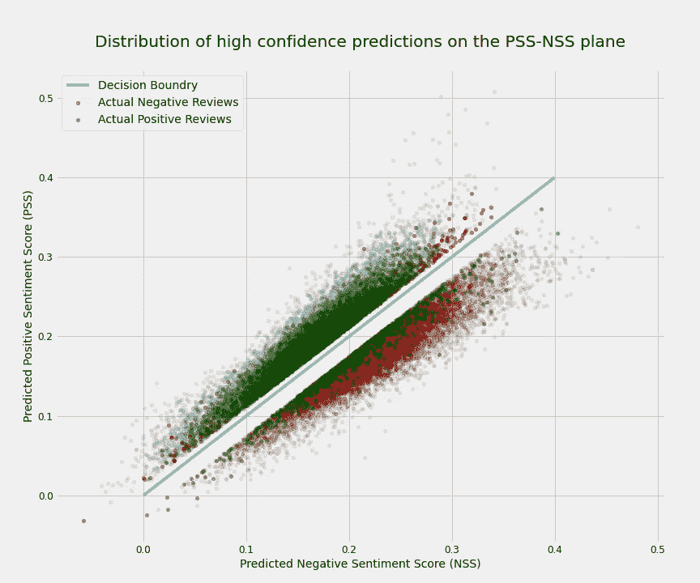

*作者图片*

## 目录

[**1。简介**](#af0e)[**2。数据预处理**](#c2a1)[**3。监督车型**](#b15b)[**4。无监督方法**](#d4bf)[**5。**进一步分析](#688d)

```
**Note**: The Github repository of this project can be found [here](https://github.com/towardsNLP/IMDB-Semantic-Sentiment-Analysis/tree/main/Word2Vec).
```

# 1.介绍

## 问题概述

情感分析，也称为观点挖掘，是自然语言处理(NLP)的典型应用，广泛用于分析给定句子或语句的整体效果和潜在情感。情感分析模型以其最基本的形式将文本分类为积极的或消极的(有时是中性的)情感。因此，最成功的方法自然是使用监督模型，这种模型需要大量的标记数据来训练。提供这种数据是一个昂贵和耗时的过程，在许多情况下是不可能的或不容易获得的。此外，这种模型的输出是暗示文本与我们在训练期间提供的正面例子有多相似的数字，并且不考虑细微差别，例如文本的情感复杂性。

依靠我在文本的仔细阅读和定性分析方面的背景，我提出了一种无监督的语义模型，该模型捕捉文本的整体情感，同时提供了一种在保持高性能的同时分析文本中情感的极性强度和复杂性的方法。

为了演示这种方法，我使用了著名的 IMDB 数据库。斯坦福大学[向公众发布了这个数据集，它是来自 IMDB 的 5 万条评论的集合，包含偶数条正面和负面评论，每部电影不超过 30 条评论。如数据集介绍注释中所述，“负面评价的得分≤ 4 分(满分 10 分)，正面评价的得分≥ 7 分(满分 10 分)。中立评论不包含在数据集中。](http://ai.stanford.edu/~amaas/data/sentiment/)

该数据集由安德鲁·马斯(Andrew Maas)编制，并在本文中首次介绍:安德鲁·马斯、雷蒙德·戴利、彼得·范、黄丹、安德鲁·吴和克里斯托弗·波茨。(2011).[学习用于情感分析的词向量。](https://ai.stanford.edu/~amaas/papers/wvSent_acl2011.pdf) *计算语言学协会第 49 届年会(ACL 2011)。*数据集可以从这里获得: [IMDb 评论](http://ai.stanford.edu/~amaas/data/sentiment/)。

## 导入必要的库

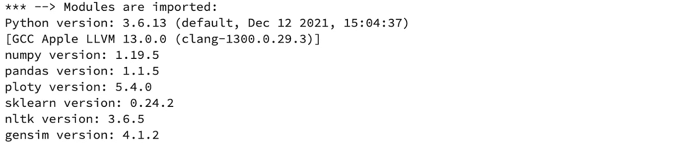

## 导入 IMDB 数据

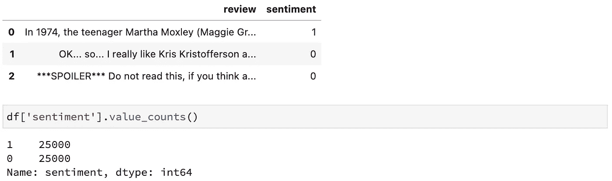

# 2.数据预处理

## 实用模块

`[w2v_utils](https://github.com/TextualData/IMDB-Semantic-Sentiment-Analysis/blob/main/Word2Vec/src/w2v_utils.py)`模块包含了 post 中多处使用的所有通用函数和类。下面是从 [Word2Vec/src/w2v_utils](https://github.com/TextualData/IMDB-Semantic-Sentiment-Analysis/blob/main/Word2Vec/src/w2v_utils.py) 导入的函数和类的列表

`Tokenizer`类将处理所有的标记化任务，并使我们能够使用不同的标记化选项。这个类有以下布尔属性:`clean`、`lower`、`de_noise`、`remove_stop_words`和`keep_neagation`。所有属性默认为`True`，但是您可以更改它们来查看不同文本预处理选项的效果。默认情况下，该类去除文本的噪声(删除 HTML 和 URL 组件)，将文本转换为小写，清除文本中的所有非字母数字字符，并删除停用词。这里的一个细微差别是否定停用词，如“不是”和“不”。否定词被认为是*情感转换器*，因为它们经常以相反的方向改变句子的情感(关于“否定和情感”的更多信息，请参见刘兵，【情感分析:挖掘观点、情感和情绪，剑桥大学出版社 2015 年，第 116-122 页)。如果`keep_neagation`为“真”，标记器会将否定标记附加到下一个标记，并在移除停用词之前将它们视为单个单词。对于我们在本帖中使用的模型，我们不需要将我们的评论分成句子，整个评论立刻就被标记化了。现在，让我们实例化记号赋予器，并在一个例子上测试它。

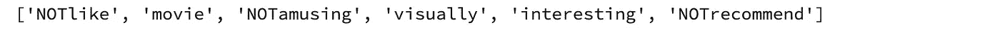

现在我们可以标记所有的评论，并快速查看一些关于评论长度的统计数据。

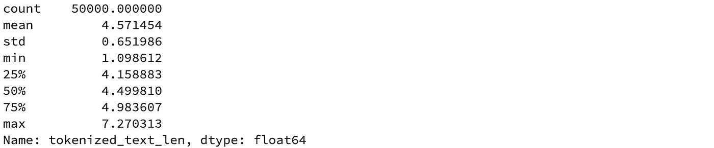

输出

最后，我们将数据分解成训练和测试，然后再进一步。

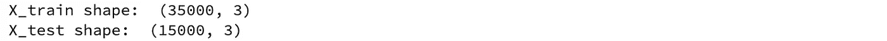

# 3.监督模型

让我们首先建立一个监督基线模型，以便稍后比较结果。有监督的情感分析本质上是一个分类问题，根据文档的情感效果将文档分为两类或更多类。值得注意的是，通过在我们的分析中选择文档级粒度，我们假设每个评论只包含评论者对单个产品(例如，电影或电视节目)的意见。因为当一个文档包含不同的人对单个产品的意见或者评论者对各种产品的意见时，分类模型不能正确地预测文档的总体情绪。

和往常一样，第一步是将评论转换成特征向量。我为这一部分选择了词频袋作为文本矢量化的简单而强大的基线方法。Frequency Bag-of-Words 为每个文档分配一个向量，该向量具有我们语料库中的词汇大小，每个维度代表一个单词。为了构建文档向量，我们用文档中相应单词的出现频率填充每个维度。所以很明显，大部分文档向量会非常稀疏。为了构建向量，我在我们的训练集上安装了 SKLearn 的‍‍ `CountVectorizer‍`,然后用它来转换测试集。在对评论进行矢量化之后，我们可以使用任何分类方法来构建情感分析模型。我试验了几个模型，发现一个简单的逻辑回归非常有效(关于 IMDB 上最先进的情绪分析列表，见[paperswithcode.com](https://paperswithcode.com/sota/sentiment-analysis-on-imdb))。

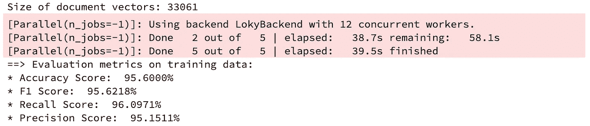

现在让我们看看模型在测试数据集上的表现:

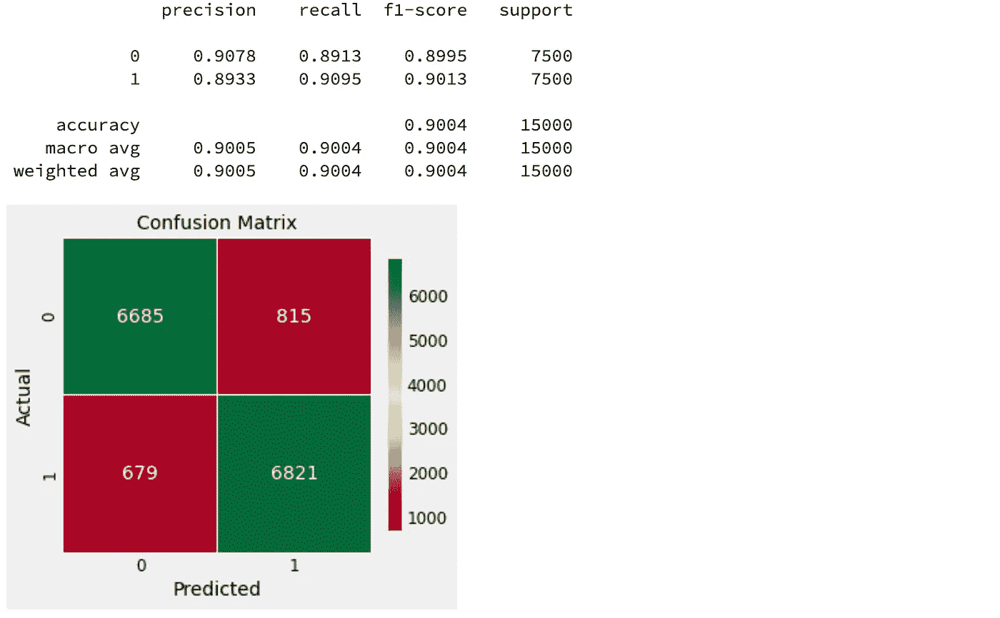

# 4.无监督方法

在解决了基础问题之后，我们现在可以继续这篇文章的主旨，即情感分析的无监督方法，从现在开始我称之为语义相似性分析(SSA)。在这种方法中，我首先使用所有评论训练一个单词嵌入模型。这个嵌入空间的特点是，这个空间中词与词之间的相似度(这里是余弦相似度)是其语义相关度的度量。接下来，我将选择两组在电影评论上下文中表达积极和消极情绪的单词。然后，为了预测评论的情感，我们将计算文本在单词嵌入空间中与这些正面和负面集的相似性，并查看文本最接近哪种情感。

## 训练单词嵌入模型

在深入讨论细节之前，我们先来训练一下单词嵌入模型。[由 Mikolov 等人于 2013 年发表](https://arxiv.org/pdf/1301.3781.pdf)，单词嵌入的引入是自然语言处理中的一项改变游戏规则的进步。这种方法有时被称为 word2vec，因为该模型将单词转换为嵌入空间中的向量。我用 gensim 包来训练 wordd2vec 模型。由于我们不需要将数据集分为训练和测试两部分来构建无监督模型，因此我在整个数据上训练模型。我还设置了嵌入维数为 300。

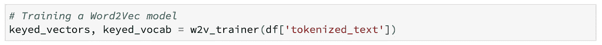

## 定义负集和正集

选择正负集没有唯一的公式。然而，我在我们新训练的嵌入空间中检查了与单词“好”和“坏”最相似的单词，以有一个起点。结合我对上下文的判断，我列出了以下清单:

*   `positive_concepts` = ['优秀'，'牛逼'，'酷'，'体面'，'了不起'，'强'，'好'，'伟大'，'有趣'，'娱乐']
*   `negative_concepts` = ['可怕的'，'糟糕的'，'恐怖的'，'无聊的'，'糟糕的'，'令人失望的'，'虚弱的'，'可怜的'，'毫无意义的'，'令人困惑的']

请注意，我们应该确保所有的`positive_concepts`和`negative_concepts`在我们的 word2vec 模型中都有表示。

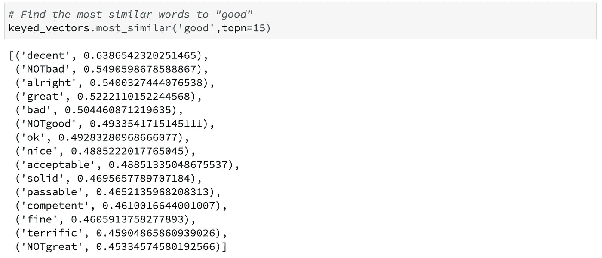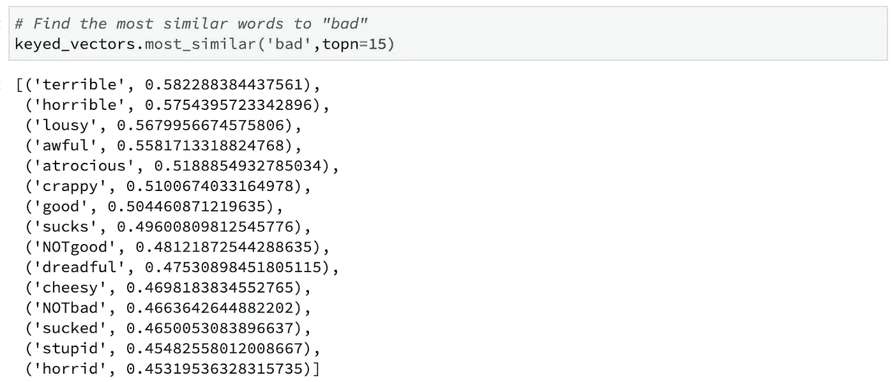

## 计算评论的语义情感

正如我们之前提到的，为了预测评论的情绪，我们需要计算它与我们的负面和正面集的相似度。我们将这些相似性分别称为负面语义得分(NSS)和正面语义得分(PSS)。有几种方法可以计算两个单词集合之间的相似度。最常见的方法之一是通过对文档的单词向量进行平均来构建文档向量。这样，我们将有一个向量用于每个评论，两个向量代表我们的积极和消极的集合。PSS 和 NSS 可以分别通过回顾向量和正负向量之间的简单余弦相似性来计算。我们姑且称这种方法为*整体语义情感分析* ( **OSSA** )。

然而，对文档中的所有单词向量进行平均并不是构建文档向量的最佳方式。考虑一个有 100 个单词的文档。该文档中的大多数单词是所谓的粘合单词，它们对文档的意义或情感没有贡献，而是用来保持文本的语言结构。这意味着，如果我们对所有的单词进行平均，有意义的单词的效果将会被粘合单词降低。

为了解决这个问题，我假设一个单词与文档的相似度等于它与文本中前 n 个最相似单词的相似度的平均值。然后，我将为我的正面和负面集合中的每个单词计算相似度，并进行平均，以获得正面和负面得分。换句话说，为了估计评论的正面分数，我计算正面集中的每个单词与评论中所有单词的相似度，并保留每个正面单词的 top_n 最高分数，然后对所有保留的分数进行平均。这种方法可以被称为 *TopN 语义情感分析*(**topsa**)。

在计算正负分数后，我们定义

`semantic_sentiment_score (S3) = positive_sentiment_score (PSS) - negative_sentiment_score (NSS)`

如果 S3 为正，我们可以将评论归类为正，如果为负，我们可以将其归类为负。现在让我们看看这样一个模型是如何执行的(代码包括 OSSA 和 TopSSA 两种方法，但只探讨后者)。

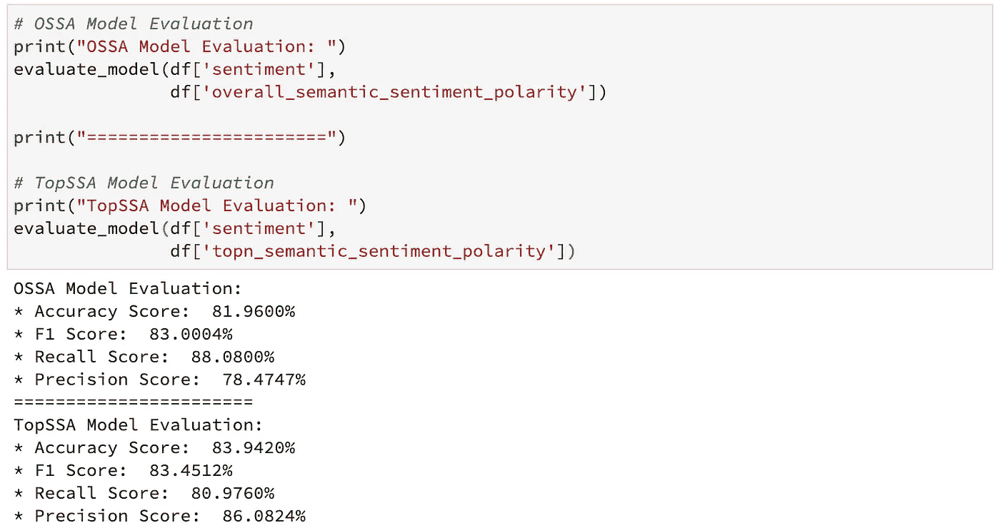

正如分类报告所示，TopSSA 模型实现了更好的准确性，F1 分数高达约 84%，这是无监督模型的一个重大成就。

让我们将数据可视化，以便更好地理解结果。每个评论都根据其 PSS 和 NSS 放在下面散点图中的平面上。因此，决策边界(蓝色对角线)上方的所有点都具有正 S3，因此被预测为具有正情绪，而边界下方的所有点都具有负 S3，因此被预测为具有负情绪。评论的实际情绪标签用绿色(正面)和红色(负面)表示。从图中可以明显看出，大多数错误标记都发生在决策边界附近，如预期的那样。

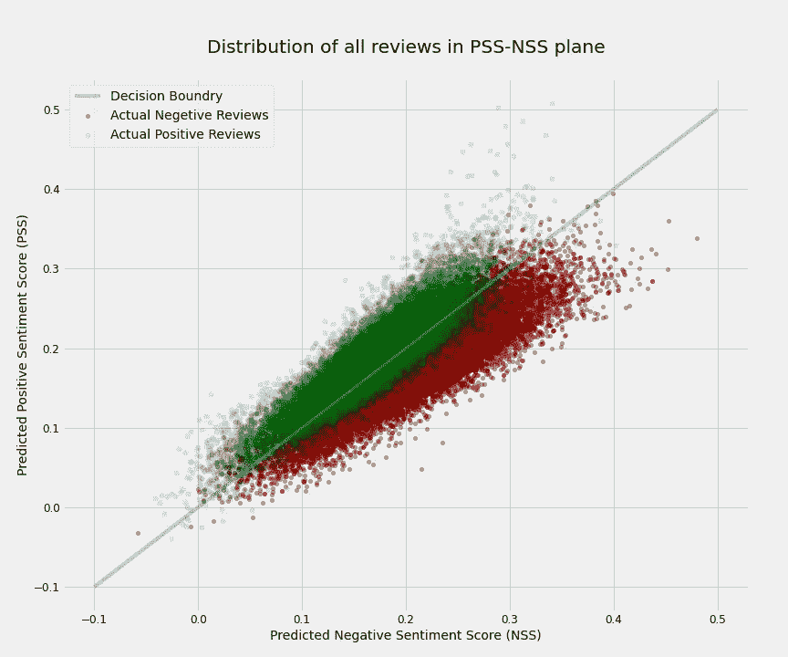

*作者图片*

## 高可信度预测

众所周知，远离决策边界的结果具有更好的性能，这里我展示了这适用于我们的无监督模型。为此，我绘制了所有评论的 S3、PSS 和 NSS 分布。正如我们从中心极限定理中所预期的，所有三个分布都非常接近正态分布，其中 S3 的平均值和标准差分别为-0.003918 和 0.037186。接下来，我将高置信度预测定义为 S3 距离平均值至少 0.5*std 的预测。这包括了大约 64%的评论，并且该模型的 F1 为大约 94%。

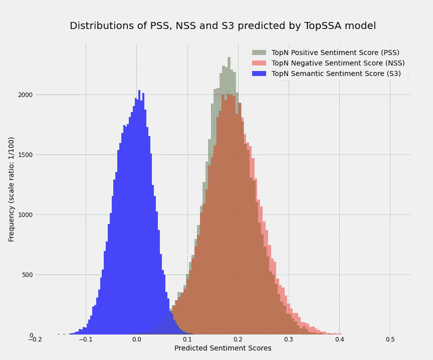

*作者图片*


*作者图片*

# 5.进一步分析

到目前为止，我已经展示了一个简单的无监督模型如何在情感分析任务中表现得非常好。正如我在介绍中所承诺的，现在我将展示这个模型将如何提供监督模型所不能提供的额外的有价值的信息。也就是说，我将证明这个模型可以让我们理解文本的情感复杂性。为此，我将再次依靠我们的积极和消极的分数。首先，让我们看看这些分数的另一个性质。除了两个分数都是正态分布的事实之外，它们的值与评论的长度相关。也就是说，评论时间越长，它的负面和正面得分就越高。一个简单的解释是，一个人可以用更多的词来表达更多积极或消极的情绪。当然分数不能超过 1，最终饱和(此处 0.35 左右)。下图很好地显示了这种相关性。请注意，我颠倒了 NSS 值的符号，以便更好地描述 PSS 和 NSS 的情况。

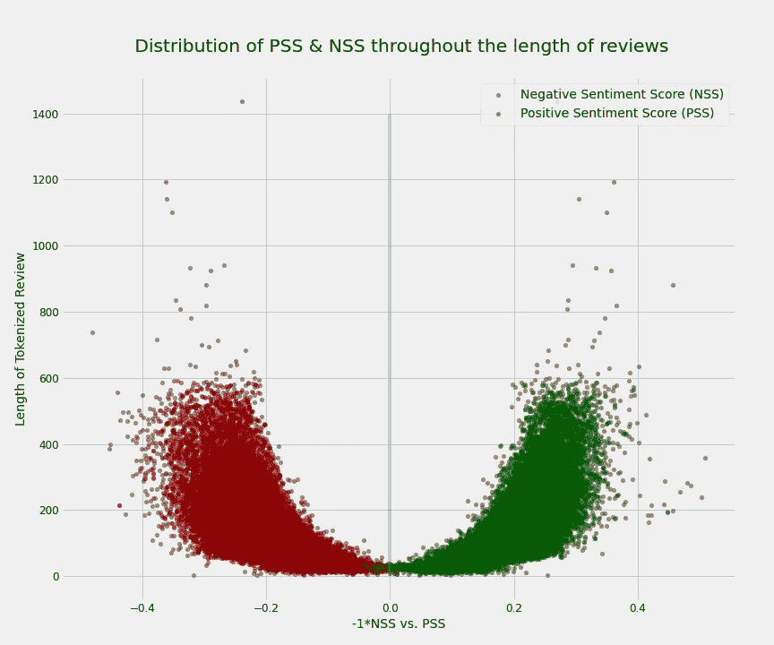

*作者图片*

因此，在我们的分析中，为了考虑文本长度的影响，我们对数据集进行切片，使得放置在每个子集中的评论在长度上接近。在这篇文章中，我将分析限制在 100 到 140 个单词之间的评论(评论中的平均单词数是 120)。这个切片中有大约 8400 个数据点，它们各自的 F1 分数约为 82%，接近整个数据集的 F1 分数。此外，该切片中的 PSS 和 NSS 都具有以下值的正态分布:

> *PSS _ mean = 0.200648
> PSS _ STD = 0.031200*
> 
> *NSS _ 平均值= 0.205617
> NSS _ 标准= 0.039358*

从现在开始，任何 PSS 和 NSS 的均值和标准差都是指数据集中这一部分的值。

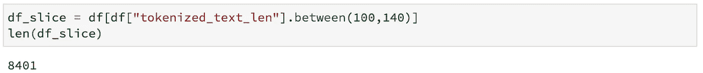

# 情感复杂性

我在这里的主要主张是，我们可以使用他们的 PSS 和 NSS 来评估情绪的复杂性(或情绪的复杂性)。我将证明，如果一个文本同时具有高 PSS 和高 NSS 值(低 S3)，它可能具有高情感复杂度。并且具有低 PSS 和高 NSS 值或者反之亦然(高 S3)的文本可以被认为具有更清晰的情感或者低情感复杂度。但是首先要定义一下高低。为了便于分析，我们将高和低 PSS (NSS)分别定义为高于和低于平均值一个标准偏差的值，但当然，这些定义是相对的，可以调整。因此

*   高 PSS(NSS) = PSS(NSS)>平均值 _PSS(NSS) +标准 _PSS(NSS)
*   低 PSS(NSS) = PSS(NSS) < mean_PSS(NSS) — std_PSS(NSS)

Therefore the high sentiment complexity could be defined as:

> *高情绪复杂度=高 PSS &高 NSS*

相比之下，一组评论同时具有低 PSS 和低 NSS。这些评论通常陈述更少的观点和更多的事实，因此它们可以被称为低主观性的评论，并被定量地定义为

> *低主观性=低 PSS &低 NSS*

下图显示了这两组评论在 PSS-NSS 平面上的分布情况。

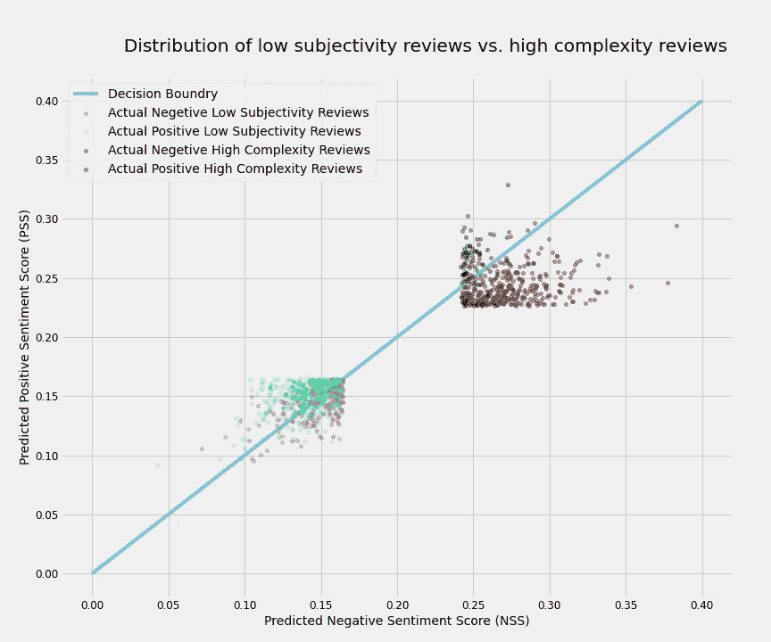

*作者图片*

尽管对于高情绪复杂性组和低主观性组，S3 不一定落在决策边界附近，但是由于不同的原因，我们的模型更难正确预测他们的情绪。传统的分类模型不能区分这两组，但我们的方法提供了这种额外的信息。下面两个[互动情节](https://nbviewer.org/github/towardsNLP/IMDB-Semantic-Sentiment-Analysis/blob/main/Word2Vec/notebooks/W2V_SSA_IMDB_Blog.ipynb#Further_Analysis)让你通过悬停在评论上来探索评论。

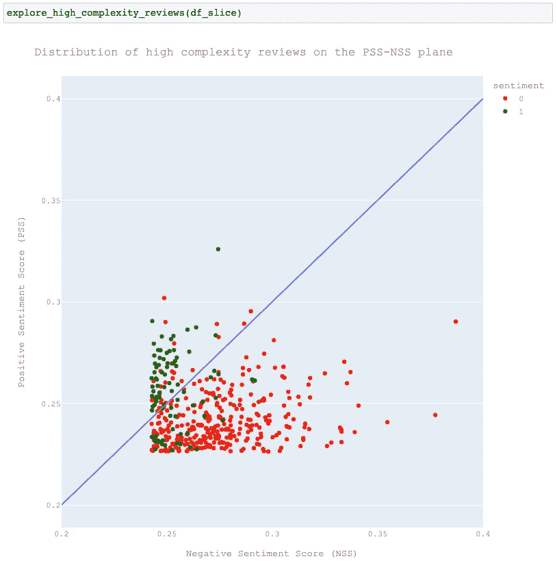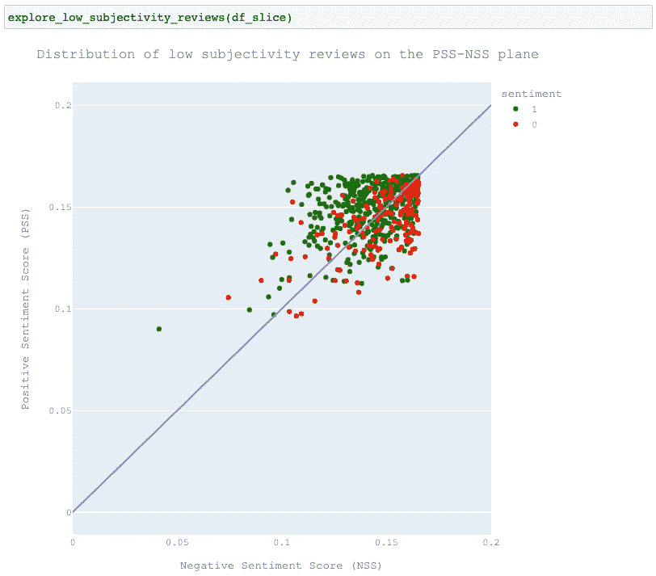

# 定性评估

在这篇文章的其余部分，我将定性分析来自高复杂性小组的几篇评论，以支持我的观点，即情感分析是一项复杂的智力任务，即使对人脑来说也是如此。

虽然自然语言处理从来没有像意义理论和语言哲学中那样关注意图和规约之间的关系，但是我们不能忽视这样一个事实，即一个人可以使用具有不同于该词的普通用法的意义或情感意图的词。例如，我们可能会讽刺性地使用一个在交流习惯中通常被认为是积极的词来表达我们的消极观点。如果情感分析模型没有学会如何使用上下文指示来预测作者想要的情感，它就不能注意到这种情感转变。为了说明这一点，让我们看看 review **#46798** ，它在高复杂度组中有一个最小的 S3。从“哇”这个词开始，这个词是惊讶的感叹词，常用来表达惊讶或钦佩，这篇评论似乎是积极的。评论家自相矛盾地重复说烂片很有趣。但是这个模型成功地捕捉到了用讽刺和挖苦表达的负面情绪。

文本情感复杂性背后的另一个原因是对主题的不同方面表达不同的情感，使得人们无法掌握文本的总体情感。一个例子是评论 **#21581** 在高情绪复杂性组中有最高的 S3。影评从电影的故事开始，根据影评人的说法，这是“如此愚蠢”和“充其量是一个拙劣的笑话。”但不久之后，通过使用几个情绪转移器如“不是”、“但是”和“然而”来陈述电影的积极和消极方面，复杂性就出现了。总的来说，在评论者看来，这部电影是 8/10，尽管在这个简短的文本中表达了所有复杂的情绪，但模型还是成功地预测了这种积极的情绪。

相比之下，审查 **#29090** 是模型错误的一个例子。影评强烈反对这部电影，并明确表达了对这部电影不该得到的曝光率和曝光率的失望和愤怒。然而，该模型未能预测情绪。因为影评中大量包含了其他人对电影的正面评价，以及影评人对其他电影的正面情绪。

同样耐人寻味的是，review **#16858** 戏剧性地融合了关于这部电影的复杂情感。这位影评人曾经很喜欢这部电影，在他们还是孩子的时候反复看了一遍。然而，作为一个成年人来看这部电影，他们的经历并没有他们记忆中的那么好:表演、故事情节和笑话看起来“相当糟糕”没有人能确定评论者在这两种对立情绪之间的最终决定。令人惊讶的是，他们决定珍惜他们的童年，并给它七颗星。难怪这个模型没有认识到怀旧的力量。

我们必须承认，有时我们的手工标签也不够准确。一个令人印象深刻的例子是评论 **#46894** ，被贴上负面标签，但评论者明确指出“我给这部剧打六分。”请记住，数据集介绍文档声称分数为 5 和 6 的评论被认为是中立的，不包括在数据集中。尽管如此，我们的模型准确地将该综述分类为阳性，尽管我们在模型评估中将其视为假阳性预测。

**复习#46798(真阴性预测):**

*   `topn_PSS`= 0.297876
    = 0.389544
    =-0.0916676

> *“哇。我一看到这部电影的封面，就立刻想看，因为它看起来太糟糕了。有时候，我看宝莱坞电影，只是因为它们太糟糕了，所以会很有娱乐性。这部电影拥有一部残暴电影的所有元素:一群完全无害的“当地暴徒”，一个糟糕的摩托车场景，可怕的对话(“恭喜你，我很自豪你是一个坏男孩”)，演员打篮球就像他们是好的一样，残暴的歌曲(“我坏，我坏，我坏男孩”)，无法解释的情节线，比如为什么好男孩和坏男孩是朋友？？？为什么辣妹会爱上书呆子？？我从没见过这么恐怖的故事。有些场景实际上长达 30 秒，就像好男孩和坏男孩莫名其妙地碾过“帮派成员”的扑克游戏。恭喜阿什维尼·乔德里，你是个糟糕的导演。如果你想看一部好电影，那就看《咕噜》,如果你想看一部非常糟糕的电影，以至于它实际上是娱乐性的，那就看《好孩子，孩子》。*

**复习#21581(真阳性预测):**

*   `topn_PSS`= 0.260054
    = 0.247708
    `topn_semantic_sentiment_score`= 0.0123464

> *“剧情:一个犯罪头目联合了三个不同的黑手党来购买一个岛屿，然后作为有组织犯罪的洗钱设施。为了挫败这一阴谋，联邦调查局试图逮捕一名黑手党头目。事情出了差错，通过一些不太可能的情节曲折，我们看到了另一部“互不喜欢对方的警察伙伴”电影…一个是女性联邦调查局特工，另一个是男性前缉毒局特工。
> 这么远，这么蠢。但是这部电影的力量不在于它的故事——充其量是一个拙劣的笑话。这很有趣。(至少同步的德语版是)。动作也很好，有一个令人难忘的场景，包括一把猎枪和一个火箭发射器。但是焦点完全集中在幽默上。不聪明的讽刺，不太滑稽，但介于两者之间，你会得到很多有趣的笑话。
> 然而这部电影是政治正确的反面。合法药物滥用是突出的特点，没有批评，甚至显示它很酷。在我看来，这是这部电影最让我恼火的地方，也是它不适合儿童观看的地方。总而言之，对于一个美好的夜晚来说，看一些有趣的笑话和可接受的动作，这部电影是完美的。只要记住:在这种流派中，当你进入电影院/电视室时，把你的大脑留在门口是很常见的。那你会玩得很开心的。8/10 英寸*

**查看#29090(假阳性预测):**

*   `topn_PSS`= 0.254718
    `topn_NSS`= 0.252167
    = 0.00255111

> *“这部电影如何获得 6.7 的评分令人难以置信。它只配得 2.0 分，显然应该被列入 IMDb 有史以来最差的 100 部电影之列。《国家宝藏》是对国家情报的冒犯，也是好莱坞对美国观众的又一次攻击。评论家们讲述了你可以驾驶 16 轮大卡车穿过的情节漏洞。
> 我喜欢这部电影好的理由……”尼古拉斯·凯奇很可爱。“来吧人们，难怪全世界的人都认为美国人很愚蠢。这一定是我看过的最愚蠢、最侮辱人的电影。如果你想在这一季看一部真正像样的电影，可以考虑金赛的《樵夫》、《百万美元宝贝》或《横着走》。不幸的是,《国家宝藏》比那些恐怖的电影得到了更多的关注。我敢打赌，读到这里的大多数人都没有听说过它们，因为有些还没有广泛发行。尼古拉斯·凯奇是个了不起的演员——当他出演合适的电影时。一次又一次，我看到凯奇把他惊人的天赋浪费在像《空气骗局》、《摇滚》和《面对面》这样令人麻木的电影上。当他的才华得到很好的利用时，就像查理·考夫曼的改编，他是一个不可思议的演员。
> 底线——我宁愿把手伸进碎木机，也不愿再次遭受这种视觉上的暴行。”*

**回顾#16858(假阴性预测):**

*   `topn_PSS`= 0.251645
    = 0.256545
    =-0.0048998

> 是的，我小时候就喜欢这部电影。在我成长的过程中，我看了很多遍这部电影，以至于我爸爸不得不买另一部 VHS 拷贝，因为旧的拷贝已经用坏了。当我们购买新的 VHS 系统时，我的家人收到了这部电影的 VHS 副本。起初，我妈妈不确定这是否适合一个 10 岁的孩子，但因为我们刚买了一个新的 VHS 系统，她让我看。就像我说的，这部电影是每个小男孩的梦想。这部电影包含了一个可怕的场景，肌肉发达的野蛮人，美丽的袒胸女人，大坏蛋和你长大后才会听到的笑话。因此，几天前我插入了视频，并在很长时间后再次观看了这部电影。一开始很无聊，后来开始想我小时候有多爱这部电影，继续看。是的，这次经历没有我记忆中的那么好，表演很糟糕，故事情节很糟糕，笑话不再好笑，但是女人们仍然很漂亮。是的，我长大了。即使电影体验对我来说发生了变化，我仍然认为它值得 7 颗星。为了你知道的过去的美好时光。”

**回顾#46894(阳性预测，误标为阴性)**:

*   `topn_PSS`= 0.286535
    = 0.211566
    `topn_semantic_sentiment_score`= 0.0749689

> *“我给这部剧打六分，因为这部剧实际上是小达蒙·威亚斯的一个平台，就像考斯比秀是比尔·科斯比的平台一样，它用幽默处理了很多问题，我觉得它实际上是为了获得笑声，而不是让笑话来自角色。迈克尔·凯尔是一个有趣的家长，也是一个爱说俏皮话的人。他在电影中是非凡的，但在节目中，他在那里说俏皮话，虽然我很喜欢，但我觉得笑声比合理性更重要。我从《家庭聚会》开始就喜欢她，喜欢她在《学校发呆》和《马丁》中的表演，这对她来说是一个很棒的角色，她选择合演这部情景喜剧是一个很好的选择。我也觉得周杰伦和迈克尔在节目中更像是平等的，但周杰伦更像是一个给她疯狂的丈夫提供台词的女人，并赞同他非正统的纪律，因为她可能觉得这很有效。Jr 只是简单的愚蠢，他的性格应该得到很好的发展，即使他有伟大的时刻，我们还是回到了愚蠢，好像他什么也没学到，这让我发疯！！！！！！！！更不用说大多数情况(在我看过的剧集中)似乎都围绕着他
> 克莱尔这个与基督徒约会的迷人妹妹，我发现她男朋友的角色比她更有趣(她最好坚持看电影，编剧应该做得更多来展示她的智慧，但这还不够老套)。可爱的小女儿凯迪。我认为除了《父母》和富兰克林之外，编剧们在剧中塑造了她最多的角色。富兰克林我喜欢这个角色，我认为他们是从只持续了一季的《聪明的家伙》( T.J. Mowry)中衍生出来的。他们为这个小天才做了很好的选角工作(如果 Jr 是聪明的那个，他们会做出努力，但也会表现出缺点)。
> 总而言之，这部情景喜剧非常精彩，它是对科斯比秀的致敬，做得很好，我喜欢这部剧，希望它能持续更长时间。我迫不及待地想看到该系列的大结局。”*

# 现在轮到你了

让我们来玩玩*文本语义情感分析*功能。请分享您对 TopSSA 模型的看法，并探讨它在分析情绪方面的准确性。

# 感谢

我要向[贾瓦德·哈希米](https://www.linkedin.com/in/thejavadhashemi/)表达我最深切的感谢，感谢他对这个项目的建设性建议和有益反馈。特别是，我非常感谢他对情感复杂性的见解，以及他为计算我在`[list_similarity](https://github.com/TextualData/IMDB-Semantic-Sentiment-Analysis/blob/main/Word2Vec/src/w2v_utils.py)`函数中使用的两个符号列表之间的向量相似性而提出的优化解决方案。