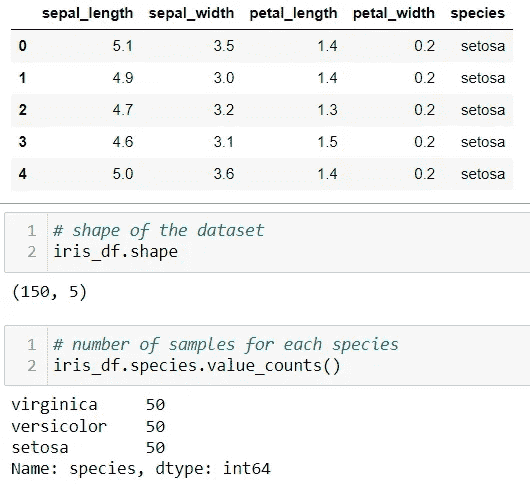
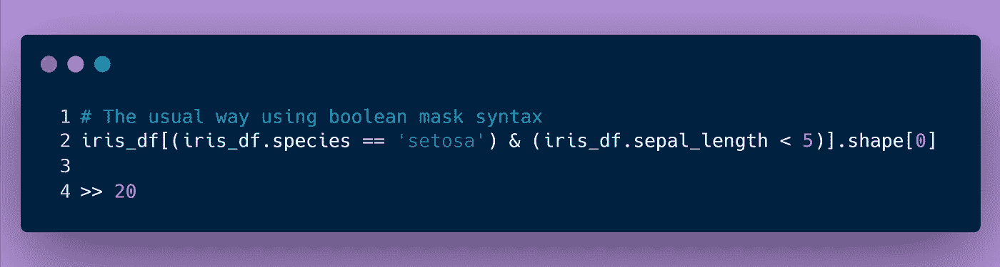
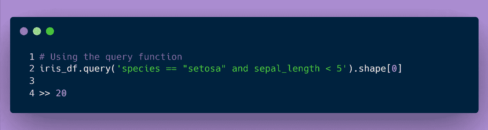
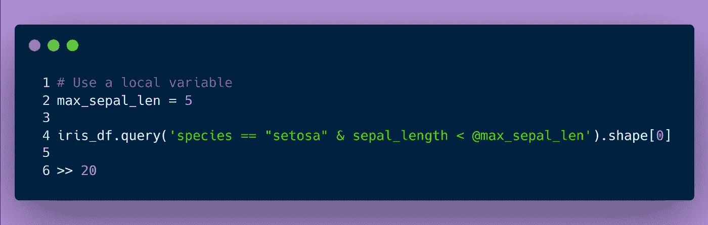

# 使用 Pandas 查询来过滤或选择 Pandas 数据框架中的数据

> 原文：<https://towardsdatascience.com/use-pandas-query-to-filter-or-select-data-in-pandas-dataframe-82ae3a3683a1>

## Pandas query()函数语法是在 Pandas 数据帧中过滤或选择数据的一种更简洁的方式

由[希德·巴拉钱德朗](https://unsplash.com/@itookthose?utm_source=medium&utm_medium=referral)在 [Unsplash](https://unsplash.com?utm_source=medium&utm_medium=referral) 上拍摄的照片

# 概观

作为一名数据科学家，我通常依靠使用布尔屏蔽来过滤或选择熊猫数据框架中的数据。我以前听说过熊猫`query()`功能，但从未真正尝试过。几周前，当我决定真正尝试一下时，这种情况发生了变化😎

现在，这个功能已经成为我选择或过滤数据的首选方法。这是因为一个简单的原因:代码可读性的提高。

查询函数有一个非常简单的语法，它接受引号内的布尔表达式(例如'*表达式'*)，并过滤表达式为*真*的数据帧行。

在本文中，我将快速向您展示如何使用`df.query('expression')`函数来代替标准的布尔屏蔽语法方法。希望你们中的一些人能够改变自己喜欢的方法！😄

***边注:本文的示例代码可以在 Jupyter 笔记本*** [***这里***](https://github.com/saedhussain/medium-pandas_query/blob/3bd0b28b82d97915e9675eed88cffdc1e861f730/medium-pandas_query.ipynb) ***找到。***

# 先来点数据

开始之前，我们需要一些数据。出于演示的目的，本文将使用 Iris 数据集。

照片由[埃斯特·刘易斯](https://unsplash.com/@_esther_?utm_source=medium&utm_medium=referral)在 [Unsplash](https://unsplash.com?utm_source=medium&utm_medium=referral) 上拍摄

该数据集使用鸢尾属植物花的四列测量值(萼片长度、萼片宽度、花瓣长度和以厘米为单位的花瓣宽度)来预测花的种类。

从 scikit-learn 加载的虹膜数据集。(来源:作者)

现在让我们开始一些语法比较！🚀

# 语法:普通布尔掩码 Vs 查询函数

为了显示这两种语法之间的一些比较，并强调为什么查询功能更好，让我们尝试从 Iris 数据集回答这个简单的问题:*有多少“setosa”物种样本的萼片长度小于 5cm？*

使用通常的布尔屏蔽语法，我可以快速得到如下结果:

使用通常的布尔掩码过滤方法。(来源:作者)

使用如下查询函数可以获得相同的结果 20:

使用查询功能得到相同的答案。(来源:作者)

你注意到两者的不同了吗？为了以防万一，这里有两个要注意的主要观察结果:

1.  我只需在查询函数表达式中写入列名`species`,而不必在过滤器中多次写入`iris_df.species`。
2.  看看这个查询方法是多么的清晰易读。

是只有我觉得这样看起来更舒服吗？

此外，我可以很容易地在查询函数中使用一个带有“@”符号的变量来获得相同的结果，如下所示:

使用“@”符号在查询函数表达式中包含变量。(来源:作者)

我希望这个简单的示例问题能激发您尝试 Pandas 中的查询功能的兴趣。可能性是无穷的！

我不打算在这里继续举更多的例子。我建议出去试试！学习的最好方法就是走出去打破一些东西。😄

只要查询函数中的表达式包含有效的数据字段、变量、布尔符号和 pythonic 布尔运算符，就应该没问题。👍

如果你还想知道更多关于如何使用查询功能的例子，我推荐你点击这里查看这篇文章。

# 最后的想法

找到有效的代码并不罕见，但是乍一看，很难理解发生了什么。这通常被称为代码可读性问题。比较这里讨论的两种方法的语法，很明显，Pandas 查询函数方法产生了可读性更好的代码。此外，它也有一些[性能优势](https://jakevdp.github.io/PythonDataScienceHandbook/03.12-performance-eval-and-query.html)。

我希望这篇文章能引起您的兴趣，让您尝试一下查询功能。😄

*感谢您花时间阅读本文。希望你觉得有用。请随时伸出手来连接！👋*

**🚀🚀*如果你愿意支持我，阅读更多来自我和其他了不起的 medium 作者的文章，考虑使用我的*** [***推荐链接***](https://saedhussain.medium.com/membership) ***注册 medium。*🙏**

以下是我的一些其他文章，你可能会感兴趣

       