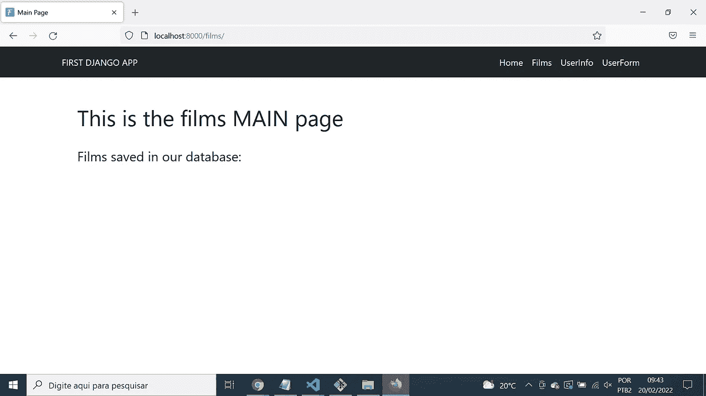
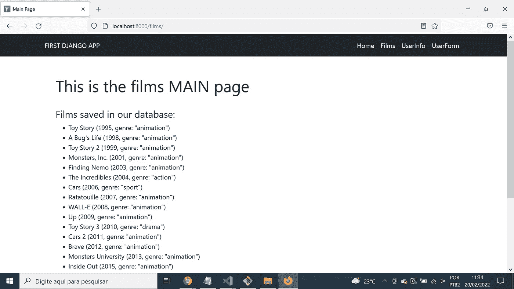

# 使用 Python 脚本将 CSV 数据插入 Django 数据库

> 原文：<https://towardsdatascience.com/use-python-scripts-to-insert-csv-data-into-django-databases-72eee7c6a433>

## Django-extensions 是您正在寻找的工具


托拜厄斯·菲舍尔在 [Unsplash](https://unsplash.com/s/photos/databases?utm_source=unsplash&utm_medium=referral&utm_content=creditCopyText) 拍摄的照片

**简介**

所以，你努力工作，为你的客户开发了一个新的现代 Django web 应用程序。她很开心，恭喜你最后的结果。*干得好。现在，我们只需将数百万个数据库行插入新的应用程序，并开始在生产中使用它*。

一些准备不足的人听到这样的话会愣住，但你不会:你会知道如何使用 **django-extensions** 并且在你安装它之后，使用 django 的 ORM 功能编写 Python 脚本来快速加载数据到 Django 数据库是多么容易。

如果您还不知道 django-extensions，不要担心:这个快速教程将通过一个非常简单的例子展示它是如何工作的。然后你可以把它扩展到你日常活动中可能遇到的更复杂的情况。

**第 1 部分:我们的模型和数据**

我们将使用我在 [my Django tutorial for total 初学者教程](https://medium.com/towards-data-science/django-first-steps-for-the-total-beginners-a-quick-tutorial-5f1e5e7e9a8c)中创建的非常简化的 films 应用程序，该教程发布在[toward Data Science](https://medium.com/towards-data-science)上。

[](/django-first-steps-for-the-total-beginners-a-quick-tutorial-5f1e5e7e9a8c) [## Django 初学者的第一步:快速教程

### 了解如何在 Django 应用程序中嵌入 Plotly 图形，以及其他主题

towardsdatascience.com](/django-first-steps-for-the-total-beginners-a-quick-tutorial-5f1e5e7e9a8c) 

它的模型只有两个表:`films_film`和`films_genre`。来自`films/models.py`的代码转载如下:

正如我在我的教程中提到的，这不是这些实体之间的完美模型关系，特别是因为它确定了一部电影不能有一个以上的类型。然而，我决定建立一个用于教学目的的简化模型，我们将在本文中保持这种方式。如果你愿意，你可以在以后扩展这个模型，允许电影和流派之间的多对多关系，或者包括新的实体，比如导演和奖项。

我们将使用的 CSV 文件可以在我的 GitHub 库中找到[。它是使用来自`pixarfilms`](https://raw.githubusercontent.com/fabricius1/DjangoTutorial/master/films/pixar.csv) [R 库](https://cran.r-project.org/web/packages/pixarfilms/index.html)的数据创建的。由于在我创建的数据模型中，每部电影只允许一种类型，所以我为大多数电影指定了类型“*动画*”，但我也包括了一些其他类型，因此我们的示例中不只有一种类型。

**第 2 部分:设置我们的环境**

1.在你的机器上选择一个你想要工作的文件夹，用启动代码克隆我的 GitHub 库。

```
git clone [https://github.com/fabricius1/DjangoTutorial.git](https://github.com/fabricius1/DjangoTutorial.git)
```

2.在克隆的文件夹`DjangoTutorial`中移动。

```
cd DjangoTutorial
```

请注意，`pixar.csv`文件已经保存在`DjangoTutorial/films`文件夹中。

3.用`venv`创建一个虚拟环境。我叫我的`.myenv`。

```
python -m venv .myenv
```

4.通过针对您选择的终端和操作系统运行正确的命令来激活虚拟环境。下面的命令在我的 Git Bash for Windows 中有效。如果你对用`venv`激活虚拟环境有疑问，请查阅 [Python 文档](https://docs.python.org/3/library/venv.html)。

```
source .myenv/Scripts/activate
```

从现在开始，所有命令都必须在激活虚拟环境的情况下执行。

5.用 PIP 安装`django`和`django-extensions`。我们还将安装`pandas`和`plotly`，因为`plotly.express`在克隆项目的`films/views.py`文件中被调用。

```
pip install django django-extensions pandas plotly
```

如果你想了解更多关于`django-extensions`，[的信息，请阅读文档](https://django-extensions.readthedocs.io/)，尤其是关于[的 runscript 功能](https://django-extensions.readthedocs.io/en/latest/runscript.html)的页面。'

6.将字符串`'django_extensions'`添加到`project/settings.py`中的`INSTALLED_APPS`列表中。其他行保持不变。

```
INSTALLED_APPS = [    
    'django.contrib.admin',
    'django.contrib.auth',
    'django.contrib.contenttypes',
    'django.contrib.sessions',
    'django.contrib.messages',
    'django.contrib.staticfiles',

    # films app:
    'films.apps.FilmsConfig', # add this:
    'django_extensions',
]
```

7.应用迁移文件在数据库中创建表:

```
python manage.py migrate
```

8.查找错误，并根据需要进行更正:

```
python manage.py check
```

9.用`python manage.py runserver`在本地运行项目。

10.在浏览器上打开`http://localhost:8000/films`并检查应用程序，检查是否一切正常。屏幕上不会显示任何电影，因为刚刚创建了`db.sqlite3`数据库。



作者图片

**第 3 部分:创建并运行脚本**

11.停止服务器。在项目根目录下创建一个`scripts`文件夹，与`manage.py`在同一层:

```
mkdir scripts
```

12.创建`scripts/load_pixar.py`文件。

```
touch scripts/load_pixar.py 
```

13.用以下代码填充`scripts/load_pixar.py`。我们稍后会解释:

14.运行`python manage.py runscript load_pixar`。请注意`load_pixar`是不带`.py`扩展名的。

如果一切顺利，您将在控制台中看到导入的行。

15.用`python manage.py runserver`再次运行服务器，然后在浏览器上打开`http://localhost:8000/films`。查看 Django 页面现在如何显示导入的电影:



作者图片

**第四部分:关于脚本代码**

`scripts/load_pixar.py`代码中只有一个函数，其末尾没有 *dunder* 调用。如 [django-extensions 文档](https://django-extensions.readthedocs.io/en/latest/runscript.html)中所述，*该文件必须实现一个* `*run()*` *函数。这是运行脚本时调用的内容。您可以导入 Django 项目的任何模型或其他部分，以便在这些脚本中使用。*

因此，我们在脚本中导入了`Films`和`Genre`模型以及`csv` Python 内置模块。接下来，在`run()`函数中，我们使用`with`上下文管理结构，并通过使用模式`app_name/csv_file`而不是相对路径来打开`pixar.csv`文件。

然后我们将`file`变量传递给`csv.reader()`函数，调用`next(reader)`跳过 CSV 头文件，最后使用 Django 的 ORM 方法`.delete()`删除模型表中可能存在的任何实例。如果不想从表中删除现有的行，请删除这些代码行。

下一步是遍历 CSV 中的所有行。在这部分代码中，我们第一次发现了重要的方法`.get_or_create()`。它返回一个 tuple，其中第一个索引处的对象是创建的(如果数据库中还不存在)或检索的(如果已经存在)Django 模型对象。元组中的第二个元素是一个布尔值，如果对象已创建，则返回`True`，否则返回`False`。

请注意我们是如何首先创建(或获取)了`Genre`对象，然后使用它以及从每个 CSV 行中获取的其他信息来创建一个新的`Film`对象并将其保存到数据库中。

**最后的话**

如前所述，这只是如何使用 django-extensions runscript 功能的一个非常简单的例子。通过了解基础知识，您可以实现更复杂模型的解决方案，还可以创建具有错误处理结构的代码，例如，处理异常。

亲爱的读者，非常感谢你花时间和精力阅读我的文章。

*快乐编码！*