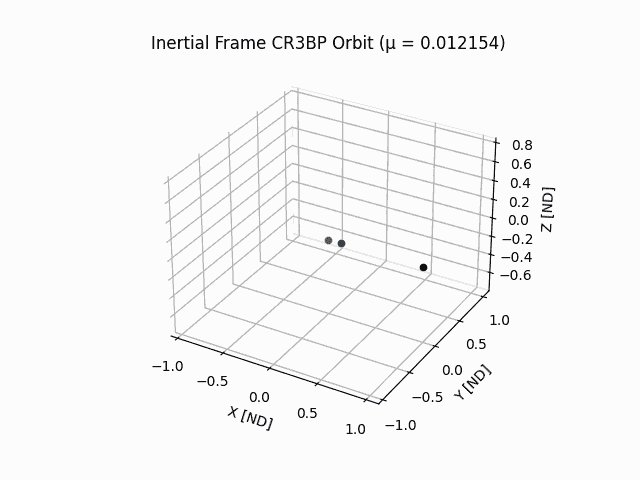
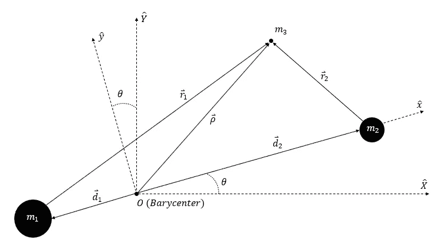
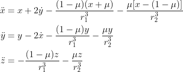
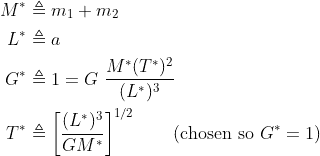
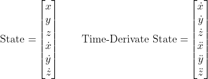
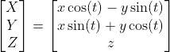
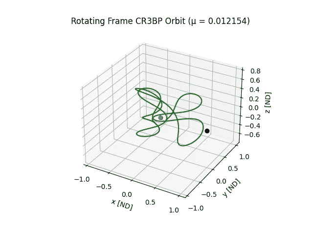
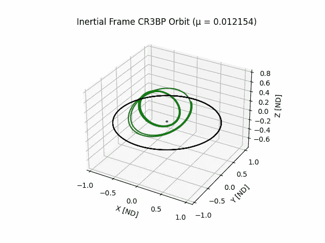

# 使用 Python 创建三体轨道

> 原文：<https://towardsdatascience.com/use-python-to-create-three-body-orbits-329ffb5b2627>

## 对卫星在两个较大质量影响下的运动轨迹进行数值积分和可视化



动画 CR3BP 轨道(惯性框架)[由作者创建]

在轨道力学中，三体(3BP)是研究一个可忽略的质量在两个较大质量(行星、月亮、恒星等)的影响下如何移动。).当必须考虑两个较大质量的引力时，这些结果用于设计航天器轨道。例如，詹姆斯·韦伯望远镜的轨道和当前轨道就是利用 3BP 设计的。通常，当人们想到轨道时，他们会想到一个可以忽略不计的质量，围绕着一颗行星或恒星的椭圆轨道。有了三体，系统中增加了一个额外的大质量物体，这增加了推导描述较小物体运动的方程的难度。

为了创建和可视化 3BP 中的轨道，我们必须推导出可忽略质量的运动方程。我在这里跳过推导的细节，但是如果你感兴趣，这篇[文章](https://medium.com/illumination/orbital-mechanics-the-three-body-problem-90be80e47113)描述了如何推导三体方程。我鼓励您浏览那篇文章，以充分理解您将要使用 Python 求解的变量和方程。我们将学习循环受限三体(CR3BP)。在这个广义三体的限制性版本中，两个较大的质量(或原色)以圆形轨道围绕它们各自的质量中心运行。这简化了航天器(或其他可忽略质量)的运动方程。下图显示了 CR3BP 的设置。



三体问题图[作者创作]

针对*(航天器、小行星等)推导出 CR3BP 运动方程。)在旋转框架中( *x* 、 *y* 、 *z-hat* 框架):*

**

*这些方程有点吓人，但是一旦你知道每个变量是什么，它们就不会太糟糕。这里， ***x*** ， ***y*** ，***z***(***ρ***矢量)是 ***m₃*** 相对于初选质心的位置坐标，在旋转坐标系( *x* ， *y* ， *z-hat【中这些项上的点表示时间导数，所以一个点表示速度项，两个点表示加速度项。是一种无量纲质量比的初选。 ***r₁*** 和 ***r₂*** 分别是 ***m₃*** 离各自主光源的距离。**

*上面的运动方程是使用无量纲变量导出的。上面提到的文章详细介绍了如何使用无量纲参数，如果你真的想了解三体，这很重要。此处不涉及太多细节，以下参数用于删除和添加尺寸(km、kg、s 等。)如有必要。我们可以用 ***M**** 来操纵质量单位(kg)***【L ****来操纵长度单位(km)*来操纵时间单位(s)。这将在编码部分进一步解释。**

****

**为了求解 CR3BP，我们将使用 ODE 求解器对 ***m₃*** 的运动方程进行数值积分。为了做到这一点，我们需要定义一个状态向量和一个时间导数状态向量。对于我们的问题，状态向量包括旋转坐标系中的位置和速度向量。时间导数状态向量就是状态向量的时间导数。这些将使用 Python 的`odeint`数字积分器。这里的双点 ***x*** 、 ***y*** 、 ***z*** 都来自上面定义的运动方程。**

****

**我们可以将旋转坐标系( ***x*** ， ***y*** ， ***z*** )中的一个矢量转换为惯性系( ***X*** ， ***Y*** ， ***Z*****

****

**我知道这只是对问题的一个简单概述，但是你不需要完全理解 CR3BP 就能编码一个解决方案。我假设你对数值积分以及如何用 Python 实现它有所了解。如果你需要这方面的一些指导，我写了另一篇[文章](/how-to-numerically-integrate-dynamics-problems-w-python-85d9783aa088?source=your_stories_page-------------------------------------)可能会有帮助，互联网上还有很多其他资源。事不宜迟，让我们直接进入代码吧！**

## ****导入包****

**对于这段代码，我们需要导入几个包。以下列表简要描述了此代码中使用的包:**

*   ***NumPy* 用于创建和操作数组(为便于调用，定义为`np`)**
*   **来自 *SciPy* 库的`*odeint*`用于数值积分**
*   ***matplotlib* 中的`*pyplot*` 用于可视化数值积分的结果(为方便调用，定义为`plt`**

```
**# Importing Packages
import numpy as np
from scipy.integrate import odeint
import matplotlib.pyplot as plt**
```

## ****创建数值积分函数****

**下一步是创建一个用户定义的 Python 函数，`model_CR3BP`，它将在`odeint`中用来对我们的状态向量进行数值积分。`odeint`函数采用当前状态向量来创建时间导数状态向量。请注意，我们从状态向量中提取位置和速度分量，以创建状态向量时间导数。**

```
**# CR3BP Model
def model_CR3BP(state, t):
    x = state[0]
    y = state[1]
    z = state[2]
    x_dot = state[3]
    y_dot = state[4]
    z_dot = state[5]
    x_ddot = x+2*y_dot-((1-mu)*(x+mu))/((x+mu)**2+y**2+z**2)**(3/2)\ 
             -(mu*(x-(1-mu)))/((x-(1-mu))**2+y**2+z**2)**(3/2)
    y_ddot = y-2*x_dot-((1-mu)*y)/((x+mu)**2+y**2+z**2)**(3/2)\
             -(mu*y)/((x-(1-mu))**2+y**2+z**2)**(3/2)
    z_ddot = -((1-mu)*z)/((x+mu)**2+y**2+z**2)**(3/2)\
             -(mu*z)/((x-(1-mu))**2+y**2+z**2)**(3/2)
    dstate_dt = [x_dot, y_dot, z_dot, x_ddot, y_ddot, z_ddot]
    return dstate_dt**
```

## ****定义无量纲参数****

**这里，我们为我们选择的系统定义几个参数。本文我选择了地月系统，但如果你想选择另一个系统(冥王星-卡戎，太阳-木星等。)，可以相应地调整质量和半长轴变量。这里， ***m₁*** 和 ***m₂*** 分别是地球和月球的质量。 ***a*** 是月球轨道的半长轴(如果他们有一个完美的圆形轨道的话)。我用月球轨道的平均距离来表示*，因为月球实际上是以圆形轨道绕地球运行的。接下来，使用本文开头的等式定义无量纲参数。***

```
***# Defining ND Parameters
G = 6.67408E-20  # Univ. Gravitational Constant [km3 kg-1 s-2]
mEarth = 5.97219E+24  # Mass of the Earth [kg]
mMoon = 7.34767E+22  # Mass of the Moon [kg]
a = 3.844E+5  # Semi-major axis of Earth and Moon [km]
m1 = mEarth
m2 = mMoon
Mstar = m1+m2  # ND Mass Parameter
Lstar = a  # ND Length Parameter
Tstar = (Lstar**3/(G*Mstar))**(1/2)  # ND Time Parameter
mu = m2/Mstar
print('\u03BC = ' + str(mu))***
```

## *****定义 ODE 解算器输入*****

***现在，除了用户定义的模型，`odeint`还需要两个输入:初始条件和积分的时间间隔。我定义了一组任意的初始条件，来创建你们一开始看到的轨道。你可以尝试你自己的初始条件或者使用这个 [NASA JPL 工具](https://ssd.jpl.nasa.gov/horizons/app.html#/)中的星历数据。接下来，我们定义初始状态向量`state_0`，以及感兴趣的时间数组`t`。请注意，使用上面的 ND 参数移除了尺寸。公里和秒单位通过除以或乘以 ***T**** 和 ***L**** 来移除。***

```
**# Initial Conditions [Initial State Vector]
X_0 = 50000/Lstar  # ND x
Y_0 = 0            # ND y
Z_0 = 0            # ND z
VX_0 = 1.08*Tstar/Lstar  # ND x_dot
VY_0 = 3.18*Tstar/Lstar  # ND y_dot
VZ_0 = 0.68*Tstar/Lstar  # ND z_dot
state_0 = [X_0, Y_0, Z_0, VX_0, VY_0, VZ_0]  # ND ICs

# Time Array
t = np.linspace(0, 15, 1000)  # ND Time**
```

## ****数值积分模型****

**下一步是组合我们已经编码的内容，并在`odeint`函数中使用它们。这里，我们使用`model_CR3BP`、`state_0`和`t`。数值积分的输出是我们在时间数组中定义的每一步的状态向量。从结果中我们可以拉出定义*位置的***x******y******z***坐标(在旋转坐标系中)。接下来，使用本文开头的等式，我们可以将转动状态转换为惯性状态。***

```
**# Numerically Integrating
sol = odeint(model_CR3BP, state_0, t)

# Rotational Frame Position Time History
X_rot = sol[:, 0]
Y_rot = sol[:, 1]
Z_rot = sol[:, 2]

# Inertial Frame Position Time History
X_Iner = sol[:, 0]*np.cos(t) - sol[:, 1]*np.sin(t)
Y_Iner = sol[:, 0]*np.sin(t) + sol[:, 1]*np.cos(t)
Z_Iner = sol[:, 2]**
```

## ****添加主要位置时间历史****

**这一步是可选的，但是包括两次初选的时间历程对于理解*的运动可能是重要的。原色的位置在旋转框架中是固定的(对于 CR3BP ),并且可以通过使用原色的质心并转换到 nd 单位来简单地导出。接下来，使用与前面相同的旋转坐标系到惯性坐标系的转换，我们可以确定原色的惯性运动时间历程。***

```
***# Constant m1 and m2 Rotational Frame Locations for CR3BP Primaries
m1_loc = [-mu, 0, 0]
m2_loc = [(1-mu), 0, 0]

# Moving m1 and m2 Inertial Locations for CR3BP Primaries
X_m1 = m1_loc[0]*np.cos(t) - m1_loc[1]*np.sin(t)
Y_m1 = m1_loc[0]*np.sin(t) + m1_loc[1]*np.cos(t)
Z_m1 = m1_loc[2]*np.ones(len(t))
X_m2 = m2_loc[0]*np.cos(t) - m2_loc[1]*np.sin(t)
Y_m2 = m2_loc[0]*np.sin(t) + m2_loc[1]*np.cos(t)
Z_m2 = m2_loc[2]*np.ones(len(t))***
```

## *****可视化数据*****

***最后一步是绘制每个质量的旋转和惯性系运动。为了区分轨道，我们将用绿色代表 ***、m₃*** ，黑色代表月球，蓝色代表地球。我们还可以设置这些轴，使它们显示相等的轴长，以便更准确地观察系统。***

```
**# Rotating Frame Plot
fig = plt.figure()
ax = plt.axes(projection='3d')

# Adding Figure Title and Labels
ax.set_title('Rotating Frame CR3BP Orbit (\u03BC = ' + str(round(mu, 6)) + ')')
ax.set_xlabel('x [ND]')
ax.set_ylabel('y [ND]')
ax.set_zlabel('z [ND]')

# Plotting Rotating Frame Positions
ax.plot3D(X_rot, Y_rot, Z_rot, c='green')
ax.plot3D(m1_loc[0], m1_loc[1], m1_loc[2], c='blue', marker='o')
ax.plot3D(m2_loc[0], m2_loc[1], m2_loc[2], c='black', marker='o')

# Setting Axis Limits
xyzlim = np.array([ax.get_xlim3d(), ax.get_ylim3d(), ax.get_zlim3d()]).T
XYZlim = np.asarray([min(xyzlim[0]), max(xyzlim[1])])
ax.set_xlim3d(XYZlim)
ax.set_ylim3d(XYZlim)
ax.set_zlim3d(XYZlim * 3 / 4)

# Inertial Frame Plot
fig = plt.figure()
ax = plt.axes(projection='3d')

# Adding Figure Title and Labels
ax.set_title('Inertial Frame CR3BP Orbit (\u03BC = ' + str(round(mu, 6)) + ')')
ax.set_xlabel('X [ND]')
ax.set_ylabel('Y [ND]')
ax.set_zlabel('Z [ND]')

# Plotting Inertial Frame Positions
ax.plot3D(X_Iner, Y_Iner, Z_Iner, c='green')
ax.plot3D(X_m1, Y_m1, Z_m1, c='blue')
ax.plot3D(X_m2, Y_m2, Z_m2, c='black')

# Setting Axis Limits
ax.set_xlim3d(XYZlim)
ax.set_ylim3d(XYZlim)
ax.set_zlim3d(XYZlim * 3 / 4)
plt.show()**
```

**代码输出:**

****

**CR3BP 轨道(旋转框架)[作者创作]**

****

**CR3BP 轨道(惯性系)[作者创作]**

**上面的图显示了*m₃和主要质量的轨道的惯性和旋转框架结果。如你所见，对于这组初始条件，飞船有一个混乱的轨道。如果调整初始条件，可以创造出各种不同的轨道(有些甚至是周期性的)。我鼓励你打乱初始条件，自己做实验。为了使文章和代码尽可能简短，我省略了如何根据情节制作动画。如果您有兴趣添加它，请查看下面的分步指南:***

***</how-to-animate-plots-in-matlab-fa42cf994f3e> *** 

***感谢您阅读文章！这是对圆形受限三体以及如何对运动方程进行数值积分的简要概述。这是一个高级的轨道力学话题，所以学习起来可能会很有挑战性。如果你有任何问题，请随时联系这里或 [LinkedIn](https://www.linkedin.com/in/zachary-fizell-915532215/) 。请关注我关于轨道力学、编码和机器学习的每周文章！***

***如果您觉得这篇文章很有趣，您可能也会觉得以下内容很有趣:***

***<https://medium.com/illumination/astrodynamics-two-body-problem-ec2c5e148184>  </use-python-to-create-two-body-orbits-a68aed78099c> ***