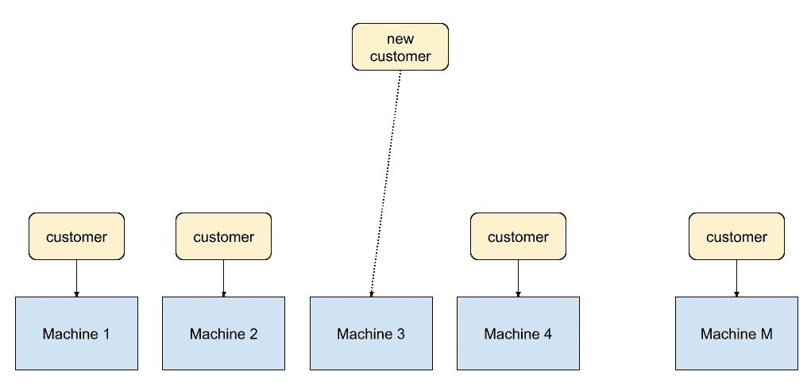
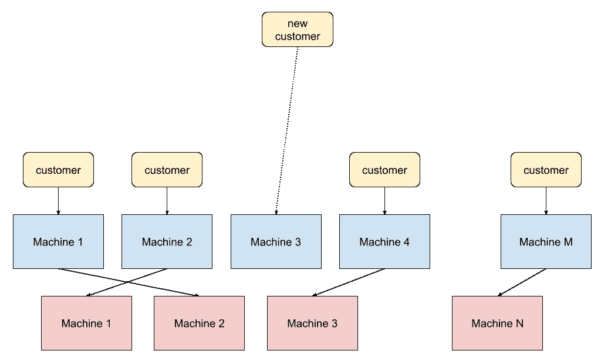
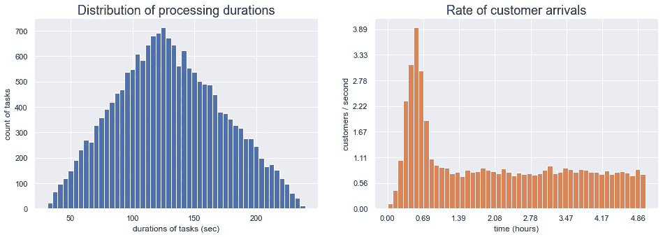
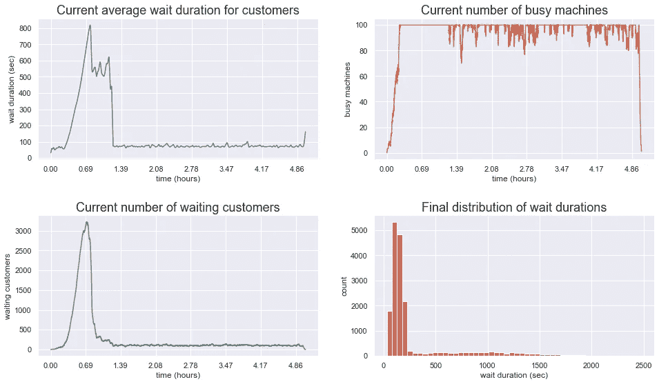
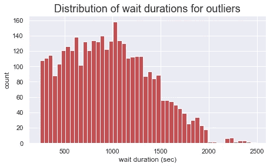
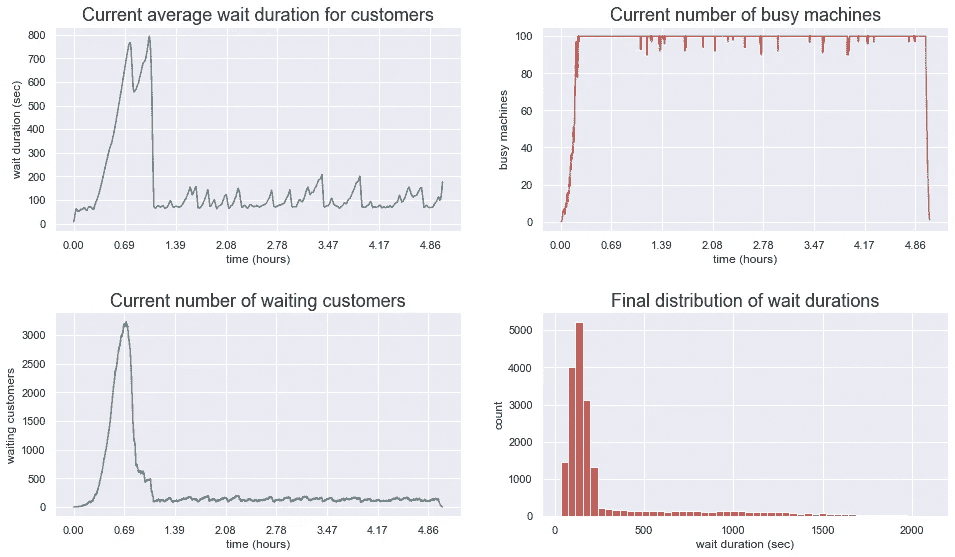
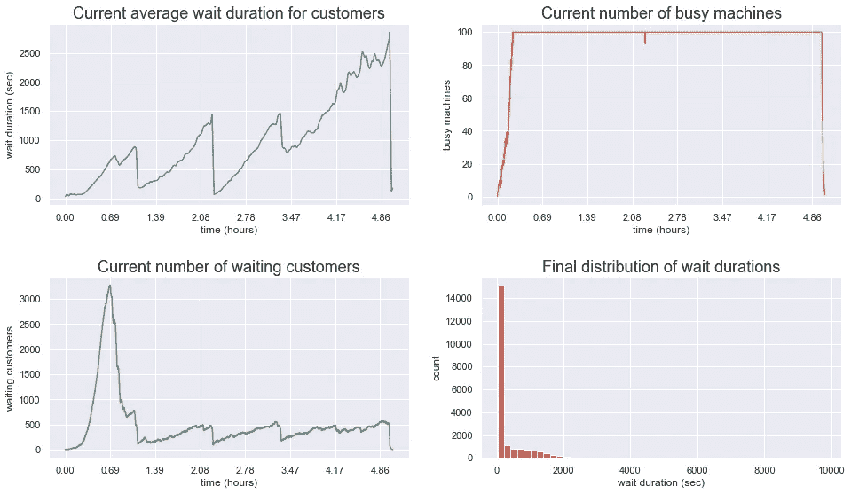
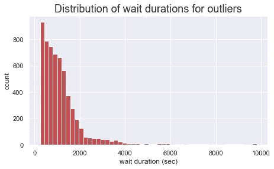
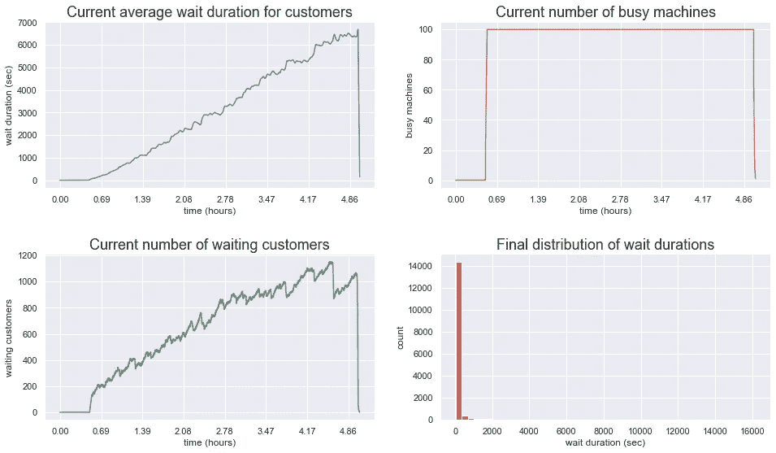

# 使用模拟来优化客户等待时间、系统负载和成本

> 原文：<https://towardsdatascience.com/use-simulations-to-optimize-customer-wait-time-systems-load-and-cost-774d2b154ace>

假设你的基础设施是一个由 M 台相同的机器组成的车队，每台机器一次处理一个任务。每个新客户都被放在一个等待机器空闲的队列中。您知道每个处理任务需要多长时间才能完成，但它不是一个固定的数字——相反，它有一个最短持续时间、一个最长持续时间和一些最可能的持续时间。你大概知道客户流入量(客户/秒)会是多少。您需要多少台机器来处理所有这些客户—M 的值是多少？

或者，您有一个固定的预算，允许您构建正好 M 台机器。车队每秒可以处理多少客户？



或者，可能每个客户都需要通过一系列任务来处理，每个任务都在不同的集群上执行，每个集群都有不同的处理时间——但是所有客户都需要通过一系列任务来处理。你需要回答和上面一样的问题。



或者可能不同的处理任务，每个都具有不同的处理时间，竞争同一机器集群上的资源——因此每个客户的任务循环回到同一集群，直到每个客户都被处理。

可能有资源，如能源或材料，用于完成任务，您可能希望优化流程，以便以最佳方式使用资源。

最后，可能会有与运行这些机器相关的成本，但也会有与客户等待时间过长相关的成本—您可能希望将总体成本降至最低。

如何找到合适的基础设施规模，以确保快速处理客户，同时优化资源使用并最大限度地降低成本？或者，给定一定的基础架构规模，在处理时间、成本和资源方面的最佳结果是什么？在一个简单的设置中，您可以做一个大概的估计，但是如果事情变得足够复杂(想象多个不同的任务在同一个集群上竞争机器)，那么最佳估计可能就不明显了。

对上述所有情况几乎都有效的一个解决方案是模拟。如果你能足够精确地描述整个工作流程，你就能在软件中模拟整个事情，让模拟及时向前运行，收集结果，并分析它们。

# 优势

如果你计划建立的基础设施足够大，运行模拟几乎总是更便宜和更快。模拟甚至可能比运行基础设施的缩小模型更容易。

因为模拟很便宜，你可以运行它很多次，每次都改变参数，寻找优化结果的方法。你甚至可以在仿真的参数空间中进行系统的搜索，以确保找到可能的最佳结果——在成本、时间等方面。

# 警告

模拟的好坏取决于你输入的数据。确保您详细描述了基础设施的特征。在模拟中使用真实世界的数据非常重要。

比如:你怎么知道每项任务要花多长时间？您可以为每种类型构建一台机器，运行数百个任务，并收集关于任务持续时间的数据。您很可能会在那里获得某种时间分布，然后在您的模型中使用它。

一些准备是强制性的。**不要随便编造数据**，否则模拟会不准确。

# 我们的例子

请参考第一张图，即本文顶部的那张图。我们正在模拟一个最简单的例子:只有一个集群，每个客户只生成一个需要处理的任务。

在本文中，我们不讨论成本或资源优化。成本和资源消耗基本上是更多的变量集(每个客户的成本、每台机器的成本等)，您需要在您的模型中进行跟踪和总结。随着模拟时间的推移，跟踪成本、资源等。为了让这个例子简单明了，我们在这里不考虑成本和资源(除了不同的时间和持续时间)。

我们将假设机队的规模是固定的:M = 100 台机器。

每位客户的处理时间大约为 2 分钟，但这不是一个固定的持续时间，而是变化的，最短的时间为 30 秒，最长的时间为 4 分钟。总体分布呈三角形。

我们怀疑客户的涌入少于 1 个客户/秒，但不会少很多。可能会出现短时间内大大超过平均速率的客户激增。

鉴于上述所有情况，我们正在努力找出我们能够处理的最高顾客到达率。

让我们生成处理时间的分布，以及客户到达时间的分布。

```
import pandas as pd
import numpy as np
from scipy import stats as st
from matplotlib import pyplot as plt
from matplotlib import ticker
import seaborn as sns
sns.set_theme()
sns_col = sns.color_palette()######## Customer arrival parameters ######### duration of initial wave in seconds
cust_peak_length = 3600
cust_peak_center = cust_peak_length // 2
# number of customers in the initial wave
cust_peak_count = 5000
# val=3 makes sure the edges of the peak are near zero
cust_peak_sigmas = 3cust_peak_dist = st.truncnorm.rvs(
    -cust_peak_sigmas,
    cust_peak_sigmas,
    loc=cust_peak_center,
    scale=cust_peak_center / cust_peak_sigmas,
    size=cust_peak_count,
)# steady state inflow, customers / second
cust_flow_rate = 0.8
cust_per_min = 60 * cust_flow_rate
cust_per_hour = 60 * cust_per_min
# steady state begin moment
cust_flow_start = cust_peak_center
# steady state end moment
cust_flow_end = cust_flow_start * 10
# total number of customers in the steady state flow
cust_flow_total = int((cust_flow_end - cust_flow_start) * cust_flow_rate)# Generate customer arrival times distribution
cust_flow_dist = np.random.uniform(cust_flow_start, cust_flow_end, size=cust_flow_total)
cust_dist = np.concatenate((cust_peak_dist, cust_flow_dist)).astype(int)######## Infrastructure parameters ######### number of machines
M = 100# processing time central value in seconds
proc_time_center = 120
# processing time minimum
proc_time_min = 30
# processing time maximum
proc_time_max = 240# Generate pre-ordained processing times
proc_time_dist = np.random.triangular(proc_time_min, proc_time_center, proc_time_max, size=cust_dist.shape[0])
```

让我们想象一下分布情况:

```
fig, ax = plt.subplots(1, 2, figsize=(16, 5))
label_format = '{:,.2f}'
bins = 50ax[0].hist(proc_time_dist, bins=50, color=sns_col[0])ax[0].set_title("Distribution of processing durations", fontsize=18)
ax[0].set_xlabel("durations of tasks (sec)")
ax[0].set_ylabel("count of tasks")ax[1].hist(cust_dist, bins=50, color=sns_col[1])
ax1_bin_width = cust_flow_end / binsax1_xticks_loc = ax[1].get_xticks().tolist()
ax[1].xaxis.set_major_locator(ticker.FixedLocator(ax1_xticks_loc))
ax[1].set_xticklabels([label_format.format(x / 3600) for x in ax1_xticks_loc])ax1_yticks_loc = ax[1].get_yticks().tolist()
ax[1].yaxis.set_major_locator(ticker.FixedLocator(ax1_yticks_loc))
ax[1].set_yticklabels([label_format.format(y / ax1_bin_width) for y in ax1_yticks_loc])ax[1].set_title("Rate of customer arrivals", fontsize=18)
ax[1].set_xlabel("time (hours)")
ax[1].set_ylabel("customers / second")
plt.show()
```



正如我们所说，处理时间呈三角形分布，峰值在 2 分钟。

我们首先要尝试的客户到达率是 0.8 客户/秒，或 48 客户/分钟。但是最初将会有 5000 名顾客的激增，他们都在 1 小时内到达，服从截断的正态分布。

我们已经定义了模型参数。让我们看一下代码。

# 实际的模拟代码

模拟完全在此函数中执行:

```
def avg_wait_time(mn, cust_dist, proc_time_dist, DEBUG=False):

    # the state of each machine
    # 0 = idle
    # 1 = busy
    machine = np.full((mn,), 0, dtype=int)

    # total number of customers
    c = cust_dist.shape[0]# status column:
    # -1 = not here yet
    # 0 = waiting customer
    # 1 = processing customer
    # 2 = customer is done
    state_dict = {
        "pt": proc_time_dist,  # pre-destined processing times
        "status": np.full((c,), -1, dtype=int),
        "machine": np.full((c,), -1, dtype=int),  # machine ID assigned to customer
        "time_went_in": cust_dist,  # arrival time
        "time_went_out": np.zeros((c,), dtype=int),  # task complete time
        "time_wait": np.zeros((c,), dtype=int),  # length of wait
    }
    state = pd.DataFrame(state_dict)

    # average wait times of currently waiting customers
    # updated every time increment
    proc_history = {
        'curr_wait_avg': [],
        'busy_machines': [],
        'waiting_cust': []
    }t = 0
    while True:

        #### update history
        # current average wait time for waiting and processing customers
        cwt = state[(state['status'] == 0) | (state['status'] == 1)]['time_wait'].mean()
        cwt = 0 if cwt != cwt else cwt
        proc_history['curr_wait_avg'] += [cwt]
        proc_history['busy_machines'] += [machine.sum()]
        proc_history['waiting_cust'] += [state[(state['status'] == 0) | (state['status'] == 1)].shape[0]]

        if DEBUG and t % 100 == 0:
            print(t, cwt, machine.sum(), proc_history['waiting_cust'][-1])

        # clock tick for waiting customers
        dfmask = (state['status'] == 0) | (state['status'] == 1)
        state.loc[dfmask, 'time_wait'] += 1

        # customers have just arrived, put them in the queue
        dfmask = (state["status"] == -1) & (t >= state["time_went_in"])
        state.loc[dfmask, "status"] = 0

        # processing has just completed for these customers
        # take them out of the machine pool
        dfmask = (state["status"] == 1) & (t - state["time_went_in"] >= state["pt"])
        state.loc[dfmask, "status"] = 2
        state.loc[dfmask, "time_went_out"] = t
        machines_go_idle = list(state.loc[dfmask, 'machine'].values)
        machine[machines_go_idle] = 0
        state.loc[dfmask, "machine"] = -1

        # find any idle machines
        # if there are any, find waiting customers for them
        idle_machines = list(np.where(machine == 0)[0])
        dfmask = (state['status'] == 0)
        waiting_customers = dfmask.loc[dfmask == True].index.to_list()
        if len(idle_machines) > 0 and len(waiting_customers) > 0:
            num_changes = min(len(idle_machines), len(waiting_customers))
            for i in range(0, num_changes):
                cust = waiting_customers[i]
                mach = idle_machines[i]
                machine[mach] = 1
                state.at[cust, "status"] = 1
                state.at[cust, "machine"] = mach

        if np.all((machine == 0)) and (state['status'] == 2).all():
            break

        t += 1
    return state, proc_history
```

该函数的参数是:

*   机器的数量
*   顾客到达时间的分布
*   加工时间的分布

状态数据框跟踪模拟的状态。每条线都是客户。各列记录分配给每个客户的数据:

*   他们的处理时间(因为它是随机的，所以可以预先指定)
*   它们的状态:尚未到达、已到达但未处理、正在处理、完成
*   分配给客户的机器
*   到达时间、结束时间和处理时间(最后一个是多余的，但很方便)

状态数据框架将贯穿整个模拟过程，并将根据每个客户的结果在每一步进行更新。

proc_history 包含几个列表，我们在这些列表中跟踪模拟的每一步的各种统计数据，可以把它看作一个日志:

*   模拟每一步的平均等待时间
*   每一步的繁忙机器数量
*   每个步骤中等待的顾客数量

每次模拟在时间上向前迭代，新的值都被添加到 proc_history 中的列表中。这个变量随着时间不断增长。

算法:

*   我们从 t = 0 开始，在时间上向前迭代
*   在每一步，我们更新 proc_history
*   如果客户正在等待，我们会更新他们的等待时间
*   如果客户刚刚到达，我们会将他们的状态更改为“等待”
*   如果客户完成了处理，我们会更新他们的统计数据和机器状态
*   如果我们发现闲置的机器，并且有客户在等待，我们就开始处理它们
*   我们每走一步，时间就增加 1 秒
*   如果所有机器都空闲并且所有客户都完成了处理，我们就停止模拟

该函数返回状态数据帧和 proc_history 列表。这是模拟的典型情况，您可能希望在结束时返回详细的最终状态，以及整个运行过程中重要变量的历史记录。

# 向量数学

你可能已经注意到在整个函数中只有一个 for 循环。这是故意的。

事实上，函数中隐藏了许多循环(大多数代码块实际上都是循环),有一种方法可以编写包含许多循环的函数——迭代数据框中的所有行，等等。那会非常慢。所示代码在我的笔记本电脑上运行大约需要 1 分钟。对于 for 循环，至少需要 10 倍的时间，甚至更长。

您必须尽可能使用这种编码风格 Numpy 和 Pandas 代码的矢量化形式——否则模拟会很慢。事实上，那个单独的 for 循环也可能被消除。

如果不熟悉向量形式，代码可能很难读懂，但是性能提升绝对值得。

# 结果

让我们调用函数并收集结果。

```
%%time
final_state, proc_history = avg_wait_time(M, cust_dist, proc_time_dist)
```

我的笔记本电脑的总运行时间是 1 分 4 秒。

我们有很多方法可以探索结果。让我们来看看这些数据的几个横截面:

```
fig, ((ax1, ax2), (ax3, ax4)) = plt.subplots(2, 2, figsize=(16, 9))
plt.subplots_adjust(hspace = 0.4)ax1.plot(np.convolve(proc_history['curr_wait_avg'], np.ones(100), 'valid') / 100, color=sns_col[0])
ax1.set_title("Current average wait duration for customers", fontsize=18)
ax1.set_xlabel("time (hours)")
ax1.set_ylabel("wait duration (sec)")
ax1_xticks_loc = ax1.get_xticks().tolist()
ax1.xaxis.set_major_locator(ticker.FixedLocator(ax1_xticks_loc))
ax1.set_xticklabels([label_format.format(x / 3600) for x in ax1_xticks_loc])ax2.plot(proc_history['busy_machines'], color=sns_col[1])
ax2.set_title("Current number of busy machines", fontsize=18)
ax2.set_xlabel("time (hours)")
ax2.set_ylabel("busy machines")
ax2_xticks_loc = ax2.get_xticks().tolist()
ax2.xaxis.set_major_locator(ticker.FixedLocator(ax2_xticks_loc))
ax2.set_xticklabels([label_format.format(x / 3600) for x in ax2_xticks_loc])ax3.plot(proc_history['waiting_cust'], color=sns_col[2])
ax3.set_title("Current number of waiting customers", fontsize=18)
ax3.set_xlabel("time (hours)")
ax3.set_ylabel("waiting customers")
ax3_xticks_loc = ax3.get_xticks().tolist()
ax3.xaxis.set_major_locator(ticker.FixedLocator(ax3_xticks_loc))
ax3.set_xticklabels([label_format.format(x / 3600) for x in ax3_xticks_loc])ax4.hist(final_state['time_wait'], bins=50, color=sns_col[3])
ax4.set_title("Final distribution of wait durations", fontsize=18)
ax4.set_xlabel("wait duration (sec)")
ax4.set_ylabel("count")plt.savefig("user_load.png", bbox_inches="tight")
plt.show()
```



左上角的蓝线是所有“当前正在等待”的客户在不同时刻的平均等待时间。在最初的高峰期间，等待时间很长，但随后会减少到接近平均处理时间。

右上角的橙色线是繁忙机器的数量。他们大部分时间都很忙。

左下角的绿线是顾客排队的长度。这符合你对到达率的预期。

右下角是整个人群等待时间的最终分布。按照处理时间，大多数客户只等待 1 … 4 分钟，但也有少数例外，他们等待的时间要长得多。让我们仔细看看异常值:

```
fig, ax = plt.subplots(figsize=(7.22, 4))
ax.hist(
    final_state[final_state["time_wait"] > proc_time_max]["time_wait"],
    bins=50,
    color=sns_col[3],
)
ax.set_title("Distribution of wait durations for outliers", fontsize=18)
ax.set_xlabel("wait duration (sec)")
ax.set_ylabel("count")
plt.savefig("outlier_wait.png", bbox_inches="tight")
plt.show()
```



这些大多是最初激增时的客户。他们中的一些人等了相当长的时间，有时超过 30 分钟，但他们不是很多。

# 探索不同的场景

让我们再次运行模拟。这一次，我们将客户流量从每秒 0.8 个增加到 0.9 个。其他一切保持不变。



显然，没什么变化。但是有一个警告信号:目前的等待时间已经变得很长了。有时，由于随机波动，等待时间会显著增加。这可能表明我们已经接近临界点了。

我们把客户涌入量提高到 1 个客户/秒。



你基本上是在看一场灾难。在整个模拟过程中，所有的机器都全力以赴地运行，然而这还不够:有许多客户被困在等待中，等待时间很长。对异常值的观察证实了这一点:



数百名顾客等待长达 30 分钟，还有一些等待几个小时。显然，就这台机器集群所能做的事情而言，我们已经达到了一个阈值。

还有一件事可以尝试:让我们将持续的客户流入保持在 1 个客户/秒，同时消除最初的激增。换句话说，如果我们假设没有大的波动，集群能处理这样的到达率吗？



答案是否定的。排队的队伍越来越长。最初的激增在最终结果中只起了很小的作用。集群根本没有能力处理这种流入。

# 进一步分析

到目前为止，我们所做的只是视觉化，我们将到此为止。本文旨在介绍与模拟相关的基本概念。

但是在实际场景中，可能会涉及到几个变量:不同大小的多个集群、不同的处理时间、消耗的各种资源等。您可能必须将一些结果作为优化度量(比如:平均等待时间)，并系统地探索参数空间(就像 scikit-learn 中的 GridSearchCV)以寻找最佳结果。

运行这样的模拟很多很多次，寻找参数的最佳组合，这并不罕见。如果你已经为机器学习模型进行了超参数调整，这在概念上是非常相似的——你正在参数空间中寻找最佳结果。

如果这听起来很开放，那是因为它是。在某些方面，您在这里比在机器学习模型中有更多的自由，但一些相同的通用技术仍然适用。

就时间(任务持续时间、客户等待时间)而言，100 台机器和 5000 个客户与 10 台机器和 500 个客户是一样的，但前一个模型给出的结果对波动的依赖性较小。中心极限定理对你有利。总是运行你能负担得起的最大模拟，或者多次运行小模拟，以确保波动不会影响结果。

# 最佳化

我们已经对大部分代码进行了矢量化，但是 Numpy 和 Pandas 是单线程的，这是这些库的基本限制。对于非常大的模拟，您可能需要研究分布式处理库，如 Apache Spark。

默认情况下，模拟的最外层循环是顺序的，您不能将其并行化，因为它反映了时间的流动，并且时刻 t 取决于之前的所有时刻 t-1、t-2……。但是您绝对可以并行化内部代码块。

为了更大的速度提升，丢弃数据帧，到处使用数组，并使用 GPU 加速的 Numpy 等效物，如 Cupy。对于小型模拟来说，这不值得麻烦，事实上它可能会更慢。对于大型模拟，速度提升非常大，通常至少一个数量级，并且随着模拟的变大，速度提升也会变大。

当然，您可以编写跨多个 GPU 运行的分布式代码，以获得最终的速度提升。但是代码的复杂性将会非常大。

# 最后的话

包含所有代码的笔记本可在此处获得:

[](https://github.com/FlorinAndrei/misc/blob/master/load_simulation/user_wait_time.ipynb)  

所有图片均由作者创作。