# 用人工智能创作新的连环画而不用写任何代码

> 原文：<https://towardsdatascience.com/using-ai-to-create-new-comic-strips-without-writing-any-code-cc669bb317a7>

## 关于如何使用 GPT-3 和 DALL-E 为有趣的网页生成原创内容的教程

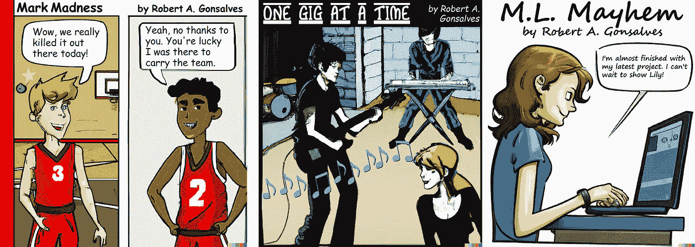

**使用 GPT-3 和达尔-E** 生成的漫画样本，图片由作者提供

我花了上个月的时间探索如何使用 OpenAI 的 [GPT-3](https://openai.com/api/) 文本生成器和他们的 [DALL-E](https://openai.com/dall-e-2/) 图像到文本系统来创建新的连环漫画，而无需编写任何源代码。请注意，这两个系统都处于测试阶段，在我使用了我所有的免费令牌后，他们开始收取象征性的使用费。但是效果还是蛮不错的！OpenAI 授予用户将他们生成的材料用于商业目的的权利。

在这篇文章中，我将提供一些关于 GPT-3 和 DALL-E 的背景知识，解释我如何使用这些系统来创作漫画，并展示结果。一路上，我将强调 GPT 3 中新的文本生成特性，并解释我如何强迫 DALL-E 用不同的视角和姿势绘制同一个角色。

# 使用 GPT-3 创建标题，人物和场景

我之前写过如何使用 OpenAI 的 GPT-3 文本生成器为迷因创建有趣的标题。通过这个项目，我知道了 GPT 3 号可能会很有趣。

OpenAI 用来自书籍和网页的大量文本训练了他们的 GPT-3 神经网络，包括喜剧材料。下面是 OpenAI 的[论文](https://arxiv.org/pdf/2005.14165.pdf)中训练数据的细分:

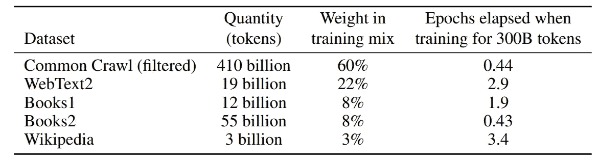

**用于训练 GPT-3** 的数据集，来源: [OpenAI](https://arxiv.org/pdf/2005.14165.pdf)

根据 [OpenAI](https://help.openai.com/en/articles/4936856-what-are-tokens-and-how-to-count-them) 的说法，一个“令牌”大约是一个字的 3/4。使用每页 500 个单词，那就是大约 7 . 5 亿页的文本。

为了使用 GPT-3，你必须在这里创建一个账户[。创建账户后，OpenAI 会给你价值 18 美元的积分，你可以在他们开始向你收费之前使用。然后，您可以导航到操场，输入提示，它将生成新的文本。](https://openai.com/api/)

# 新漫画#1 -马克疯狂

我创作新漫画的第一步是从一个主题概念中产生一个标题。使用 GPT-3 用户界面很容易做到。我只是问了一下。我输入“为一部关于大学体育的幽默漫画创作古怪的标题”,然后点击**提交**按钮。请注意，我使用了默认的型号、温度等设置。这些效果很好。


**使用 GPT-3**，由作者生成关于大学体育的漫画标题

系统显示了结果。

```
**1\. The Benchwarmers
2\. Intramural Idiots
3\. Out in Left Field
4\. One Hitter Wonders
5\. Bleacher Creatures
6\. The Walk-ons
7\. Touchdowns and Turnovers
8\. The Mascots
9\. Mark Madness
10\. Shot Clock Shenanigans**
```

我喜欢“疯狂马克”，所以我用了那个。如果它们都不好，我可以点击**撤销最后一个**按钮，然后**再次提交**来创建一些新的。GPT 三号有很多想法。

请注意，生成的标题不能保证在现实世界中是唯一的。所以我在谷歌上快速搜索了一下，没有找到任何与“疯狂马克”相关的现有漫画一切都好。

## 用 GPT-3 创造角色

为了创建新漫画的角色，我精心制作了这个提示，“为一个关于大学体育的新漫画创建主角，名为马克疯狂。”点击提交。以下是结果，生成的文本以粗体显示。

```
Create lead characters for a new comic strip about college sports called "Mark Madness."1. **Mark: A talented but under-appreciated college basketball player who dreams of making it to the NBA.
2\. Jimmy Chitwood: Mark's talented but egotistical teammate who always seems to steal the spotlight.
3\. Suzie Hurley: Mark's girlfriend and fellow student, who is always trying to get him to focus on his studies.
4\. Mr. McNulty: Mark's crusty old basketball coach who is always harping on him to "play with more passion."
5\. Dean Snyder: The dean of Mark's college, a highly respected academic institution that is also known for its Division I athletics.**
```

这些角色看起来还不错。例如，GPT3 发现主角应该是一个名叫马克的大学篮球运动员。

但是请注意，这组字符中似乎没有太多的文化多样性。GPT-3 的创作者在他们的论文中讨论了偏见和缺乏文化代表性的问题。

> 训练数据中存在的偏见可能导致模型生成定型的或有偏见的内容。这是令人担忧的，因为模型偏见可能以不同的方式伤害相关群体中的人，因为它强化了现有的陈规定型观念，并在其他潜在的伤害中产生贬低的描述。我们对模型中的偏差进行了分析，以便更好地理解 GPT-3 在公平性、偏差和代表性方面的局限性。—汤姆·布朗等人，OpenAI

他们继续讨论他们对模型中性别、种族和宗教的偏见和文化代表性不足的分析。

## 用命令编辑文本

OpenAI 正在 GPT 3 中推出一个新的文本编辑功能，目前处于测试阶段。现在，您可以使用该系统使用文本命令编辑任何现有的散文，而不仅仅是通过响应提示来创建文本。为了测试这一点，我使用了上面的角色列表，并要求系统“使角色在文化和种族上更加多样化。”


**GPT-3 文本编辑**，图片由作者提供

这是结果。

```
**1\. Mark: A talented but under-appreciated college basketball player who dreams of making it to the NBA.
2\. Enrique: Mark's talented but egotistical teammate who always seems to steal the spotlight.
3\. Sandhya: Mark's girlfriend and fellow student, who is always trying to get him to focus on his studies.
4\. Mr. McNulty: Mark's crusty old basketball coach who is always harping on him to "play with more passion."
5\. Dean Wong: The dean of Mark's college, a highly respected academic institution that is also known for its Division I athletics.**
```

好吧，它改了一些名字，像吉米改成了恩里克，苏西改成了桑迪亚，让角色更加多样化。

## 创建场景

文本生成的最后一步是要求 GPT-3 根据给定的标题和角色创建一个场景。下面是我使用的提示，新生成的文本以粗体显示。

```
Create a scene with dialog for a comic strip about a college sports called "Mark Madness."CHARACTERS:
Mark: A talented but under-appreciated college basketball player who dreams of making it to the NBA.
Enrique: Mark's talented but egotistical teammate who always seems to steal the spotlight.
Sandhya: Mark's girlfriend and fellow student, who is always trying to get him to focus on his studies.SETTING: **The basketball court after a big game.****Mark: Wow, we really killed it out there today!****Enrique: Yeah, no thanks to you. You're lucky I was there to carry the team.**
```

那是一段精彩的对话。接下来，我解释我如何使用 DALL-E 来渲染这个场景。

# 使用 DALL-E 从文本中绘制连环漫画

上个月，我写了如何使用 OpenAI 的 DALL-E 图像创建系统来创建数字艺术。这是一个付费系统，目前处于测试阶段，注册[这里](https://labs.openai.com/waitlist)。您输入一个文本提示，然后点击 Generate 按钮，20 秒钟后，您会看到提示中描述的图像的四个版本。它非常容易使用。

## 标记疯狂

对于马克疯狂漫画，我使用了这个提示，“一个在篮球场上的漫画，有两个穿着红色制服的角色，马克，一个有才华的大学篮球运动员，和恩里克，一个自负的队友。”以下是 DALL-E 创作的四幅图像。

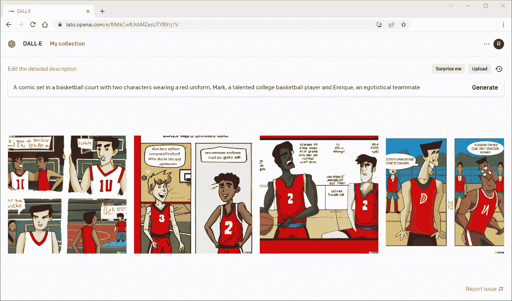

**达尔-E 形象代为马克疯狂，**形象作者

我喜欢第二个，但我需要在 Photoshop 中清理一下。我添加了标题和 GPT-3 生成的对话，替换了单词 balloons 中的乱码文本。这是之前和之后的图像。

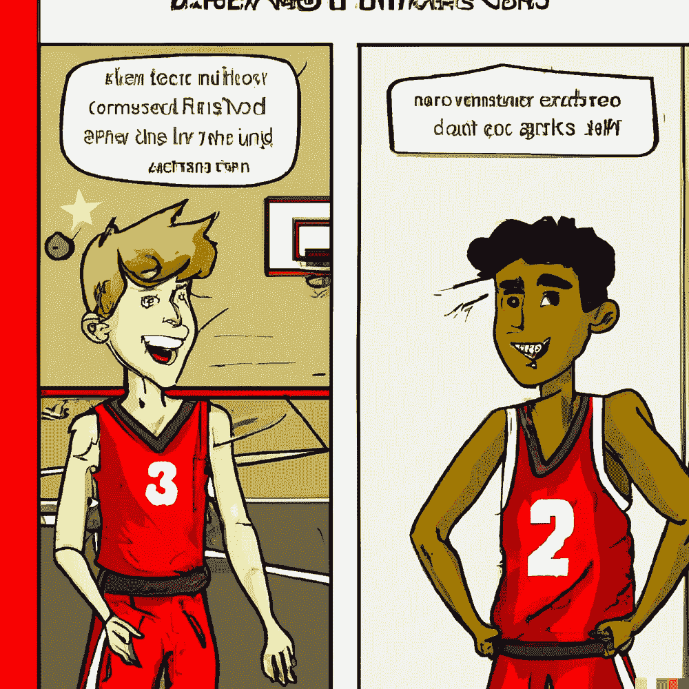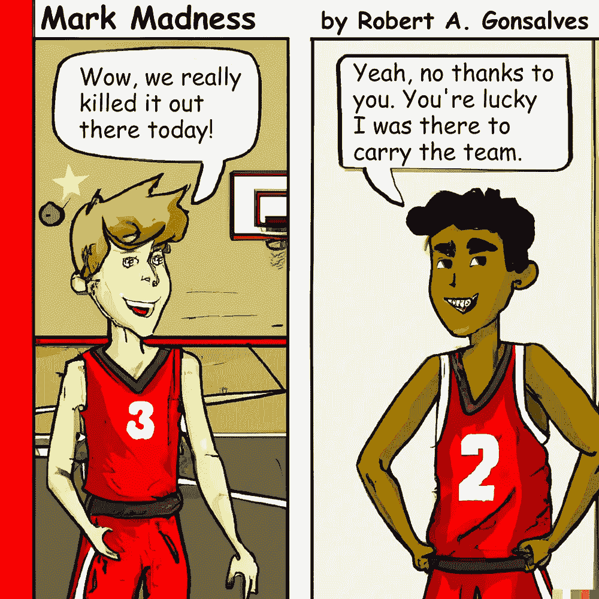

**马克疯狂漫画，原创自 DALL-E** (左)**并在 Photoshop** 中清理后(右)，图片由作者提供

这有点像一个视觉难题，你需要找出十个不同点。你能认出他们吗？🙂

我喜欢漫画的整体外观，有一些可爱的细节，如与球队颜色相匹配的红色竖条。然而，人物的眼睛完全不匹配。我用 Photoshop 里的一个小技巧复制了马克的右眼和恩里克的左眼。当然，我在对话中使用了漫画字体。

# 新漫画#2 -一次一场演出

我用同样的方法用 GPT 3 制作了第二幅漫画的标题、角色描述和场景。这次我从提示开始，“为一部关于车库乐队的幽默漫画创作古怪的标题。”最好的标题是一次一场演出。在为角色生成文本之后，我使用这个提示来生成图像:“一个有三个音乐家的漫画，克莱夫弹吉他，杰玛弹贝斯，拉杰弹电钢琴。”

这是结果。

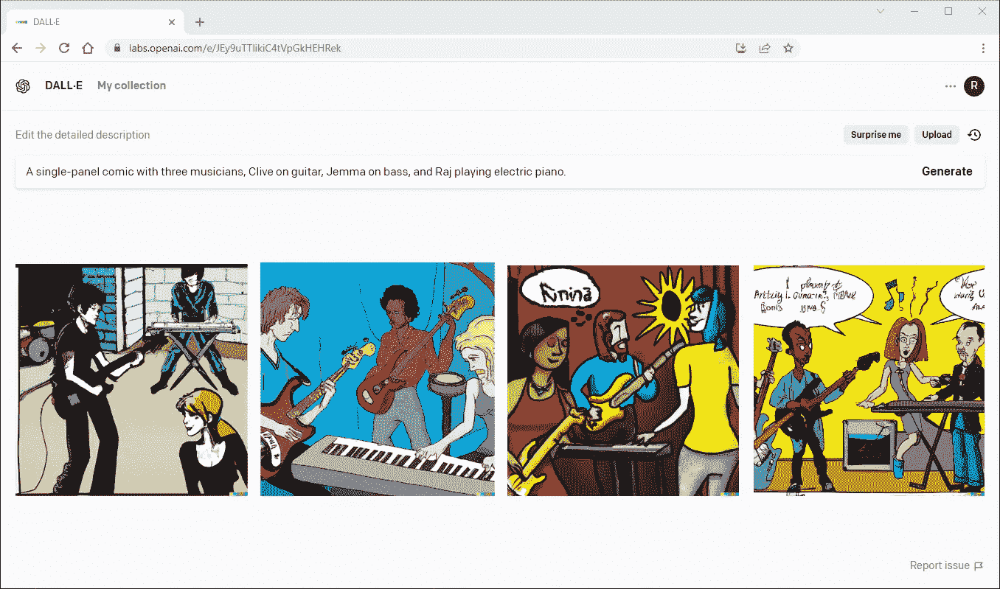

**DALL-E 一次生成一个 Gig 的图像，**由作者生成的图像

这一次第一个图像似乎是最好的。下面是我在 Photoshop 中清理和添加标题前后的样子。

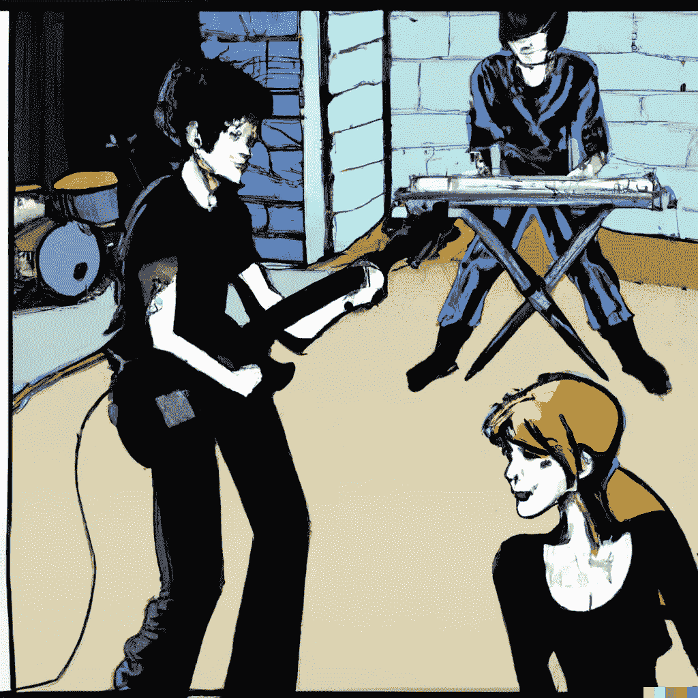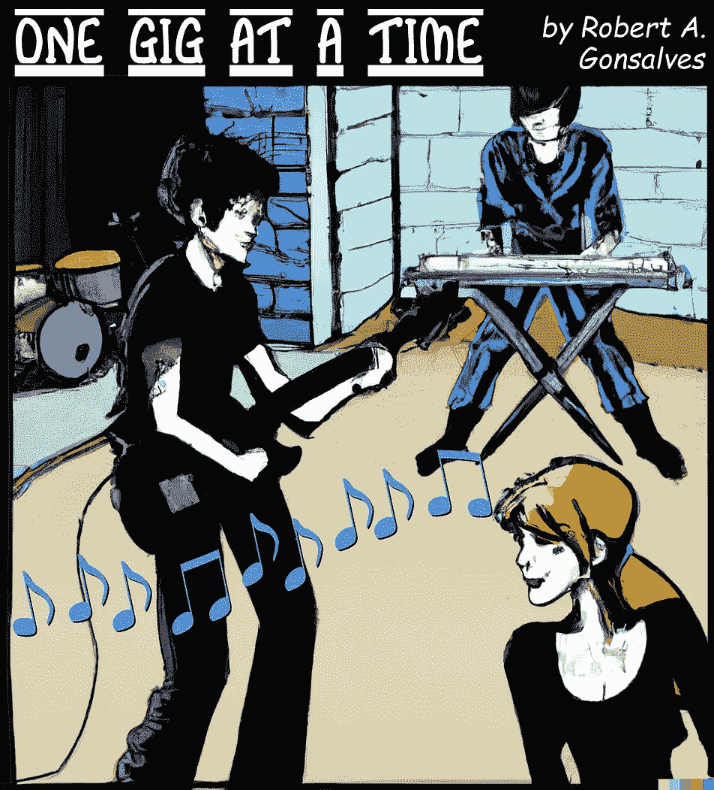

**一次一场漫画，原创自 DALL-E** (左)**并在 Photoshop** 中清理后(右)，图片由作者提供

我从最初的设计中选择了大胆的黑色外观。我不得不把图片向下压缩一点，为标题腾出空间。不需要太多的清理，但我确实在 Photoshop 中添加了音符流。

# 新漫画#3 - ML 混乱

对于这一个，我想看看我是否能创作一个三幅连环画。我从 GPT-3 的这个提示开始，“为一个新的高科技漫画创作古怪的标题。”


**使用 GPT-3**，作者的图片为一部科技漫画制作标题

它提出了一些好的建议。

```
**1\. "ML Mayhem"
2\. "G33k5 Uprising"
3\. "Coding Crazy"
4\. "Cyber security Shenanigans"
5\. "The Great Cloud Catastrophe"**
```

## 为马丁·路德·金创造角色

我喜欢军情六处的混乱，但我把它程式化为军情六处的混乱。然后我让 GPT-3 创造主角。生成的文本以粗体显示。

```
Create lead characters for a new techy comic strip called "M.L. Mayhem"1**. Millie is a brilliant young coder who spends her days creating new ways to make life easier for her friends and family.****2\. Lily Nguyen is Millie's best friend and closest confidante. She's always there to offer a listening ear.****3\. Mayhem is the name of the extremely powerful AI system that Millie accidentally created. It has a mind of its own and is always causing havoc for Millie and Lily.**
```

好吧，我看到它在那里做了什么。这部连环画的名字叫 M.L. Mayhem，所以它给主角米莉和莉莉起了名字。嗯，M 和 l。非常聪明！而肆虐的人工智能系统的名字叫做 Mayhem。干净整洁。

## 为三个面板创建场景

接下来，我让 GPT-3 为三个面板生成场景和对话。

```
Create a scene and dialog for a three-panel techy comic strip called "M.L. Mayhem."CHARACTERS: 
Millie is a brilliant young coder who spends her days creating new ways to make life easier for her friends and family.Lily Nguyen is Millie's best friend and closest confidante. She's always there to offer a listening ear.Mayhem is the name of the extremely powerful AI system that Millie accidentally created. It has a mind of its own and is always causing havoc for Millie and Lily.PANEL 1 SCENE: **Millie is sitting at her computer, her fingers flying across the keyboard as she codes.** **MILLIE: I'm almost finished with my latest project. I can't wait to show Lily!****PANEL 2 SCENE: Lily is sitting on the couch, reading a book.****LILY: I can't wait to see what Millie has been working on. She's so brilliant!** **PANEL 3 SCENE: Millie's computer screen is flashing red and an error message is displayed.****MILLIE: Oh no! What have I done?**
```

## 为多画面连环漫画创作艺术作品

为了这个任务，我真的发挥了 DALL-E 的能力。前两部漫画只有一个面板，但我需要为这一部创建三个面板，并为角色创建一致的外观。

下面是我用来创建基本图像的三个提示。

```
Panel 1: "A techy comic strip where Millie, a brilliant young coder, is sitting at her computer typing."Panel 2: "A techy comic where Lily Nguyen is sitting on the couch, reading a book."Panel 3: "A techy comic, Millie, a college student with red hair and a green shirt, is working on her computer, the screen is showing an error message, and her friend Lily Nguyen, wearing a black shirt and blue sweatpants, is watching in horror."
```

请注意，我不得不稍微修改了一下提示，试图让角色在视觉上保持一致。DALL-E 为三个提示中的每一个生成了四个版本的图像，下面是最好的几个。

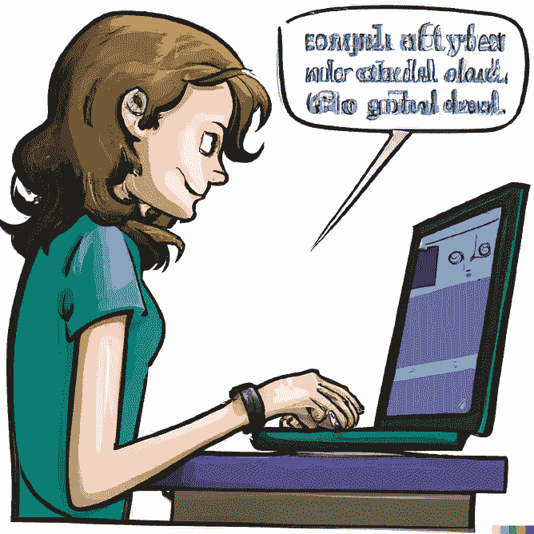

**DALL-E 为 M.L. Mayhem 制作的初始图片**，图片由作者提供

总的来说，这些都很好。但是，除了乱码文本，第三个面板还有一个视觉一致性的主要问题；DALL-E 不知道这些角色到底应该是什么样子。根据提示，它已经尽力了。

## 创建角色研究

为了使角色完全实现，我首先在 Photoshop 中润色了图像，然后创建了一个 3x2 网格的模板，并在左上角绘制了米莉。我让六个面板中的五个保持透明。模板的大小为 1024x1024，这是 DALL-E 的工作分辨率。

然后，我将模板上传到 DALL-E，并使用提示编辑图像，“这是对米莉的漫画的性格研究，米莉是一名出色的年轻大学生和程序员，从侧面和正面展示了她六种不同的姿势。”这是结果。

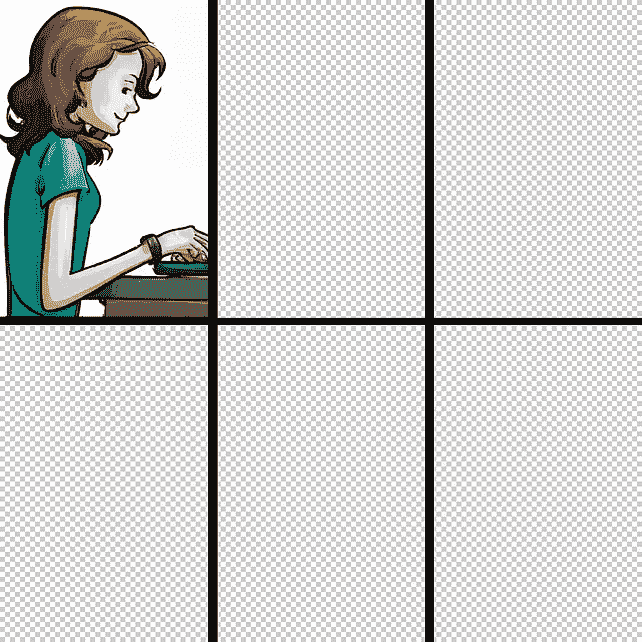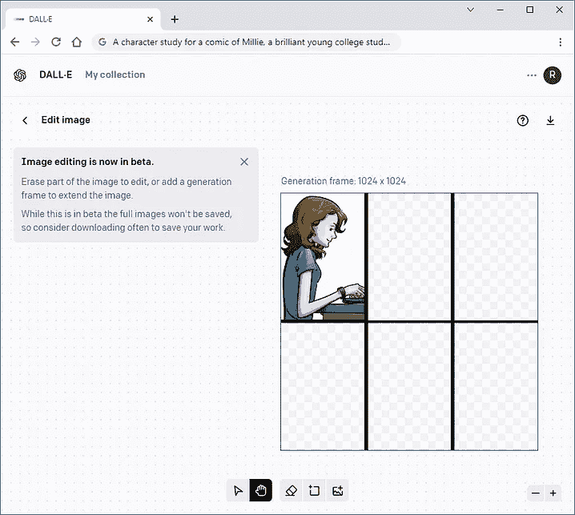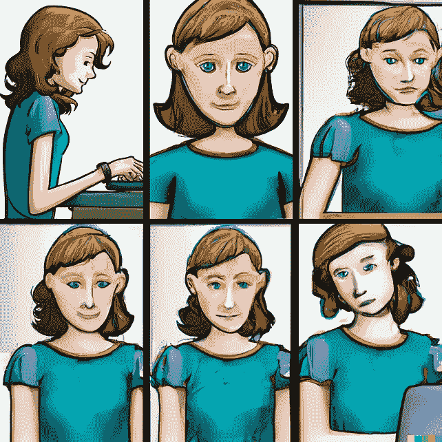

**角色研究模板**(左)**，DALL-E 编辑屏幕**(中)，以及****DALL-E 渲染**(右)，图片由作者提供**

**很明显，DALL-E 知道什么是角色研究，并且很好地将我们的主角渲染成不同的姿势。**

**为了给这幅画创建最终的面板，我选择了其中一个姿势，并把它和透明背景上的莉莉的一部分图像一起粘贴到 Photoshop 中。我擦掉了他们脸上的部分内容，看看 DALL-E 是否能在给出提示的情况下填充他们的表情，“这是一部科技漫画，米莉是一名大学生，正在用电脑工作，屏幕上显示一条可怕的错误信息，她的朋友莉莉·阮(Lily Nguyen)惊恐地看着。”这是结果。**

**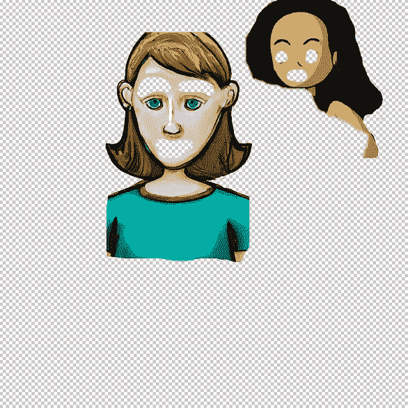****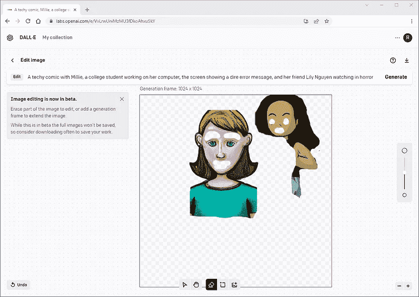******

****部分图像合成**(左)**，DALL-E 编辑画面**(中)，以及**T5**DALL-E 渲染**(右)，图片作者****

**系统在填充细节方面做得很好，比如米莉的手在键盘上打字，给她一个双显示器设置。**

**这是在 Photoshop 中进一步清理后最终的三幅漫画，以及《GPT 3》中单词 bubbles 的对话。**

**************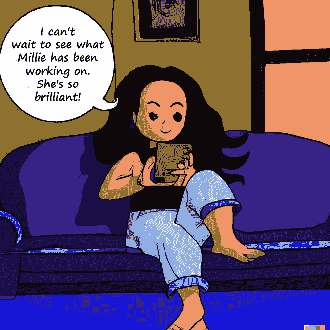******

****M.L. Mayem 连环漫画**，作者图片**

# **最后的想法**

**比较这两个系统，我发现 GPT-3 在生成文本方面比 DALL-E 做得更好。虽然漫画的初始图像作为概念渲染看起来不错，但它们需要一些清理才能用于制作。但主要的问题是 DALL-E 并没有为漫画创作出一致的角色。主要限制源于 DALL-E 中 1024x1024 的图像大小。请注意，OpenAI [最近添加了](https://openai.com/blog/dall-e-introducing-outpainting/)一个新的“outpainting”功能，以便更容易地添加到生成的图像中。然而，新功能只能以渐进的方式工作。它只考虑 1024x1024 帧来生成图像。该系统将需要一个“上传参考帧”功能，以产生一致的视觉元素，如漫画人物。**

# **感谢**

**我要感谢詹尼弗·林对这篇文章的帮助。**

**为了无限制地访问 Medium 上的所有文章，[成为会员](https://robgon.medium.com/membership)，每月支付 5 美元。非会员每月只能看三个锁定的故事。**