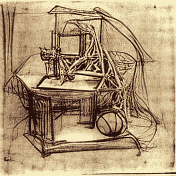
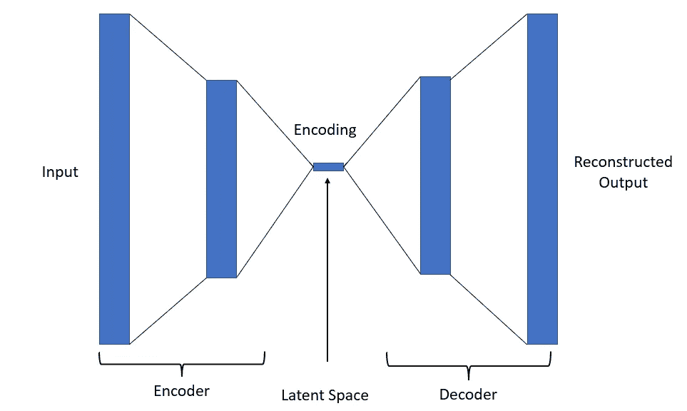
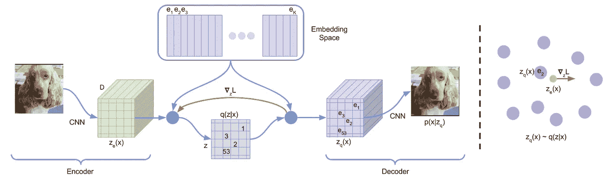
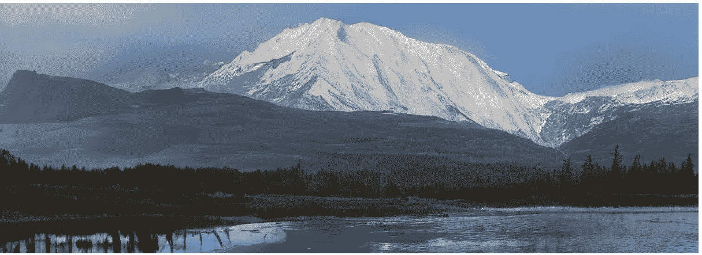
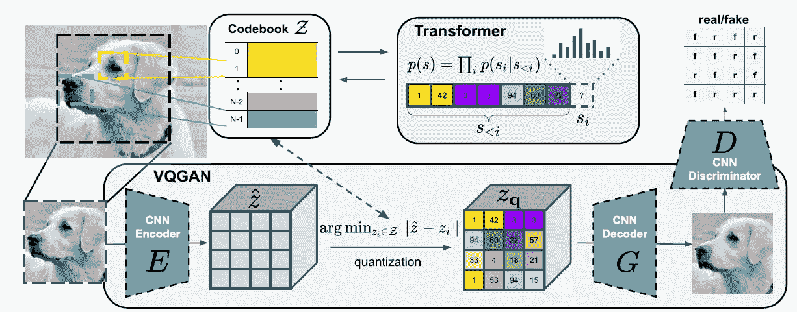
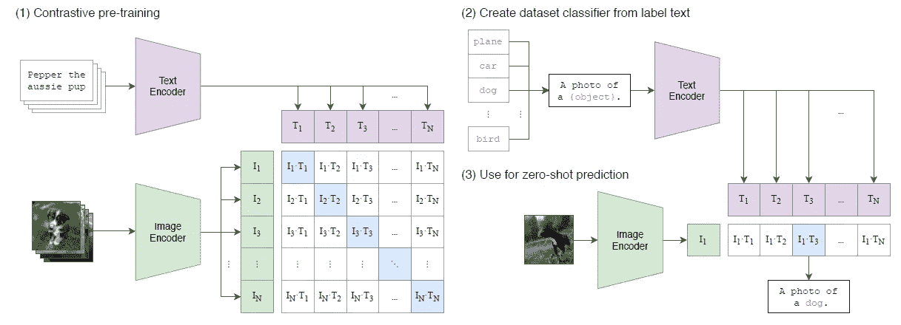
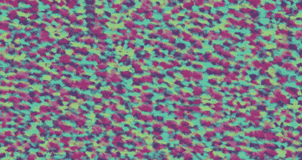
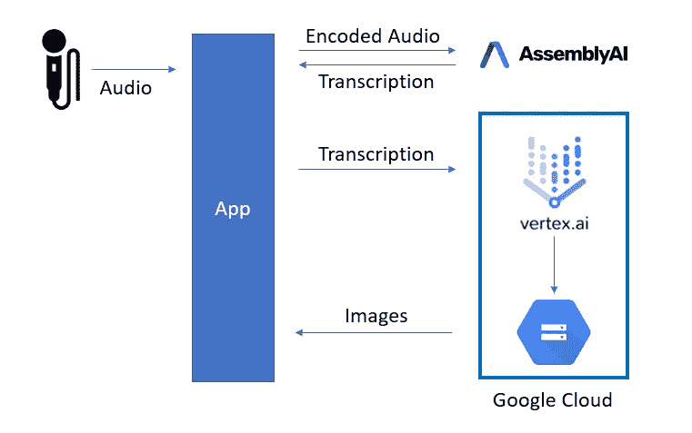
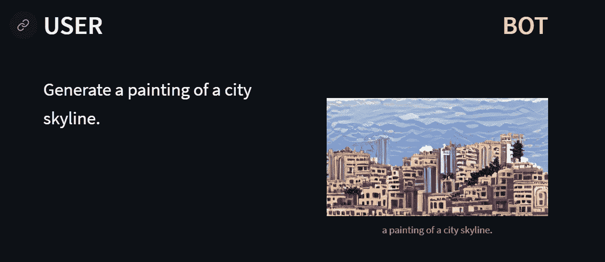

# 用人工智能产生艺术

> 原文：<https://towardsdatascience.com/using-ai-to-generate-art-22e030497f73>

## 应用机器学习

## 一个支持语音的艺术生成工具

作者图片

我已经阅读并应用了一些最新的人工智能研究，所以你不必这么做。在本文中，我将介绍最先进的文本到图像的生成模型，并应用它们来制作一个支持语音的艺术生成工具。

## 介绍

在过去的几年里，文本到图像生成领域出现了一些开创性的论文。这个领域正变得越来越受欢迎，新的方式来赚钱这些艺术品在线。

艺术生成模型在很大程度上建立在我以前的一些文章上，特别是生成方法，如[变分自动编码器(VAEs)](/differentiable-generator-networks-an-introduction-5a9650a24823) 和[生成对抗网络(GANs)](/how-gans-learn-a-simple-introduction-6d21081773bd) 。

作为一个小小的剧透，这里有一些这些惊人的模型可以制作的图像:

绿色景观中的酷炫建筑(图片由作者提供)

手绘草图(图片由作者提供)

日落、船和湖(图片由作者提供)

如你所见，结果是惊人的。但是在我使用这个应用程序之前，先讲一点理论。我将首先回顾 VAEs。然后我会谈到这些在 VQ-维斯和 VQ-甘斯是如何被改编的。最后，我将谈谈 OpenAI 的回形针，以及它如何改变了文本到艺术的游戏。

## VAEs 概述

可变自动编码器是这些模型工作方式的一个组成部分。自动编码器通过训练两个神经网络来学习。第一个是编码器，第二个是解码器。

作者图片

编码器的任务是将输入图像(训练数据)的维度缩小到更低维度的潜在向量。解码器的工作是从潜在向量中尽可能好地重建图像。

标准自动编码器和 VAEs 之间的区别在于，VAEs 不是寻找潜在向量，而是通过例如寻找平均值和标准偏差来参数化潜在空间(最常见的是各向同性高斯)。通过将这个潜在空间拟合为高斯型，我们就能够非常便宜地对这个高斯型进行采样，并将采样提供给解码器。然后，解码器可以用于生成看起来像训练数据的新图像。

*要点:自动编码器学习潜在向量和图像空间之间的映射。VAEs 学习潜在空间和图像空间之间的映射。*

ELBO(图片由作者提供)

VAEs 试图最大化 ELBO(证据下限)。如果你想知道这是从哪里来的，看看这篇文章。第一项是重建误差，第二项是后验 q(z|x)和先验 p(z)之间的 KL 散度。

*   q(z|x)是后验概率，在给定输入数据 *x* 的情况下，看到潜在向量的概率
*   p(z)是先验分布，我之前说过通常是高斯分布

最小化第二项本质上是一种正则化模型的方法，试图总是使空间尽可能接近先验(例如高斯)。

## VQ 值(向量量化值)

> 基于:[神经离散表示学习](https://arxiv.org/abs/1711.00937)，作者:亚伦·范·登·奥尔德、奥里奥尔·维尼亚尔斯、科拉伊·卡武克库奥卢。2017 年 11 月。[1]

今天，许多最先进的人工智能模型，如 DALL-E 和 VG-GANs，都是基于 VQ-瓦斯。正确理解这篇论文是最基本的。VQ-VAE 是由 Deep Mind 开发的一个模型，它提高了 VAE 生成图像的能力。

VAEs 和 VQ-VAEs 有两个主要区别。VQ-维斯学习它们的先验，并且编码器的输出是离散的(而不是学习潜在分布)。

VQ-维斯仍然在学习潜在空间和图像空间之间的映射，然而，他们将潜在空间离散化。

图像的离散输出背后的推理是，语言本质上是离散的，可以用一系列离散的符号来表达。图像可以通过语言来描述，因此解码器应该能够从离散空间重建图像。

图片来自[神经离散表示学习](https://arxiv.org/abs/1711.00937)论文【1】

VQ-维斯首先使用编码器将图像编码成一系列矢量。然后，使用“码本”将编码矢量映射到嵌入空间。码本是可学习的，它是图中所示的作为嵌入空间的一系列向量。人们可以把码本想象成字典，把离散化的潜在空间想象成我们的语言。一旦使用码本映射了模型的输出，我们基本上就有了输入图像的描述。由解码器获取该编码描述，并重建原始图像。

因此，来自我们的编码图像的每个向量被映射到来自码本的嵌入向量。实现的方式是通过选择码本中最接近每个编码矢量的矢量(距离是 L2 范数)。

一旦这些向量被映射到它们的离散化潜在空间，它们就被馈送到解码器，解码器有望精确地重建输入图像。

VQ-维斯损失[1]

以上是 VQ-维斯的损失项。将其与 VAE·爱尔博损失进行比较，可以看到我们有类似的重建误差。我们不再有 KL(因为统一的先验而消失)，取而代之的是第二个和第三个项。在第二项中，我们有一个停止梯度，它冻结编码矢量(z)并帮助学习码本矢量(e)。第三项是相反的，它冻结码本向量，并帮助学习编码向量。

解码器仅使用第一项进行优化，编码器使用第一项和最后一项，嵌入(学习码本向量)仅使用中间项。

在整个训练过程中，先验保持一致，但是，在训练之后，它们使用 PixelCNN 拟合新的先验。

## VQ-甘斯(矢量量化甘斯)

> 基于:Patrick Esser、Robin Rombach、bjrn Ommer 的《驯服高分辨率图像合成的变形金刚》。2020 年 12 月[2]

高分辨率合成图像由[驯服高分辨率图像合成变压器](https://arxiv.org/abs/2012.09841)【2】

VQ-甘斯是 VQ-维斯的改进。这篇论文是开创性的，因为它首次能够通过使用变压器生成连贯的高分辨率图像。他们能够通过应用基本假设来做到这一点，即图像中的低级结构可以通过图像中的局部连通性来描述，而这种方法不能用于图像的高级结构。

这些模型结合使用了 GANs 和 VAEs。作为对 GANs 的快速提醒，这些模型分两部分学习。第一个是生成图像的生成器，第二个是鉴别器，一个分类器，试图识别你给它的图像是真是假。这些模型可以一起学习，本质上是试图欺骗对方。一旦它们被训练好，你就用生成器来生成新的图像。

图像由[驯服高分辨率图像合成变压器](https://arxiv.org/abs/2012.09841) [2]

上图展示了 VQ 甘斯的建筑。您可能已经意识到，底层模块是集成到该架构中的 VQ-瓦斯，因为它充当 GAN 的发生器。

VQ-甘斯本质上是对 VQ-VAE 的改进。两个主要区别是，他们没有使用 PixelCNN 作为模型来拟合先验，而是拟合了一个变压器(他们使用了 OpenAI 的 GPT-2)。第二个区别是他们改进了损失函数，这次使用了对抗性损失(使用 GAN 架构)。

你可能会注意到上图中鉴频器的输出是一个矩阵，而不是二进制输出。这是因为他们使用了补丁 GAN。这将获取图像的重叠碎片，并像普通鉴别器一样对每个碎片进行操作。

图像中的变换器像顺序语言模型一样被训练，其中变换器试图预测编码码本向量的序列。然后，变换器用于学习码本嵌入向量。

## 对比图像语言预训练

> 基于:[从自然语言监督中学习可转移的视觉模型](https://arxiv.org/abs/2103.00020)亚历克·拉德福德等人 2021 年 2 月。[3]

到目前为止，我们已经看到了生成图像的方法，但是我们如何将它与文本联系起来呢？OpenAI 的剪辑是一个模型，可以确定哪个标题与哪个图像最匹配。它不能生成图像，但它是图像生成和文本之间的连接。

图像由[从自然语言监督中学习可转移的视觉模型](https://arxiv.org/abs/2103.00020) [3]

以上是 CLIP 模型的架构。图像中显示的模型有三个部分。

1.  *对比预培训*

模型的输入是图像和描述文本对。文本和图像输入分别通过各自的编码器。一旦这样做了，你就可以构建上面矩阵所示的对比空间。训练的目标是将蓝色方块的余弦相似度推至 1，将所有其他方块的余弦相似度推至 0。通过这种方式，我们教导文本编码器和图像编码器将它们的输入编码到相似的空间。

2.*从标签文本创建数据集分类器*

对比预训练不足以确定文本和图像是否相同。我们需要进行某种分类。例如，假设我们有一只狗和一只猫的两张图片。这些图像可能彼此非常相似。如果我们拍摄了狗的图像，但是文本显示为猫，我们希望 CLIP 知道这个图像与所涉及的文本无关。

为了将该分类器功能应用于预训练的模型，他们首先需要建立分类器数据库。他们首先从标记的图像数据中构建样本句子。网上有很多带标签的图像数据集，如 CIFAR-10、ImageNet 等。这些图像被分配了类别，而不是句子。为了解决这个问题，他们将类添加到句子中。

例如，如果你有一张狗的图片，你可以给文本编码器一个句子，比如“一张狗的照片”。我们这样做是为了构造数据集中每个类的嵌入向量。

3.*用于零炮预测*

一旦我们有了学习过的嵌入向量，我们可以给图像编码器相应的图像对到文本，我们可以比较编码器的输出和我们的嵌入。余弦相似度最大的将是该类。

文本和图像编码器都可以通过这种方式进行改进，从而得到更好的结果。

## VQ-甘+剪辑

因此，我们有 VQ-甘斯，它可以基于离散空间生成图像，我们有 CLIP，它可以评估图像与文本的匹配程度，反之亦然。

当文本输入到 VQ-甘-剪辑，VQ-甘首先用随机噪声初始化，并产生一个图像。然后，该图像和编码的码本向量可以被馈送到剪辑图像编码器，并根据它们与文本输入的相似性进行评估。然后可以相应地更新 VQ-甘的权重以反映文本输入。这可以递归地进行 N 次迭代，直到生成器的输出是文本输入的满意表示。

算法的收敛性(作者 GIF)

还有更先进的模型，如 OpenAI 的 DALL-E 和最近的 DALL-E2。(DALL-E 这个名字来源于 Dalí和 WALL-E 的混合，非常聪明)。这些模型产生了文本输入的极其复杂的表示。然而，它们不是公开的，所以我不能乱来，也不能在这里展示他们的作品。但是你可以通过[这个链接](https://openai.com/dall-e-2/)查看其中的一些。

## 我自己的艺术生成应用

现在我已经看完了所有的理论和最新的模型，我想自己应用它们。之前我做了自己的[智能助手 App](/using-ai-to-make-my-own-smart-assistant-app-5ad015449447) 。在这里，我想修改它，让它能够使用人工智能生成艺术。你可以在[我的 Github](https://github.com/diegounzueta/Medium-Articles-/tree/master/AssemblyAI%20Smart%20Assistant) 上查看这个应用的一些代码。

这个想法是能够通过我的声音访问这些模型。我想正常使用智能助手，但如果我给模型一个“触发词”，它会使用句子的其余部分作为提示，生成一幅艺术作品。

应用架构(图片由作者提供)

为了将音频转录为文本，我使用了 AssemblyAI 的 Websocket api 来实时地将我的讲话转录为文本。为了执行模型，我使用了[谷歌云](https://cloud.google.com/)的 VertexAI。

为了运行模型并生成艺术作品，我需要将模型作为作业在云上执行。我不能在我的本地机器上运行这些模型，因为它们真的需要 GPU。为了运行这些模型并生成图像，我首先通过设置一个“setup.py 文件”来安装所需的库。然后，我在可以访问虚拟 GPU 的虚拟机上执行作业。

最后要做的是配置智能助手，使其能够生成艺术。我通过简单地添加一个 if 语句来合并“触发词”，如果句子以“生成”开头，那么我将句子的其余部分传递给艺术生成器模型，作为 Vertex AI 的一项工作。工作完成后，我将图像保存到一个桶中，然后我可以访问并加载到应用程序中。

作者图片

在这里，我要求机器人“生成一幅城市天际线的画”。触发词是“生成”，然后应用程序获取句子的其余部分，并将其传递给作业请求。我发现这个触发词是可靠的，而且效果很好。

就这样，我现在有了一个智能助理应用程序，可以根据请求为我生成艺术作品。

作者图片

## 结论

在这篇文章中，我通过最新的人工智能研究论文的技术方面来从文本中生成图像。我回顾了基本的生成器方法架构，比如 VAEs(可变自动编码器)和 GANs(生成对抗网络)。然后我会谈到如何在矢量量化的研究论文中采用这些方法来提高它们生成图像的能力。总之，这些方法设法离散化状态空间，当与 CLIP(一种比较图像与文本相似性的方法)结合使用时，这些模型能够生成令人惊叹的艺术作品。

我特别兴奋地看到这一研究领域将如何在未来传授给数字艺术行业，如视频游戏或动画电影，因为我相信这项技术有可能彻底改变这些行业！

## 支持我

希望这对你有所帮助，如果你喜欢，可以 [**跟我来！**](https://medium.com/@diegounzuetaruedas)

您也可以使用我的推荐链接成为 [**中级会员**](https://diegounzuetaruedas.medium.com/membership) ，并访问我的所有文章及更多:[https://diegounzuetaruedas.medium.com/membership](https://diegounzuetaruedas.medium.com/membership)

## 你可能喜欢的其他文章

[支持向量机](https://medium.com/p/4f50d1e3d4d2)

[精度 vs 召回](https://medium.com/p/d1d5bad79e72)

## 额外收获:如何向 Vertex AI 启动作业

作为一点额外的补充，我想包括一些关于如何部署这些模型的信息，因为我遇到了很多困难，而且这并不像看起来那么简单。

这些模型运行在云中预先构建的映像上。在 GCP 上有很多，我用的是“Europe-docker . pkg . dev/vertex-ai/training/py torch-GPU . 1–10:latest”。

然而，为了让模型运行起来，我还需要一些镜像中没有的包。为了解决这个问题，我随自定义作业一起传递了一组包。

为了传递这些必须编译成 tar.gz 文件的软件包，我使用了“setup tools”Python 库。

然后，我必须将 Python 作业包装成一个模块。这是通过添加 __init__ 来完成的。py 文件添加到 task.py 文件的位置，并稍微修改 python 脚本。

以下是我使用的自定义工作函数:

作业不能每次都是相同的 python 脚本。这是因为每次我请求不同的画时，标题都会改变。每当我启动一个作业时，我都需要将该信息传递给那个特定的作业。

我这样做的方式是通过旗帜。在执行 Python 文件时，可以通过命令行将标志作为选项传递。有了 absl-py 库，我能够阅读这些，并把它们传递给艺术生成模型。

下面是我发送给 VertexAI 的任务的 task.py 文件结构。

希望这有所帮助:)

## 参考

[1] A. van den Oord，O. Vinyals 和 K. Kavukcuoglu，“神经离散表征学习”(VQ-VAEs)，*康奈尔大学*，2017 年。可用:【https://arxiv.org/abs/1711.00937】T2。

[2] P. Esser、R. Rombach 和 B. Ommer，“驯服高分辨率图像合成的变形金刚”(VQ-甘斯)，*康乃尔大学*，2020 年。可用:[https://arxiv.org/abs/2012.09841](https://arxiv.org/abs/2012.09841)

[3] A .拉德福德等，“从自然语言监督中学习可转移视觉模型”(CLIP)，*康乃尔大学*，2022。可用:[https://arxiv.org/abs/2103.00020](https://arxiv.org/abs/2103.00020)