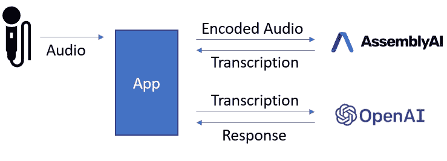
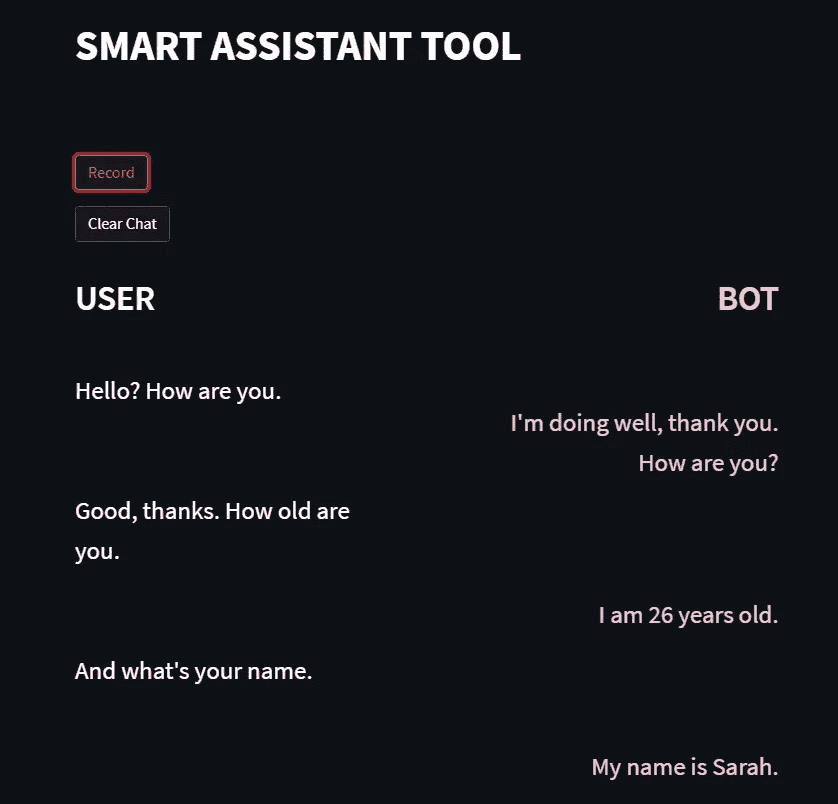
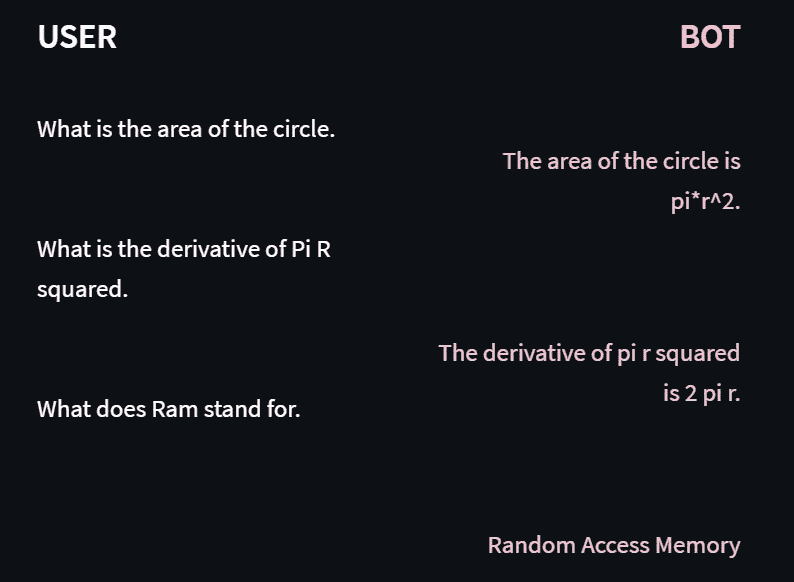
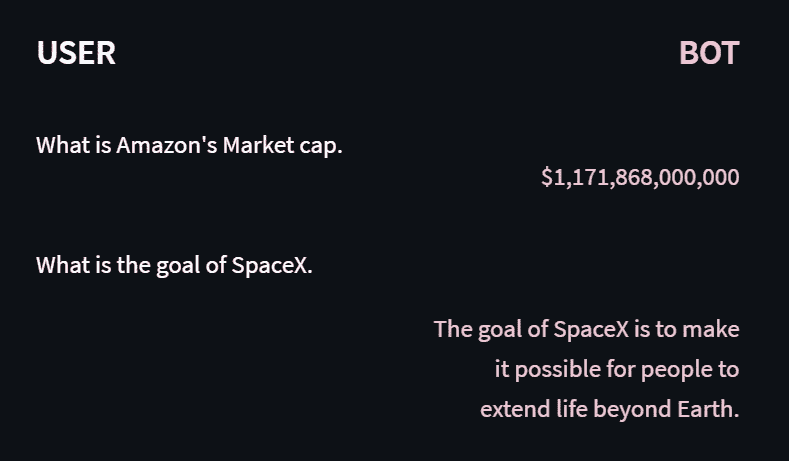

# 用 AI 做自己的智能助手 App

> 原文：<https://towardsdatascience.com/using-ai-to-make-my-own-smart-assistant-app-5ad015449447>

## 应用机器学习

## 使用 Python 和 GPT-3 制作的智能助理应用程序

图片由[摄影盒](https://www.shutterstock.com/image-illustration/robotic-hand-cylinder-shape-sorting-toy-650430337)中的 [maxuser](https://www.shutterstock.com/g/maxuser) 拍摄

随着苹果的 Siri、亚马逊的 Alexa 和谷歌 Home 等产品的出现，购物助手变得越来越受欢迎。在本文中，我用 Python 制作了自己的智能助手。

# 介绍

智能助手允许你通过语音交互从网络上快速收集信息。在制作智能助手时，我想制作一个具有图形用户界面的 web 应用程序，在那里我可以使用我的语音与智能助手进行交互。在这篇文章中，我详细介绍了我是如何制作这个应用程序的，我使用了哪些工具和方法。用于这个小项目的许多工具可以用于许多其他项目。

# 方法

为了做智能助手，我用了 OpenAI 的 GPT-3。GPT-3 是由 [OpenAI](https://openai.com/) 训练的海量语言模型。它经过预先训练，能够很好地推广到各种各样的用例。

我的目标是制作一个应用程序，通过它我可以用我的声音与 GPT 3 互动。

该应用程序的整体流程图如下所示:

作者图片

为了将我的声音传递给 OpenAI，我首先需要将我的讲话传递给文本。所以首先我用 Streamlit 应用程序录下我的声音。然后，我对录音进行编码，并将其传递给 [AssemblyAI](https://www.assemblyai.com/) 进行转录。我收到了抄本并把它传给了 OpenAI。然后，我可以将回复显示在应用程序上。

为了通过应用程序与这些服务通信，我使用了它们的 API。

# 什么是 API？

应用程序接口(API)是软件程序相互通信的方式。为了让它们进行交互，API 提供了一组协议和工具来帮助交互成功。

这两个服务都有 Python 中的 API，所以我可以轻松地将这两个服务集成到应用程序中。API 允许我访问由公司开发和托管的服务、工具和人工智能模型。我可以向他们发送一个请求，询问我希望他们的模型为我处理什么，然后我得到一个响应，其中包含他们预先训练好的模型的输出。

# 你如何使用 API 的？

为了实时转录音频，我使用了 AssemblyAI Websocket API。与 HTTPS 连接不同，Websocket 连接允许双向发送和接收来自 API 服务器的请求。这样我可以实时转录数据。

为了建立 WebSocket 连接，我使用了 Python 中的异步库“asyncio”和“websockets”。下面是代码的样子:

在上面的代码中，我连接到 WebSocket URL，并尝试接收连接确认(参见上面的 session_begins)。

一旦连接，我可以定义发送和接收函数，这将允许我以我想要的方式与 API 通信。

在 send 函数中，我首先收集我的音频，将其编码为 utf-8，然后使用 WebSocket 发送。当处理音频文件或 API 时，utf-8 编码是相当标准的。

在接收功能中，我首先从音频文件中接收转录的文本，我将该文本发送到 OpenAI 并接收来自 GPT-3 的响应。

# 使用 Streamlit 构建应用程序

Streamlit 可用于快速构建网络应用。该应用程序的目标是提供一个图形用户界面(GUI)，以便用户可以在不使用任何代码的情况下与智能助理无缝交互。

我现在将详细说明我用来制作应用程序的代码结构。我总是把我的 Streamlit 应用包在一个类里。整个代码结构如下所示:

该应用程序包含两个按钮。第一个是记录按钮，第二个是清除聊天按钮。

录制按钮开始录制您的语音，然后转录并发送文本到 OpenAI。然后，响应会以聊天对话的形式显示在应用程序上。

该应用程序会记录下存储聊天内容的对话。txt 文件。当按下清除聊天按钮时。txt 文件被清除。

这个应用程序的最后一个我不能在这里展示的功能是文本到语音转换。当机器人回应时，它会读出句子。为此，我使用了 pyttsx3 库。

# 与工具交互

作者图片

上面是这个应用程序的截图。最上面是应用程序的两个按钮。要与智能助理互动，您可以按录音并说出您的信息。你的信息的副本显示在左边，GPT-3 的回应显示在右边。

这位聪明的助手显然名叫莎拉，今年 26 岁。这个应用程序似乎工作得很好，它可以检测我的声音，并以一种全面的方式显示出来。智能助理可以处理更复杂的查询:

作者图片

智能助手在处理基本几何图形或首字母缩略词时没有问题。这个机器人也知道现代公司的背景:

作者图片

# 结论

在这篇文章中，我介绍了我是如何制作智能助手应用程序的。该应用程序能够记录你的声音，转录它，将转录传递给 OpenAI 的 GPT-3，并为你读出回应。我介绍了该应用程序的管道是什么样子，以及该应用程序是如何在 streamlit 上编程的。最后，我回顾了一些我与智能助手的交互示例。总的来说，我认为这个应用程序很有用，效果很好。

# 支持我

希望这对你有所帮助，如果你喜欢，可以 [**跟我来！**](https://medium.com/@diegounzuetaruedas)

您也可以成为 [**中级会员**](https://diegounzuetaruedas.medium.com/membership) 使用我的推荐链接，访问我的所有文章以及更多:[https://diegounzuetaruedas.medium.com/membership](https://diegounzuetaruedas.medium.com/membership)

# 你可能喜欢的其他文章

[利用人工智能分析语音](https://pub.towardsai.net/using-ai-to-analyze-speech-3a3bbf6248ac)

[AI 应用于掩膜检测](https://medium.com/p/2105956c8720)