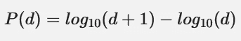
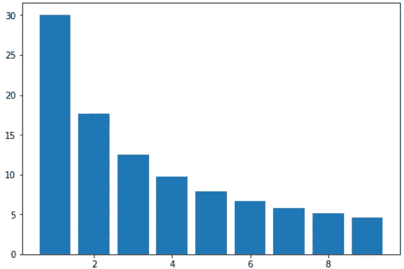
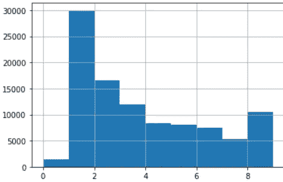
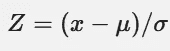
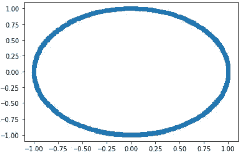
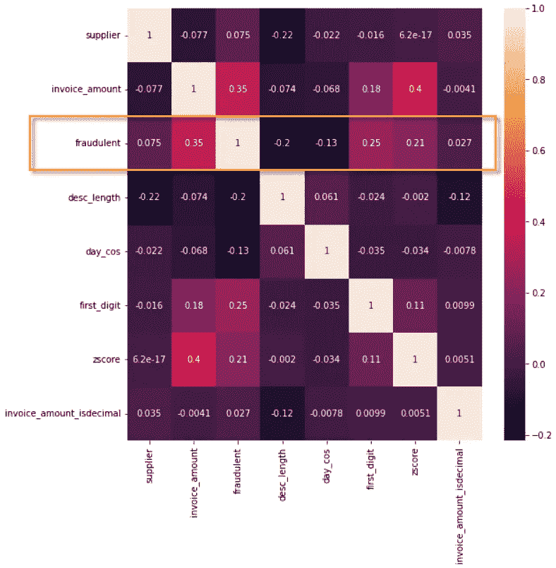
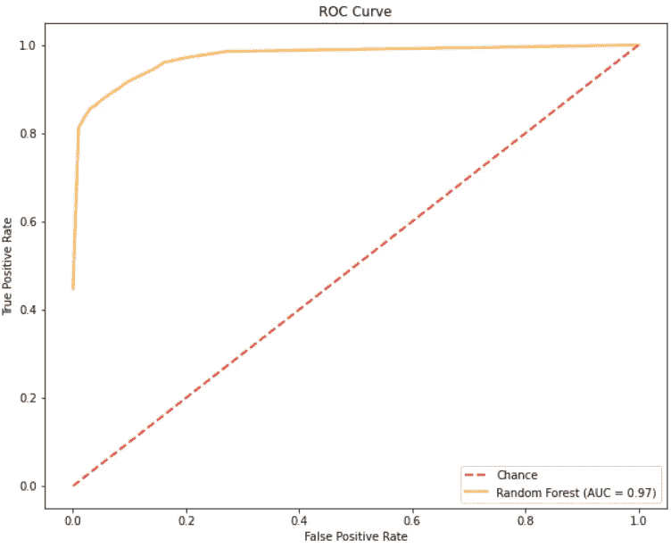

# 使用人工智能防止供应商发票欺诈

> 原文：<https://towardsdatascience.com/using-ai-to-prevent-supplier-invoice-fraud-fed13f2aaab4>

照片由 [Unsplash](https://unsplash.com?utm_source=medium&utm_medium=referral) 上的[阿扎马特 E](https://unsplash.com/@esen_aza?utm_source=medium&utm_medium=referral) 拍摄

供应商发票欺诈是商业中的一个重要问题。每年都有数百万美元因供应商提交的不正确或无效发票而损失。这里概述的基于机器学习的方法能够在这些发票到期支付之前识别高达 97%的发票。

此处使用的示例基于一个私有的匿名数据库，该数据库包含一家服务公司五年内的约 9 万张发票，该公司反过来购买服务和商品进行转售。该公司已经允许在本文中使用发票数据库。

在开具发票期间，该公司一直存在一个问题，即供应商提交的发票金额夸大、金额错误，有时还会提交从未提供的货物/服务的发票。

经过仔细的人工分析后，许多发票被标记为欺诈性的，这些发票用于训练此处的模型。值得注意的是，这里的“欺诈”一词并不一定意味着故意欺诈，还包括无意的数据输入错误。

首先，我们将数据加载到 Pandas 数据框架中，并整理一些缺失的值:

在生成人工智能模型之前，需要大量的特征工程。探索的第一个项目是[本福特定律](https://en.wikipedia.org/wiki/Benford%27s_law)的应用。这表明，在自然出现的数据集中，前导数字更可能是一个小数字，而不是一个大数字。

计算的基础是数字的对数正态分布，而不是数字本身。

本福特定律

基于此，每个发票金额的第一个数字的分布应该如下所示:

本福特定律下第一位数的分布

第一个数字大约有 30%的概率是 1，大约有 4%的概率是 9。对发票数据集的分析揭示了真实世界的分布情况:

第一位数的真实分布

我们可以立即看到，数字 9 的出现比我们预期的要高。此外，对于小数值小于 1 的发票，数字 0 也会出现。

为了在模型中利用本福特定律，我们将把发票金额的第一个数字分离到一个名为“first_digit”的新列中。

接下来，我们将为每张发票生成一个 [z 分数](https://www.investopedia.com/terms/z/zscore.asp)。这是衡量一个值与其组的标准偏差的距离。在这种情况下，我们将按供应商对发票进行分组，并获得每张发票的标准差。

z 得分是减去组平均值的值，除以组标准偏差

这是使用下面的代码生成的:

有趣的是，据报道，在夏季的几个月里，欺诈的发生率较高。虽然对此没有明显的解释，但还是决定进一步调查。

为此，发票日期被转换为基于自 1 月 1 日以来的天数的新功能。这允许所有年份都被平等地处理。

因为 12 月 31 日紧挨着 1 月 1 日，所以需要将*天数*转换成一个循环值。这是通过生成天数除以一年 365 天的余弦值来实现的。绘制该值会给出下图，其中每个值都在-1 和+1 之间:

天数的正弦值与余弦值的对比表明了数据的循环性质

最后，我们将创建另外两个特征。同样，根据传闻信息，据报道，欺诈性发票通常是整数金额，没有小数，而且更常见的是描述也较短。

为了解决这种可能性，添加了另一个新特性来标记金额是否包含小数，以及发票描述的长度。

然后对包括新特征在内的数据集进行分析，以寻找相关性:

数据集中列的相关矩阵

从上面的关联矩阵中，如果我们查看与“欺诈”字段相关的行，我们可以观察到许多有趣的事情。

首先，与发票金额有很强的相关性。这在某种程度上是意料之中的，因为欺诈者不太可能开具低值发票。我们已经知道，数据集包含许多值小于 1 的发票，因此大额发票可能更经常是欺诈性的。

这似乎也与发票描述的长度有关。这表明欺诈性发票更有可能具有较短的描述。

支持本福特定律，我们可以看到与发票金额第一位数字的相关性。最后，我们可以观察到，zscore 还与发票是否存在欺诈行为相关联。

这里的下一步是选择要使用的最佳分类器类型。虽然我们有许多与欺诈与否密切相关的特征，但这些特征彼此之间没有很强的相关性。例如，发票描述的长度与发票金额的第一位数字具有 0.024 的相关性。

由于这些特征之间的相关性较弱，因此选择了随机森林分类器。这种分类器通过创建几个独立的决策树来工作，每个决策树输出自己的预测。然后将这些组合在一起，做出最终预测。

我们现在将把数据分成测试和训练数据集，并训练一个随机森林分类器。

经过训练后，该模型能够对测试数据集进行预测，准确率高达 97%(精确度 92%，召回率 78%)。

为了评估模型的整体质量，我们现在将生成一条 ROC 曲线。

这将生成下图:

训练后模型的 ROC 曲线

该模型本身能够实现超过 80%的准确性，而不会产生大量的假阳性。略高于 90%的准确度代表了产生少量假阳性的折衷。

总的来说，这种方法能够达到非常高的准确性，这取决于您愿意接受的假阳性的数量。

然而，这完全取决于源数据的性质，所有的公司都不尽相同。此处显示的许多因素都是该公司及其所在行业特有的，例如欺诈活动的季节性和发票金额的分布。要成功地将这种方法应用到另一家公司，对其业务的透彻理解将是极其有益的。

*注:除特别注明外，所有图片均为作者所有。*