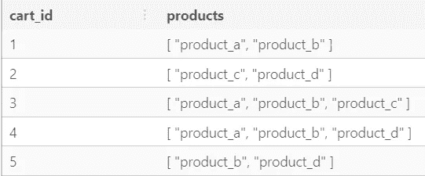
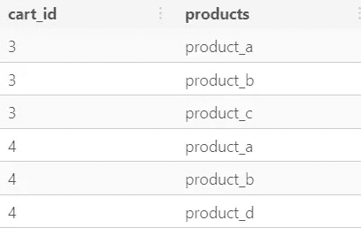
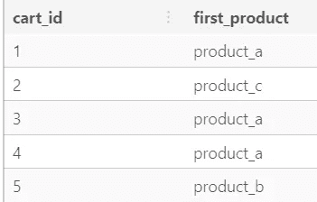
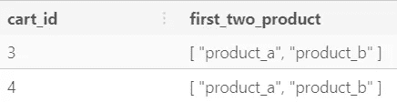
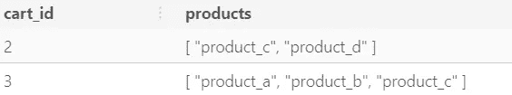
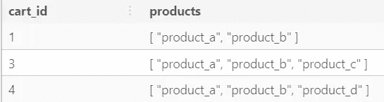
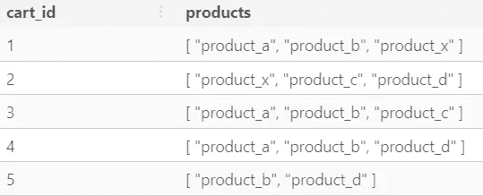
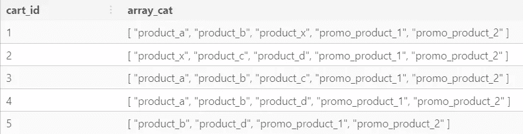

# 在 PostgreSQL 中使用数组

> 原文：<https://towardsdatascience.com/using-arrays-in-postgresql-450202a2b57f>

## 学习在 SQL 中创建和操作列表和嵌套结构

卡斯帕·卡米尔·鲁宾在 [Unsplash](https://unsplash.com?utm_source=medium&utm_medium=referral) 上的照片

当您想到表的 SQL 图像时，选择查询和每个数据点一行的概念(没有嵌套结构)可能会浮现在脑海中。
但是如果你想存储一个数字、产品等的列表呢？一排以内？
你当然可以将列表分解成许多行，但是这可能会导致难以跟踪的行的混乱。幸运的是，PostgreSQL 提供了数组数据类型，可用于存储和操作列表。
下面是方法:

## 数组类型

PostgreSQL 允许将表中的列定义为可变长度的多维数组。可以创建任何内置或用户定义的基本类型、枚举类型、复合类型、范围类型或域的数组。

## 创建数组

数组可以采用多种形式，并且有多种方法来声明它们。

您可以在列的数据类型声明后使用关键字 ARRAY 来表示您想要创建一个声明前数据类型的数组，如下所示。

您也可以在数据类型声明后面加上方括号(例如 text[])，但是我发现这样不太明确，并且不符合关键字版本所遵循的 SQL 标准。

在下面的例子中，我创建了一个小表来模拟购物卡，并用多种产品的一些排列来填充它。如果您运行完整的查询，您还可以看到数组是如何表示为输出的。

创建和填充数组列

结果表

向表中添加数组的另一种方法是使用{ }-语法，而不是带括号的 Array 关键字。两种方法都有效，你只需要**密切注意带花括号的引文**。，我再次发现关键字语法更明确，括号更接近于其他编程语言中的数组表示，但两者都工作得很好。

## 取消阵列嵌套

但是等等！如果您实际上需要展开或取消嵌套特定行的数组，以便在某个产品信息表上连接或在列表项基础上执行其他操作，该怎么办？

没问题，PostgreSQL 中的数组可以很容易地用 UNNEST 关键字取消嵌套:

取消对数组列的嵌套

正如所料，UNNEST 在原始行的相应数组中为每个项目创建一行:

取消阵列嵌套的结果

## 访问数组项目

您可能会问自己，每次想要访问单个项以进行进一步操作时，是否必须取消数组嵌套。如果是这样的话，数组结构可能并不是一个好主意。幸运的是，PostgreSQL 中的数组允许通过括号和切片索引进行访问，如下所示。这允许容易地选择例如每个列表中的第一个项目或列表中特定范围的项目。

***注意:PostgreSQL 数组中的索引从 1 开始，而不是从 0 开始，这可能与你在其他编程语言中所习惯的不同。***

通过索引访问数组项

切片使用[start:end]-语法。

通过对具有两个以上数组元素的所有行进行切片来访问数组项。

如果你不确定你的数组有多少项，或者你想按照数组的大小进行过滤，就像我上面做的那样，你可以使用 CARDINALITY 关键字。这将返回数组中的整数个数。

## 按数组元素过滤

如果您想选择数组中有特定产品的所有购物车，该怎么办？或者任何其他基于数组项的筛选操作？没问题，PostgreSQL 允许将 WHERE 子句中的 item 值与 ANY 关键字结合使用。下面，我正在筛选产品数组列中包含“product_c”的行。这种过滤方式对单个过滤值最有用。

按数组中的项目筛选行

## 包含运算符

您还可以从上面扩展过滤器逻辑，并要求任何包含特定子数组的购物卡。在这里，我使用了代表“包含”的“@ >”操作符。可以这样理解:

"产品数组包含数组['产品 a '，'产品 b']"

## 更新阵列

数组和数组值可以像其他数据类型一样进行更新，使用 UPDATE … SET …子句，如下所示。您可以通过索引更新单个数组项，也可以更新整个数组。

## 前置和追加

如果您希望通过追加或前置(在当前值之前插入)数组来专门改变数组，您可以相应地使用 ARRAY_APPEND 和 ARRAY_PREPEND 函数。确保**注意到参数顺序**的不同，每个函数的顺序不同，但遵循直觉顺序。

追加和前置数组

前两行通过追加和前置进行更改

## 移除数组项目

如果你想去掉一个特定的数组项，你可以使用 UPDATE…SET…和 ARRAY_REMOVE 函数。这允许您从所有行的数组中移除一个项，或者在与 WHERE 子句一起使用时仅移除一个特定项。

移除数组项目

## 串联数组

最后，您可以使用 ARRAY_CAT 将 PostgreSQL 数组连接成一个更大的数组，如下所示:

PostgreSQL 数组能做得更多吗？当然，去 PostgreSQL 文档中寻找更多的可能性。

现在，您已经拥有了在 SQL 表中使用列表和嵌套结构的所有工具。虽然这些强大的工具允许您打破一行一个记录的模式，但是您应该只在它们提供真正的价值并且不能被更传统的方法替代时才使用它们。现有的 SQL 最佳实践有很好的理由，所以您绕过它们的理由应该更充分。

希望你学到了东西，感谢阅读。

 [## 通过我的推荐链接加入 Medium-Merlin sch fer

### 阅读梅林·谢弗(以及媒体上成千上万的其他作家)的每一个故事。您的会员费直接支持…

ms101196.medium.com](https://ms101196.medium.com/membership)