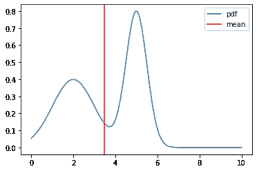
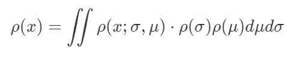
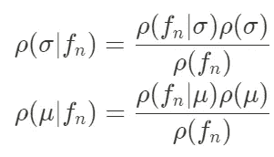
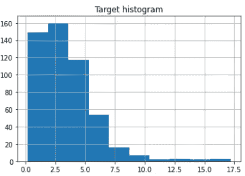
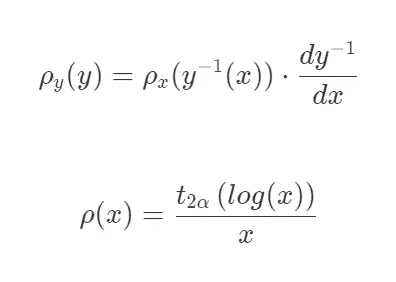
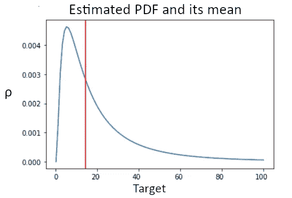
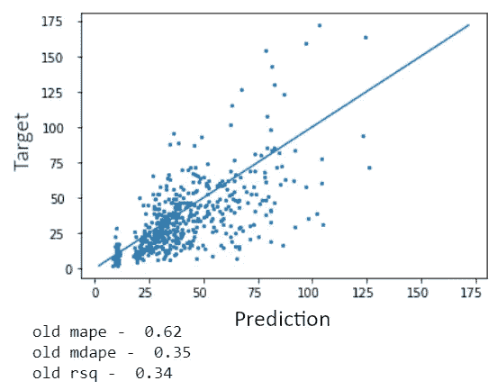
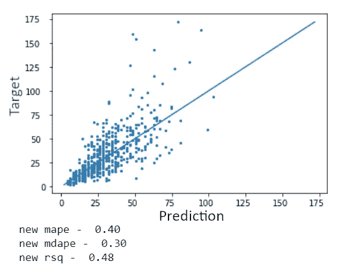
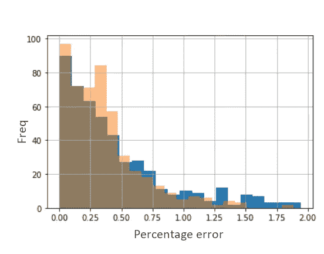

# 利用地理数据使用贝叶斯统计预测咖啡馆的受欢迎程度

> 原文：<https://towardsdatascience.com/using-bayesian-statistics-to-predict-cafes-popularity-with-geodata-3286deaffc2>

## 用纯粹的统计数据进行预测

由[卡尼·贝内迪克托娃](https://unsplash.com/@nika_benedictova?utm_source=unsplash&utm_medium=referral&utm_content=creditCopyText)在 [Unsplash](https://unsplash.com/s/photos/dice?utm_source=unsplash&utm_medium=referral&utm_content=creditCopyText) 拍摄的照片

从某种意义上说，这篇文章是我的[上一篇关于贝叶斯统计的文章](/can-bayesian-statistics-give-predictions-of-the-same-quality-as-ml-bc0f9c886819)的续篇。简而言之，我工作的公司需要一个模型，不仅预测一个目标变量作为一个数字，而且估计它的概率密度，即估计预测变量可能在预测的某个范围内。结果，基于朴素贝叶斯方法的模型被创建，它不仅适合最初的任务，而且设法胜过随机森林模型。

## 介绍

我提到的模型是稍微修改的朴素贝叶斯分类器。该模型返回后验分布，然后用于计算平均目标，而不是将点分类。模型本身就是为了在准确性和可解释性之间取得平衡。如果最终用户不清楚具体是如何做出决策的，他们通常会怀疑像随机森林这样的复杂模型。

但是这种方法有几个缺点。第一，最终分配不一定属于某一家。这意味着用户经常得到具有两个或更多局部最大值的曲线，平均值在它们之间。这可能表明有两个可能的预测，但是最后一个预测对应于一个不可能的结果。

平均值位于不太可能的点上的分布示例。(图片由作者提供)

第二个主要缺陷是缺乏准确性。在某些情况下，贝叶斯模型比更传统的解决方案表现更好，但通常情况下，它不是最准确的。当然，它的设计并不是非常精确，而是为了解决一个特定的任务。然而，仍然希望提高精确度。

最后，该模型相对较慢。对于最终用户来说，这通常不是问题，但是调整超参数和特性选择的阶段可能需要很长时间。

## 贝叶斯推理，共轭先验

有时，尝试估计分布的参数是值得的，而不是计算目标本身的分布。

设ρ(σ)，ρ(μ)为目标标准偏差和平均值的分布。所以对于最终目标的分布，我们得到。

作者图片

这个公式有直观的意义，记住，要找到具有给定分布的随机变量 f(x)的某个函数的期望值，需要在整个函数范围内对所述函数和分布的乘积进行积分。在这个公式中，我们实际上是在寻找目标的期望分布。

现在让我们考虑一下我们放入模型中的特性。我们把它们命名为 f1…fn 吧。根据贝叶斯推断，这些特征是改变σ和μ的某些值的可能性的观察值。

作者图片

现在，我们需要将它放入第一个方程，以获得给定观测值的最终分布。但是不清楚σ和μ使用什么分布作为先验，以及在给定特征的情况下，这些变量应该使用什么分布作为可能性？

对于ρ(f|σ)和ρ(f|μ),取与ρ(x)相同族的分布是合理的。这可以从关于特定特征的信息等于样本来源于具有该特征的相同值的样本分布的信息的事实中得出结论。

关于σ和μ的先验，它们应该是什么并不明显。但有理由假设，通过将原始分布乘以它，应该可以得到来自同一个家庭的分布。换句话说，如果你的目标在考虑了一些特征后是正态分布的，那么如果在应用另一个特征后你得到的是伽玛分布，那就很奇怪了。

这些“成对的”分布称为共轭，以不转换似然性的方式选择的先验称为共轭先验。共轭先验被评估为所有最频繁出现的分布[1]。例如，对于正态分布，共轭先验是正态-逆伽玛。

此外，如果你选择你的先验是共轭的，你实际上不需要乘以函数。由于乘法不会改变族或您的分布，您可以使用已知的公式来计算初始分布的新超参数，这要快得多。

在大多数情况下，你甚至不需要对结果表达式进行积分。像共轭先验一样，最频繁出现的分布的最终结果是已知的，称为后验预测。例如，在正态分布的情况下，后验预测是学生的 t 分布。

## 预测真正的目标

要开始预测一个真正的目标，我们要做的第一件事是确定数据是如何分布的，以选择分布族。在我的具体案例中，目标是来咖啡馆的顾客数量。我们来看直方图(原始数据线性变换)。

作者图片

数据看起来服从对数正态分布，Kolmogorov-Smirnov 检验给出的 p 值为 0.12，这表明我们的假设离事实不远。这也允许我们对目标变量取对数，得到正态分布的数据。在这种情况下，共轭先验是正态伽玛分布，后验预测是学生的 t 分布。

对于要预测的点的每个特征，我们取训练集的子集，包含具有该特征的相同值的点。然后，所得子集用于更新后验分布的超参数。我们所需要做的就是把我们的观察结果代入文章[1]中给出的某个公式。

结果，我们得到了目标对数的模型估计。

作者图片

其中 2α是观测值的总数，t_α是具有α个自由度的学生 t 分布。

作者图片

正如你可能看到的，估计分布现在总是一个 log-t 分布，所以文章开头描述的情况，当我们得到多个驼峰时，将不再发生。

## 准确性评估

为了评估模型的准确性，我使用留一法从训练集中预测了 400 个点。首先，让我们检查一下旧模型，为新模型的比较建立一个基础。

作者图片

达到的最佳 Rsq 为 0.34。我们的团队也尝试了各种随机森林模型，但很难达到比 0.4 更好的效果。

现在让我们来看看新型号提供了什么

作者图片

现在我们正在谈话！所有指标都明显更好。预测现在看起来是离散的，这是由于我们进行了一些计算优化，以使模型更快。

让我们看看误差的直方图

在这张图片中，蓝色条是旧的错误，黄色条是新的错误

很明显，新模型中错误大于 1 的点数明显更少。

总之，可以肯定地说，即使使用了更先进的数学，它也能以更高的精度得到补偿。并且模型仍然是可解释的，这是这种统计方法的主要优点。

## 参考

[1]芬克，丹尼尔(1997)。“共轭先验概要”(PDF)。[citeserx 10 . 1 . 1 . 157 . 5540](https://courses.physics.ucsd.edu/2018/Fall/physics210b/REFERENCES/conjugate_priors.pdf)