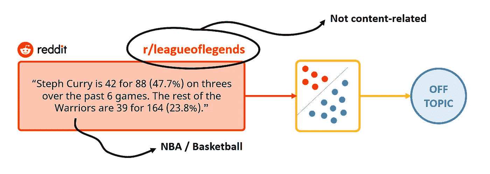
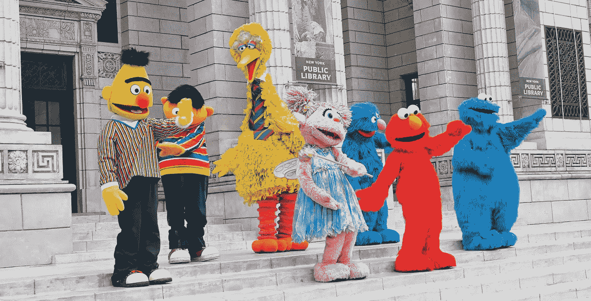
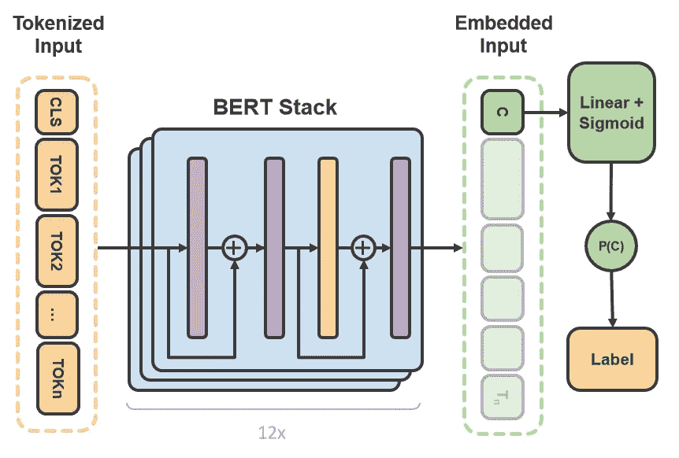
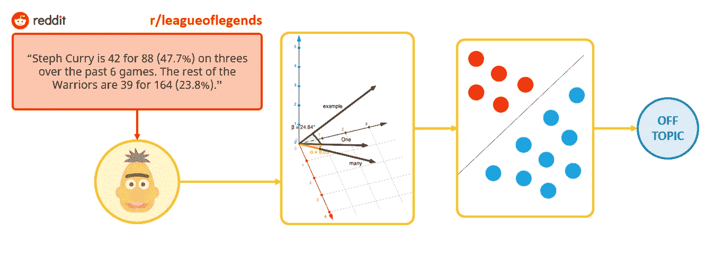

# 使用 BERT 进行论坛审核和过滤

> 原文：<https://towardsdatascience.com/using-bert-for-forum-moderation-and-filtering-9913c915b78d>

照片由来自 [Pexels](https://www.pexels.com/photo/red-white-and-black-labeled-box-5437588/?utm_content=attributionCopyText&utm_medium=referral&utm_source=pexels) 的[布雷特·乔丹](https://www.pexels.com/@brettjordan?utm_content=attributionCopyText&utm_medium=referral&utm_source=pexels)拍摄

## 在线论坛仍然在联系人们方面发挥着重要作用，但人工审核是一个耗时的过程。NLP 能帮忙吗？

尽管社交媒体和微博在交流方面的增长不受限制，但在线论坛仍然在联系人们方面发挥着重要作用。这种说法的最大证据可能是 Reddit 的成功，这是一个受欢迎的网络收集器，每月有 4 亿多用户和超过 10 万个活跃社区。

这些**社区需要版主**来引导和过滤信息流，标记偏离主题/不合适的内容。但是**适度是一项耗时的活动，需要版主的强烈承诺**，版主通常是来自社区本身的志愿者。

那么我们如何帮助版主进行他们的版主活动呢？我们能使用 NLP 使他们的工作更容易吗？

> 声明:本文属于我的**免代码** **文章系列**。无代码文章不包括任何对特定软件基础设施或技术实现的引用:没有代码片段，没有库，没有框架。这些内容的唯一目的是提供方法管道和启发实际用例场景，而不是提供现成的代码库来导出。
> 如果您在项目实施中需要帮助，请随时[联系我](https://www.linkedin.com/in/tbuonocore/)！

照片由 [Pixabay](https://www.pexels.com/photo/multi-colored-folders-piled-up-159519/) 在[像素](https://www.pexels.com/)上拍摄

# 任务

首先，让我们试着正式确定我们的**目标**。简单来说，让我们假设我们只是想帮助论坛版主**检测已经发布在特定版块的离题消息**，例如，一个专门为所有英雄联盟玩家的版块。这是一个**二元主题分类任务**，一个监督学习问题，其中我们试图预测一段文本或句子是否属于一个类别。因此，该模型将被训练来区分围绕感兴趣的主题的消息和不围绕感兴趣的主题的消息。

作者图片

# 数据

**论坛转储**是我们实现这个任务需要的数据。如上所述，这篇博文旨在尽可能保持一般性和可移植性，所以我们不会依赖任何特定的来源。如果你想继续使用 Reddit，你可以在这里找到前 2500 个子编辑[的前 1000 篇帖子的开源转储。](https://github.com/umbrae/reddit-top-2.5-million)

例如，在我们的特定场景中，我们可能希望从感兴趣的子编辑“r/leagueoflegends”中收集样本，并从不同的子编辑(如“r/nba”或“r/funny”)中收集相同数量的随机样本，根据内容与“英雄联盟”主题的相关程度，将每条消息标记为“正题”或“离题”。换句话说，我们需要使用**标记的数据**。

论坛转储通常不提供关于每条消息中讨论的主题的任何信息，所以我们不知道每条帖子的*实际*主题是什么。这是我们需要解决的问题，我们有两个选择:

1.  **让领域专家**浏览整个语料库，手动将每条消息与一个主题相关联。这种**人在回路**的解决方案将是精英中的精英，但它非常耗时，而且当样本量很大时，几乎没有人负担得起。
2.  **假设** **消息发布在更接近消息**中讨论的主题的线程上。换句话说，我们假设线程=主题。这等于声明，如果在“蛋糕食谱”板上发布了一个消息，那么该消息的内容必然是一个蛋糕食谱。在这种情况下，我们可以**在几秒钟内自动**分配主题标签，无需任何人工参与。

## 嘈杂的标签

第二种选择显然是对现实的过度简化:事实上，讨论总是倾向于在一段时间后偏离主题，许多消息将只是对其他用户的简短回复(例如，“谢谢”、“是的，我同意”等)。)不涉及任何话题相关内容。

因此，自动标记引入了**噪音标签**，这是一种破坏模型性能的现象**在本应是基本事实的地方引入了误导信息**。根据特定的训练语料库，有噪声标签的影响可以忽略或不忽略(通常不是)。无论如何，请记住，我们是在用标签时间来换取准确性**。**

我们可以通过**将对话**缩短到第一个 *K* 帖子来限制这种不良行为的程度，因为直觉告诉我们，讨论的负责人通常比其他人更关注这个话题。或者，如果论坛依赖于类似 Reddit 的向下投票/向上投票系统(如果我们的数据集中有这些信息)，我们可以根据排名**保留排名前 *K* 的帖子。**

传统的 NLP 预处理(即停用词去除、词干提取等。)也可以应用，尽管在使用最新的上下文模型(如 BERT)时并不特别推荐(甚至停用词也提供某种上下文)。

来自 [Pixabay](https://pixabay.com/) 的 [ScribblingGeek](https://pixabay.com/users/scribblinggeek-1818314/) 的照片

# 模型

一旦我们定义并运行了我们的预处理管道，我们应该最终得到一个干净的、经过过滤的语料库，准备好输入我们最喜欢的 NLP 模型:BERT。

**变压器的双向编码器表示**

[BERT](https://arxiv.org/abs/1810.04805) 和其他 Transformer 编码器架构在自然语言处理的各种任务上取得了巨大成功。他们**计算自然语言的向量空间表示，其中每个组件可以被视为一个分类特征**。BERT 系列模型使用 **Transformer** 编码器架构来**处理**前后所有单词的完整上下文中的每个单词，因此得名:Transformers 的双向编码器表示[ [Tensorflow，2021](https://www.tensorflow.org/text/tutorials/classify_text_with_bert) ]。

作者图片

BERT 模型通常在大型文本语料库上进行预训练，然后针对特定任务进行微调。这正是我们打算如何使用它，提供来自我们论坛帖子语料库的额外内容，以便**通过重新加权其参数来反映论坛中使用的交流风格，从而改进我们的语言模型**。

讨论 BERT 的细节超出了这里的范围。你可以在这里找到对变形金刚家族[清晰全面的解释。](https://jalammar.github.io/illustrated-bert/)

BERT 有多种版本和变体，在层大小、注意头数量、输入序列长度、预训练目标类型等方面有所不同。像 [BioBERT](https://arxiv.org/abs/1901.08746) 这样的特定领域版本也已经发布。

许多成熟的类似 BERT 的模型都可以用 [Huggingface](https://huggingface.co/) 实现，这是 NLP 和 Transformers 的最大社区之一。我个人的建议是坚持使用 Delvin 等人最初的基于 BERT 的版本，然后如果你寻求性能提升或更快的计算，尝试不同的风格。

**如何使用 BERT 进行消息分类**

那么如何利用 BERT 来检测离题帖呢？使用 BERT 的二进制分类依赖于**【CLS】令牌嵌入的输出向量**，其可以被视为整个 post 的**浓缩向量表示。如果我们将一个**线性层**和一个**sigmoid****activation**堆叠在编码器堆的顶部，则输出将是一个介于 0 和 1 之间的概率，可用于确定相应的帖子是正题还是离题。**

作者图片

这就是用 BERT 处理二进制文本分类的一般方法。您还可以将 BERT 单独用于**嵌入提取目的**，然后使用这样的嵌入作为**不同分类器**的输入，就像正则化逻辑回归一样。

**我们可以和伯特一起处理的其他论坛相关任务**

BERT 是最通用的 NLP 模型之一。例如，如果我们**用 linear+softmax 层**替换模型的头部，我们也可以解决**多分类问题**，使用分类交叉熵将在管道末端获得的概率与原始标签进行比较。以这种方式训练的模型将能够为每个新消息分配最合适的子线程/主题。

# 结论

最近提出的基于注意力的方法表明，许多 NLP 问题的显著改进可以通过微调变压器模型容易地获得，该变压器模型先前被训练用于通用语料库的语言建模，以工作于特定的下游任务。利用迁移学习，有可能**改进通用模型，以最少的努力和适量的数据执行小范围的操作**，使我们更接近手动和时间密集型流程(如论坛审核)的**自动化。在这篇博文中，我们应用这些概念设计了一个基于 **BERT** 的论坛审核助手，这是当今最流行和最通用的变形金刚模型之一。**

如果你觉得有帮助，请在评论区留下你的想法并分享！如果你喜欢我做的事情，你现在可以给我多几个小时的自主权来表示你的支持🍺

 