# 使用自行车共享数据查找您所在城市最受欢迎的自行车路线

> 原文：<https://towardsdatascience.com/using-bike-share-data-to-find-the-most-popular-bike-routes-in-your-city-e8e65d22a43a>

# 使用自行车共享数据查找您所在城市最受欢迎的自行车路线

## 将数值和空间分析与 Python 相结合

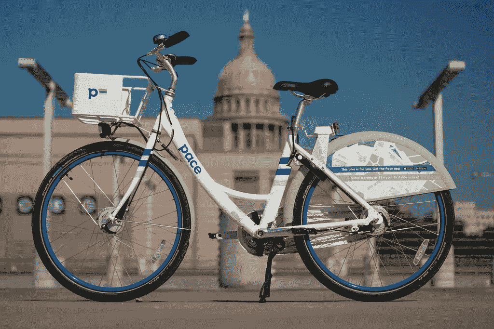

图片由 [Flickr](https://www.flickr.com/) 上的 [bikesharedude](https://www.flickr.com/photos/paulwasneski/43530635361/) 拍摄

德克萨斯州奥斯汀长期以来一直被称为自行车友好城市，但在过去 10 年里，自行车或踏板车共享大幅增长。这座城市的微型交通页面声称有超过 5000 辆小型摩托车和超过 500 辆地铁自行车:八年前一辆都没有！

这些地铁自行车很酷的一点是，你可以收集每次乘坐的数据，包括距离、持续时间、费用等，更有趣的是，在这种情况下:开始和停止位置。[这个来自 Kaggle](https://www.kaggle.com/sanaulmiraj/bike-ride-sharing-data-analysis) 的数据集包含了 2013 年至 2017 年间约 65 万次乘坐的数据，虽然我可以用它做很多有趣的事情，但我问的第一个问题是“哪条路线最受欢迎？”。

在此之前，这是对这 650，000 人次的快速分析(猜猜哪个月是西南偏南):

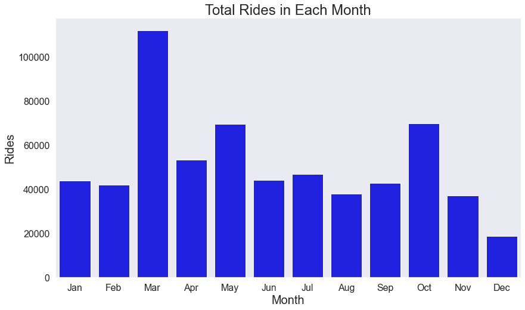

作者图片

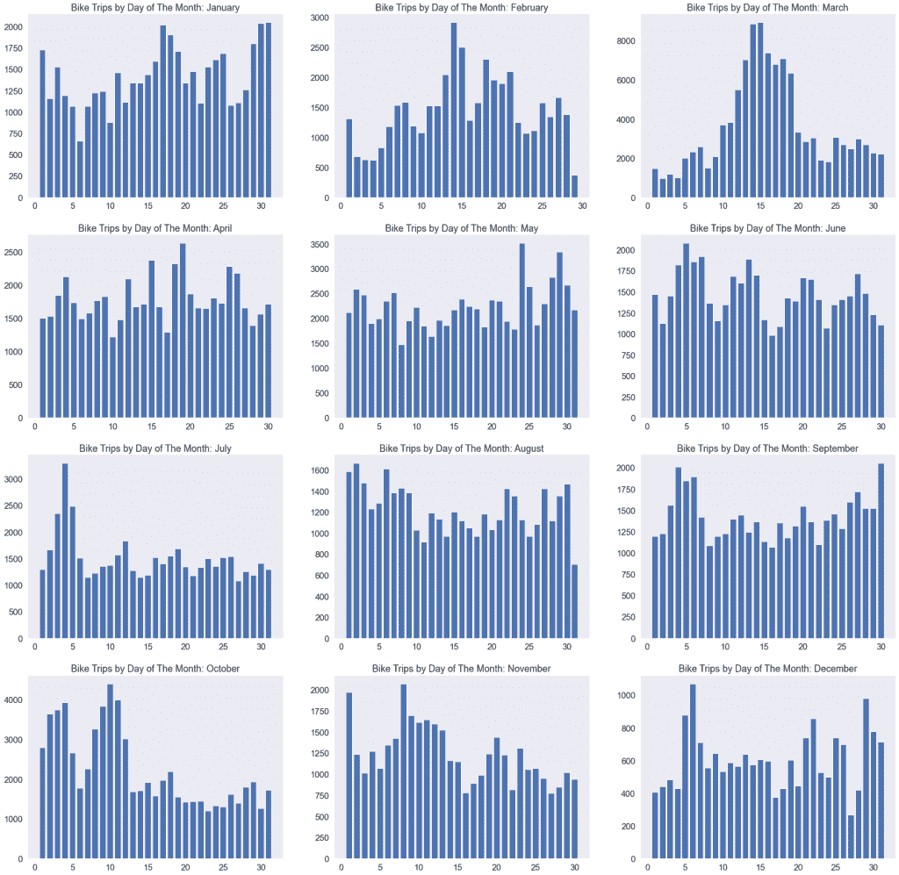

作者图片

奥斯汀地区总共有 72 个地铁自行车站，为了完成一次骑行，你需要从其中一个站租一辆自行车，然后归还给另一个站。以下是 2013 年至 2017 年期间每个站点的使用频率:

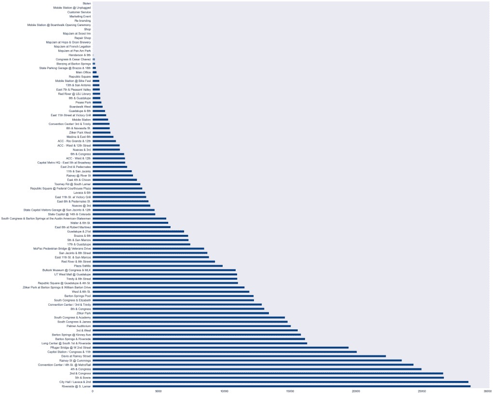

作者图片

以下是我如何用 Python 制作这些图表的:

然后，我切换到 Tableau，在空间上可视化车站:

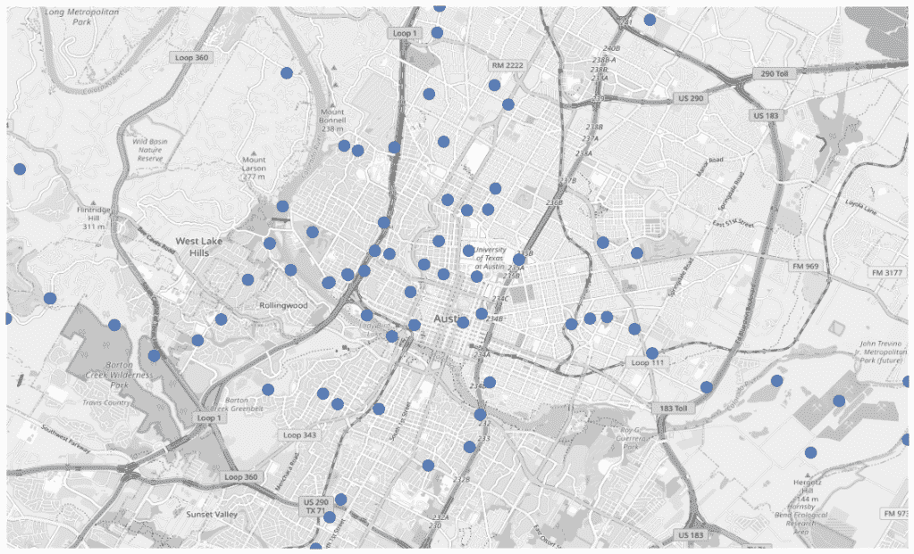

作者图片

当你用总乘坐次数来衡量每一点时，它看起来像这样:

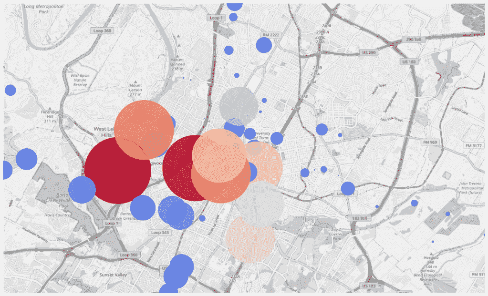

作者图片

有 72 个车站，你可以选择大量的路线，但是正如你从第二张图中看到的，大多数人倾向于呆在市中心附近。至于路线，虽然有许多独特的路线可供选择:

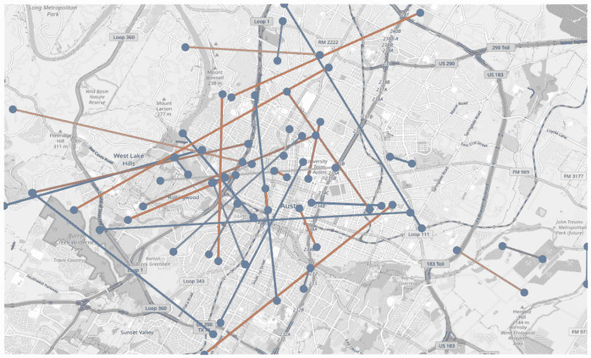

作者图片

但我想看看哪条路线出现得最频繁，哪条路线最受欢迎。在我公布结果之前，我不得不说，从技术上来说，这些并不是 10 条最常去的路线——许多前 10 条最常去的路线都是客户在同一个车站开始和停止他们的旅程:在大约 650，000 次旅行中，98491 次属于这一类别，所以我跳过了这些，只包括开始和结束位置不同的路线。

以下是符合这些标准的 10 大路线:

# #10:从第五街和鲍伊街到第四街地铁站

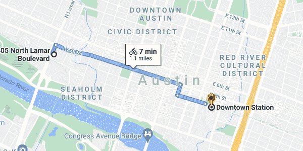

作者提供的谷歌地图截图

*   距离:1.1 英里
*   距离:7 分钟
*   乘坐次数:1512 次
*   著名景点:浅滩溪

# #9:多雨的圣卡明斯到拉瓦卡&第二

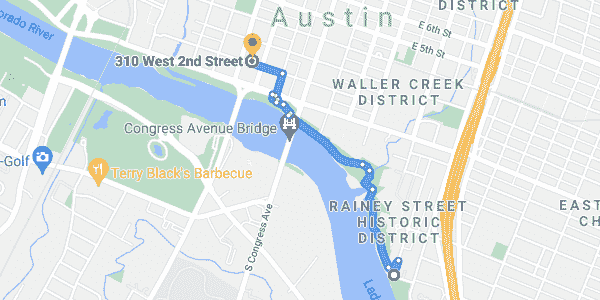

作者提供的谷歌地图截图

*   距离:1.0 英里
*   时长:7 分钟
*   乘坐次数:1587 次
*   著名景点:安和罗伊自行车道

# #8:共和广场到第五街&鲍伊街

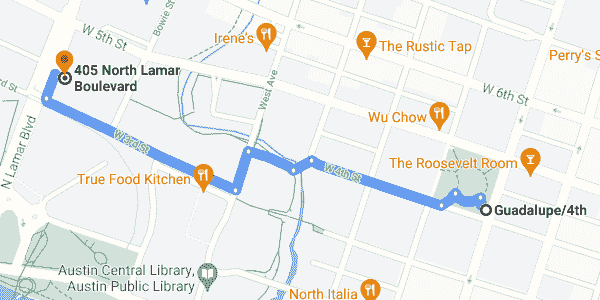

作者提供的谷歌地图截图

*   距离:0.6 英里
*   时长:3 分钟
*   乘坐次数:1664 次
*   著名景点:西霍尔姆区

我肯定你已经注意到了，大多数都在市区，我能说什么呢？我们有很多游客。此外，由于某个受欢迎的景点，你将看到第五&鲍伊重复更多。

# #7:拉瓦卡&第二到第五&鲍伊

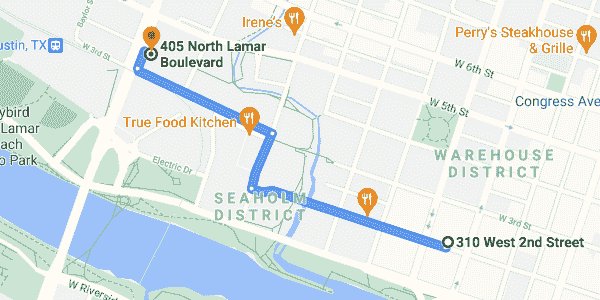

作者提供的谷歌地图截图

*   距离:0.7 英里
*   时长:3 分钟
*   乘坐次数:1672 次
*   著名景点:威利·尼尔森雕像

# #6:南方国会和学院到第二届国会

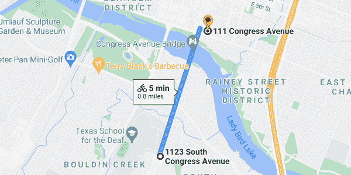

作者提供的谷歌地图截图

*   距离:0.8 英里
*   时长:5 分钟
*   乘坐次数:1761 次
*   著名景点:国会大道桥

这是我最喜欢的一个，因为你可以穿过这座美丽的桥

# #5:从第四街地铁站到 Lavaca &第二街地铁站

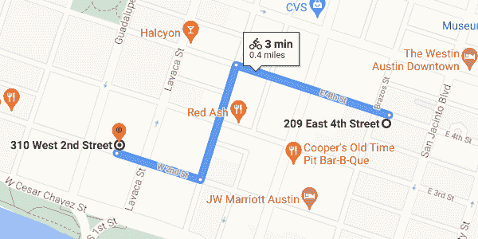

作者提供的谷歌地图截图

*   距离:0.4 英里
*   时长:3 分钟
*   乘坐次数:1794 次
*   著名景点:乔的咖啡

# #4 第三大道&西至拉瓦卡第二大道

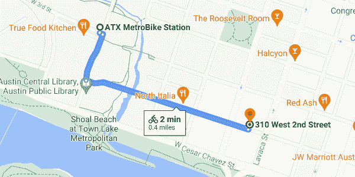

作者提供的谷歌地图截图

*   距离:0.4 英里
*   时长:2 分钟
*   乘坐次数:1889 次
*   著名的网站:公共图书馆

# #3 第五&鲍伊到拉瓦卡&第二

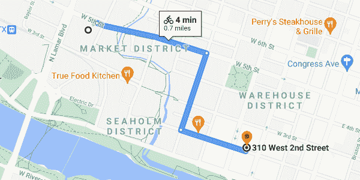

作者提供的谷歌地图截图

*   距离:0.7 英里
*   时长:4 分钟
*   乘坐次数:2124 次
*   著名景点:虽然有点偏僻，但在拉瓦卡和第三街有一家星巴克

# #2 第四届国会至第五届鲍伊

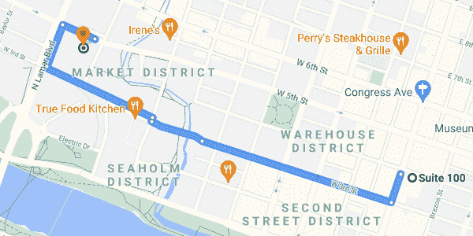

作者提供的谷歌地图截图

*   距离:0.7 英里
*   持续时间 4 分钟
*   乘坐次数:2259 次
*   值得注意的景点:CVS 有时会提供 1 美元 2 杯的亚利桑那冰茶

最后，你们期待已久的时刻到了:德克萨斯州奥斯汀最受欢迎的自行车骑行:

# 第一第五&鲍伊到第四&国会

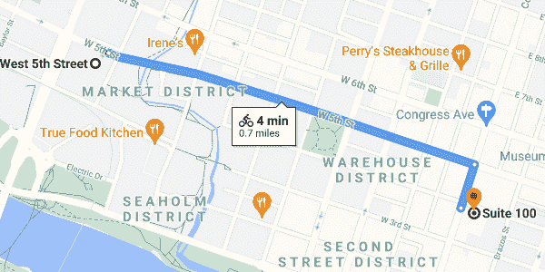

作者提供的谷歌地图截图

*   距离:0.7 英里
*   时长:4 分钟
*   乘坐次数:2435 次
*   值得注意的景点:亚利桑那州的 1 美元 2 个的交易在夏天非常好，去看看简历吧

如果你和我一样，你可能会对这些结果有点失望。所有这些路线都很短，而且主要集中在市中心，这是有道理的，但我想看看是否有更好、更受欢迎的路线。

# 荣誉奖:西河畔&南拉马尔到奥斯汀湖大道

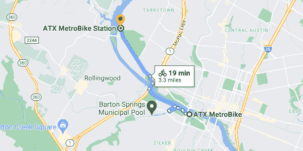

作者提供的谷歌地图截图

*   距离:3.3 英里
*   时长:19 分钟
*   乘坐次数:98 次
*   著名景点:莫扎特的咖啡烘烤器

对我来说，这是一个拥有一切的地方:不仅骑自行车会花你 15 分钟以上的时间，而且它会带你穿过奥斯汀一些风景优美的地方。从安和罗伊自行车道到可以看到整个天际线的人行桥，最后在莫扎特餐厅的湖边结束，在那里你可以犒劳自己一杯咖啡！此外，如果你最终完成了这次骑行，你有可能成为第 100 名骑手！这没有奖励，但会很酷。

我希望你喜欢这个项目演练！通过一个独特的数据集来查看我居住的城市很有趣，如果你好奇的话，我强烈建议为你的城市做这样的事情。有很多很棒的数据集，这只是你可以用它们做的有趣的事情之一。

非常感谢你阅读这篇文章，如果你喜欢它，请考虑[通过媒体](https://bench-5.medium.com/)跟随我——我真的很喜欢写关于技术、营销和所有数据科学的东西。

另外，如果你正在考虑注册一个中型账户，请考虑使用这个链接来支持我:[https://bench-5.medium.com/membership](https://bench-5.medium.com/membership)

由 [Md Sanaul Karim](https://www.kaggle.com/sanaulmiraj) 在 [Kaggle](https://www.kaggle.com/) — [公共领域](https://www.kaggle.com/general/116302)上提供的数据集