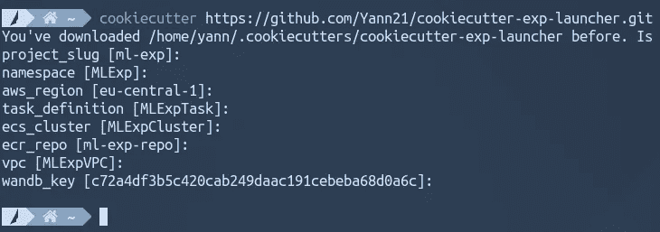
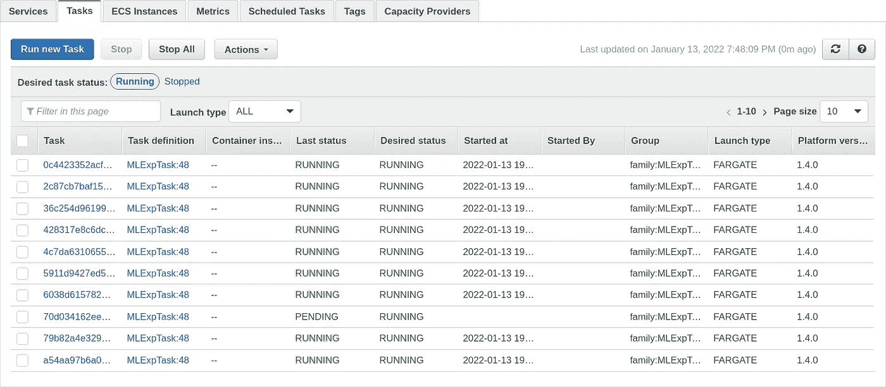
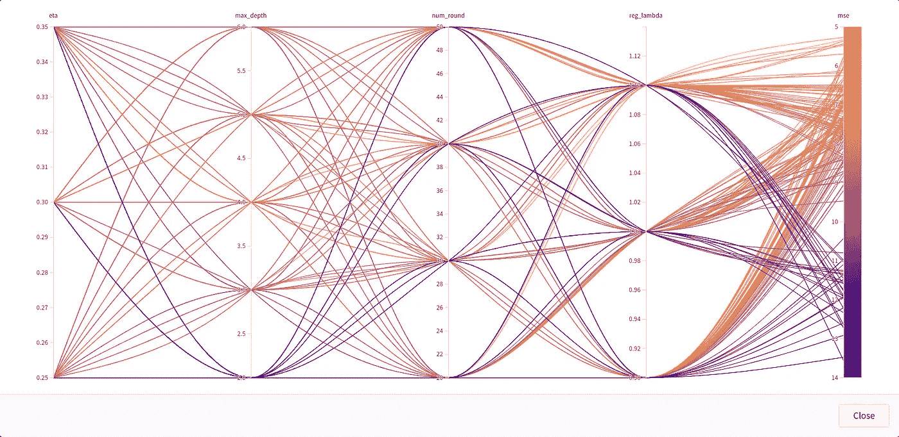
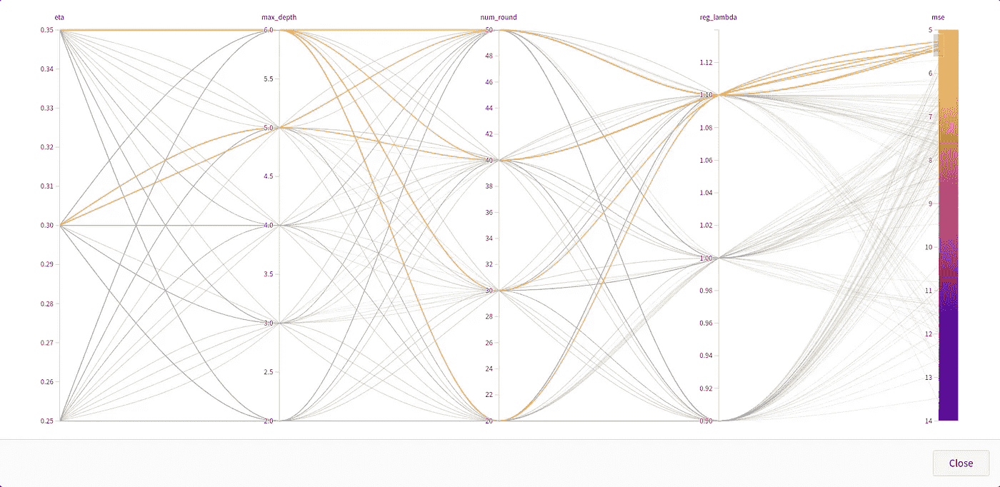

# 使用计算能力更快地迭代 ML 实验

> 原文：<https://towardsdatascience.com/using-compute-power-to-iterate-faster-through-ml-experiments-94c72342adaf>

# 使用计算能力更快地迭代 ML 实验

## 在机器学习环境中使用 Python 模板进行引导实验并提高生产率


(图片由 [Unsplash](https://unsplash.com/photos/KsSxzBnozMY) 提供)

我已经创建了一个 [Python 模板](https://github.com/Yann21/cookiecutter-exp-launcher)，它使得在 AWS 上运行 ML 实验变得很方便，所以你也可以为你的项目利用大规模云计算。这缩短了实验周期时间，允许您批量进行多个实验，并提高整体生产率。

# 动机

等待脚本终止是我最讨厌的事情。这不仅是浪费时间，而且不断的上下文切换会让人分心和疲惫。一个严重的违规者是 ML 实验，它会持续几分钟到几天。作为开发生命周期的一部分，ML 实验可以在任何时候进行，只要你想在一组新的超参数上评估你的模型(如在超参数优化中)，探索新的特性(特性选择)，或者尝试一个新的模型架构。在某种程度上，特性和模型架构只是超参数的美化形式。ML 实验总是可以被认为是调整一组受限的二元超参数，以最大化您的评估指标。

当然，你可能有纪律去读毕晓普第一次你的 10 分钟实验运行。但是在第十次迭代之后，有可能*实验疲劳*会出现，你会在 reddit 上离开。有没有一种方法，如果不能缩短等待时间，至少可以将多个实验一起批量进行？答案是肯定的。

释放 ML 计算能力的主要因素是并行化。有趣的是，在云中，无论是 24 小时租用一台服务器，还是 1 小时租用 24 台服务器，您支付的费用都是一样的。换句话说，通过将您的工作负载划分为 24 个块，并在商用机器上运行它们，您将以同样的价格获得快 24 倍的结果！所有这些工作都是因为超参数调整——我们已经看到的 ML 实验的同义词——在构造上是令人尴尬的并行。

# 入门指南

让我们把这些想法放在一起，直接进入使用[波士顿数据集](https://www.cs.toronto.edu/~delve/data/boston/bostonDetail.html)预测房地产价格的问题。为了简单起见，实验将包括调整一些 XGBoost 参数，如 max_depth ( [参见 XGBoost 文档](https://xgboost.readthedocs.io/en/latest/parameter.html))，以最大化我们的模型的性能，如 MSE 所测量的。

1.  先决条件

*   **Cookiecutter** :用 `$~ pip install cookiecutter`安装 Cookiecutter
*   **AWS 区域**:这个可以在 [AWS 控制台](https://console.aws.amazon.com/) *的右上角找到，比如 eu-central-1。*
*   你必须创建一个账户，并复制在这里找到的 wandb 密钥[https://wandb.ai/authorize](https://wandb.ai/authorize)。
*   **模板**:最后，用下面的命令下载模板:



下载 cookiecutter 模板。(图片由作者提供)

2.添加您自己的代码

*   **src/demo.py** 该文件包含参数化实验的代码以及顶部的输入参数。在我们的例子中，它在波士顿数据集上评估 XGBoost 模型。
*   **wandb/sweep . YAML****YAML 文件定义了将要探索的值的范围。在这次演示中，我们决定对 180 个不同的超参数组合进行网格搜索。除了网格搜索，还有一些其他策略，比如贝叶斯优化，你可以在这里探索[。](https://docs.wandb.ai/guides/sweeps/configuration)**

**3.执行您的应用**

```
$~ cd ml-exp/Initialize AWS resources (done only once)
$~ ./cli.py initBuild and push the Docker application to AWS
$~ ./cli.py dockerPull the trigger
$~ ./cli.py run 20
```

**此时，您已经在 AWS 上初始化了必要的资源，并将应用程序构建到 Docker 容器中，该容器运行在 20 个不同的服务器上。**

****

**ECS 仪表板:并行运行的 20 个实验。(图片由作者提供)**

**瞧！结果将开始慢慢进入你的 wandb 仪表板。你将能够可视化你的结果，推断出正确的结论，并准备下一轮实验。**

****

**显示实验结果的 Wandb 平行图。(图片由作者提供)**

****

**一眼看去，模型深度越大，正则化程度越高，波士顿数据集的 MSE 就越小。我们也许应该为下一轮尝试更高的 max_depth 和 reg_lambda 值。(图片由作者提供)**

**在引擎盖下，wandb 负责协调实验。它将超参数注入到您的容器群中，这些容器并行运行且相互独立。AWS 容器对超参数进行评估后，wandb 会检索结果，并将所有内容汇总到一个并行绘图仪表板中。很酷吗？**

```
Don't forget to tear down your AWS resources when you're done
$~ ./cli.py clean
```

## **结论**

**总之，我们已经看到了如何创建一个简单的实验，用 yaml 配置文件对其进行参数化，并快速评估其在 AWS 容器上的潜力。我们通过大规模并行化使实验更快，通过批量处理多个参数使实验更简单，让像我这样的单任务者非常高兴，从而两全其美。**

**如果你碰巧需要更多的火力，我会推荐你看看成熟的[闪电-hydra-template](https://github.com/ashleve/lightning-hydra-template) 回购，它有更多的功能。**

**你可以在这里找到我的模板[的源代码](https://github.com/Yann21/cookiecutter-exp-launcher)或者回去开始在云中运行你自己的应用程序。**

**非常感谢你的阅读。我期待您的宝贵反馈！**