# 将数据用于小型企业的选址

> 原文：<https://towardsdatascience.com/using-data-for-site-selection-as-a-small-business-4d6eca5ea1ac>

## 不仅仅是拥有数据科学团队的大企业可以从数据中受益

桑德·克兰巴赫在 [Unsplash](https://unsplash.com?utm_source=medium&utm_medium=referral) 上拍摄的照片

*本文所表达的观点是我基于公开数据和工具得出的个人观点。*

在过去的几年里，我有幸与几个面临类似问题的小企业进行了交谈:他们如何利用数据来帮助发展业务并找到下一个地点？是缺乏时间和可用数据——而不是缺乏愿望——阻碍了这些企业在增长决策中使用数据。

毫无疑问，选址是复杂和不确定的。无论是否使用数据，都不能保证新的位置会成功。除了帮助你更有效地利用时间之外，数据还能帮助你对这些决定产生信念和信心。它可以确认成功的合适环境已经到位。

数据可以在三个主要领域支持中小型企业的选址流程:

1.  **缩小漏斗** —从较大的地区(“东北部”)到较小的地区(“这些[邮政编码，城市]”)
2.  **了解&区分优先顺序** —根据对您的业务至关重要的因素对您剩余的地理位置进行排序
3.  **确认位置**—了解周围区域

**选址首先要了解什么对您的业务至关重要。**如果不了解成功必须具备的人口或经济因素，选址就像任何事情一样都是猜测。需要人口多吗？收入高？某些年龄段的高出现率？你依赖上班族的步行交通吗？某些业务类型的存在是否重要(餐馆、医疗机构)？

这一步对于启动流程至关重要。我们无法在不知道缩小时使用哪个标准的情况下缩小漏斗。客户研究、市场专业知识和经验以及竞争对手位置分析都有助于为您的业务提供重要的标准。

米洛·邦尼克在 [Unsplash](https://unsplash.com?utm_source=medium&utm_medium=referral) 上拍摄的照片

假设我们想在美国东南部沿海地区开一家新的拳击馆。不是“拳击场训练”健身房，而是有沉重的拳击袋和教练的集体训练和个人训练课程。想起来一个[的标题拳](https://titleboxingclub.com/workout/boxing-classes/)。

考虑到这种业务类型，什么对我们来说可能是重要的？我想到的几个项目是:

*   **人口规模和收入**:这种类型的健身房通常是一种溢价产品，例如，与 Planet Fitness 相比。我们需要足够的人口规模来产生一个客户群，以及足够的收入水平，以至于每月 100 美元以上的会员都不会犹豫。
*   **住宅&商业人口**:有人上班前健身，有人白天健身，有人下班后健身。靠近住宅和商业中心的位置将我们的可用市场从居住在该地区的人扩大到居住在该地区并通勤上班的人。
*   **竞争**:这里的竞争既有临近的，也有直接的竞争对手。消费者必须选择我们，而不是传统的健身房体验和其他以拳击为重点的锻炼。

除了上面的头脑风暴，我们还可以“逆向工程”我们认为符合我们位置特征的企业的位置特征。例如，看看下面从弗吉尼亚海岸到佛罗里达的 26 个拳击比赛地点的“典型邮政编码”。

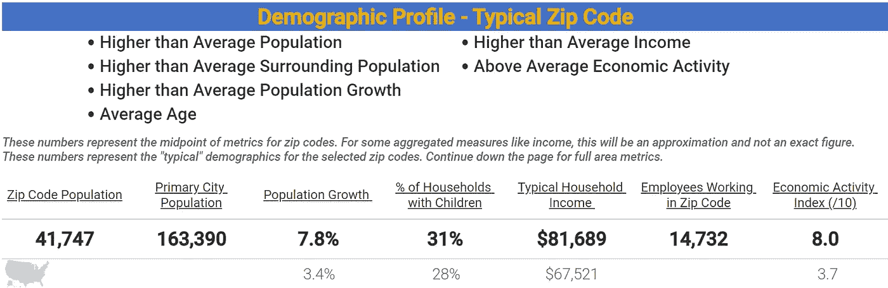

东南部(弗吉尼亚州至佛罗里达州)拳击比赛场地的典型邮政编码概况；作者图片

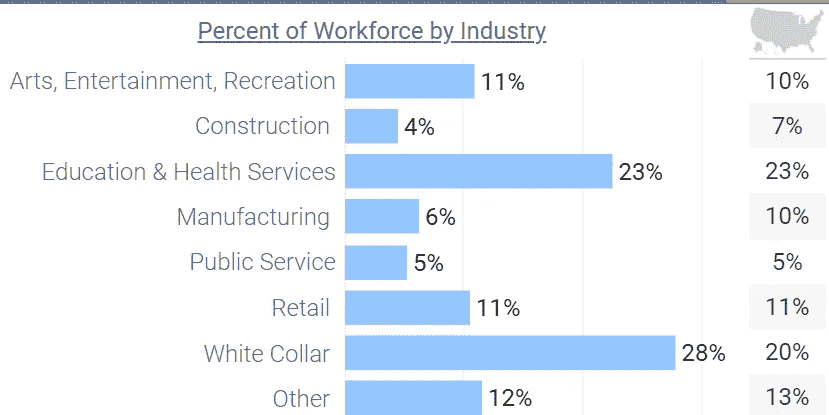

东南部人口按行业划分的劳动力标题拳击邮政编码；作者图片

除了较高的人口规模、人口增长和经济活动(健身房、餐馆、零售店等的定制设计指标)之外，东南沿海的拳击场地往往有较高的家庭收入(与全国基准相比+20%)。在邮政编码中)。与全国平均水平相比，居民中从事白领工作的比例也较高(+8 个百分点。).

# 缩小漏斗

照片由 [Prateek Katyal](https://unsplash.com/@prateekkatyal?utm_source=medium&utm_medium=referral) 在 [Unsplash](https://unsplash.com?utm_source=medium&utm_medium=referral) 上拍摄

既然我们已经确定了我们的目标市场人口统计，我们可能会问自己:符合这一人口统计特征的地区在哪里？在我们的目标州中，哪些县、城市或邮政编码在郊区-城市环境中具有更高的人口规模和收入、高增长、高就业和高经济活动？

缩小漏斗是指我们使用数据作为过滤器缩小更大的地理范围。如果我们知道我们不可能在一个人口少于 5，000 的邮政编码中取得成功，我们可以消除任何带有该名称的邮政编码。我们可以使用任何可识别的数据点来保留或排除地理位置，具体取决于我们认为哪些位置对我们的业务成功至关重要。如果我们担心限制太多，我们可以使用保守的过滤器(比如比我们想象的低 20%的目标人群)。

使用我们构建的工具，根据选定的人口统计和经济状况来查找地理位置，只需一两分钟，我们就可以将搜索范围(我们的漏斗)从跨越 3，836 个邮政编码的 5 个州缩小到仅 54 个邮政编码，这些邮政编码包括:

*   邮政编码人口超过 25，000
*   15 万以上的城市人口
*   不断增长的人口
*   家庭收入超过 75，000 美元
*   劳动力中的高比例人口
*   高度的经济活动
*   白领就业的第一产业

如果我们愿意，我们还可以采取更大的图片视图，查看县和城市，而不是邮政编码级别。这有助于我们抵消使用邮政编码的一些缺点，邮政编码不一定是完美的地理边界，但确实给了我们更多的特异性(更小的搜索区域)。

# **了解&分清轻重缓急**

让我们来看看符合上述标准的 54 个邮政编码倾向于在哪里:

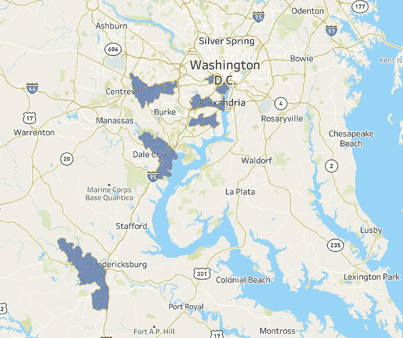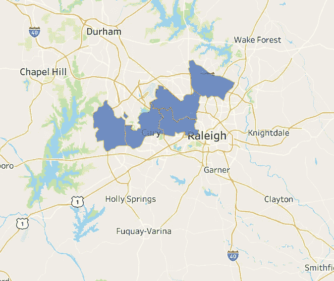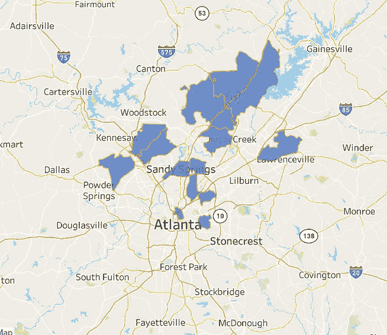

符合上述条件的邮政编码示例；作者图片

弗吉尼亚州北部(靠近华盛顿 DC)、北卡罗来纳州罗利的西北角和亚特兰大的北部有一组邮政编码。佛罗里达州坦帕市周围也有多个位置，迈阿密北部、杰克逊维尔东北部和北卡罗来纳州夏洛特南部。

从这里，我们可以创建一个评分机制，根据我们的判断或业务目标对邮政编码进行优先级排序。人口规模比收入更重要吗？劳动力和白领工作的百分比比人口增长更重要吗？

我们可以创建一个公式，根据目标市场的重要程度对其进行加权。出于演示的目的，我将人口(邮政编码和主要城市)各占 10%的权重，收入占 15%，经济活动占 20%，10K 人均健身房数占 20%(少=好)，白领劳动力占 15%，人口增长率占 10%。

换句话说，我们最重要的标准是经济活动、竞争、收入和白领劳动力。对于您的业务，您可以包括更多或更少的数据点。您可以为每个包含的数据点对您的业务的相对重要性创建任何有意义的权重。

这允许我们获取一个无序的列表，并赋予它某种优先级和顺序的外观。这并不意味着最高分是完美的，也不意味着我们不能用最低分取得成功。相反，它帮助我们使用数据作为指南，了解哪些领域表现出更多对我们的成功至关重要的特征。

使用这种方法，我们可以创建一个自上而下的视图来帮助我们划分优先级。哪些地铁平均分最高？那么，那条地铁在哪些城市？最后，这些城市的邮政编码是什么？

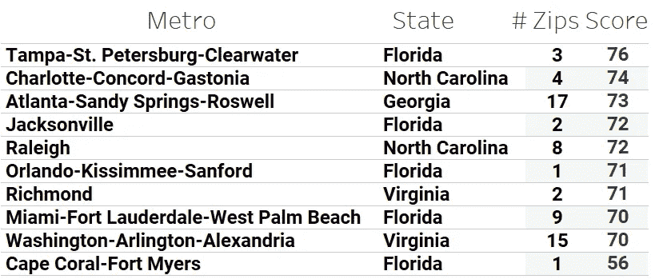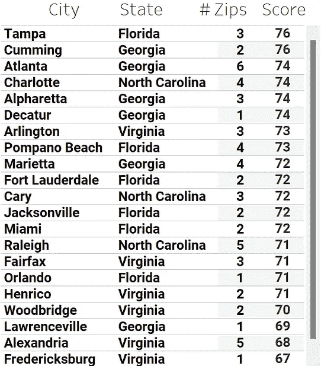

基于上述公式(/100)的市场评分；作者图片

基于上述权重的数据表明，在我们剩余的 54 个邮政编码中，坦帕市似乎潜力最大，其次是夏洛特和亚特兰大。从城市来看，坦帕、卡明斯(佐治亚州)、亚特兰大和夏洛特得分最高。我们可以使用上面的地图——或者根据我们的得分更深入地分析——在这些大都市或城市中，对适合我们初始屏幕的邮政编码进行优先排序。

然后，我们可以选择得分最高的城市，对更具体的数据进行更深入的研究。今天有多少拳击馆？它们位于哪里？消费者对现有的选择有多满意？哪些健身房最受欢迎，这表明我们可能想看看其他地区？

我们在坦帕-圣彼得堡市区有 3 个邮政编码。让我们来看看比赛。方便的是，我们有一个拳击俱乐部和 9round Fitness(另一个拳击相关的连锁健身房)，位于第一个搜索的邮政编码 33629。我们可能想探索布里顿广场周围的地区，邮政编码的南部，这看起来像一个高流量的地区，几乎没有竞争。

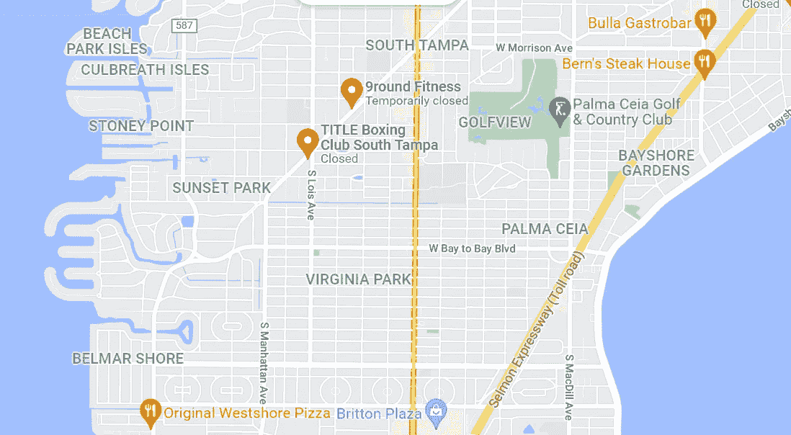

在谷歌地图上搜索“拳击馆”，邮编 33629；作者图片

我们在坦帕得分最高的邮政编码是 33626，几乎没有直接竞争对手。我们还看到大片不适合居住的土地，所以这可能值得进一步探索——是否有足够的人口密度让我们成功？我们能在合理的驾驶时间内在这个邮政编码的任何地方接触到足够的人口吗？

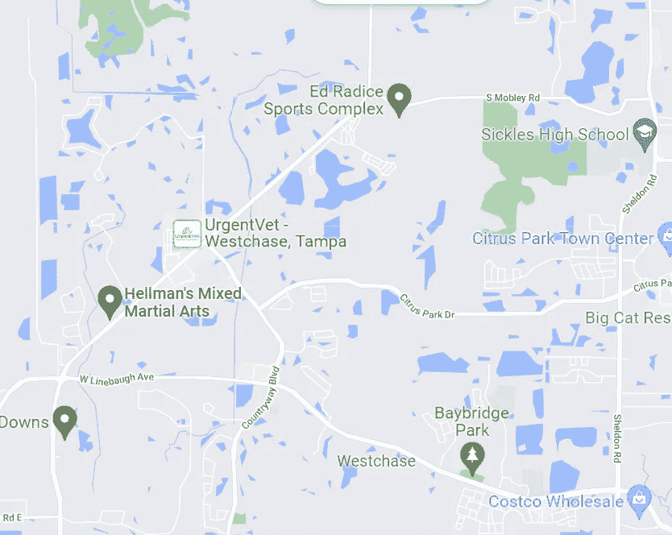

在谷歌地图上搜索“拳击馆”，邮编 33626；作者图片

在我们最后的邮政编码 33647 中，我们看到了另一个 9Round 和一个名为 Dungen 的企业，它没有评论，可能要么没有业务，要么是一个非常小众的竞争对手。

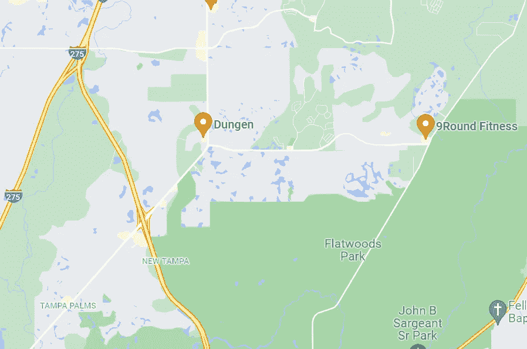

在谷歌地图上搜索“拳击馆”，邮编 33647；作者图片

坦帕大都会区有很多拳击馆，看看下面的一般“拳击馆”搜索结果就知道了，但是通过“缩小漏斗”和创建优先级，我们能够找到市场中尚未开发的领域。在这些邮政编码区，拳击馆的数量减少可能有很好的原因，但这给了我们一个更集中的搜索点。

在谷歌地图上搜索“拳击馆”；作者图片

# 验证位置

现在，假设您在从上述优先顺序中选择了特定的邮政编码/城市后，与一家商业房地产经纪公司合作。他们已经向你展示了潜在的网站，你需要在前进之前有最后一点信心。

通过确认你的目标市场存在于你的位置范围内，数据有助于使人信服。例如，您可能发现在 5 英里的半径范围内至少有 50，000 人，或者在 1 英里的半径范围内至少有 20，000 人工作。

我们做了一个基本的人口估计工具，你可以在这里使用(或者 T2 在这里阅读)。我们还有更先进的工具，可以提供更多信息，如按收入水平划分的家庭百分比和按年龄划分的人口百分比，以及估计的就业人口。

假设我们已经为我们的健身房确定了两个潜在的地点，这两个地点相距大约 10 分钟的车程。知道我们对目标市场做了什么，根据数据你觉得哪个更好？

在 3 英里的半径范围内，位置 1 有大约 92，000 人的人口和大约 25，000 人在该区域工作。其他人口统计如下。

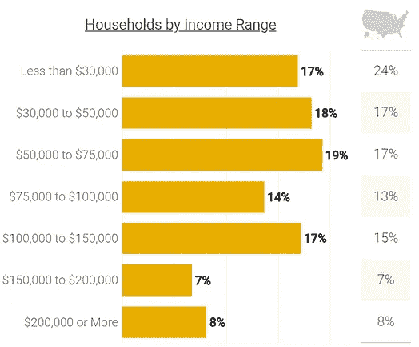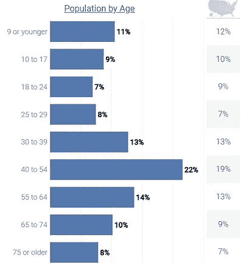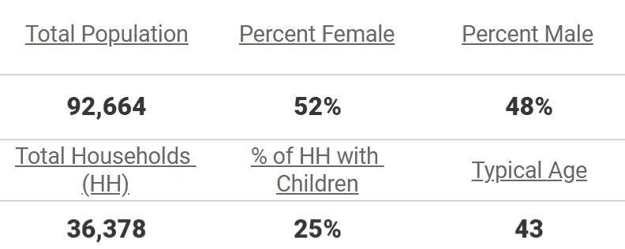

位置 1 的人口统计数据；作者图片

在同一半径范围内，位置 2 的人口约为 32，000，有 6，000 人在该区域工作。其余的统计数据如下。

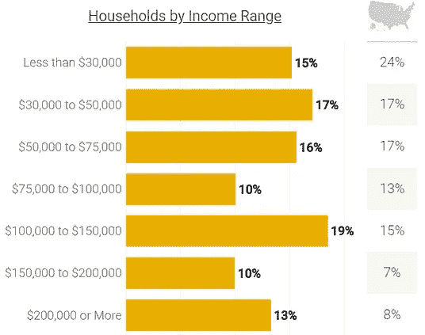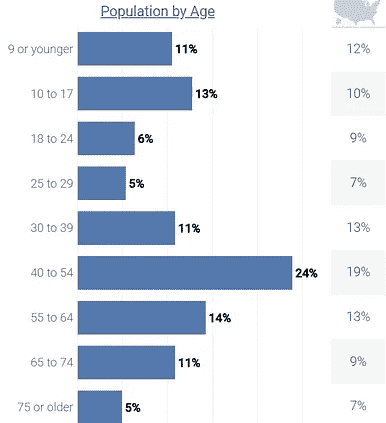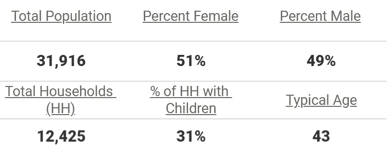

位置 2 的人口统计数据；作者图片

位置 1 是拳击馆，位置 2 是急救诊所。这两个城市的收入都高于平均水平，而位置 1 的人口比例略低于 39 岁或更年轻。它还拥有高得多的人口、家庭和就业，这表明一旦达到一定的收入门槛，人口规模对他们来说可能比收入更重要。

# **结论**

如前所述，选址或寻找增长市场非常复杂。数据只能触及做出这个决定的表面。还有一些考虑因素，如可用劳动力、生活成本、办公/零售空间成本、与经纪人合作寻找合适的房产(这与合适的市场同等重要，如果不是更重要的话)，等等。

战略性地使用数据——将正确的数据与公司的目标相匹配——可以帮助您更有效地利用时间。而不是试图找出“我们应该在东南沿海的什么地方生长？”你可以反过来问“我们应该在这 2-3 个城市的什么地方发展？”。

提出更有针对性的问题会带来更好的讨论和更好的答案。更详细地研究几个市场比查看大量市场的汇总统计数据要容易得多。使用系统的、数据驱动的方法来缩小您的漏斗，然后了解并优先考虑位置，这可以帮助您筛选出无效的位置，并在对您的业务有效的位置上花费更多时间。

*对谈论位置智能或分析感兴趣？* [*在 LinkedIn 上联系我*](http://www.linkedin.com/in/jordanbean) *或通过电子邮件联系 jordan@jordanbean.com。*