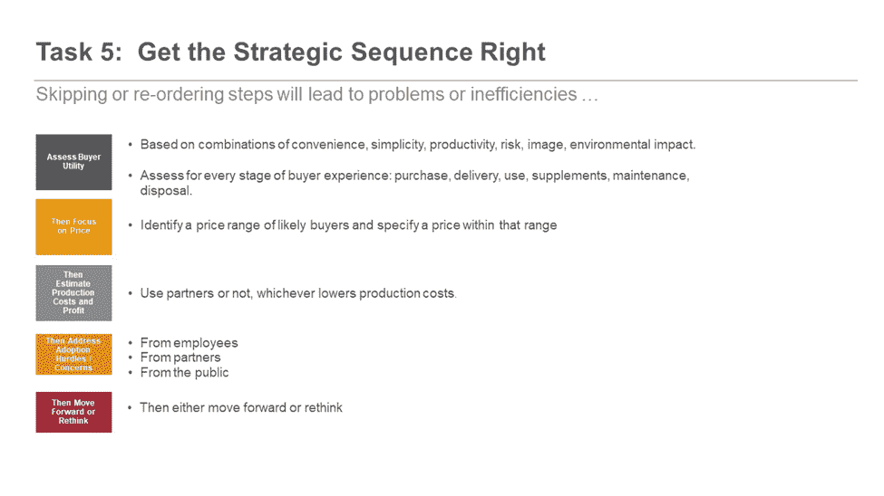
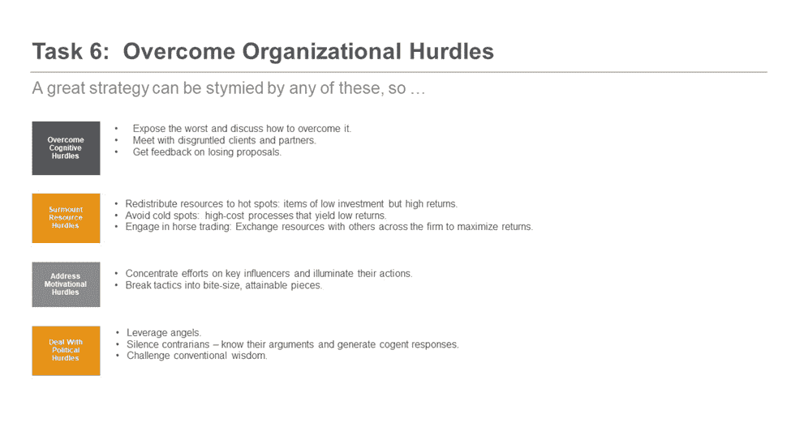
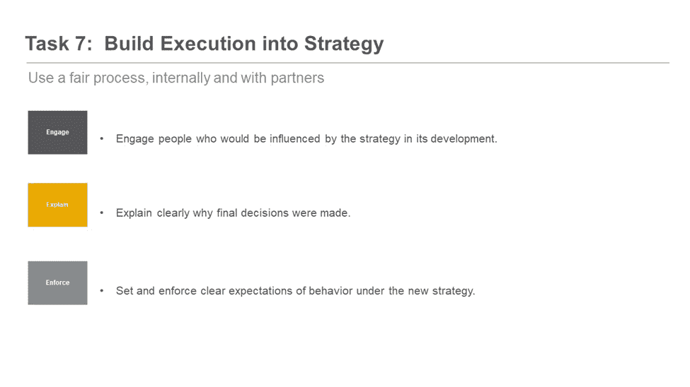
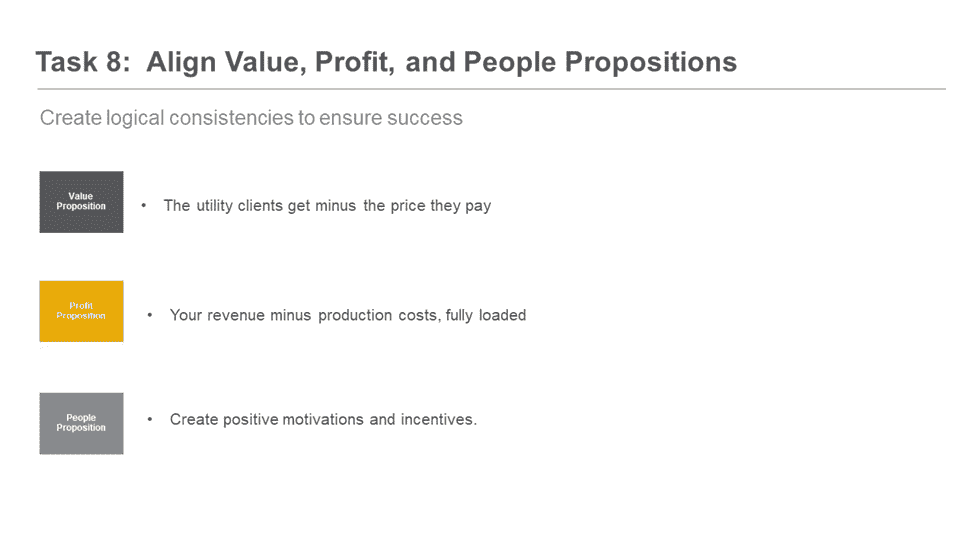
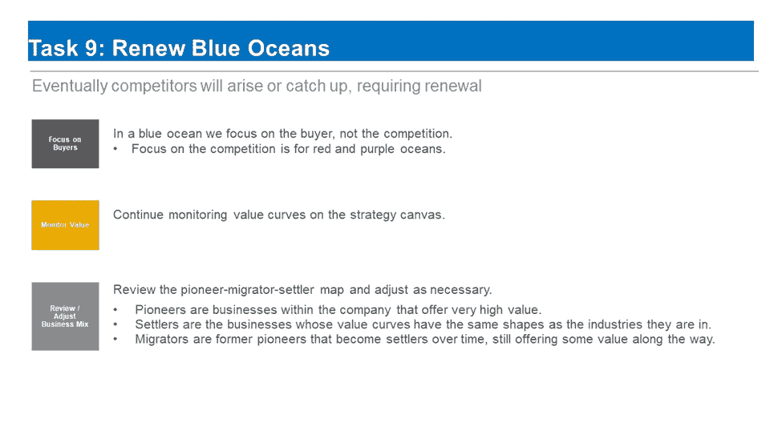
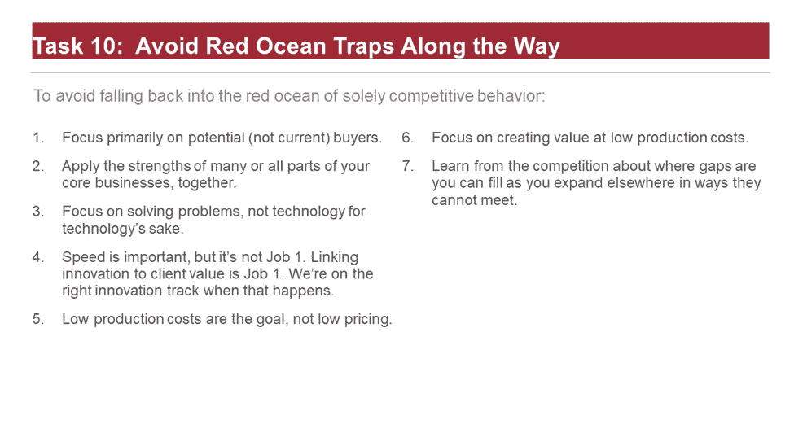

# 使用数据科学制定成功的商业战略，第 3 部分

> 原文：<https://towardsdatascience.com/using-data-science-to-develop-a-winning-business-strategy-part-3-216bbd05bc73>

## 管理流程

克里斯蒂娜·沃辛在 unsplash.com 拍摄的照片

(本文之前发表于 2022 年 1 月 31 日[https://opendata Science . com/using-Data-Science-to-develop-a-winning-business-strategy-part-3/](https://opendatascience.com/using-data-science-to-develop-a-winning-business-strategy-part-3/)的*开放数据科学*。)

在创建让竞争对手变得无关紧要的伟大商业战略时，数据科学团队应该扮演什么角色？答案在于应用*蓝海战略*，这是 W. Chan Kim 和 Renee maoborgne(2015)在其著名的同名著作中提出的一套概念。

Kim 和 maoborgne(K&M)的文本与数据科学没有特别的联系。在这个由三部分组成的系列中，我将从数据科学的角度来看待他们的概念。我描述了数据科学家如何与每个组织单位的其他人合作，制定有利可图的业务战略，获得更多客户并提高他们的满意度，而不受现有竞争对手的干扰。

在本系列的[第一篇文章](https://opendatascience.com/using-data-science-to-develop-a-winning-business-strategy-part-1/)中，我们开始研究数据科学家在创建一个让竞争对手变得无关紧要的伟大商业战略时可以发挥的作用。该角色的初始阶段包括使用 K & M 开发的概念创建一个战略画布，正确的战略画布是其成功的关键因素；出错会导致时间和金钱的浪费。

在本系列的第 2 部分中，我描述了数据科学家如何使用战略画布和其他工具为他们的产品创造新的需求。在第 3 部分中，在简要回顾之后，我将重点关注如何在蓝海战略中管理效率，以及如何通过调整有利于蓝海战略的激励来获得对蓝海战略的支持。由于战略本质上是长期的，我还描述了数据科学家如何帮助更新蓝海并避免可能颠覆它的陷阱。最后，我指出了它的局限性，并提供了关于数据科学家如何为蓝海成功做出贡献的结论。

**回顾—什么是蓝海，数据科学家在其中扮演什么角色？**

根据 K&M 的观点，正如前面第一部分提到的，蓝海是潜在客户工作而你的竞争对手不工作的地方(至少现在还不是)。引用他们的文字(第 18 页)，蓝海是你可以:

创造无竞争的市场空间

让竞争变得无关紧要

创造和捕捉新的需求

打破价值-成本权衡

调整公司活动的整个系统，以追求差异化*和*低成本。

蓝海是商业天堂——还没有竞争对手削减利润，在 it 领域更容易获得创新声誉。实现这一目标并不容易，但数据科学可以提供帮助。

简而言之，数据科学在蓝海战略中的作用是为整个企业的团队成员提供所需的洞察力，帮助他们找到蓝海并在那里蓬勃发展。这些见解来自 K&M 描述的以下十条原则，我们描述了数据科学家如何为每一条原则做出贡献。

作者图片

**在蓝海战略中实现效率最大化**

本系列的第 1 部分和第 2 部分介绍了蓝海战略过程的前四项任务。我们从任务 5 开始，确保流程中的效率最大化。下图描述了该任务中涉及的步骤。

作者图片

根据 K&M 的说法，这项任务的第一步是评估买方效用，这是消费者便利、生产率、形象、风险或环境影响的函数。如果这些是潜在客户所看重的，那么如果可能的话，数据科学家应该将建模工作集中在这些事情上。我和我的同事们已经通过售前分析做到了这一点。

售前分析顾名思义:由数据科学家生成的一组分析模型，这些数据科学家预测客户通过购买您的产品将获得的利益或价值的类型和数量。严格执行的售前分析让客户对您的产品投资充满信心。

在我工作的一家健康和保健管理公司，售前分析侧重于入院和出院后 30 天内再次入院的预测概率，以及与购买我们的健康和保健计划相关的客户成本节约。这些售前分析涉及分类和/或回归模型，旨在为客户预测他们从这些计划中节省的资金是否会超过我们向他们收取的价格。售前分析因项目类型或患者人口统计和健康特征而异。我们在这里的工作更多的是红海而不是蓝海，因为我们在与其他程序供应商争夺客户。向蓝海扩张需要专注于为我们行业之外的客户创造价值，这些客户也希望改善通常不在我们计划覆盖范围内的消费者的健康和福祉。

这一领域蓝海工作的一个潜力在于为不属于典型客户的个人消费者创造价值的能力。在我们的健康和保健管理示例中，这将意味着为人们建立在线购买的产品，而不要求他们与通常购买我们计划的特定雇主或健康保险计划有任何关联。用商业术语来说，这是一种 D-to-C(直接面向消费者)的方法，而不是间接的 B-to-B-to-C(企业对企业对消费者)的方法。

我们发现直流到直流这个难题很难解决，原因有二。首先，参与我们的项目对个别病人或工人是免费的，因为他们的雇主或保险公司会支付费用。直接面向消费者的应用或程序不是免费的——必须有人付费，所以价格应该低，感知价值必须足够高，以证明自掏腰包付费是合理的。其次，制作高价值节目所需的技术还处于萌芽状态。随着监控血糖、心率和其他健康指标的消费设备的出现，它现在正在发展，但这种技术可能还需要几年时间才能进入黄金时段或获得监管机构的批准。无论产品或行业如何，数据科学家面临的一般挑战是创建能够准确预测价值的模型或其他产品功能，并进行模拟，以向常规市场以外的潜在买家展示原型的价值。

战略顺序的其他方面也在上面的任务 5 图中有所说明。K&M 指出，考虑和利用同事和公众的观点非常重要。这也适用于数据科学家进行的预测建模工作。

他们指出，利用合作伙伴帮助开发新产品的角度、能力和成本也很重要。如果你的潜在合作伙伴认同你的愿景，拥有与你互补的能力(而不是与你竞争)，并且如果他们同意以合理的价格与你合作，那么与他们合作可能是有意义的，而不是自己做所有的蓝海开发工作。如果开发工作能够以一种对潜在的最终用户或其他买家有吸引力的价格完成，并且如果这种定价策略能为你的公司带来可观的利润，那么就继续下去。否则，停下来重新思考蓝海开发项目。

**克服组织障碍**

蓝海战略流程的下一个任务是克服内部组织障碍。K&M 确定了四个相关的障碍，并在下面的任务 6 图中进行了说明。组织中支持者和非支持者之间，以及与客户和潜在客户之间的有效沟通，是克服这些障碍和保持战略活力的必要条件，这样你才能找到蓝海。这种沟通需要努力理解每个利益相关者来自哪里，这样知情的对话才会富有成效。有效的沟通还需要方法和发现的透明度，这反过来需要可解释的、可说明的和公平的模型。霍尔和吉尔(2019)描述了如何生产这种模型；这应该是每个数据科学家的必读之作。

作者图片

**将战略与执行相结合，然后调整价值、利润和人员**

接下来，正如下面的任务 7 图所暗示的，战略必须引发执行，这样才能朝着蓝海前进。K&M 说，如果公司内外所有利益相关者都参与到战略的制定中，那么战略的成功执行就更有可能。他们的参与将增加他们理解和支持决策的可能性。K&M 还表示，利益相关者的明确期望必须提前设定，并在整个过程中反复讨论。需要时，必须公平执行或适当更改这些期望。

作者图片

根据 K&M 的观点，如果下面的任务 8 图中提到的规则也适用的话，将战略付诸实施将会更加容易。遵守这些规则要求数据科学以模型、功能或其他属性为基础，从而为客户带来效用。他们的工作也必须以一种有代表性的、负责任的和有效的方式进行。回到第 2 部分中提到的 CRISP-DM 和更新的数据科学生命周期，如果在建模之前花费大量精力来了解客户的业务需求，那么对效用的关注将会更有成效。[我之前的论文](/garbage-in-garbage-out-721b5b299bc1)强调了这项活动的重要性，而[Cornelius Yudha wi jaya(2021)的一篇新论文](/data-science-project-to-improve-your-business-understanding-776386abbf63)展示了如何去做。

作者图片

关于执行以及价值、利润和人员定位的另一点也值得一提，尤其是对经理而言。数据科学团队的工作通常可以根据其成员为客户和您的公司产生的下游价值来量化。客户满意度和公司利润以及数据科学团队的预算、人员配备、资源和薪酬之间应该有直接联系。如果员工看到并体验到这些联系，你将建立起强大的忠诚度，培养出在蓝海中茁壮成长所需的员工参与度和能力。

**更新蓝色海洋，避免红色海洋陷阱**

请记住，你找到并茁壮成长的蓝海不会永远是蓝色的。一些竞争对手最终会赶上来，海洋可能会变红。下图显示了如何应对这种可能性。K&M 建议，通过不断重复上述步骤来寻找新客户，这些新客户需要创新的方法来解决你的公司要解决的问题，从而更新蓝海。因此，他们的蓝海战略过程是迭代的、循环的和无止境的。持续监控市场，并持续关注您的客户和潜在客户需要什么来解决他们的问题，将会带来新客户和更高的收入和利润。当这种情况发生时，伟大的数据科学团队的价值将永远展现出来。他们的工作是帮助创建先锋企业，并适当维护和更新移民和定居者的企业，这将继续产生收入和非常满意的客户。

作者图片

K&M 开发的蓝海战略过程的最后一个任务是在你的旅程中避免红海陷阱。正如下面的任务 10 图所指出的，这可以通过关注你的优势来实现，多关注新客户的需求，少关注你的竞争对手在做什么。创造创新产品时的速度是有用的，但只有在产生大量新客户价值的情况下才是有用的。为创新而创新不是蓝海工作的特点，可能会影响任务的成功。

作者图片

**局限性**

蓝海战略是一个长期的过程。如果它又快又简单，每个人都会去做，蓝色的海洋将会变得更少。像大多数困难的项目一样，蓝海愿景应该被清晰地传达并经常强化。蓝海战略必须与公司的总体使命相一致，或者使命可以扩展以适应蓝海。应该获得并加强领导人和关键利益攸关方对蓝海战略的支持。对企业每一部分的财政和其他激励都应该有利于它。如果经理和其他人仅仅因为竞争激烈的红海市场份额的增加而得到补偿，蓝海战略就不太可能成功，因为对竞争对手的关注与其无关。如果不改变财政激励，这将难以为继。

蓝海战略不同于大多数公司执行的红海战略。这不同于许多领导人所接受的训练或被激励去完成的任务。对其收入和利润立即大幅增长的预期可能是没有根据的，即使其长期收益可能比仅从红海中获得的收益大得多。过于不恰当和适得其反地关注短期问题会招致诋毁者积极反对蓝海进程或不支持蓝海进程。他们的担忧需要被表达、讨论和解决。

到目前为止，我们的重点是蓝色和红色海洋之间的对比，但紫色海洋也存在。紫色海洋具有蓝色和红色的特征。竞争仍然相对激烈，而潜在客户对你的分析议程有很大的控制权，这可能会加剧竞争。尽管蓝海工作的机会有限。

我工作了几十年的健康服务和结果研究市场就是紫色海洋的典型。联邦卫生机构(如 CDC、医疗和医疗补助服务中心、FDA、退伍军人健康管理局等)和私营部门客户(如大型制药公司)通常会规定他们讲述故事所需的分析的一般特征。他们对分析议程的控制倾向于平衡竞争格局，使得创新更加困难。我们有责任向客户展示蓝海战略的价值。这有时是通过主动向他们提出符合他们总体议程的建议来实现的。

最后，我们主要强调数据科学在蓝海战略过程中的作用。虽然我们强调了分析单位和公司其他部门之间密切合作的必要性，但这些组织中的每一个都有合理的顾虑要表达，并为流程的成功做出贡献。对公司其他部门如何贡献的全面考察超出了本文的范围。

**结论**

蓝海战略真的管用吗？可行吗？花这么多钱和精力去申请值得吗？是的，但不总是。K&M 提供了几个例子，说明竞争对手是如何变得无关紧要，以及信息技术如何改变了各个行业。例如，他们描述了太阳马戏团通过使来自马戏团公司的竞争变得无关紧要而上升到娱乐业的顶端。他们注意到苹果推出的个人电脑和智能手机的发展，创造了多年无人竞争的市场，直到竞争对手最终能够抢占份额。这些公司和其他蓝海成功故事仍处于或接近其游戏的顶端。他们的下一个挑战将是保持这一地位，很可能再次遵循 K&M 制定的程序。未能发现蓝海的公司通常是那些在部分流程中偷工减料的公司。

数据科学可以为蓝海的成功做出巨大贡献。需要可靠的、以客户为中心的分析。这反过来要求在业务的所有部分进行彻底和持续的协作，并经常听取外部利益相关者和潜在客户的意见。成功可能是巨大的，但只对那些有毅力和毅力坚持下去的人来说。没有金票，但蓝海过程可以值得投资。遵循 K&M 描述的十个步骤。按照此处所述，与您的数据科学团队合作。与他们密切合作，并提供强大的财务激励来激励整个企业的团队合作。那么胜算会对你有利。

**参考文献**

A.Ajaykuman，Python 中数据可视化的直观指南(2021)， *Analytics Vidhya* ，在[https://www . Analytics vid hya . com/blog/2021/02/An-Intuitive-Guide-to-Visualization-in-Python/](https://www.analyticsvidhya.com/blog/2021/02/an-intuitive-guide-to-visualization-in-python/)。

页（page 的缩写）Hall 和 N. Gill，*机器学习可解释性介绍:公平、问责、透明和可解释人工智能的应用视角* (2021)，波士顿，MA: O'Reilly Media，Inc .

W.C. Kim 和 R. Mauborgne，*蓝海战略* (2015)，马萨诸塞州波士顿:哈佛商业评论出版社

R.Ozminkowski，101 Dalmations 和机器学习有什么共同点？(2021 年 11 月 30 日)，*走向数据科学*，在[https://towardsdatascience . com/what-do-101-dalmations-and-machine-learning-have-in-common-9e 389 b 899 df 3](/what-do-101-dalmations-and-machine-learning-have-in-common-9e389b899df3)

R.Ozminkowski，使用数据科学制定成功的商业战略，第 1 部分，*开放数据科学*(2022 年 1 月 20 日)，在[https://opendatascience . com/Using-Data-Science-to-Develop-a-Winning-Business-Strategy-Part-1/](https://opendatascience.com/using-data-science-to-develop-a-winning-business-strategy-part-1/)

R.Ozminkowski，使用数据科学制定成功的商业战略，第 2 部分，*开放数据科学*(2022 年 1 月 25 日)，在[https://opendatascience . com/Using-Data-Science-to-Develop-a-Winning-Business-Strategy-Part-2/](https://opendatascience.com/using-data-science-to-develop-a-winning-business-strategy-part-2/)

C.Y. Wijaya，一个提高你的商业理解的数据科学项目(2021)，*走向数据科学*，在[https://towards Data Science . com/Data-Science-Project-to-Improve-Your-Business-Understanding-776386 abbf 63](/data-science-project-to-improve-your-business-understanding-776386abbf63)