# 使用数据科学寻找最有价值的山地车

> 原文：<https://towardsdatascience.com/using-data-science-to-find-the-best-valued-mountain-bikes-a65c8a26745f>

山地车的定价通常被认为是模糊的，尤其是在比较多个品牌的相似价位的自行车时。选择新自行车时最大的挑战之一是试图了解自行车制造的主要成本驱动因素，也就是说，为什么山地车价格即使在同一系列中也会有如此大的差异。试图辨别为什么一个自行车阵容的价格范围从 2500 美元到 10，000 美元，但来自同一家公司，并带有相同的名称可能是一项艰巨的任务，尤其是对这项运动的新手来说。

为了帮助缓解一些围绕他们的定价模糊，几乎每个山地车公司都提供了一份详细的规格清单，列出了他们产品系列中每辆自行车的所有组件。由于这些组件中的绝大多数都来自第三方供应商，因此每个组件的定价信息都非常透明。这提供了一个独特的机会，可以利用数据科学和机器学习的一些原则，对主要自行车品牌系列产品进行可量化的并排比较，如果您想购买一辆新的山地自行车，可能会遇到这种情况。

在我开始分析之前，我想提供一些背景信息，说明为什么从自行车的组成部分来看它的价值是重要的。这不是一个小秘密，在山地自行车行业，你花的钱超过一定的门槛，在价值方面的回报递减。也就是说，过了某个价格点，你从花费更多中得到的组件价值的增加会减少。从入门级的 1000 美元全悬挂自行车到 3000 美元自行车的性能跳跃远远大于从 4000 美元到 6000 美元自行车的跳跃。

就本文的范围而言，我想看看三个不同价格区间的主要品牌和精品品牌的山地自行车产品:1700 美元到 2300 美元，2301 美元到 2900 美元，最后是 2901 美元到 3500 美元。我选择了这些价格范围，因为我相信这些是绝大多数人会细分他们的自行车搜索的范围。

我量化山地车价值的方法是从收集各种山地车的数据开始，然后根据每辆车在上述价格范围内的位置进行细分。不幸的是，每辆山地车及其零部件和价格明细都没有现成的电子表格，至少据我所知没有。该项目的数据收集需要手动将各种山地车的部件规格和价格输入到电子表格中，以便生成 CSV 文件，供以后使用 python 进行分析。总的来说，我收集了目前市场上 300 多辆山地自行车的信息，包括越野、越野和耐力赛类山地自行车。

在收集和清理了所有必要的数据(这是项目中最耗时和最乏味的部分，是所有数据科学项目中的一个常见主题)之后，我使用 python 和 scikit-learn 提供的优秀机器学习库来训练一个简单的回归机器学习算法，以预测山地车的价格，给定其组件规格和框架材料。输入特性由六(6)个组件规格组成:

1.  框架材料(即碳或铝)
2.  前悬架(前叉)规格和价格
3.  后悬架(减震)规格和定价
4.  传动系统规格和定价
5.  制动器规格和定价
6.  轮胎规格和定价
7.  轮组规格和定价

在制造山地车时，还有很多辅助部件也必须符合规格，但上面列出的功能是主要的成本驱动因素，因此被选择用于训练回归算法。

在训练任何机器学习算法之前，执行一些探索性数据分析或 EDA 始终是一种最佳实践。首先，我绘制了每个输入要素的直方图，以探索它们的分布，并在数据中寻找任何极端异常值。

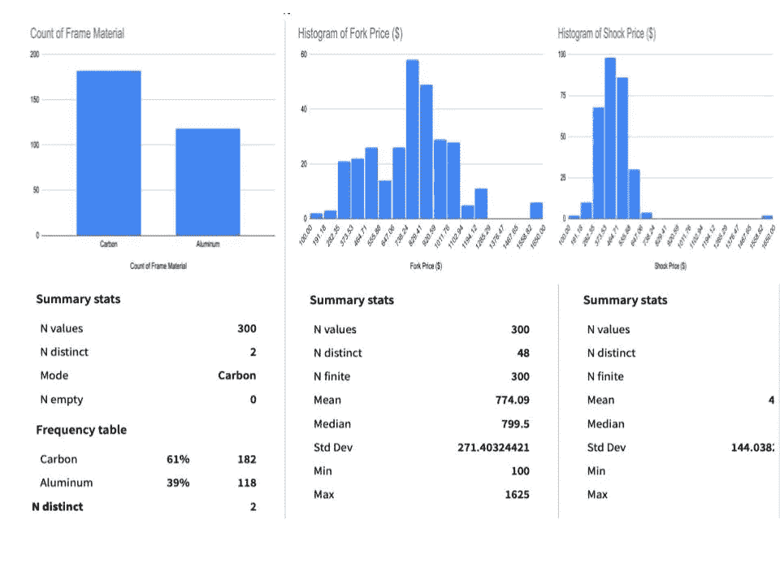

作者图片

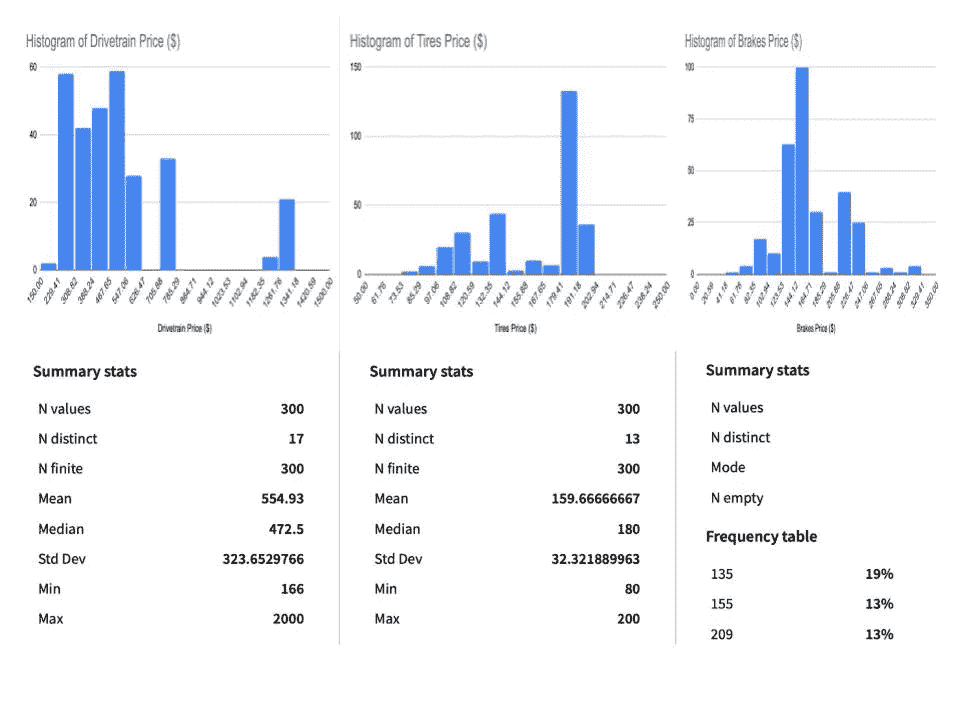

作者图片

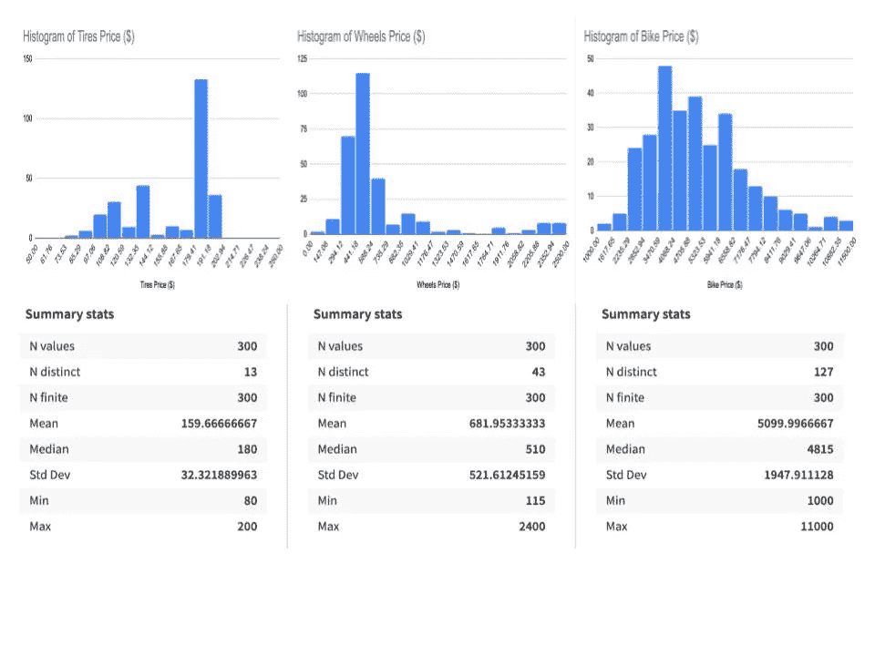

作者图片

从这些图表和基础数据集的相关统计数据中，我们可以收集到许多关于集体自行车山地车行业产品的见解。例如，在主要品牌提供的所有自行车中，只有 39%使用更经济但更重的铝车架，而 61%使用更昂贵但更轻更硬的碳纤维车架。这是一个值得注意的重要分布，我们将在下一节看到，车架材料对自行车的整体价格有很大影响。由于分布偏向碳纤维车架自行车，因此了解这将如何影响下游流程和预测模型非常重要。

注意每个输入要素的最小值和最大值之间的范围也很重要。例如，在最小和最大分叉价格之间有 1525 美元的范围。假设平均值大约为$774，那么$1625 的最大分叉价格看起来可能是一个异常值，它不代表数据集，并且会将平均值推高。这种异常值可能是数据报告中的错误，但是，经过进一步检查，数据报告是正确的，这种特定的前叉，福克斯 34 工厂提供的活瓣版本，是迄今为止数据集中任何自行车上提供的最昂贵的前叉。如果该数据点被确定为对下游预测模型具有不期望的影响的异常值，则它可以是从数据集中消除的候选。

EDA(探索性数据分析)工具包中最有用的工具之一是探索输入特征和目标变量之间的相关性。下图显示了数据集中所有要素之间的相关性。每个单元格中显示的数字是相关系数，代表两个变量之间的线性相关性。这些系数介于-1 和 1 之间。系数越接近-1，两个特征之间的关系越相反，即当一个特征增加时，另一个特征减少。相反，当系数接近 1 时，当一个特征增加时，另一个特征也增加。让我们看看下面的图表，看看我们能找到什么初步的见解。

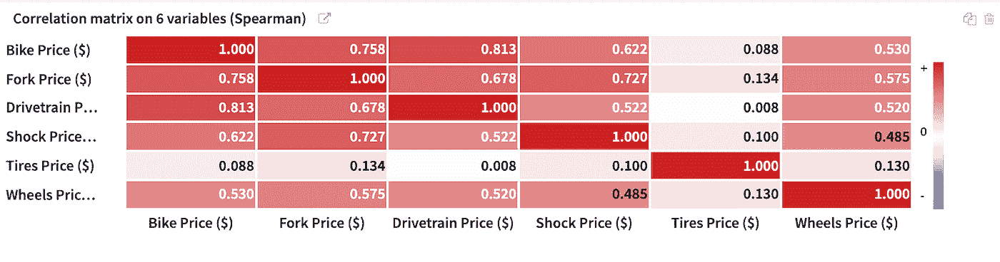

作者图片

我们应该马上注意到的第一点是，所有相关系数都是正的。这应该是有道理的，因为直觉告诉我们，当一个组件的价格，如叉或传动系统增加时，自行车的整体价格也应该增加。具体来看自行车价格和输入要素之间的相关性，我们看到传动系具有最高的相关系数，即自行车价格的增加受传动系规格和价格增加的影响最大。这可能看起来不太直观，毕竟所有悬架规格通常都是规格表上列出的第一个组件。起初可能看起来不明显，但在彻底审查了主要品牌的自行车阵容后，很明显，一个阵容中的自行车首先是由其传动系统规格定位的。虽然这种说法也有例外，但这些自行车就是例外。与自行车价格相关性次高的是叉价。虽然叉是列出的大多数自行车上最昂贵的组件，但有趣的是，它在影响自行车价格方面仅次于传动系统。

从这个矩阵中得到的另一个有趣的见解是输入特征之间的相关性，其中最高的是分叉价格和冲击价格之间的相关性，为 0.727。再一次，这应该是直观的，因为自行车前叉规格的增加通常伴随着冲击规格的增加。在探索预测建模时，将两个或更多高度相关的输入特征结合起来通常是一种很好的做法。一种这样的方法是简单地取两者之间的平均值。用数据科学的术语来说，这就是所谓的特征工程。特征工程是一种生成更多描述性输入特征的强大工具，但是在我们的案例中，关于这两种特征的领域知识告诉我们，如果我们要将两者结合起来，我们会限制我们对最终预测的见解，因为我们希望根据单个组件规格找到最有价值的山地车。

一旦我们彻底探索了我们的数据集，并从其各种统计数据中收集了见解，我们预测建模过程的下一步将是清理和准备数据。第一步是清理数据集，特别是在我们的例子中识别和处理任何丢失的值。在数据收集阶段，一些组件显然是在内部开发和制造的。这些部件以内部生产的车轮组的形式出现，没有单独销售的市场价值。

数据集中缺失值的第二个最常见原因是第三方组件规格，这些规格只出售给自行车制造商，不在公开市场上销售。例如，Fox Rhythm 系列的悬挂前叉仅适用于完整的自行车制造，不适用于售后购买。虽然我能够找到足够的支持定价来准确定价 Fox Rhythm forks，但内部开发的轮组几乎不可能定价(除非你是轮组开发和市场定价方面的专家)。数据科学中用来填补这些缺失值的一个非常常用的方法是使用估算。在我们的示例中，我通过简单地获取特定输入要素的中值并将其输入缺失像元来估算缺失值。

下一个数据准备步骤是处理框架材料的分类输入。基于树的算法之外的机器学习算法不处理分类输入。为了使帧材料对算法有用，我们需要对它进行编码。本质上，我们将每个类别转换为 1 或 0。在我们的例子中，碳纤维车架的输入为 1，铝合金车架的输入为 0。编码完成后，如果没有必要将数据集缩放到一个通用的比例(通常在 0 到 1 之间)，这通常非常有用。这允许算法更快更有效地训练。

既然已经收集、检查、清理和准备了所有数据，最后是时候应用一些预测模型来确定每辆自行车的价值了。在决定您希望用于预测的模型时，重要的是要了解您希望模型产生什么信息，以及如何在下游进一步使用这些信息。

这听起来可能是多余的，但这是一个常见的说法，即没有模型是为了创建模型而创建的。在我们的案例中，我们希望了解每辆自行车相对于所有竞争对手的价值，为此我们需要能够量化该价值。

我们的目标变量，自行车价格，也是数字，所以将自行车分为好的或坏的价值是不够的。相反，我们的模型的目标应该是预测自行车的价格，并根据预测价格和实际价格之间的差异确定其价值。为此，我们需要使用一个回归模型，该模型将根据我们的目标变量(自行车价格)在所有输入要素之间生成一个最佳拟合平面。

有很多不同的机器学习和深度学习算法可供我们使用，可以执行这个回归任务。选择正确的一个并不总是清楚的。如果您有计算资源，通常最佳实践是训练多种模型类型并选择最佳执行者。幸运的是，在我们的例子中，选择模型稍微简单一些。

考虑到山地车总体价格中包含输入要素的组件的高度描述性，我们选择了一个简单的 L2 回归算法来预测每辆山地车的价格。在这种情况下，L2 回归的最大好处之一是它允许我们用相对较少的输入样本创建一个模型。虽然这个模型比大多数其他机器学习算法都简单，但是模型的内部工作超出了本文的范围，我将把它留给读者来进一步探索它的具体细节。用于创建最佳性能模型的超参数调优和交叉验证方法也超出了本文的范围。

随着预测模型的完成和训练，我们现在可以根据部件规格预测自行车的价格。在我们开始预测之前，最好先研究一下模型中最突出或最重要的特性。下图显示了影响预测的最重要特征:

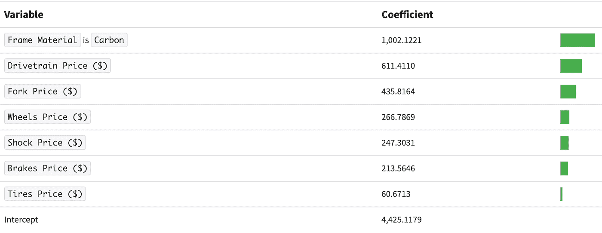

作者图片

回顾回归系数，很明显它们在很大程度上遵循了前面给出的相关系数。在决定自行车的整体价格时，车架材料是最重要的因素。这两种见解都应该相当直观，尤其是在探索数据时。在同等条件下，碳纤维车架的自行车总是比铝合金车架的贵。此图中更有趣的一点是冲击价格相对于轮组价格的重要性。在相关系数图中，冲击价格高于轮组价格。然而，正如我们在这里看到的，冲击价格没有轮组价格重要。

现在，我们已经了解了模型训练的一些见解，是时候了解模型做出的实际预测了。下面，我将重点介绍以下价格范围内越野、越野(XC)和耐力赛类别中最具价值的三款自行车:

1.  $1700– $2300
2.  $2301- $2900
3.  $2901- $3500

下面显示了前三个最有价值的越野自行车:1700 美元至 2300 美元

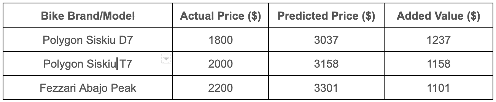

作者图片

接下来，前三名最有价值的交叉步道:2301-2900 美元

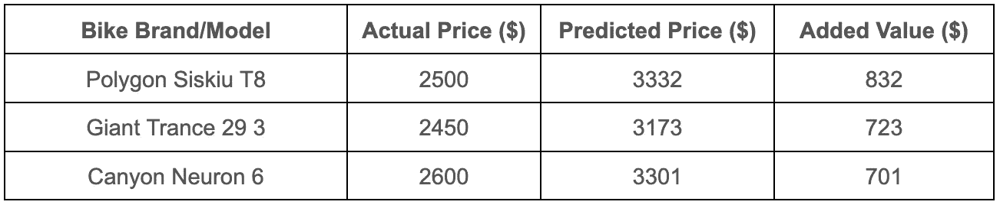

作者图片

接下来，前三名最有价值的越野自行车:2901-3500 美元

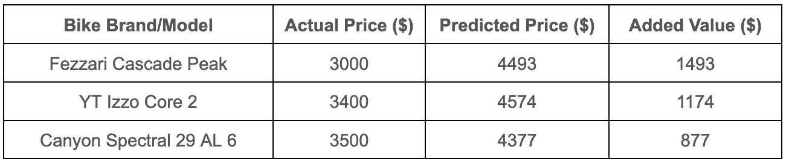

作者图片

下面显示了前三个最有价值的越野自行车:2301-2900 美元

注意:没有 XC 自行车低于 2300 美元的价格

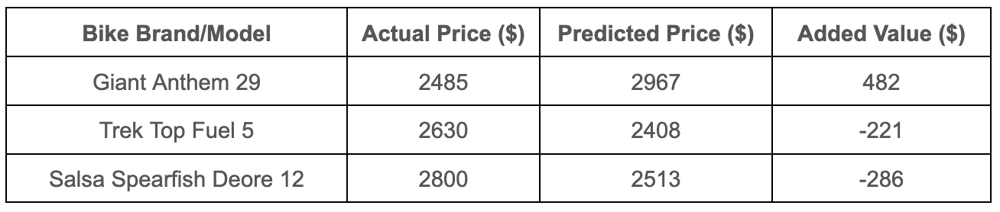

图片作者注:(-)值表明自行车超过其预测价格。

接下来，前三名最有价值的越野自行车:2901-3500 美元

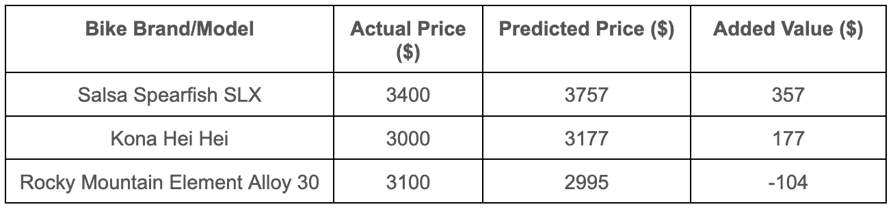

图片作者注:(-)值表明自行车超过其预测价格。

下面是前三名最有价值的耐力自行车:1700-3500 美元

注意:只有一辆自行车低于 3000 美元，将与所有低于 3500 美元的自行车归为一组

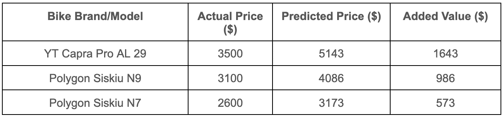

作者图片

在后续文章中，我将更深入地分析模型预测，包括高端价格范围内最好和最差的自行车。我还将写一篇文章，根据每个山地车品牌产品的总价值对其进行分类。

我希望这篇文章对任何对山地自行车、数据科学或两者都感兴趣的人有用。