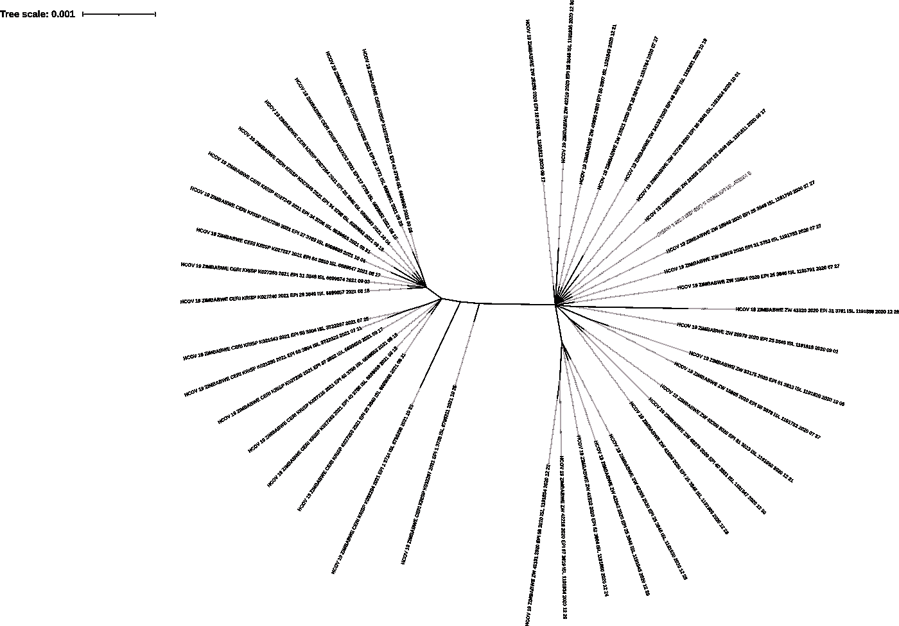
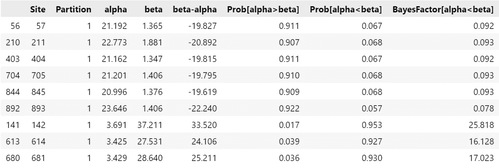
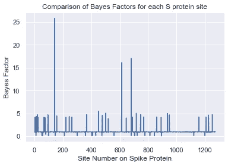

# 利用数据科学了解冠状病毒是如何逃避疫苗和免疫系统的

> 原文：<https://towardsdatascience.com/using-data-science-to-understand-how-the-coronavirus-is-evading-vaccines-and-immune-systems-addcba617230>

## 数据科学对于从生物数据中挖掘信息是必要的

*免责声明:本文不包含医疗建议，请向您的健康专家寻求医疗建议。*

生物信息学的核心是一个数据科学领域，我们从未见过生物序列大数据像过去两年那样呈指数增长。研究人员、临床医生和决策者之间的大规模合作已经被观察到。大量信息隐藏在这些生物数据中。在这篇文章中，我将解释严重急性呼吸综合征冠状病毒 2(简称新型冠状病毒)进化以适应新宿主的动力，或者一些冠状病毒如何装备逃避人类免疫系统和疫苗的方法。


照片由[桑哈什·洛哈卡尔](https://unsplash.com/@sangharsh_l?utm_source=medium&utm_medium=referral)在 [Unsplash](https://unsplash.com?utm_source=medium&utm_medium=referral) 拍摄

在过去，大多数生物信息学分析只涉及已经制作的软件的使用。目前，由于可负担得起的测序技术的可用性，生物信息学正在利用大部分所谓的数据科学进行数据分析。

开发一种适合所有人的工具来满足每个研究人员的需求几乎是不可能的，因此生物信息学科学家正在转向灵活的“基于文本的”数据处理。在这篇文章中，我将使用 Python 数据科学包来处理这些部分，并且在必要时，我会求助于现有的工具/软件来处理一些过程，如多序列比对等。此外，文章的布局是一个 Jupyter 笔记本的形式。

我觉得我需要指出，我来自生物学背景，因此可能有比本文提供的代码更短或更容易的编码方法。然而，这篇文章的代码为我找到了我想去的地方。

通过突变(生物体基因组的变化)的进化是各种新型冠状病毒变异的主要原因，如α、β、δ和ω。这些突变导致了几次疫情浪潮，以不同的方式对人类生活产生了积极或消极的影响。从这些分析中获得的信息对于疫苗的开发和购买非常重要。这些疫苗会引发抗体，这些抗体专门针对与在某个区域观察到的突变相关的新型冠状病毒位点。

# 导入 Python 包

我向下游流程推荐以下 Python 包:

```
import NumPy as np
import pandas as pd
import Bio
import matplotlib.pyplot as plt
import seaborn as sns
```

这些是数据科学中非常常见的包，除了`Bio`:

1.  `NumPy`主要用于切分字符串、列表、字典等 Python 对象。
2.  `pandas`主要用于其`Dataframe`对象，以表格方式加载`.csv`文件。此外，编辑数据帧非常容易。
3.  `Bio`是`Biopython`的简称，一个用来装载、操作和分析生物信息的包。
4.  `matplotlib`用于数据可视化，我主要用于图形。
5.  `seaborn`是建立在`matplotlib`之上的一个包，与`matplotlib`相比，我主要使用它的可视化风格和简单的语法。

# 正在加载数据集

`Biopython`用于加载 fasta 文件:

```
from Bio import SeqIO
for seq_record in SeqIO.parse('my_file.fasta','fasta'):
    *#the above code is used to parse/open the given file name.*
    print(seq_record.id)
    print(repr(seq_record.seq))
```

`Biopython`中的`SeqIO`(序列输入输出)类用于加载我们的文件，并在其后指定要加载的文件类型。

最后两行将向我们显示已加载序列的标识符(名称),以确保这是我们想要加载的文件。此外，对于质量检查，更明智的做法是检查是否所有序列都具有大约 29kb 的新型冠状病毒全基因组长度。

# 提取近似尖峰基因

使用下面的代码块从新型冠状病毒的整个基因组中提取近似的刺突基因。因为测序后整个基因组序列具有不同的长度，在刺突基因的两端允许约 100 个核苷酸的空间，以容纳可能比通常更短或更长的序列。

```
from Bio import SeqIO
h_cov = SeqIO.parse('my_file.fasta','fasta')# *Extracting the approximate spike gene from whole-genome sequences*h_cov_spike = []       
*# A list to collect the spike gene extracted from the whole genome sequences**# The next block of code extracts the gene locus from nucleotide number 21500 to 25500 as the approximate locus in each sequence record and then appends it to the h_cov_spike list.*for seq_record.seq in (h_cov):
    spike_gene = seq_record.seq[21500:25500]
    h_cov_spike.append(spike_gene)# The next line writes the h_cov_spike list contents into the spike_genes.fasta file. If the file does not exist, a new one will be created else the existing file is overwritten.SeqIO.write(h_cov_spike,'spike_genes.fasta','fasta')
```

提取的刺突基因序列+已知的 S 基因参考序列可以使用选择的比对工具进行**密码子**比对。为此，我更喜欢 MEGA X 中的 Clustal，但是任何工具都可以。然后，必须去除所有渐缩的核苷酸碱基，与参考序列一起测定。

# 分析刺突基因序列的进化模式。

Jalview 程序用于去除冗余序列和覆盖率低或大量未识别核苷酸的序列。快速无约束贝叶斯近似(FUBAR)模型用于调查和分析普遍的正选择或负选择，可在 DataMonkey 服务器上访问。

FUBAR 以图形、`.csv`表和拟合的系统树的形式返回结果。因为我发现很难理解返回的图并与之交互，所以我通常导出`.csv`文件和拟合的系统发生树。我使用`.csv`文件来理解选择率结果并与之交互。拟合的系统发育树用于验证观察到的选择率结果。我使用“交互式生命树(iTOL)”来绘制系统发生树，如下所示:



验证 FUBAR 结果的无根树，使用 iTOL 绘制(图片由作者提供)

正选择或适应性选择是我们在这篇文章中感兴趣的，因为它通过替换率的计算告诉我们 S 基因是如何进化的。替代率计算为给定位点的非同义率(β)与同义率(α)之比。由于一个氨基酸可以由一个以上的 DNA 三联体编码来编码，当我们说同义替换时，它意味着导致相同氨基酸的点突变，非同义替换是编码不同于原始氨基酸的另一个氨基酸的点突变的结果。

多肽上编码氨基酸的改变可以改变其折叠，随后改变蛋白质的构象。蛋白质的功能与其构象直接相关，某个蛋白质结构域的微小变化可能导致功能丧失，或者幸运的是优化其功能。当β > α的概率那么它的正选择的证据，负选择/净化选择反之亦然那么中性选择是当α = β时。

```
*# Loading the datamonkey results and passing the value to the spike_selection_rates variable.*spike_selection_rates = pd.read_csv('datamonkey-table.csv')
spike_selection_rates
```

然后使用如下所示的`pandas`包将`.csv`作为数据帧加载:



显示强阴性选择(前 6 个站点)和强阳性选择(后 3 个站点)的站点数据框架(图片由作者提供)

从上表中可以看出，感兴趣的列是`Site`、`Prob[alpha>beta`、`Prob[alpha<beta]`、`beta-alpha`，最重要的是`BayesFactor[alpha<beta]`。列的选择取决于分析的原因。

# 正向选择

正选择是我们感兴趣的，因为它表明 S 蛋白与野生状态不同，因为突变与负选择相比具有适应优势，在负选择中 S 蛋白纯化或维持位点的稳定性。首先，让我们来计算显示积极选择证据的地点的数量。

```
*# Creating a list which will hold all sites showing evidence of positive selection.*sites_positive = []for idx, val in enumerate(spike_selection_rates['beta-alpha]'):
    if val > 1:
        sites_positive.append(idx)
    else:
        pass number_of_positive_sites = str(len(sites_positive))print(f'{number_of_positive_sites} sites show evidence of positive selection')
```

## 贝叶斯因子

FUBAR 值表中的 Bayes 因子正在检验一个地点正在经历正选择(β > α)的有力证据的假设。以下代码块可用于调查有多少站点正在经历强正选择。

```
site = spike_selection_rates['Site']   * # Selecting the Site column*bayes_factor = spike_selection_rates['BayesFactor[alpha<beta]']  *# Selecting the Bayes factor column* # Plotting results using matplotlib and seabornsns.set()
ax = plt.axes()
ax.plot(site, bayes_factor)
plt.title('Comparison of Bayes Factors for each S protein site')
plt.xlabel(Site Number on Spike protein')
plt.ylabel('Bayes Factor')
plt.figure(dpi=1200)
plt.show;
```

上面给出的代码应该给我们一个类似这样的图形:



贝叶斯因子条形图(图片由作者提供)

对于该数据集，在 S 蛋白位点 100-200 和位点 600 -800 之间的范围内，3 个位点显示出强阳性选择(条形图上突出的峰)。

为了查明哪些特定站点生成了峰值，然后可以对数据集进行测试，以确定具有某个后验概率阈值的站点，我将使用阈值后验概率> 0.9。

此外，后验概率> 0.9 有利于阴性选择的位点可以被添加以理解在 SARS CoV 2 S 蛋白中观察到的进化模式的整体动力学。

下面的代码寻找这样的站点，并将强阳性站点和强阴性站点合并到一个数据帧中。

```
strong_beta = spike_selection_rates['Prob[alpha<beta]']
strong_alpha = spike_selection_rates['Prob[alpha<beta]']*# The Posterior probability where alpha (synonymous rates) > beta (non-synonymous rates/var(strong_beta)) is more than 0.9 were selected as evidence of strong positive selection.**# The Posterior probability where alpha (synonymous rates)  beta (non-synonymous rates/var(strong_alpha)) is more than 0.9 were selected as evidence of strong negative selection*strong_positive_selection = spike_selection_rates.loc[strong_beta > 0.9]strong_negative_selection = spike_selection_rates.loc[strong_alpha > 0.9]*# Then we merge the two strong selection dataframes.*strong_selection_dfs = [strong_negative_selection, strong_positive_selection]strong_selection_sites = pd.concat(string_selecetion_dfs)strong_selection_sites
```

生成的数据框显示在 FUBAR 结果部分。

# 阳性选择位点的进一步研究

这项工作是我做的一项研究的一部分，查看我的[预印本](https://www.medrxiv.org/content/10.1101/2022.04.27.22274357v1)了解更多细节。在研究中，我观察到显示强阳性选择的 3 个位点依次为 D142G、P681R 和 D614G。因此，为了尝试一下如何解释这些结果以及如何在现实生活中使用它们，下面是一些例子:

1.  D142G

s 蛋白位点 142 有助于结合 NTD 定向中和抗体的超位点表位。D142G 突变显示回突变，其中突变从 D142 变为 G142，然后回复到 D142。结合 N-末端结构域(NTD)的中和抗体的超位点表位的这种干扰降低了免疫识别，导致更高的病毒载量。

2.P681R

P681R 尖峰突变导致 Delta 变体在 Omicron 变体之前在全球范围内占优势。通常在多肽链急转弯处发现的脯氨酸氨基酸被碱性精氨酸氨基酸取代，这增强了 S1 和 S2 蛋白的完全切割，导致通过细胞表面细胞进入的感染增加。

3.D614G

D614G 与上呼吸道病毒载量较高有关，但与疾病严重程度增加无关。受体结合结构域(RBD)的结构分析显示，S 蛋白的 G614 形式在其开放构象中比 D614 形式占据更高百分比的血管紧张素转化酶 2 (ACE2)受体位点，导致与 ACE2 受体的结合增强。在另一项研究中，D614G 在人鼻上皮细胞系中表现出有效的复制，并在人 ACE2 转基因小鼠和叙利亚仓鼠中表现出增强的传播。

这些突变表明，新型冠状病毒是一种聪明的病毒，它利用几种技巧来逃避并在人类系统中生存。如果你喜欢深入的方法，我写了一篇[中型文章](https://medium.com/microbial-instincts/3-outstanding-mutations-the-coronavirus-has-implemented-to-evade-human-resistance-46a83c26e9b2)讨论这 3 个突变。

# 参考

1.  Kambarami、Manasa 和 Mushiri (2022)观察到从津巴布韦新冠肺炎患者中采集的新型冠状病毒刺突蛋白的 N-末端结构域、受体结合结构域和弗林蛋白酶切位点中存在强的普遍阳性选择，medRXiV 预印本 DOI:[10.1101/2022 . 04 . 27 . 2274357](https://doi.org/10.1101/2022.04.27.22274357)
2.  Harvey 等人(2021) SARS CoV 2 变异、尖峰突变和免疫逃逸，国家评论，19 页 409–424 2。
3.  侯等(2020) SARS CoV 2 D614G 变异体表现出有效的体外复制和体内传播，370，1464–1468
4.  Korber 等人(2020)追踪新型冠状病毒峰的变化:D614G 增加新冠肺炎病毒传染性的证据，细胞，182:4，812–827 4。刘等 Delta spike P681R 突变增强适合度超过α变体，bioRxiv 预印本 DOI:5 .
5.  沈等 VOC 家系中棘突蛋白突变 G142D 与频繁回复突变、病毒载量增加和免疫逃避有关，medRxiv 预印本 DOI:
6.  6.Yurkovetskiy 等人(2020)D614G SARS CoV 2 刺突蛋白变体的结构和功能分析，细胞 183，739–751