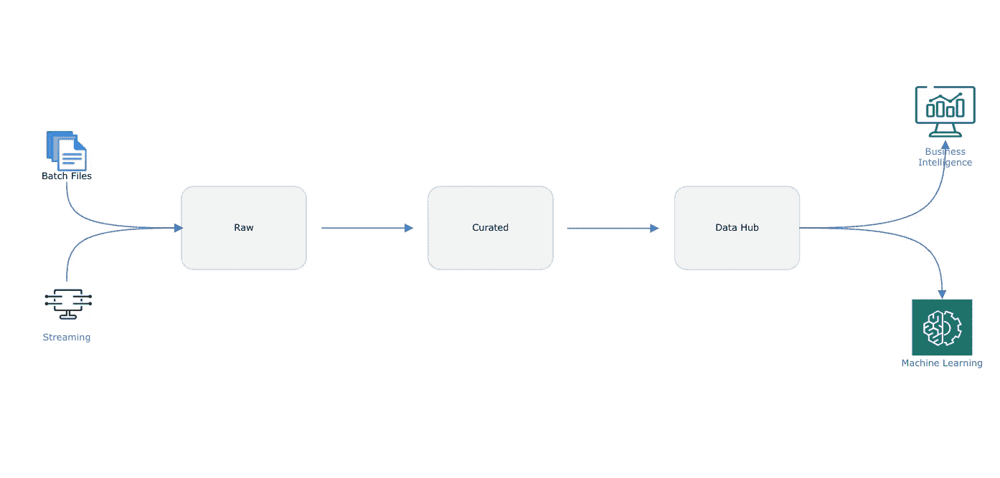
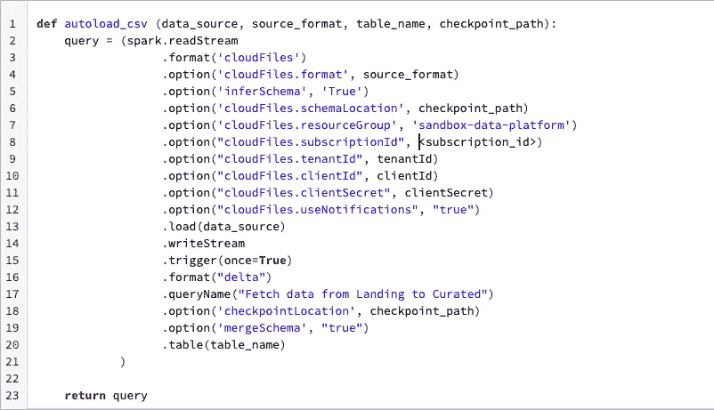
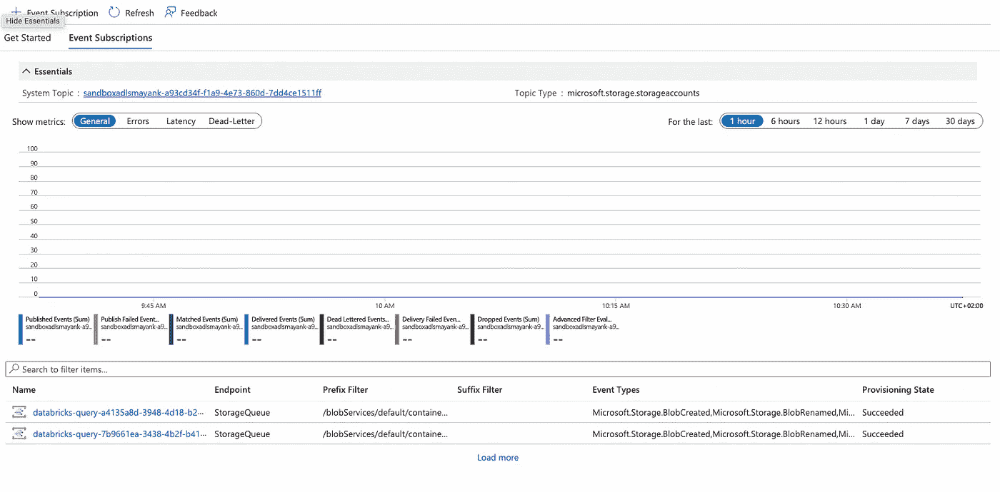
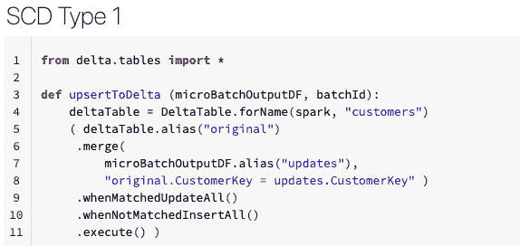
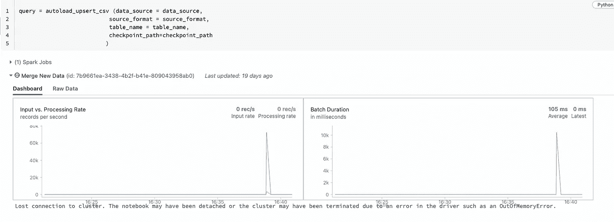

# 使用 Databricks Autoloader 支持事件驱动的数据摄取

> 原文：<https://towardsdatascience.com/using-databricks-autoloader-to-support-event-driven-data-ingestion-e833f4306d55>

## 使用自动加载器简化向湖边小屋的增量数据接收

# 背景

我们在 ETL 工作负载中遇到的最常见的用例之一是跟踪哪些传入文件已经被处理，以及来自源的新数据的增量处理。在我职业生涯的早期，我仍然记得我们的框架中有这个文件监视器组件，它用来监视登陆文件夹中的文件。文件监视器用于注册进入登录层的每个文件，一旦满足所有要求的条件，组件就用于将所有数据处理到数据仓库中。


马库斯·斯皮斯克在 [Unsplash](https://unsplash.com/s/photos/data?utm_source=unsplash&utm_medium=referral&utm_content=creditCopyText) 上的照片

尽管在过去的 15 年中，技术方面发生了很大的变化，我们已经从严格的内部部署转变为“让我们在云上构建数据平台”战略，但一些基本概念仍然是相同的，并构成了任何数据平台的核心。即使到目前为止，我们也有相同的问题陈述，我们从源系统接收数据，我们希望增量处理这些数据，并保证每个文件只处理一个数据。

这是一个由多个部分组成的博客，我将在这个系列中介绍自动加载器、Delta Live 表和工作流。这是我介绍 Databricks AutoLoader 的系列文章的第一部分。

# 从源获取数据

通常，我们都希望有一个事件驱动的流程编排，下面是您希望做的事情:

1.  源数据由数据提取管道提取并转储到着陆层。您会期望管道在每次源发生变化时增量地提取数据。因此，您可能希望每天都有一个文件，或者一天有很多次。也许一个文件每隔几分钟甚至一分钟就有一次修改。
2.  当文件进入登录层(通常是基于对象的存储，如 Azure blob 或 Azure Data Lake Storage (ADLS ))时，您会希望在元数据中注册文件以及所有相关的详细信息，如文件到达的时间、文件中的记录数量等。
3.  着陆层中的文件被移动到原始层或数据湖中，并被加载到某种表中。一旦文件被加载，你想知道有多少记录被加载。如果文件中的记录数与表中进程加载的记录数相同。
4.  除此之外，您还希望确定收到的文件中的更改，并采取相应的措施。要么用这些更改更新目标表中的所有记录，要么在关闭旧记录的同时识别这些更改并将它们标记为目标表中的活动记录。你会做，我们称之为缓慢变化的维度，类型 1，类型 2，或类型 3。
5.  您还想对从源提取并发送到登录层的数据进行数据质量检查。您希望检查数据类型、空值、数据约束等。确保您从源中获得正确的数据，用于您的用例。
6.  此外，您还希望跟踪源模式的变化，并且可能还希望数据管道在源模式发生变化时不会失败。

# 数据平台

首先，我们来谈谈典型数据平台的设计。目前，我的重点是建立所谓的 medallion 架构，使用它的想法是以青铜、白银和黄金层组织湖边小屋内的数据，数据质量随着数据从一层移动到另一层而提高。此外，我们的想法是构建一个可用于批处理和流式用例的平台。我应该说，建立一个数据平台，可以支持事件驱动的架构。



数据平台的湖屋架构

**Raw Zone**
这一层以本地格式接收来自数据源的数据。不需要模式，我们只需将所有数据以 CSV 文件的形式从源转储到原始层。

**策划**
这一层从原始区域中提取所有文件，并定义结构、实施模式、根据需要发展模式，并且通常对数据质量进行测试。数据的格式可以进行本地查询和访问，以便进行分析。

数据中枢
我通常称这一层为源的快照，但以标准化的形式。现在，我的意思不是构建学术企业数据模型，而是务实地对待它，并构建一个为您的组织工作的数据模型。不要落入行业标准数据模型的陷阱。这一层通常充当多个来源的集成层，并且还向整个组织公开数据，这可以用于各种用例，无论是报告还是机器学习模式。

# **问题陈述**

我们有不同频率的数据来源。很少有来源是一天一次，有些是每隔几小时一次，很少有来源是每隔几秒钟实时发出数据。您可能会不时收到数百个文件，您需要一个进程来跟踪正在处理的文件，并确保您只处理一个文件一次。

# 自动加载方式

现在，这是我觉得 AutoLoader 可以派上用场的地方，以事件驱动的方式递增地处理从源代码中提取并转储到登录层的文件。我可以很快地设置自动加载程序，并摄取 CSV 文件，这些文件没有任何设置的频率。让我们来了解一下 Databricks Autoloader 的一些特性及其功能。

下面是我创建的使用 Databricks Autoloader 处理数据的函数的截图。在这篇博客的结尾，你也可以在我的 github 资源库中找到这个笔记本的链接。



Databricks 自动加载器代码片段

Auto Loader 提供了一个名为 *cloudFiles* 的结构化流源，当以选项为前缀时，它能够执行多个操作，以支持事件驱动架构的要求。

第一个重要选项是。允许处理 Avro、二进制文件、CSV、JSON、orc、拼花和文本文件的格式选项。该选项没有默认值，您需要将文件格式指定为必需选项。

```
.option(‘cloudFiles.format’, source_format)
```

“使用通知”选项允许您选择是使用文件通知模式还是目录列表模式来检测新文件。如果 useNotifications 设置为 true，您需要提供创建云资源所需的权限。启动作业后，您可以在 Azure Storage 的 Events 部分看到正在创建的通知。Autoloader 自动设置通知服务和队列服务，从输入目录订阅文件事件。文件通知模式要好得多，建议在大量文件进入您的登录区时使用。

```
.option(“cloudFiles.useNotifications”, “true”)
```



来自 Azure 存储的事件通知

我还写了一小段代码，如果数据已经存在于表中，就根据键列进行识别。如果键和记录都出现在目标表中，并且记录有变化，代码将更新目标 delta lake 表中的现有记录。如果该记录不存在，它会将该记录作为新记录插入到目标 delta lake 表中。



使用 foreachBatch 在自动加载程序中实现 SCD

的。foreachBatch 选项允许您指定对流式查询的每个微批处理的输出数据执行的函数。所以基本上你可以定义一个动作为一个函数，这个选项会在加载数据到你的增量表之前执行那个选项。

```
.foreachBatch(upsertToDelta)
```

Auto Loader 使用 RocksDB 跟踪检查点位置中发现的文件，以提供一次性接收保证。您可以使用 checkpointLocation 选项来指定路径。

```
.option(“checkpointLocation”, “/tmp/sky/customers/_checkpoints”)
```

我喜欢这个选项。触发器，您可以将自动加载器用于批处理和流式用例。将该选项设置为 true，可以将自动加载器作业配置为启动，处理源位置中的可用文件，然后停止。这有助于您控制成本，并且您不需要让集群一直运行。如果你知道你的文件什么时候到达，你可以用一个基于时间的时间表来安排。

```
.trigger(once=True)
```

一旦准备就绪，您就可以使用运行时定义的参数执行自动加载器功能。在下面的例子中，我使用了。tirgger 选项设置为 true，因此作业运行并加载目标中的所有数据，并应用 SCD 类型 1。因此，任何更改的记录都会在目标中更新，并且所有新记录都会被添加。这个图表非常简洁，而且是实时的。因此，您可以将文件放在源存储位置，当 Autoloader 尝试处理文件时，它会显示在图形中。



运行自动加载器功能

如果您单击原始数据选项卡，您会发现以下 JSON 格式的输出。其中有大量的信息可以帮助您构建数据可观察性仪表板。它为您提供了操作元数据，包括批处理何时运行、处理了多少条记录以及其他一些信息。老实说，我仍然需要弄清楚如何才能将这些信息派上用场。

```
{
  "id" : "7b9661ea-3438-4b2f-b41e-809043958ab0",
  "runId" : "1bd6e990-0b08-451c-be46-29c00f6b8233",
  "name" : "Merge New Data",
  "timestamp" : "2022-07-08T14:40:54.500Z",
  "batchId" : 7,
  "numInputRows" : 0,
  "inputRowsPerSecond" : 0.0,
  "processedRowsPerSecond" : 0.0,
  "durationMs" : {
    "latestOffset" : 0,
    "triggerExecution" : 0
  },
  "stateOperators" : [ ],
  "sources" : [ {
    "description" : "CloudFilesSource[/mnt/landing/customers/]",
    "startOffset" : {
      "seqNum" : 9,
      "sourceVersion" : 1,
      "lastBackfillStartTimeMs" : 1657033622925,
      "lastBackfillFinishTimeMs" : 1657033623542
    },
    "endOffset" : {
      "seqNum" : 9,
      "sourceVersion" : 1,
      "lastBackfillStartTimeMs" : 1657033622925,
      "lastBackfillFinishTimeMs" : 1657033623542
    },
    "latestOffset" : null,
    "numInputRows" : 0,
    "inputRowsPerSecond" : 0.0,
    "processedRowsPerSecond" : 0.0,
    "metrics" : {
      "approximateQueueSize" : "0",
      "numBytesOutstanding" : "0",
      "numFilesOutstanding" : "0"
    }
  } ],
  "sink" : {
    "description" : "ForeachBatchSink",
    "numOutputRows" : -1
  }
}
```

总的来说，Databricks AutoLoader 在新数据文件到达云存储时，无需任何额外的设置，即可增量式高效地处理这些文件。它支持将数据接收到平台的批处理和流方式，如果您正在使用 Databricks 构建您的数据平台，我建议您使用它。它消除了构建数据摄取框架的需要和复杂性，并具有我在本博客前面描述的所有特性。[点击此处](https://github.com/iammayanksrivastava/databricks/blob/main/autoload_csv_to_delta_orig.ipynb)访问我在上面创建和使用的 Databricks 笔记本。此外，我很想听听你对这个话题的看法。

# **参考文献**

【https://databricks.com/glossary/medallion-architecture[https://docs . Microsoft . com/en-GB/azure/data bricks/ingestion/auto-loader/](https://docs.microsoft.com/en-gb/azure/databricks/ingestion/auto-loader/)
[https://www1 . NYC . gov/site/TLC/about/TLC-trip-record-data . page](https://www1.nyc.gov/site/tlc/about/tlc-trip-record-data.page)