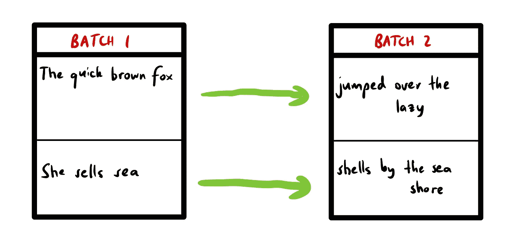
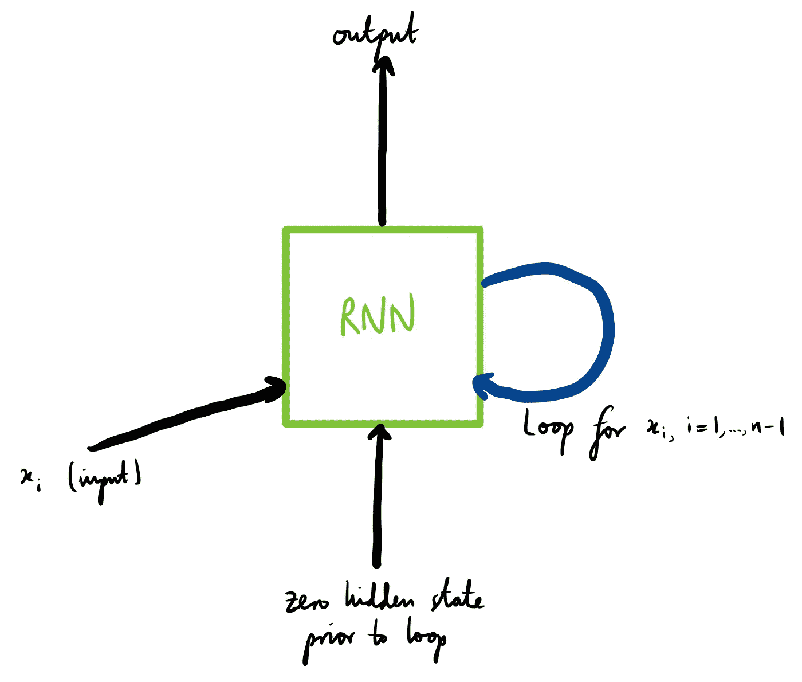
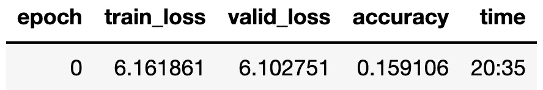
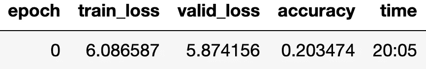
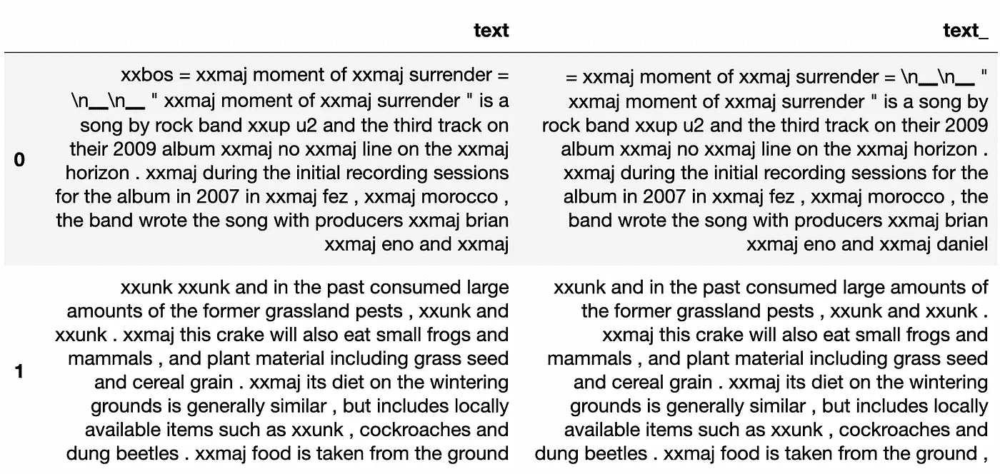
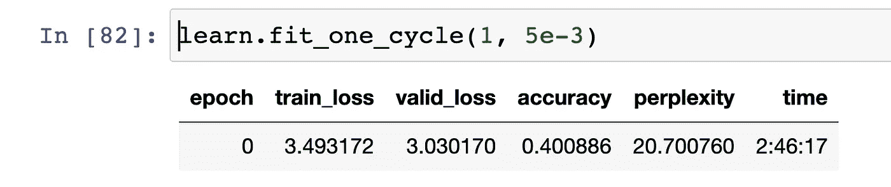

# 使用深度学习进行维基百科文章的文本生成

> 原文：<https://towardsdatascience.com/using-deep-learning-for-text-generation-of-wikipedia-articles-c9f1897f54a0>

# 使用深度学习进行维基百科文章的文本生成

## 在 fastai 和 Pytorch 中对自然语言模型使用 AWD-lstm


卢克·切瑟在 [Unsplash](https://unsplash.com?utm_source=medium&utm_medium=referral) 上的照片

预测序列中的下一个单词是*语言模型*的任务。语言模型是一种自我监督学习的形式。与大多数深度学习任务不同，语言模型没有通过手动标记提供给它们的问题目标。相反，数据本身包含所需的标签。在我们的例子中，这些标签只是句子中的下一个单词。除了显而易见的原因之外，你可能有很多原因想要承担这样一个自我监督的学习问题。例如，拟合一个语言模型，然后使用迁移学习极大地提高了文本分类器的性能:它们可以理解它们预测的语料库的细节。这种方法被称为通用语言模型微调(ULMFit)和[是由杰瑞米·霍华德和西尔万·格鲁格首创的。](https://arxiv.org/abs/1801.06146)

虽然变形金刚目前在深度学习社区风靡一时，但在 Pytorch 和 fastai 中很难找到关于语言模型的资源。从导入文本数据和符号化到编写复杂的模型，理解整个语言管道更加困难。因此，我们的任务将是预测 Wikitext 微小数据集中的未来单词，由 Stephen Merity，Xiong，James Bradbury 和 Richard Socher 提供(2016，[Pointer Sentinel Mixture Models](http://arxiv.org/abs/1609.07843))。这个数据集在[知识共享署名-共享许可](https://en.wikipedia.org/wiki/Wikipedia:Text_of_Creative_Commons_Attribution-ShareAlike_3.0_Unported_License)下可用。

。这是从维基百科文章中收集的超过 1 亿个单词的语料库的一个小样本。这篇文章结合了自然语言处理的基础，包括标记化，以及让 RNNs 真正良好工作的最新技术。这同时解决了杰瑞米·霍华德快速书[第 12 章和第 14 章的主题，并详细阐述了需要进一步概括的概念和代码。](https://github.com/fastai/fastbook)

# 数据预处理

你可能想知道为什么我们使用一个较小的模型。如果我们有完整的 Wikitext 数据可用(通过 fastai)，那么为什么不使用它呢？有两个主要原因:无论何时开始建模任务，总是从数据的子集开始。它允许你建立你的管道，更快地迭代，更容易地实验。一旦你让整个事情运转起来，接下来就是在更大的数据集中进行替换，然后等待模型训练完成。

我们将首先回顾将文本转换成可以输入模型的东西的两个主要步骤:标记化和数值化。

## 符号化

标记化是将单词列表转换成单个标记的过程。但是，我们不能只在空格上打散字。如果你想一想，英语有很多奇怪的地方，有很多奇怪的符号，我们需要解释。例如，fastai 使用一套称为`spaCy`的令牌化规则。我们可以通过使用`WordTokenizer`来访问这个默认的标记器。

我们使用函数`coll_repr(collection, n)`来显示这个`collection`的前`n`项。我们还必须将`txt`包装在一个列表中，因为标记器获取一组文档，我们可以将它们表示为一个列表。然而，我们不能就此罢休。熟悉语言模型的人会知道，我们需要添加特殊字符来表示新文本的开始:`xxbos`，其中 BOS 代表“流的开始”。还有许多其他规则也使语言模型更容易学习，例如通过对重复字符使用特殊标记而不是简单地重复几次标记来减小嵌入矩阵的大小。这是由 fastai 的`Tokenizer()`处理的:

其他特殊令牌包括:

*   下一个单词以大写字母开头
*   `xxunk`:未知令牌

## 数值化

一旦我们对输入流进行了标记，我们仍然需要一种方法来对这些标记进行分类，就像我们可以在表格数据的嵌入矩阵中嵌入分类变量一样。事实上，这个过程几乎是相同的:列出所有可能的标记，代表分类变量(这只是我们的词汇表)，然后用它在这个列表中的索引或位置替换每个标记。

为此，我们实际上首先需要我们的标记化输入流，所以我们从上面调用我们的标记器:`toks=tkn(txt)`。然后我们需要设置`Numericalize`:这是使用一个类方法完成的，将我们的令牌作为参数传入。这样，我们构建了语料库的词汇。设置好之后，我们可以向它传递任何输入流，将令牌转换成整数。我们指定`min_freq=0`，因为缺省值是 3；由于我们的文本甚至不是一个句子，这意味着任何出现少于三次的单词都将被替换为`xxunk`。

如果我们将文本从上面传递到`num`，我们会期望什么？这个过程的要点是将令牌转换成整数，表示它们在 vocab 中的索引。让我们仔细检查我们得到了这个。

你可能想知道为什么我们有这么多 0。这是因为我们的输入流很小，所以大部分令牌都是未知的。我们需要大量的批处理来构建足够大的词汇表。我推荐看看 fastai 的书的第 10 章[中的例子。](https://github.com/fastai/fastbook/blob/master/10_nlp.ipynb)

为什么我们首先想要`unk`代币？向我们的模型提供尽可能多的信息当然是好的。然而，避免过大的嵌入矩阵是有用的，因为它会使用太多的内存并降低训练速度。此外，语料库中没有很好表示的单词可能没有足够的数据来形成表示。

## 创建数据加载器

最初，我们将基本上从零开始为我们的语言模型创建数据加载器，然后我们将把所有的文本放入 Pandas 数据帧，并让 fastai 为我们处理它。这第一步对于理解如何向语言模型提供数据非常重要。

我们以通常的方式提取数据，然后使用内置函数`L()`读取文本数据。这本质上只是一个 Python 列表的花哨版本，带有一些受 NumPy 启发的高级索引技术。不要太担心这个的语义。您可以在将来为不同的文本文件或 CSV 文件回收这些代码。这只是将训练集和测试集连接成一个连续的流。这将使我们能够在以后将它分成重要的和合理的批量。

然后我们可以看看我们的文本。

我们将通过在每个空格处分割文本来标记。

创建一个唯一标记的列表为我们提供了语料库的词汇。同样，我们使用内置函数`L()`。然后，我们可以通过枚举`vocab`将每个标记映射到它在词汇表中的索引。正如我们所预料的，一次输入一个令牌会给出一个整数列表。

要使用我们的语言模型，我们需要确保批处理是以特定的方式组织的。将来，我们可以使用内置的 fastai 功能来完成这项工作，但现在我们将手动完成这项工作。

数据集被分成`bs`个大小相等的组，代表`bl`个小序列流。每个批次都有`bs`行(批次大小)和`bl`列(序列长度)。第一批的第一行包含第一个迷你流的开始。第一批的第二行包含第二个迷你流的开始。第二批的第一行包含第一迷你流的第二块，从最后一批结束的地方继续。该模型将“看到”从一批流到另一批的文本。



我们的文本流如何跨批排列的示例(图片由作者提供)。

我们这里的`group_chunks`函数直接来自 fastai，它所做的就是这个重新索引。我们将文本流分成大小相等的`m = len(dset) // bs`批，其中`m`是每个批的长度。

您可能想知道如果文本流的长度不能被批处理大小整除会发生什么。在这种情况下，当使用`drop_last=True`创建`DataLoaders`时，我们可以删除最后一个形状不正确的批次(除以批次大小后的余数)。您可能还会问，如果数据加载器是基于向模型随机提供批处理的概念构建的，那么文本将如何成为连续的流。正因为如此，我们也通过`shuffle=False`。

最后，我们需要将文本流分解成相应的输入和目标。为此，我们获取输入的序列长度，比如说 16 个单词，并从当前单词到未来的 16 个单词对我们的`words`标记进行索引。然后，目标变成从当前单词开始的 16 个单词(偏移 1)。确保您理解下面`seqs`中的循环范围。然后，我们为训练/测试分割指定一个截止值，即我们数据的 80%。最后，我们像往常一样使用`DataLoaders`，除了这次直接使用方法`from_dsets`传入我们的训练和有效数据集，并记住传入我们的批处理大小。

通过查看`seqs`列表中的第一项，我们可以确认我们的目标仅仅是我们的输入，偏移了一个元素。

这正是我们想要的:我们输入特定的单词流，自我监督语言模型的任务是预测该流中的下一个单词。

## 基线 RNN

我们最初的模型仍将是一个递归神经网络，但它不会有 LSTM 的内部细胞结构。相反，我们将使用一个香草 RNN，只有一层。我们的任务是在每个时间步输入最后一个`n`字，输出一个预测，并在输入下一个字时使用隐藏单元状态进行预测。我们对序列中的所有单词循环这个过程，减去一个。



我们单层 RNN 的象征性表现(图片由作者提供)。

我们在 RNN 中使用了三层:一个嵌入层和两个线性层，最后一个线性层输出预测的单词。这里唯一稍微不熟悉的是嵌入层。它所做的就是获取一个索引列表，代表我们的令牌，然后[输出单词 embeddeds](https://pytorch.org/docs/stable/generated/torch.nn.Embedding.html)。我们也注意初始化我们的隐藏状态，由`h`表示，在初始化中为 0。如果我们在 forward 方法中这样做，我们将在每个序列被传入后丢弃模型的隐藏状态。这将违背整个目的——模型将不会知道它在序列中的位置。

在我们的正向方法中，我们初始化一个输出列表。然后，我们在序列长度上循环，在每次迭代中连接隐藏状态和应用于当前输入的嵌入层(直到沿着第二个轴的当前时间步长)。然后，我们应用中间的线性层和 ReLU 非线性，最后将最后一个线性层的输出附加到 outputs。当返回这些输出时，我们沿着第一维堆叠它们。

唯一不太说得通的线是`self.h=self.h.detach()`线。这是必要的，因为 RNNs 是如何工作的。通过仅在一个序列的开始将隐藏状态初始化为 0(在我们的例子中，一个序列是一篇文章)，那么对于文章中的数千个单词，该模型可能不得不在自身上循环数千次。(记住，这是因为我们一次前进一个单词。)如果你考虑 RNN 的展开表示，这基本上等同于几千层的神经网络。如果你还没有发现这个问题，这里就是:如果我们在第 8000 个单词上，也就是 RNN 的第 8000 层，反向传播要求我们计算一直到第一层的导数。可以想象，这需要很长的时间和很大的内存。

因此，我们简单地从我们的 `*sl*` *长度输入中移除除梯度之外的所有梯度*。*如果我们的序列长度是 16 左右，这使得它更容易管理。我们用`detach`方法来实现这一点，在`sl`迭代的每一次循环之后都会调用这个方法。通过递归层向后计算导数被称为**通过时间的反向传播** (BPTT)。分离方法通常被称为**截断 BPTT** 。*

还要注意，我们添加了一个`reset`方法，可以在创建学习者时通过回调来访问它。所有这一切都是自动初始化`h`到零在每个时期的开始，并在验证之前。这样做的理由是，我们不希望模型在阅读并预测一篇关于烹饪的文章的第一个单词时，具有来自高尔夫文章的某种隐藏状态。

然后我们可以创建我们的学习者并调用`fit_one_cycle`。请记住，语言模型需要一段时间来训练，所以即使我们的简单模型的一个纪元也需要大约 20 分钟。注意我们如何将`ModelResetter`传递到`cbs`，代表回调。



单层 RNN 的结果。

15%的准确度。还不错，但是让我们看看我们是否能在这方面有所改进。

# 创造 LSTM 模式

虽然与 RNNs 相比，LSTM 可以部分解决爆炸或消失梯度的问题，但是我们仍然可以做三件关键的事情来确保我们的 LSTM 被正则化并且不会过度拟合。这些都是由 Merity，Keskar 和 Socher 在一篇开创性的论文中介绍的。按重要性排序，它们是:

1.  拒绝传统社会的人
2.  激活和时间正则化
3.  重量捆绑

我们将会看到上述技术与普通 RNN 的性能相比有什么贡献。

## 拒绝传统社会的人

我们使用 dropout 来调整神经网络，防止过度拟合。它的工作原理是在神经网络的特定层随机归零激活，概率为`p`。这防止了网络对某些激活模式的过度依赖，允许神经元更好地合作。添加的噪声提高了模型的鲁棒性。这个想法实际上是深度学习的创始人之一杰弗里·辛顿(Geoffrey Hinton)在一次在线讲座中提出的。

> 辛顿辍学的灵感来自一次去银行的旅行。“我去了我的银行。出纳员一直在变，我问其中一个为什么。他说他不知道，但是他们经常搬家。我想这一定是因为它需要员工之间的合作才能成功地欺骗银行。这让我意识到，随机移除每个例子中不同的神经元子集将防止共谋，从而减少过度拟合。”

然而，我们不能只是随机地删除一些激活，就此打住。考虑下一层的后果。假设我们最初有 10 个神经元，在整个退出过程中，我们只剩下 5 个。然后，将这些激活传递到下一层，我们可以想象下一层是相当混乱的。以前，它得到 10 个正激活的总和(因为我们在层之间应用 ReLU ),现在它只得到该信号的一半。就是尺度不一样。

如果我们想规模保持不变，我们需要重新调整。例如，如果`p=0.5`，那么我们期望一半的神经元被清零，这将使传递给下一层的信息减半。我们还剩下大约`1-p`个神经元。因此，我们除以`1-p=0.5`，将这些激活的大小增加到与之前相同的水平(因为我们除以一个小于 1 的数)。

## 激活和时间正则化

权重衰减在深度学习中被用作一种正则化形式，以防止过度拟合。权重衰减通过向损失添加惩罚来减小模型权重的大小，这意味着权重与所有其他权重相比不会变得过于重要。类似地，我们可以将两种其他形式的正则化应用于递归神经网络:激活正则化和时间激活正则化。

激活正则化(AR)旨在使模型的最终激活尽可能小。要做到这一点，我们只需将激活平方，并将它们添加到损失中，乘以一个超参数`alpha`。减少激活的大小实现了*稀疏性*，当我们有大的隐藏层倾向于过度拟合数据时，这是可取的。引入这样的稀疏惩罚允许模型更好地一般化。为了使 AR 工作，我们将它应用于退出激活，这样我们就不会惩罚在常规退出中被清零的激活。

时间激活正则化(TAR)通过确保序列中连续令牌之间的激活是靠近的来工作。这是因为在句子中看到一个新单词后，激活不应该发生剧烈的变化。因此，我们通过增加连续激活之间的平方差来惩罚损失。与 AR 相反，TAR 应用于非退出激活，因为我们想要时间步长之间的激活差异，这可以通过训练中的退出而显著减少。

## 重量捆绑

AWD·LSTM 的论文还介绍了一种被称为*重量捆绑*的技术。这与模型中映射的对称性有关。在我们的语言模型中，嵌入输入是一个将单词转化为激活的映射过程。相反，最终输出层激活英语单词。根据直觉，这些映射可能是对称的。我们可以强制 Pytorch 为嵌入的输入和输出层分配相同的权重矩阵，如下所示:

```
self.h_o.weight = self.i_h.weight
```

## AWD-LSTM

让我们把所有这些技巧都包括进来，看看我们的准确度提高了多少。回想一下，我们仍然使用相同的 LSTM 模型架构；我们只是在每一步之间做一些小的调整，让它成为 AWD-LSTM。请注意我们通常在 Pytorch 中构造 LSTM 的方式与这里的模型之间的相似性。关键步骤是创建层`nn.LSTM`，在这里我们接受`n_hidden`输入并输出`n_hidden`输出，一定数量的层由`n_layers`表示。Pytorch 为我们处理其余的。我们还在 LSTM 层之后实现了 dropout，请注意实例化权重绑定的行。

请注意，我们为通过网络的每个前向传递返回三个内容:常规输出、丢失前来自 RNN 层的激活以及丢失后的激活。这允许我们使用回调`RNNRegularizer`。

为了使用激活正则化和时间正则化，我们实际上并没有把它传递到模型中。这在很大程度上是因为我们自己实施它的复杂本质，也因为它可以直接附加到损失上。相反，在创建学习器时，我们将`RNNRegularizer`传递给回调列表，超参数 alpha 和 beta 分别用于激活和时间正则化。

您可能想知道为什么我们创建了两个学习者。第一个是以通常的方式创建的:传入数据加载器、模型、损失函数、指标和回调，我们就完成了。第二种方法更简单。我们可以让`TextLearner`处理类似于`ModelResetter`和`RNNRegularizer`的回调，这是自动完成的。

经过一个时期的训练，我们的模型已经大大优于多层 RNN。如果你有时间进行更长时间的训练，我强烈建议进行多次训练，因为这样做后模型之间的差异会更加明显。



我们手工制作的 AWD LSTM 的结果(图片由作者提供)。

# 使用 fastai 进行培训

## 一批

虽然了解语言模型中的符号化和数字化是如何工作的对于调试很重要，但我们实际上可以使用 fastai 的内置模块来完成这项工作。出于我们的目的，我们甚至不需要向`DataLoaders`传递一个`DataLoader`对象。我们可以使用一个`Datasets`对象创建一个数据加载器，我发现这在处理 Pandas `DataFrames.`时更容易。首先，我们将把我们的训练和测试文本连接成一个大的连续流，就像我们上面做的那样。

然后，我们将创建`Datasets`对象。我们将使用它来创建我们的数据加载器。让我们一行一行地分解这段代码。

显然，splits 用于创建我们的训练集和验证集的索引，我们使用`range_of`函数来完成这项工作(提示:请仔细查看括号的位置)。然后，我们需要将特定的转换传递给`Datasets`类初始化器，其中包括记号化和数值化。如果您阅读`Tokenizer`的[文档](https://docs.fast.ai/text.data.html#TextBlock.from_df)，您会发现我们在这里传递的`0`只是文本列的名称。(打印出`df_all`，您将看到这确实是列名。)

但是，还有一个来自 Python 标准库的奇怪操作符叫做`attrgetter("text")`。这实质上是构造了一个从类中获取某个属性的函数。例如，如果`boy`是某个类的实例，我们定义了`func = attrgetter("age")`，那么调用`func(boy)`将返回`boy.age.`，因此，在我们的调用中，`attrgetter("text")`将获取在我们的`txt_cols`的标记化中创建的`"text"`属性，并将其数值化。

最后，我们将所有这些参数传递给我们的`Datasets`构造函数。请注意，我们将数据加载器类型指定为语言模型，这意味着当我们在调用类方法`Datasets.dataloaders()`期间传入附加参数时，我们的数据加载器将执行我们上面概述的操作，如下所示:

我们在这里做的是将所有的文本样本(dataframe 的行)连接成一个流，将它分割成大小为`bs`(表示批处理大小)的连续序列，然后一次遍历这些`seq_len`标记。然后我们就完事了！在用`dls.show_batch(max_n=3)`创建了数据加载器之后，我们可以用通常的方式显示一些批处理。请注意，右边的因变量只是输入流偏移了一个标记。



图片作者。

## 语言模型学习者

通过使用 fastai 中内置的语言模型学习器，我们可以省去很多麻烦，该学习器还使用了优化的 AWD-LSTM 架构。这也将是一个比我们上面使用的模型大得多的模型。我们以几乎相同的方式构造学习者，但是将`AWD-LSTM`作为模型传入。我们还将困惑作为一种度量，它只是损失的指数，通常用于语言模型中。

我们在学习者上调用`fit_one_cycle`,一旦一个时期完成，我们将把我们的模型保存到我们的本地机器上，这样我们可以在以后加载它，而不用担心再次经历所有上述步骤。警告:如果没有 GPU，即使只是这一个纪元也需要一段时间。准备等几个小时。



图片作者。

太神奇了！我们的精度比我们自己的 AWD-LSTM 高一倍，比普通的 RNN 高近三倍。

## 保存和加载模型

调用`learn.save("final_model")`。这将在`learn.path/models/`中创建一个名为“final_model”的文件。我们可以用`learn.load("final_model")`把这个模型的权重重新加载给学习者。

## 文本生成

使用上面的`language_model_learner`而不是普通的`Learner`的原因之一是`language_model_learner`有生成新文本的`.predict`方法。要做到这一点，我们只需要指定开始的文本，字数，我们将循环这个期望的句子数。

我们现在要做的就是把它们打印出来。

```
print(“\n”.join(preds))Michael Jordan was a professional golfer , who won a Golden Globe Award and the WWE Emmy Awards . Jordan was named to the NBA All - Star Game Team for that yearMichael Jordan was a professional basketball player . Jordan said that " i have a lot of support for my career " , and that he had changed his mind after being recalled to Utah . Jordan said he would not be
```

至少对我来说，这是惊人的。我们的语言模型显然不符合事实，但如果你不是很了解迈克尔·乔丹的传记，这种自动生成的文本几乎可以作为维基百科的文章。为`Temperature`使用相对较高的值增加了模型的随机性，我们也可以传递像`min_p`这样的参数，不考虑低于某个阈值概率的单词。

这些预测还拥有近乎完美的语法(正如杰瑞米·霍华德所指出的，这些“I”没有大写，仅仅是因为标记化规则不允许将单个字符大写)。我们的语言模型，仅仅在 CPU 上经过几个小时的训练，就已经掌握了构成英语基础的核心概念。

# 结论

在本文中，我们介绍了如何使用 Pytorch 和 fastai 构建语言模型，这是一个可以预测句子中下一个单词的模型。我们在几千篇维基百科文章上训练我们的模型，将准确度提高了近三倍，并使用 LSTM 生成了一篇关于迈克尔·乔丹的文章。

如果您想了解更多关于如何处理 Wikitext 数据集(以及一般的 NLP 数据集)的信息，请查看这里的简短 fastai 演练。未来的探索方向将是采用本文中创建的语言模型，并使用它来训练语言分类器模型，就像 ULMFit 中一样。

## 参考

[1] S. Merity，N. S. Keskar 和 R. Socher，[规范和优化 LSTM 语言模型](https://arxiv.org/abs/1708.02182) (2017)，CoRR

[2] J. Howard 和 S. Ruder，[用于文本分类的通用语言模型微调](https://arxiv.org/abs/1801.06146) (2018)，CoRR

[3] J. Howard 和 S. Glugger，[fastai 和 Pytorch 的程序员深度学习](https://course.fast.ai/) (2020)，O'Reilly 出版社

[4]斯蒂芬·梅里蒂，·熊，詹姆斯·布拉德伯里，理查德·索彻，[维基文本](https://blog.salesforceairesearch.com/the-wikitext-long-term-dependency-language-modeling-dataset/) (2016，[指针哨兵混合模型](http://arxiv.org/abs/1609.07843))。这个数据集在[知识共享署名-相似分享许可](https://en.wikipedia.org/wiki/Wikipedia:Text_of_Creative_Commons_Attribution-ShareAlike_3.0_Unported_License)下可用。