# 使用深度学习预测 Spotify 上的嘻哈流行度

> 原文：<https://towardsdatascience.com/using-deep-learning-to-predict-hip-hop-popularity-on-spotify-1125dc734ac2>

## 我能建立一个对音乐很有品味的神经网络吗？


KC 是做音乐的，我的表哥，客户。图片由 KC Makes Music 提供。

# 高级摘要

> (粗略的描述)

在这个项目中，我想建立一个工具，可以帮助我的表弟，一个名叫“KC 制作音乐”的嘻哈艺术家。这个工具将评估他尚未发布的歌曲是否有可能在黄金标准音乐流媒体服务 Spotify 上流行。我只从 Spotify 的数据库中收集和使用了音频预览样本和最近发布的嘻哈歌曲的相关流行度评分。这些被处理成光谱图和二元目标(流行/不流行)。这些被输入到一个神经网络中，这个神经网络是以不断增加的复杂性反复构建的。基于递归神经网络的最复杂的模型表现最好，准确率为 59.8%，ROC-AUC 为 0.646。这表明比基线提高了 9.1%的准确度和 0.146。这不是一个令人震惊的结果，但也不是一无是处！特别是考虑到这个模型只有音频非常有限，这是一个非常有希望的结果。我不建议在单首歌曲级别使用这种模型，但它对大量样本仍然有用。它可以将艺术家的注意力集中在一个子集上，这样可以节省精力，因此仍然有价值。进一步的改进只会使它成为我的客户可以使用的更强大的工具。

[GitHub 链接](http://github.com/Nindorph/HipHopPopularity)

# 语境

音频分类是神经网络模型的经典用例。例如，在之前的一个项目中，我所在的一个团队建立了一个分类器来区分来自[数据集](http://marsyas.info/downloads/datasets.html)的音乐流派。这已经在多个博客帖子([博客 1、](https://medium.com/swlh/music-genre-classification-using-transfer-learning-pytorch-ea1c23e36eb8) [博客 2](https://www.analyticsvidhya.com/blog/2021/06/music-genres-classification-using-deep-learning-techniques/) )中完成，看起来是一个相当知名的项目。此外，Kaggle 上正在进行音频分类竞赛，这将是类似工作流的主要候选对象。[谷歌大脑的语音识别比赛](https://www.kaggle.com/c/tensorflow-speech-recognition-challenge)和康奈尔鸟类学实验室的鸟叫声识别比赛就是两个很大的例子。

带着这些想法，我想知道音频分类能走多远。流派、人类语言和鸟鸣声涉及的类别的差异在人耳中是显而易见的。爵士乐听起来不同于金属，音节听起来彼此不同，不同的鸟有不同的叫声。这些对于人类观察者来说都是显而易见的。我知道机器比人类有更高的分辨能力，我发现在音频领域，我们给机器一些人类耳朵可以毫不费力解决的问题，这很奇怪。我能找到的最难的音频例子是[区分新冠肺炎咳嗽和普通咳嗽，](https://www.kaggle.com/andrewmvd/covid19-cough-audio-classification)但是一个训练有素的呼吸科医生可能会做出相当好的评估。相比之下，我们有模型可以根据井的一系列数据点预测坦桑尼亚的[水井是否正常工作](https://www.drivendata.org/competitions/7/pump-it-up-data-mining-the-water-table/)。在神经网络领域，[《自然》发表了一个深度神经网络，它可以通过观察心电图来预测心脏诊断。](https://www.nature.com/articles/s41467-020-15432-4)人类很难通过筛选任何一个数据集来做出这样的预测(第二个数据集可能需要心脏病专家)。

因此，我想选择一个涉及音频的项目，对人类难以预测的事情进行预测。我想挑战极限，做一些雄心勃勃的事情。我喜欢音乐，所以我想看看只根据歌曲样本训练的模型是否能预测一首歌的受欢迎程度。这是一个非常常见的想法([博客 1、](/predicting-popularity-on-spotify-when-data-needs-culture-more-than-culture-needs-data-2ed3661f75f1#:~:text=According%20to%20Spotify%2C%20%E2%80%9Cpopularity%20is,a%20lot%20in%20the%20past.%E2%80%9D) [博客 2、](/predicting-spotify-song-popularity-49d000f254c7) [博客 3](https://medium.com/m2mtechconnect/predicting-spotify-song-popularity-with-machine-learning-7a51d985359b) )，但这些都使用了 Spotify 提供的音频功能(如可跳舞性、乐器性等)。他们自己不使用音频样本，我认为使用带有神经网络的原始歌曲样本可能会更好。它也更有用，因为你不需要依赖 Spotify 的指标，可以在歌曲发布前进行这种分析。

受欢迎程度是一个艰难的目标——上述博客帖子与更传统的(即非神经网络)技术相结合取得了成功。此外，神经网络通常与人耳相对容易分类的音频数据一起使用。但是一个人不可能听着一首歌说“哦耶，那个*听起来*流行”。他们可能会说这听起来*不错*，但是受欢迎程度的量化有点模糊。

# 商业问题

KC Makes Music 是我表哥的艺名，他是 Spotify 上的嘻哈歌手。我认为，如果我利用我的数据科学技能尝试帮助他在平台上获得听众，这将是一次有趣的学习经历。他已经取得了一些成功，截至 2021 年 12 月，每月拥有约 24.5 万名听众，但了解如何获得每月听众和追随者往往很难。Spotify 有一个非常强大的数据库，所以我知道这里有一个机会，可以帮助我的表弟增加他的听众基础，从而扩大他作为一名艺术家的影响。

在查看了这个项目的可用角度后，我决定一种方法是调查最近的 hop hop 曲目，并尝试建立一个模型来预测以前未发布的歌曲是否有可能在当前场景中流行。我会收集随机分类的歌曲(所有流行度评分)，提取它们的预览音频文件，将它们转换成频谱图，然后通过神经网络输入。这将有望提供一个模型，该模型已经获得了流行歌曲之间的共同特征，从而可以判断一首新歌是否会流行。我的堂兄有一些未发行的，完成的曲目，我们可以通过模型来实现。如果它足够精确，它就能决定哪首歌会唱得好。如果他们都做得不好，这将向我的表弟发出信号，他的曲目可以使用更多的工作，我们可以以迭代的方式重新测试它们。此外，我可以使用 LIME 之类的工具来确定模型发现什么特别重要，并将该信息传递给我的堂兄，让他关注。

对于这个项目，我决定将目标简化为流行/不流行的二进制，因为对于模型来说区分两个类别比确定某个东西有多流行更容易一些。就我的商业目的而言，受欢迎/不受欢迎和受欢迎程度没有太大区别。如果我得到了惊人的结果，我总是可以在以后将其转换为回归型模型，但是现在，简化标签应该有助于我更容易地看到模型的有效性。此外，最重要的是模型可以在两个类之间分离。有一个混搭流行和冷门歌曲的模型是没用的。假阳性意味着我的表弟发布了一首不会做得很好的歌曲，假阴性意味着我的表弟过度生产了一首像以前一样好的歌曲。不管怎样，我们都毁了好作品。考虑到这一点，准确性是一个有用的指标，但 ROC-AUC 是使用的首选指标，因为它可以衡量这两个类别的区分程度。

# 数据采集

所有数据来自 [Spotify web API](https://developer.spotify.com/documentation/web-api/) 。选择 Spotify 不仅是因为它是我们试图优化的平台，还因为它是最全面的音乐数据库之一。通过使用 Spotify web API 的 python 接口 [Spotipy，](https://spotipy.readthedocs.io/en/2.19.0/#)我收集了 2019 年至 2021 年发布的“嘻哈”流派中随机歌曲的信息。随机轨道是采用[这里](https://perryjanssen.medium.com/getting-random-tracks-using-the-spotify-api-61889b0c0c27)所述的方法生成的。

关于我如何获得数据的更多细节，请查看 GitHub。

最终，16168 首曲目被选入。最关键的是，这些数据包括一个 30 秒 mp3 预览音频文件的 http 链接和一个流行度评分。这个分数在 0-100 之间，100 分是最受欢迎的。受欢迎程度是三态的，在 0 时有一个大峰，在 28 时有一个小峰，在 45 时有一个大峰。

# 仔细看看

## 数据集:完整性和代表性的检验

这是最容易做到的，看看我知道的几个有代表性的艺术家在过去 3 年里发行的歌曲。在这种情况下，德雷克、坎耶·韦斯特和 KC 做音乐(我的表哥)。关于代码的更多细节，请查看 github。

> 德雷克描绘了大约 140 首曲目。似乎是对的。
> 
> 坎耶·韦斯特得了 9 分。肯定不准确，因为他不久前释放了冬达。
> 
> KC 让音乐完全缺失！

这个数据集看起来不像它应该的那样完整。有很多歌曲的艺术家和受欢迎程度都非常多样化，但我期待会出现的歌曲却不见了。例如，Kanye West 不久前发行了《冬达》,我在这张专辑中没有看到任何东西。再者，表哥的音乐根本没有表现出来。

就像我说的，仍然有很多歌曲，所以现在可能已经足够好了。我会继续我所拥有的，如果我需要更多，我会调查更多。

## 受欢迎程度:对目标的检查

```
track_df['popularity'].hist(bins=100)
```

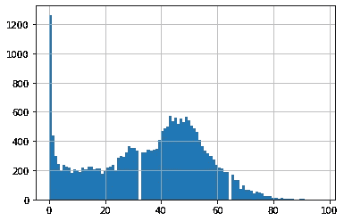

受欢迎程度得分(x 轴)与计数(y 轴)。作者图片

40 或更高似乎是一个不错的截止值，但我将在训练测试保持分裂后选择截止值，以保持数据泄漏最小。

稍后你会看到，39 是截止数，所以这是很接近的。

其他有趣的花絮——没有 MP3 的歌曲稍微更受欢迎。令人惊讶！

```
track_df[track_df['preview_url'].isna()]\['popularity'].hist(bins=100)
```

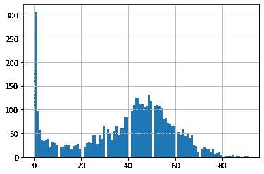

受欢迎程度得分(x 轴)与计数(y 轴)。作者图片

```
# before removal of nulls/duplicate links
track_df['popularity'].hist(bins=100)
```


受欢迎程度得分(x 轴)与计数(y 轴)。作者图片

```
# after removal of nulls/duplicate links
mp3s['popularity'].hist(bins=100)
```

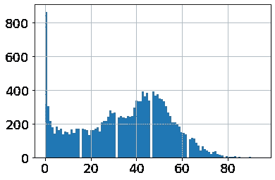

受欢迎程度得分(x 轴)与计数(y 轴)。作者图片

如您所见，带有预览 MP3 的歌曲和收集的所有独特歌曲的人口分布大致相同。尽管上述关于没有 mp3 歌曲的事情是真实的，所以没有偏见被引入没有预览 MP3 的歌曲的删除。

## 艺术家:对普通大众的审视

只是为了满足我的好奇心，并把流行值放在上下文中，我观察了数据集中艺术家平均歌曲流行度的分布。我用同样的`track_df_expart`从上面看了一下。

许多我认为非常受欢迎的艺术家平均都在 70 分以下，而许多我从未听说过的艺术家平均受欢迎程度非常高…

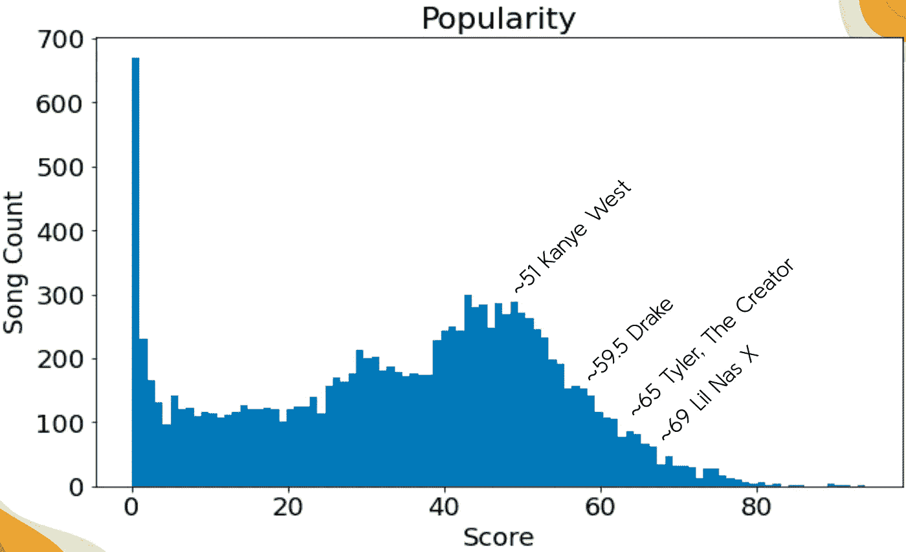

一些相当著名的艺术家的平均受欢迎程度得分。作者图片

考虑到这一点，上面的 40 个估计似乎是为“流行”画的一条非常坚实的线。同样，我将只查看训练数据，但由于样本量较大，我预计它会有类似的分布。

## 歌曲:对重复价值的审视

我看到一些歌曲有不同的 mp3 预览 http 链接，但实际上是同一首歌，只是在不同的专辑中。我会进一步调查。

```
# find duplicates based on track name and the duration
# lots of repeats -- 652 in the dataset
mp3s[mp3s.duplicated(subset=['track', 'duration_ms'], keep=False)]['track'].value_counts() 6 'N the Mornin'                                     6
3 Headed Goat (feat. Lil Baby & Polo G)              6
Zulu Screams (feat. Maleek Berry & Bibi Bourelly)    4
How TF (feat. 6LACK)                                 4
durag activity (with Travis Scott)                   4
                                                    ..
Zu Besuch                                            2
50 in Da Safe (feat. Pink Sweat$)                    2
The Announcement (Sex Drugs & Rock and Roll)         2
Shotta Flow                                          2
I'LL TAKE YOU ON (feat. Charlie Wilson)              2
Name: track, Length: 652, dtype: int64
```

> 如你所见，有很多复制品。让我们来看看最上面的例子。

```
mp3s[mp3s['track'] == "3 Headed Goat (feat. Lil Baby & Polo G)"]
```

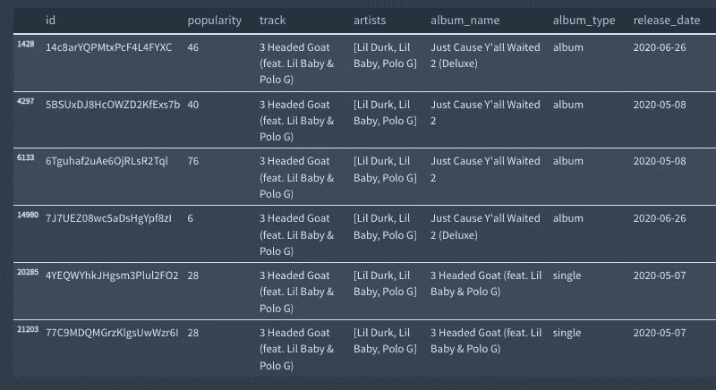

重复次数最多的歌曲，以表格形式。按作者分类的表格

> 哇，这首歌有 2 个单曲条目，2 个专辑条目，和 2 个豪华专辑条目，都有不同的预览 mp3 链接(没有图片)。他们都有不同的受欢迎程度！

虽然有不同专辑(单曲、专辑等)的重复歌曲。)，它们通常具有不同的流行度分数，这仍然是有价值的信息。只要它们的流行度分数不同，我就保留这些重复。这仅删除了 26 个条目:

```
mp3s[mp3s.duplicated(subset=['track','duration_ms','popularity'], 
                     keep=False)]['track'].value_counts() 6 'N the Mornin'                           6
9ja Hip Hop                                3
Face Off                                   2
8 Figures                                  2
80's - Instrumental - Remastered           2
3 Headed Goat (feat. Lil Baby & Polo G)    2
Studio 54                                  2
SAME THING                                 2
One Punch Wulf                             2
50/50 Love                                 2
96 Freestyle                               2
6itch remix - feat. Nitro                  2
6565                                       2
Zero Survivors                             2
Jazz Hands                                 2
Just Mellow - Norman Cook 7'' Remix        2
Aries (feat. Peter Hook and Georgia)       2
60%                                        2
Sex Cells                                  2
Seven Day Hustle                           2
Ring (feat. Young Thug)                    2
8 Missed Calls                             2
Name: track, dtype: int64
```

# 目标和图书馆处理

现在我有了提取的数据集，我需要将我的目标处理成二进制编码的变量，我的 mp3 预览链接到带有 librosa 的 Mel 光谱图，然后我可以将这两者传递到神经网络中。

正如我前面提到的，流行度被简化为一个二元目标，以使我的模型更容易，因为受欢迎程度并不像受欢迎与否那样更具描述性。

Mel 频谱图是以可视格式表示音频数据的众所周知的工具。它将音频分解成频率(Mel 频率是一种更接近人类听觉的尺度)并显示频率随时间的分布。这样，关于节拍、音色等的模式。可以被模型检测到。

```
# making train test holdout splits
# train = 75%, test = 15%, holdout = 10%

X = mp3s.drop(columns=['popularity'])
y = mp3s['popularity']

X_pretr, X_holdout, y_pretr, y_holdout = train_test_split(X, y, test_size=0.10, random_state=42)
X_train, X_test, y_train, y_test = train_test_split(X_pretr, y_pretr, test_size=15/90, random_state=42)
print(X_train.shape, X_test.shape, X_holdout.shape)(12125, 9) (2426, 9) (1617, 9)
```

## 流行

39 岁似乎是个不错的截止年龄。

```
fig, ax = plt.subplots(figsize=(10,6))
y_train.hist(bins=95, ax=ax)
ax.grid(False)
ax.set(title='Popularity', xlabel='Score', ylabel='Song Count')
```

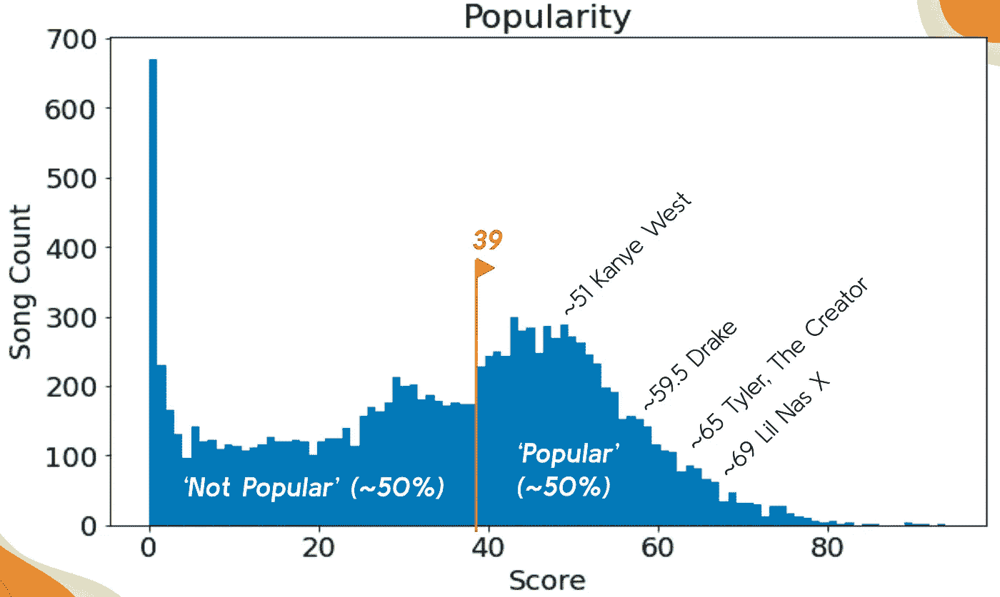

最终的流行截止(文本和截止标记添加后渲染)。作者图片

```
# defining popular as >= 39 and encoding (1 = popular)
y_train = y_train.map(lambda x: 1 if x >= 39 else 0)
y_train.value_counts(normalize=True)0    0.512
1    0.488
Name: popularity, dtype: float64y_test = y_test.map(lambda x: 1 if x >= 39 else 0)
y_test.value_counts(normalize=True)0    0.516076
1    0.483924
Name: popularity, dtype: float64y_holdout = y_holdout.map(lambda x: 1 if x >= 39 else 0)
y_holdout.value_counts(normalize=True)0    0.506494
1    0.493506
Name: popularity, dtype: float64
```

## Mel 谱图处理

查看 github 以获得关于代码的更多细节，因为它对于一篇博客文章来说太详细了。

通常，工作流程是这样的:

1.  从 http 链接获取. MP3
2.  将. mp3 转换为。与 [pydub。音频段](https://audiosegment.readthedocs.io/en/latest/audiosegment.html)
3.  获取训练、测试和保持分裂的 mel 光谱图
4.  缩放光谱图(简单的最小值-最大值，适合训练数据)

让我们来看一个示例波形。这是“行业宝贝(壮举。由 Lil Nas X 创作的 Jack Harlow)，这是一首非常流行的歌曲，最初的流行度得分为 90。如你所见，它有 30 秒长，各种振幅。

```
# visualize waveform
y, sr = librosa.load('data/X_train/wav/10564.wav',duration=30)
fig, ax = plt.subplots(figsize=(10,6))
librosa.display.waveshow(y, sr=sr, ax=ax);
ax.set(title='Waveform', xlabel='Time (sec)', ylabel='Amplitude')
plt.savefig('images/waveform.png');
```

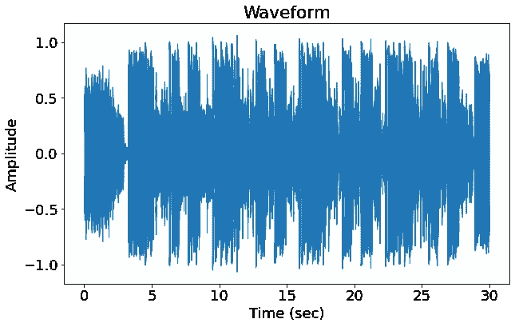

波形。作者图片

下面是对应的 Mel 谱图。有趣的是，随着歌曲的发展，你可以分辨出和弦、旋律和节奏(以及其他)的形状。这对模型非常重要。

```
fig, ax = plt.subplots(figsize=(10,6))
img = librosa.display.specshow(X_train[4118][:,:,0], x_axis='time', 
                               y_axis='mel', fmax=11025, ax=ax)
fig.colorbar(img, ax=ax, format='%+.1f dB')
ax.set(title='Mel Spectrogram', xlabel='Time (sec)', ylabel='Frequency (mels)')
plt.savefig('images/melspec.png');
```

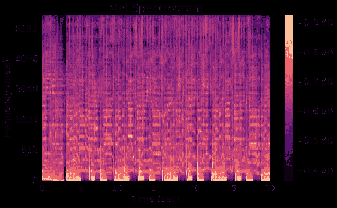

相应的 Mel 谱图(未缩放)。作者图片

# 建模

光谱图是一种图像，因此该工作流程类似于使用神经网络的图像分类问题。

我从基线理解开始，然后转向传统的多层感知器。我用几个不同的卷积配置开发神经网络，然后用一个卷积神经网络结束，它包括一个门控递归单元，这是一种递归/递归神经网络。

当我增加模型的复杂性时，目标是用它来增加模型在光谱图中提取与目标相关的潜在模式的能力。当我介绍每个模型迭代时，我将详细解释我的思考过程。

## 基线理解

当我训练我的神经网络时，我需要知道一个未经训练的/无用的神经网络将如何运行。我将通过查看虚拟分类器来获得这些信息，该分类器简单地预测每首歌曲的多数类。

```
dummy = DummyClassifier(random_state=42)
dummy.fit(X_train, y_train)
dummypreds = dummy.predict(X_test)

print(f"Dummy Accuracy: {accuracy_score(y_test, dummypreds)}")
print(f"Dummy ROC-AUC: {roc_auc_score(y_test, dummypreds)}")Dummy Accuracy: 0.516075845012366
Dummy ROC-AUC: 0.5
```

不出所料，这次表现很差。对于只预测“不流行”的模型将如何表现，这些是需要记住的好数字。

## 多层感知器

现在我们已经了解了最坏的情况，我们可以进入最简单的神经网络。我认为单层感知器特别没用，所以我选择了稍微复杂一点但仍然简单的两层密集模型。

128 和 64 个节点是根据以前对这些类型的模型的经验相对随意地选择的。

```
input_shape = X_train.shape[1:]
batch_size = X_train.shape[0]/100# set random seed for reproducibility
np.random.seed(42)
set_seed(42)

# build sequentially
mlp = keras.Sequential(name='mlp')

# flatten input 3D tensor to 1D
mlp.add(layers.Flatten(input_shape=input_shape))

# two hidden layers
mlp.add(layers.Dense(128, activation='relu'))
mlp.add(layers.Dense(64, activation='relu'))

# output layer
mlp.add(layers.Dense(1, activation='sigmoid'))

# compile perceptron
mlp.compile(loss='binary_crossentropy',
            optimizer="adam",
            metrics=['accuracy', 'AUC'])

# take a look at model architecture
mlp.summary()Model: "mlp"
_________________________________________________________________
 Layer (type)                Output Shape              Param #   
=================================================================
 flatten (Flatten)           (None, 165376)            0         

 dense (Dense)               (None, 128)               21168256  

 dense_1 (Dense)             (None, 64)                8256      

 dense_2 (Dense)             (None, 1)                 65        

=================================================================
Total params: 21,176,577
Trainable params: 21,176,577
Non-trainable params: 0
_________________________________________________________________mlp_history = mlp.fit(X_train, y_train, epochs=20, batch_size=30,
                  validation_data=(X_test, y_test))Epoch 1/20
346/346 [==============================] - 10s 28ms/step - loss: 0.8132 - accuracy: 0.4975 - auc: 0.5008 - val_loss: 0.8145 - val_accuracy: 0.5161 - val_auc: 0.4437
Epoch 2/20
346/346 [==============================] - 9s 27ms/step - loss: 0.7078 - accuracy: 0.5031 - auc: 0.5002 - val_loss: 0.6934 - val_accuracy: 0.4971 - val_auc: 0.5652
Epoch 3/20
346/346 [==============================] - 10s 28ms/step - loss: 0.7144 - accuracy: 0.5046 - auc: 0.5035 - val_loss: 0.6919 - val_accuracy: 0.5161 - val_auc: 0.5573
Epoch 4/20
346/346 [==============================] - 10s 29ms/step - loss: 0.6962 - accuracy: 0.5039 - auc: 0.5015 - val_loss: 0.6923 - val_accuracy: 0.5161 - val_auc: 0.5369
Epoch 5/20
346/346 [==============================] - 11s 30ms/step - loss: 0.6930 - accuracy: 0.5097 - auc: 0.5040 - val_loss: 0.6934 - val_accuracy: 0.5161 - val_auc: 0.5004
Epoch 6/20
346/346 [==============================] - 9s 27ms/step - loss: 0.6933 - accuracy: 0.5077 - auc: 0.5010 - val_loss: 0.6926 - val_accuracy: 0.5161 - val_auc: 0.5000
Epoch 7/20
346/346 [==============================] - 10s 28ms/step - loss: 0.6929 - accuracy: 0.5112 - auc: 0.4996 - val_loss: 0.6927 - val_accuracy: 0.5161 - val_auc: 0.5000
Epoch 8/20
346/346 [==============================] - 10s 28ms/step - loss: 0.6930 - accuracy: 0.5112 - auc: 0.4888 - val_loss: 0.6927 - val_accuracy: 0.5161 - val_auc: 0.5000
Epoch 9/20
346/346 [==============================] - 10s 28ms/step - loss: 0.6930 - accuracy: 0.5112 - auc: 0.4966 - val_loss: 0.6927 - val_accuracy: 0.5161 - val_auc: 0.5000
Epoch 10/20
346/346 [==============================] - 10s 28ms/step - loss: 0.6930 - accuracy: 0.5112 - auc: 0.4961 - val_loss: 0.6927 - val_accuracy: 0.5161 - val_auc: 0.5000
Epoch 11/20
346/346 [==============================] - 10s 28ms/step - loss: 0.6930 - accuracy: 0.5112 - auc: 0.4947 - val_loss: 0.6927 - val_accuracy: 0.5161 - val_auc: 0.5000
Epoch 12/20
346/346 [==============================] - 10s 28ms/step - loss: 0.6929 - accuracy: 0.5112 - auc: 0.4977 - val_loss: 0.6927 - val_accuracy: 0.5161 - val_auc: 0.5000
Epoch 13/20
346/346 [==============================] - 10s 28ms/step - loss: 0.6930 - accuracy: 0.5112 - auc: 0.4937 - val_loss: 0.6927 - val_accuracy: 0.5161 - val_auc: 0.5000
Epoch 14/20
346/346 [==============================] - 10s 28ms/step - loss: 0.6930 - accuracy: 0.5112 - auc: 0.4994 - val_loss: 0.6928 - val_accuracy: 0.5161 - val_auc: 0.5000
Epoch 15/20
346/346 [==============================] - 10s 28ms/step - loss: 0.6929 - accuracy: 0.5112 - auc: 0.5009 - val_loss: 0.6927 - val_accuracy: 0.5161 - val_auc: 0.5000
Epoch 16/20
346/346 [==============================] - 10s 28ms/step - loss: 0.6930 - accuracy: 0.5112 - auc: 0.4951 - val_loss: 0.6927 - val_accuracy: 0.5161 - val_auc: 0.5000
Epoch 17/20
346/346 [==============================] - 10s 30ms/step - loss: 0.6930 - accuracy: 0.5112 - auc: 0.4899 - val_loss: 0.6927 - val_accuracy: 0.5161 - val_auc: 0.5000
Epoch 18/20
346/346 [==============================] - 10s 28ms/step - loss: 0.6930 - accuracy: 0.5112 - auc: 0.4937 - val_loss: 0.6926 - val_accuracy: 0.5161 - val_auc: 0.5000
Epoch 19/20
346/346 [==============================] - 10s 28ms/step - loss: 0.6930 - accuracy: 0.5112 - auc: 0.5026 - val_loss: 0.6929 - val_accuracy: 0.5161 - val_auc: 0.5000
Epoch 20/20
346/346 [==============================] - 10s 28ms/step - loss: 0.6930 - accuracy: 0.5112 - auc: 0.4942 - val_loss: 0.6928 - val_accuracy: 0.5161 - val_auc: 0.5000visualize_training_results(mlp_history)
```

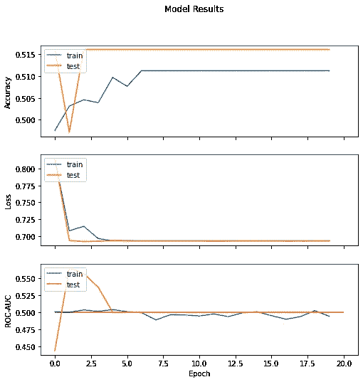

MLP 结果。作者图片

多层感知器并没有像预期的那样产生特别好的结果。在 5 个时期之后，即使是在训练数据中，指标也保持稳定。这告诉我们，这个模型很难找到任何有用的东西。测试准确性和 ROC-AUC 也与虚拟分类器匹配，因此它肯定是无用的。

## 卷积神经网络

让我们添加卷积功能来帮助它更好地解析视觉信息。一般而言，卷积架构用于图像处理，将越来越大的图像片段组合在一起。

这通常是通过卷积组件完成的，然后将卷积组件馈送到密集连接的感知器。

下面的架构改编自之前的一个项目，我们使用与这里类似的过程构建了一个流派分类器。该项目的 GitHub repo 可以在这里找到。

```
# set random seed for reproducibility
np.random.seed(42)
set_seed(42)

# build sequentially
cnn1 = keras.Sequential(name='cnn1')

# convolutional and max pooling layers with successively more filters
cnn1.add(layers.Conv2D(16, (3, 3), activation='relu', padding='same', input_shape=input_shape))
cnn1.add(layers.MaxPooling2D((2, 4)))

cnn1.add(layers.Conv2D(32, (3, 3), activation='relu', padding='same'))
cnn1.add(layers.MaxPooling2D((2, 4)))

cnn1.add(layers.Conv2D(64, (3, 3), activation='relu', padding='same'))
cnn1.add(layers.MaxPooling2D((2, 2)))

cnn1.add(layers.Conv2D(128, (3, 3), activation='relu', padding='same'))
cnn1.add(layers.MaxPool2D((2, 2)))

# fully-connected layers for output
cnn1.add(layers.Flatten())
cnn1.add(layers.Dense(128, activation='relu'))
cnn1.add(layers.Dropout(0.3))
cnn1.add(layers.Dense(64, activation='relu'))
cnn1.add(layers.Dropout(0.3))

# output layer
cnn1.add(layers.Dense(1, activation='sigmoid'))

# compile cnn
cnn1.compile(loss='binary_crossentropy',
            optimizer="adam",
            metrics=['accuracy', 'AUC'])

# take a look at model architecture
cnn1.summary()Model: "cnn1"
_________________________________________________________________
 Layer (type)                Output Shape              Param #   
=================================================================
 conv2d (Conv2D)             (None, 128, 1292, 16)     160       

 max_pooling2d (MaxPooling2D  (None, 64, 323, 16)      0         
 )                                                               

 conv2d_1 (Conv2D)           (None, 64, 323, 32)       4640      

 max_pooling2d_1 (MaxPooling  (None, 32, 80, 32)       0         
 2D)                                                             

 conv2d_2 (Conv2D)           (None, 32, 80, 64)        18496     

 max_pooling2d_2 (MaxPooling  (None, 16, 40, 64)       0         
 2D)                                                             

 conv2d_3 (Conv2D)           (None, 16, 40, 128)       73856     

 max_pooling2d_3 (MaxPooling  (None, 8, 20, 128)       0         
 2D)                                                             

 flatten_1 (Flatten)         (None, 20480)             0         

 dense_3 (Dense)             (None, 128)               2621568   

 dropout (Dropout)           (None, 128)               0         

 dense_4 (Dense)             (None, 64)                8256      

 dropout_1 (Dropout)         (None, 64)                0         

 dense_5 (Dense)             (None, 1)                 65        

=================================================================
Total params: 2,727,041
Trainable params: 2,727,041
Non-trainable params: 0
_________________________________________________________________cnn1_history = cnn1.fit(X_train, y_train, epochs=20, batch_size=100,
                  validation_data=(X_test, y_test))Epoch 1/20
104/104 [==============================] - 152s 1s/step - loss: 0.6937 - accuracy: 0.5081 - auc: 0.4969 - val_loss: 0.6926 - val_accuracy: 0.5161 - val_auc: 0.5000
Epoch 2/20
104/104 [==============================] - 152s 1s/step - loss: 0.6930 - accuracy: 0.5074 - auc: 0.5047 - val_loss: 0.6929 - val_accuracy: 0.5161 - val_auc: 0.5000
Epoch 3/20
104/104 [==============================] - 151s 1s/step - loss: 0.6932 - accuracy: 0.5114 - auc: 0.4907 - val_loss: 0.6928 - val_accuracy: 0.5161 - val_auc: 0.5000
Epoch 4/20
104/104 [==============================] - 151s 1s/step - loss: 0.6929 - accuracy: 0.5112 - auc: 0.5015 - val_loss: 0.6927 - val_accuracy: 0.5161 - val_auc: 0.5043
Epoch 5/20
104/104 [==============================] - 151s 1s/step - loss: 0.6930 - accuracy: 0.5112 - auc: 0.4978 - val_loss: 0.6927 - val_accuracy: 0.5161 - val_auc: 0.5000
Epoch 6/20
104/104 [==============================] - 151s 1s/step - loss: 0.6929 - accuracy: 0.5112 - auc: 0.4984 - val_loss: 0.6926 - val_accuracy: 0.5161 - val_auc: 0.5000
Epoch 7/20
104/104 [==============================] - 150s 1s/step - loss: 0.6928 - accuracy: 0.5111 - auc: 0.5071 - val_loss: 0.6927 - val_accuracy: 0.5161 - val_auc: 0.5032
Epoch 8/20
104/104 [==============================] - 148s 1s/step - loss: 0.6929 - accuracy: 0.5120 - auc: 0.5002 - val_loss: 0.6927 - val_accuracy: 0.5161 - val_auc: 0.5000
Epoch 9/20
104/104 [==============================] - 149s 1s/step - loss: 0.6930 - accuracy: 0.5114 - auc: 0.4937 - val_loss: 0.6927 - val_accuracy: 0.5161 - val_auc: 0.5000
Epoch 10/20
104/104 [==============================] - 152s 1s/step - loss: 0.6930 - accuracy: 0.5116 - auc: 0.4982 - val_loss: 0.6927 - val_accuracy: 0.5161 - val_auc: 0.5000
Epoch 11/20
104/104 [==============================] - 152s 1s/step - loss: 0.6930 - accuracy: 0.5108 - auc: 0.4994 - val_loss: 0.6927 - val_accuracy: 0.5161 - val_auc: 0.5000
Epoch 12/20
104/104 [==============================] - 155s 1s/step - loss: 0.6928 - accuracy: 0.5112 - auc: 0.5051 - val_loss: 0.6927 - val_accuracy: 0.5161 - val_auc: 0.5000
Epoch 13/20
104/104 [==============================] - 150s 1s/step - loss: 0.6930 - accuracy: 0.5111 - auc: 0.4957 - val_loss: 0.6927 - val_accuracy: 0.5161 - val_auc: 0.5000
Epoch 14/20
104/104 [==============================] - 150s 1s/step - loss: 0.6930 - accuracy: 0.5112 - auc: 0.4986 - val_loss: 0.6927 - val_accuracy: 0.5161 - val_auc: 0.5000
Epoch 15/20
104/104 [==============================] - 153s 1s/step - loss: 0.6930 - accuracy: 0.5118 - auc: 0.4976 - val_loss: 0.6927 - val_accuracy: 0.5161 - val_auc: 0.5000
Epoch 16/20
104/104 [==============================] - 150s 1s/step - loss: 0.6930 - accuracy: 0.5112 - auc: 0.4946 - val_loss: 0.6927 - val_accuracy: 0.5161 - val_auc: 0.5000
Epoch 17/20
104/104 [==============================] - 149s 1s/step - loss: 0.6929 - accuracy: 0.5112 - auc: 0.4928 - val_loss: 0.6927 - val_accuracy: 0.5161 - val_auc: 0.5000
Epoch 18/20
104/104 [==============================] - 155s 1s/step - loss: 0.6930 - accuracy: 0.5112 - auc: 0.4981 - val_loss: 0.6927 - val_accuracy: 0.5161 - val_auc: 0.5000
Epoch 19/20
104/104 [==============================] - 150s 1s/step - loss: 0.6930 - accuracy: 0.5112 - auc: 0.4974 - val_loss: 0.6927 - val_accuracy: 0.5161 - val_auc: 0.5000
Epoch 20/20
104/104 [==============================] - 149s 1s/step - loss: 0.6929 - accuracy: 0.5112 - auc: 0.4956 - val_loss: 0.6927 - val_accuracy: 0.5161 - val_auc: 0.5000visualize_training_results(cnn1_history)
```

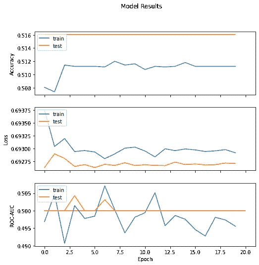

第一个 CNN 结果。作者图片

第一个 CNN 做的不是很好。它似乎比多层感知器更具反应性，但不是以产生结果的方式。测试数据最终进入虚拟分类器值，所以这也是一个无用的模型。

## CNN 第二轮

与上述完全相同的架构，只是没有第二个密集层。这和我前面提到的音乐流派分类项目中的第一次迭代模型是一样的。

在做那个项目的时候，我注意到如果你把 CNN 连接到一个单一的密集层，它会表现得更好。这可能不直观，但我想尝试一下。

```
# set random seed for reproducibility
np.random.seed(42)
set_seed(42)

# build sequentially
cnn2 = keras.Sequential(name='cnn2')

# convolutional and max pooling layers with successively more filters
cnn2.add(layers.Conv2D(16, (3, 3), activation='relu', padding='same', input_shape=input_shape))
cnn2.add(layers.MaxPooling2D((2, 4)))

cnn2.add(layers.Conv2D(32, (3, 3), activation='relu', padding='same'))
cnn2.add(layers.MaxPooling2D((2, 4)))

cnn2.add(layers.Conv2D(64, (3, 3), activation='relu', padding='same'))
cnn2.add(layers.MaxPooling2D((2, 2)))

cnn2.add(layers.Conv2D(128, (3, 3), activation='relu', padding='same'))
cnn2.add(layers.MaxPool2D((2, 2)))

# fully-connected layer for output
cnn2.add(layers.Flatten())
cnn2.add(layers.Dense(128, activation='relu'))

# output layer
cnn2.add(layers.Dense(1, activation='sigmoid'))

# compile cnn
cnn2.compile(loss='binary_crossentropy',
            optimizer="adam",
            metrics=['accuracy', 'AUC'])

# take a look at model architecture
cnn2.summary()Model: "cnn2"
_________________________________________________________________
 Layer (type)                Output Shape              Param #   
=================================================================
 conv2d_4 (Conv2D)           (None, 128, 1292, 16)     160       

 max_pooling2d_4 (MaxPooling  (None, 64, 323, 16)      0         
 2D)                                                             

 conv2d_5 (Conv2D)           (None, 64, 323, 32)       4640      

 max_pooling2d_5 (MaxPooling  (None, 32, 80, 32)       0         
 2D)                                                             

 conv2d_6 (Conv2D)           (None, 32, 80, 64)        18496     

 max_pooling2d_6 (MaxPooling  (None, 16, 40, 64)       0         
 2D)                                                             

 conv2d_7 (Conv2D)           (None, 16, 40, 128)       73856     

 max_pooling2d_7 (MaxPooling  (None, 8, 20, 128)       0         
 2D)                                                             

 flatten_1 (Flatten)         (None, 20480)             0         

 dense_2 (Dense)             (None, 128)               2621568   

 dense_3 (Dense)             (None, 1)                 129       

=================================================================
Total params: 2,718,849
Trainable params: 2,718,849
Non-trainable params: 0
_________________________________________________________________cnn2_history = cnn2.fit(X_train, y_train, epochs=20, batch_size=100,
                  validation_data=(X_test, y_test))Epoch 1/20
104/104 [==============================] - 144s 1s/step - loss: 0.6943 - accuracy: 0.5069 - auc: 0.5027 - val_loss: 0.6929 - val_accuracy: 0.5161 - val_auc: 0.4861
Epoch 2/20
104/104 [==============================] - 140s 1s/step - loss: 0.6932 - accuracy: 0.5074 - auc: 0.4978 - val_loss: 0.6930 - val_accuracy: 0.5161 - val_auc: 0.5000
Epoch 3/20
104/104 [==============================] - 139s 1s/step - loss: 0.6932 - accuracy: 0.5088 - auc: 0.5013 - val_loss: 0.6930 - val_accuracy: 0.5161 - val_auc: 0.5000
Epoch 4/20
104/104 [==============================] - 139s 1s/step - loss: 0.6930 - accuracy: 0.5095 - auc: 0.4984 - val_loss: 0.6928 - val_accuracy: 0.5161 - val_auc: 0.5102
Epoch 5/20
104/104 [==============================] - 140s 1s/step - loss: 0.6929 - accuracy: 0.5121 - auc: 0.5119 - val_loss: 0.6926 - val_accuracy: 0.5161 - val_auc: 0.5000
Epoch 6/20
104/104 [==============================] - 139s 1s/step - loss: 0.6928 - accuracy: 0.5112 - auc: 0.5153 - val_loss: 0.6925 - val_accuracy: 0.5161 - val_auc: 0.5096
Epoch 7/20
104/104 [==============================] - 138s 1s/step - loss: 0.6927 - accuracy: 0.5144 - auc: 0.5148 - val_loss: 0.6915 - val_accuracy: 0.5474 - val_auc: 0.5670
Epoch 8/20
104/104 [==============================] - 137s 1s/step - loss: 0.6934 - accuracy: 0.5106 - auc: 0.5047 - val_loss: 0.6924 - val_accuracy: 0.5161 - val_auc: 0.5395
Epoch 9/20
104/104 [==============================] - 137s 1s/step - loss: 0.6925 - accuracy: 0.5115 - auc: 0.5183 - val_loss: 0.6931 - val_accuracy: 0.5161 - val_auc: 0.4675
Epoch 10/20
104/104 [==============================] - 137s 1s/step - loss: 0.6923 - accuracy: 0.5163 - auc: 0.5186 - val_loss: 0.6936 - val_accuracy: 0.4918 - val_auc: 0.5717
Epoch 11/20
104/104 [==============================] - 138s 1s/step - loss: 0.6926 - accuracy: 0.5178 - auc: 0.5260 - val_loss: 0.6917 - val_accuracy: 0.5260 - val_auc: 0.5594
Epoch 12/20
104/104 [==============================] - 140s 1s/step - loss: 0.6896 - accuracy: 0.5247 - auc: 0.5415 - val_loss: 0.6869 - val_accuracy: 0.5400 - val_auc: 0.5728
Epoch 13/20
104/104 [==============================] - 136s 1s/step - loss: 0.6876 - accuracy: 0.5356 - auc: 0.5477 - val_loss: 0.6862 - val_accuracy: 0.5396 - val_auc: 0.5769
Epoch 14/20
104/104 [==============================] - 136s 1s/step - loss: 0.6863 - accuracy: 0.5379 - auc: 0.5572 - val_loss: 0.6863 - val_accuracy: 0.5408 - val_auc: 0.5772
Epoch 15/20
104/104 [==============================] - 137s 1s/step - loss: 0.6854 - accuracy: 0.5460 - auc: 0.5625 - val_loss: 0.6850 - val_accuracy: 0.5433 - val_auc: 0.5788
Epoch 16/20
104/104 [==============================] - 143s 1s/step - loss: 0.6835 - accuracy: 0.5496 - auc: 0.5703 - val_loss: 0.6855 - val_accuracy: 0.5400 - val_auc: 0.5811
Epoch 17/20
104/104 [==============================] - 137s 1s/step - loss: 0.6878 - accuracy: 0.5363 - auc: 0.5500 - val_loss: 0.6854 - val_accuracy: 0.5412 - val_auc: 0.5762
Epoch 18/20
104/104 [==============================] - 136s 1s/step - loss: 0.6839 - accuracy: 0.5442 - auc: 0.5686 - val_loss: 0.6882 - val_accuracy: 0.5466 - val_auc: 0.5743
Epoch 19/20
104/104 [==============================] - 136s 1s/step - loss: 0.6833 - accuracy: 0.5532 - auc: 0.5707 - val_loss: 0.6856 - val_accuracy: 0.5425 - val_auc: 0.5710
Epoch 20/20
104/104 [==============================] - 136s 1s/step - loss: 0.6832 - accuracy: 0.5545 - auc: 0.5717 - val_loss: 0.6837 - val_accuracy: 0.5453 - val_auc: 0.5821visualize_training_results(cnn2_history)
```

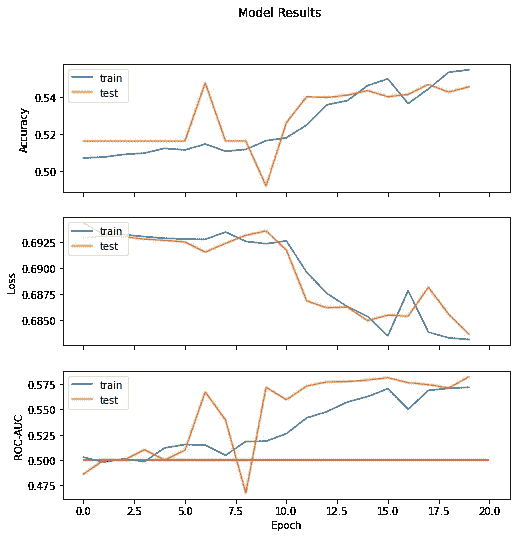

第二个 CNN 结果。作者图片

哇，它居然学到了一点东西！整洁！它没有以伪分类器值结束，所以我可以肯定它确实学到了一些东西。最终，我们可以看到在以后的时期，模型开始过度适应训练数据，但是当训练结束时，测试分数稳定在一个好的点上。

## 递归神经网络

最后，我们将尝试这种风格的递归神经网络。我从[这篇论文](https://arxiv.org/pdf/1901.04555.pdf)中提取了下面的架构，并将其改编为二进制分类。在那篇论文中，他们试图用这种方法对音乐艺术家进行分类。

像前两次迭代一样，它使用卷积组件开始，但随后输出被馈入门控递归单元，该单元“总结 2D 卷积之后的时间结构”。换句话说，它允许神经网络使用它从卷积部分学到的东西来拾取时间模式。

很整洁，是吧？

```
# set random seed for reproducibility
np.random.seed(42)
set_seed(42)

# build sequentially
rnn = keras.Sequential(name='rnn')

# convolutional and max pooling layers with successively more filters
rnn.add(layers.Conv2D(64, (3, 3), activation='elu', padding='same', input_shape=input_shape))
rnn.add(layers.MaxPooling2D((2, 2)))
rnn.add(layers.Dropout(0.1))

rnn.add(layers.Conv2D(128, (3, 3), activation='elu', padding='same'))
rnn.add(layers.MaxPooling2D((4, 2)))
rnn.add(layers.Dropout(0.1))

rnn.add(layers.Conv2D(128, (3, 3), activation='elu', padding='same'))
rnn.add(layers.MaxPooling2D((4, 2)))
rnn.add(layers.Dropout(0.1))

rnn.add(layers.Conv2D(128, (3, 3), activation='elu', padding='same'))
rnn.add(layers.MaxPool2D((4, 2)))
rnn.add(layers.Dropout(0.1))

rnn.add(layers.Reshape((80,128)))
rnn.add(layers.GRU(units=32, dropout=0.3, return_sequences=True))
rnn.add(layers.GRU(units=32, dropout=0.3))

# output layer
rnn.add(layers.Dense(1, activation='sigmoid'))

# compile cnn
rnn.compile(loss='binary_crossentropy',
            optimizer="adam", 
            metrics=['accuracy', 'AUC'])

# take a look at model architecture
rnn.summary()Model: "rnn"
_________________________________________________________________
 Layer (type)                Output Shape              Param #   
=================================================================
 conv2d (Conv2D)             (None, 128, 1292, 64)     640       

 max_pooling2d (MaxPooling2D  (None, 64, 646, 64)      0         
 )                                                               

 dropout (Dropout)           (None, 64, 646, 64)       0         

 conv2d_1 (Conv2D)           (None, 64, 646, 128)      73856     

 max_pooling2d_1 (MaxPooling  (None, 16, 323, 128)     0         
 2D)                                                             

 dropout_1 (Dropout)         (None, 16, 323, 128)      0         

 conv2d_2 (Conv2D)           (None, 16, 323, 128)      147584    

 max_pooling2d_2 (MaxPooling  (None, 4, 161, 128)      0         
 2D)                                                             

 dropout_2 (Dropout)         (None, 4, 161, 128)       0         

 conv2d_3 (Conv2D)           (None, 4, 161, 128)       147584    

 max_pooling2d_3 (MaxPooling  (None, 1, 80, 128)       0         
 2D)                                                             

 dropout_3 (Dropout)         (None, 1, 80, 128)        0         

 reshape (Reshape)           (None, 80, 128)           0         

 gru (GRU)                   (None, 80, 32)            15552     

 gru_1 (GRU)                 (None, 32)                6336      

 dense (Dense)               (None, 1)                 33        

=================================================================
Total params: 391,585
Trainable params: 391,585
Non-trainable params: 0
_________________________________________________________________rnn_history = rnn.fit(X_train, y_train, epochs=30, batch_size=100,
                  validation_data=(X_test, y_test))Epoch 1/30
104/104 [==============================] - 948s 9s/step - loss: 0.6970 - accuracy: 0.5051 - auc: 0.4990 - val_loss: 0.6913 - val_accuracy: 0.5223 - val_auc: 0.5421
Epoch 2/30
104/104 [==============================] - 933s 9s/step - loss: 0.6932 - accuracy: 0.5156 - auc: 0.5170 - val_loss: 0.6940 - val_accuracy: 0.5161 - val_auc: 0.5173
Epoch 3/30
104/104 [==============================] - 953s 9s/step - loss: 0.6932 - accuracy: 0.5153 - auc: 0.5186 - val_loss: 0.6908 - val_accuracy: 0.5161 - val_auc: 0.5515
Epoch 4/30
104/104 [==============================] - 947s 9s/step - loss: 0.6906 - accuracy: 0.5260 - auc: 0.5372 - val_loss: 0.6883 - val_accuracy: 0.5289 - val_auc: 0.5532
Epoch 5/30
104/104 [==============================] - 960s 9s/step - loss: 0.6881 - accuracy: 0.5328 - auc: 0.5526 - val_loss: 0.6876 - val_accuracy: 0.5317 - val_auc: 0.5649
Epoch 6/30
104/104 [==============================] - 955s 9s/step - loss: 0.6874 - accuracy: 0.5369 - auc: 0.5558 - val_loss: 0.6875 - val_accuracy: 0.5441 - val_auc: 0.5646
Epoch 7/30
104/104 [==============================] - 951s 9s/step - loss: 0.6868 - accuracy: 0.5429 - auc: 0.5609 - val_loss: 0.6863 - val_accuracy: 0.5276 - val_auc: 0.5869
Epoch 8/30
104/104 [==============================] - 961s 9s/step - loss: 0.6896 - accuracy: 0.5329 - auc: 0.5498 - val_loss: 0.6909 - val_accuracy: 0.5293 - val_auc: 0.5688
Epoch 9/30
104/104 [==============================] - 966s 9s/step - loss: 0.6870 - accuracy: 0.5451 - auc: 0.5639 - val_loss: 0.6830 - val_accuracy: 0.5540 - val_auc: 0.5773
Epoch 10/30
104/104 [==============================] - 978s 9s/step - loss: 0.6857 - accuracy: 0.5511 - auc: 0.5658 - val_loss: 0.6826 - val_accuracy: 0.5556 - val_auc: 0.5868
Epoch 11/30
104/104 [==============================] - 963s 9s/step - loss: 0.6865 - accuracy: 0.5436 - auc: 0.5640 - val_loss: 0.6810 - val_accuracy: 0.5676 - val_auc: 0.5884
Epoch 12/30
104/104 [==============================] - 972s 9s/step - loss: 0.6835 - accuracy: 0.5565 - auc: 0.5793 - val_loss: 0.6790 - val_accuracy: 0.5750 - val_auc: 0.6003
Epoch 13/30
104/104 [==============================] - 960s 9s/step - loss: 0.6837 - accuracy: 0.5563 - auc: 0.5772 - val_loss: 0.6851 - val_accuracy: 0.5478 - val_auc: 0.5953
Epoch 14/30
104/104 [==============================] - 969s 9s/step - loss: 0.6816 - accuracy: 0.5640 - auc: 0.5863 - val_loss: 0.6784 - val_accuracy: 0.5709 - val_auc: 0.6051
Epoch 15/30
104/104 [==============================] - 961s 9s/step - loss: 0.6807 - accuracy: 0.5679 - auc: 0.5901 - val_loss: 0.6771 - val_accuracy: 0.5697 - val_auc: 0.6011
Epoch 16/30
104/104 [==============================] - 967s 9s/step - loss: 0.6793 - accuracy: 0.5719 - auc: 0.5957 - val_loss: 0.6834 - val_accuracy: 0.5668 - val_auc: 0.5973
Epoch 17/30
104/104 [==============================] - 961s 9s/step - loss: 0.6801 - accuracy: 0.5682 - auc: 0.5927 - val_loss: 0.6785 - val_accuracy: 0.5783 - val_auc: 0.5988
Epoch 18/30
104/104 [==============================] - 967s 9s/step - loss: 0.6793 - accuracy: 0.5716 - auc: 0.5932 - val_loss: 0.6931 - val_accuracy: 0.5602 - val_auc: 0.5948
Epoch 19/30
104/104 [==============================] - 972s 9s/step - loss: 0.6811 - accuracy: 0.5654 - auc: 0.5888 - val_loss: 0.6843 - val_accuracy: 0.5441 - val_auc: 0.5977
Epoch 20/30
104/104 [==============================] - 958s 9s/step - loss: 0.6759 - accuracy: 0.5754 - auc: 0.6050 - val_loss: 0.6764 - val_accuracy: 0.5779 - val_auc: 0.6049
Epoch 21/30
104/104 [==============================] - 972s 9s/step - loss: 0.6741 - accuracy: 0.5849 - auc: 0.6108 - val_loss: 0.6796 - val_accuracy: 0.5688 - val_auc: 0.5943
Epoch 22/30
104/104 [==============================] - 972s 9s/step - loss: 0.6706 - accuracy: 0.5895 - auc: 0.6195 - val_loss: 0.6898 - val_accuracy: 0.5581 - val_auc: 0.5958
Epoch 23/30
104/104 [==============================] - 968s 9s/step - loss: 0.6727 - accuracy: 0.5821 - auc: 0.6149 - val_loss: 0.6797 - val_accuracy: 0.5767 - val_auc: 0.6058
Epoch 24/30
104/104 [==============================] - 966s 9s/step - loss: 0.6705 - accuracy: 0.5877 - auc: 0.6203 - val_loss: 0.6753 - val_accuracy: 0.5717 - val_auc: 0.6027
Epoch 25/30
104/104 [==============================] - 974s 9s/step - loss: 0.6667 - accuracy: 0.5915 - auc: 0.6289 - val_loss: 0.6816 - val_accuracy: 0.5660 - val_auc: 0.6017
Epoch 26/30
104/104 [==============================] - 973s 9s/step - loss: 0.6664 - accuracy: 0.5997 - auc: 0.6308 - val_loss: 0.6820 - val_accuracy: 0.5730 - val_auc: 0.6105
Epoch 27/30
104/104 [==============================] - 971s 9s/step - loss: 0.6701 - accuracy: 0.5872 - auc: 0.6207 - val_loss: 0.6792 - val_accuracy: 0.5775 - val_auc: 0.5988
Epoch 28/30
104/104 [==============================] - 976s 9s/step - loss: 0.6669 - accuracy: 0.5958 - auc: 0.6298 - val_loss: 0.6959 - val_accuracy: 0.5350 - val_auc: 0.6071
Epoch 29/30
104/104 [==============================] - 1424s 14s/step - loss: 0.6650 - accuracy: 0.5948 - auc: 0.6336 - val_loss: 0.6758 - val_accuracy: 0.5787 - val_auc: 0.6059
Epoch 30/30
104/104 [==============================] - 971s 9s/step - loss: 0.6666 - accuracy: 0.6011 - auc: 0.6315 - val_loss: 0.6716 - val_accuracy: 0.5837 - val_auc: 0.6152visualize_training_results(rnn_history)
```

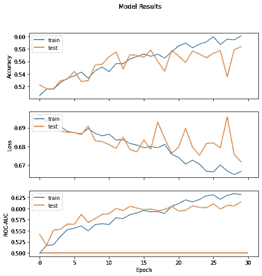

CNN-GRU 结果。作者图片

一点都不差！显然，没什么*惊人的*，但还是不算没什么。显然，这种类型的神经网络结构正在获取音乐中存在的某些东西。准确性提高了约 7–8 %, ROC-AUC 提高了约 0.1，这是一个明显的进步。这无疑显示了承诺，也许还有某种程度的效用。

## 保持测试

```
models_dict = {'Dummy': dummy, 'MP': mlp_dict, 'CNN 1': cnn1_dict, 'CNN 2': cnn2_dict, 
               'RNN': rnn_dict}acc_dict, roc_auc_dict = evaluate_holdout(models_dict, X_holdout, y_holdout)# numerical scores for all the models
print("Accuracy Scores:")
for model, score in acc_dict.items():
    print(f'{model}: {score}')
print("<>"*10)
print("ROC-AUC Scores:")
for model, score in roc_auc_dict.items():
    print(f'{model}: {score}')Accuracy Scores:
Dummy: 0.5065015479876162
MP: 0.5065015479876162
CNN 1: 0.5065015479876162
CNN 2: 0.5523219814241486
RNN: 0.5981424148606811
<><><><><><><><><><>
ROC-AUC Scores:
Dummy: 0.5
MP: 0.5
CNN 1: 0.5
CNN 2: 0.5742730226123023
RNN: 0.645901654431502# graph!

plt.rcParams.update({'font.size': 20})
fig, (ax1, ax2) = plt.subplots(2, figsize=(9,9))
plt.tight_layout(pad=2.5)
fig.suptitle('Holdout Data Results')

ax1.bar(list(acc_dict.keys()), list(acc_dict.values()))
ax1.set_ylabel('Accuracy')
ax1.set_ylim(0.5, 1)
ax1.tick_params(axis='x', rotation=45)

ax2.bar(list(roc_auc_dict.keys()), list(roc_auc_dict.values()))
ax2.set_ylabel('ROC-AUC')
ax2.set_ylim(0.5, 1)
ax2.tick_params(axis='x', rotation=45)
plt.show()
```

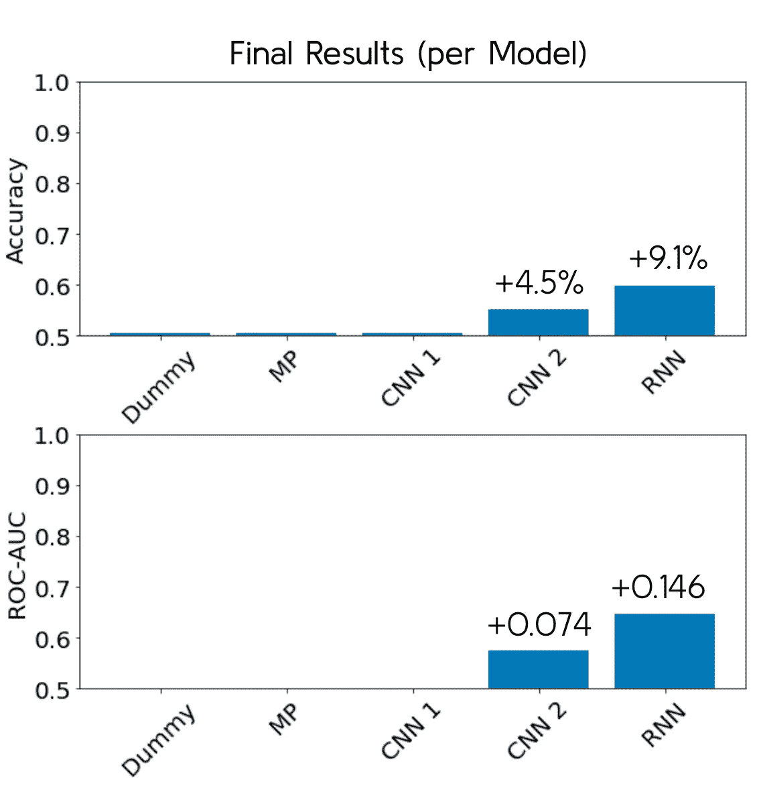

维持集的最终结果(+渲染后添加的更改)。作者图片

# 估价

正如你所看到的，即使我们使用了一些非常复杂和尖端的神经网络架构，我们也没有在我们选择的指标上获得大幅增加:准确性和 ROC-AUC。这表明模型部分的学习量有限，无法成功区分这两个组。

然而，我们确实获得了 59.8%的准确率和 0.646 的 ROC-AUC，这并不是什么都没有——这增加了 9.1%的准确率和 0.146 的 ROC-AUC。这是在维持集上，所以它确实发现了一些潜在的抽象模式，这很有趣也很有用。

如果我们让模型继续学习，它最终会过度适应训练数据。无论如何，如果我用酸橙分析这个，我肯定能获得一些真正的洞察力，了解它所拾取的模式到底是什么。

# 结论

我从一开始就知道这个建模项目是一个令人难以置信的雄心勃勃的事业。现在它已经完成了，我可以事后聪明地说，它做得并不令人惊讶地好，但它确实表现得令人钦佩。坦率地说，我甚至可以断言，由于我提出的限制，它注定会在某种程度上失败——也就是说，只使用**音频样本。然而，我的结果显示有一个实用的金块。更重要的是，它展示了一个非常强大的概念证明。**

创造一个对人耳来说有些困难的模型是一个挑战。不仅数据很难按照任何潜在的模式进行分组，而且受欢迎程度的目标也很模糊，本质上很难量化。流行有很大的影响，我知道音乐本身之外的因素对其结果有很大的影响。例如，许多糟糕的歌曲之所以流行，是因为与一个受欢迎的艺术家有关联。

最终我获得了 59.8%的准确率和 0.646 的 ROC-AUC，非常有希望(提高了 9.1%的准确率和 0.146 的 ROC-AUC)。尽管我做这个项目的方式必然受到限制，但我还是能够建立一个模型，该模型提取了流行歌曲的一些共同特征，并做出了一些成功的预测。

这改变了我的模型可能有用的方式。我着手建立一个模型，它可以被艺术家用作歌曲层面的工具，以判断某首特定歌曲是否有前途。我最终得到的是一个模型，可以传递一些可能的歌曲，并指出它认为会流行的几首歌曲。巧合的是，我的客户也经营着一家录音室，并与几十位艺术家有联系，他们都有一系列歌曲在制作中。在模型当前的形式下，我们可以传入一组歌曲样本让它进行预测，然后它选择的“流行”歌曲就可以被选择作为焦点。这个选择不会完美地决定哪些歌曲会流行，但它可以为艺术家和我的客户的录音室节省时间。

# 后续步骤

最终，通过足够的工作，我相信这个模型可以足够工具化，它将有助于评估个别歌曲。显然，除了我为这个项目收集的因素之外，还有其他影响受欢迎程度的因素，第一步是尝试将这些因素纳入模型。

在音频本身中，我们可以对样本进行不同的处理，并提取其他相关信息。也许更重要的是，我们可以看看音乐本身以外的因素。当我打电话给我的客户谈论模特的表现时，他说的第一句话是“我并不惊讶”，因为他非常了解看似随意的因素是如何导致一首歌的流行的。曝光率是一首歌是否/有多大影响力的重要因素。最好的例子是——我的客户在 Spotify 上的热门歌曲是抖音某些圈子里的一个迷因的原声带。其他非音频特征可以包括发行时间和艺术家信息。

此外，我在更高级的神经网络架构方面取得了相当大的成功，特别是门控递归单元(一种递归/递归神经网络)。研究其他架构并进一步调整现有架构可能会提高性能。

我在本笔记的早些时候提到过，数据集的一个显著限制是曲目列表似乎并不完整。为了更全面地捕捉当代嘻哈音乐的景观，我需要重新评估我的收集方法，以收集更多的歌曲。

除了扩展我所拥有的，我还想看看什么有效。我在介绍中提到过使用石灰(或类似的东西),但这次没有使用。这将是一个非常有用的工具，可以帮助我们了解对模型预测影响最大的因素是什么。尤其是一旦我开始合并更多/不同的输入、输入类型和架构，这将帮助我了解实际发生了什么。此外，这将建议艺术家，他们的歌曲的哪些重要部分是模型正在寻找的。