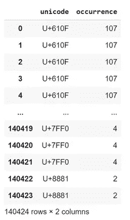
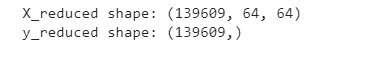
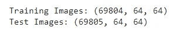
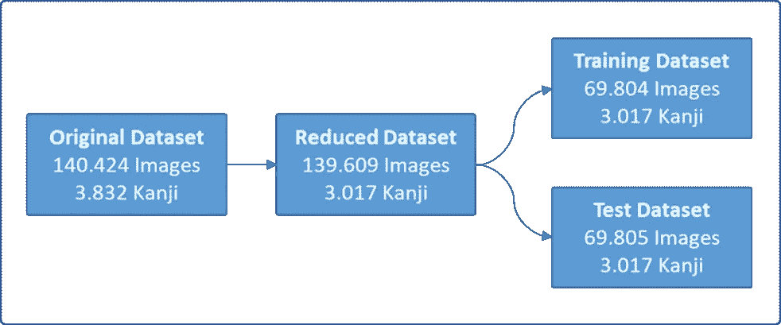
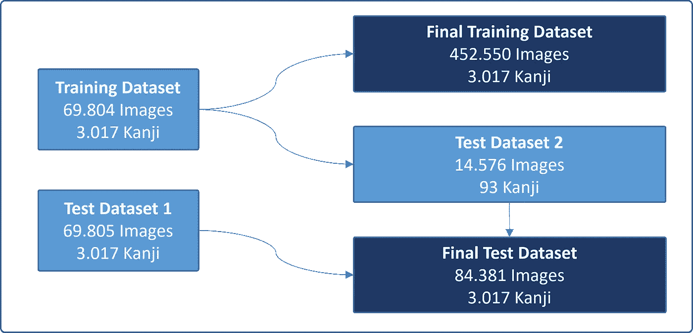
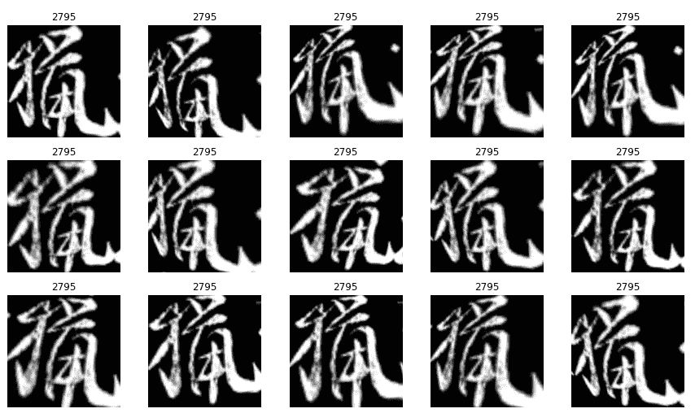
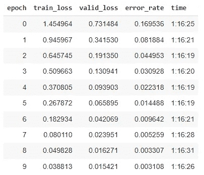
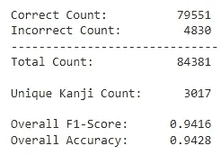
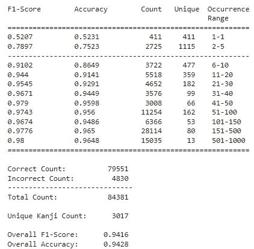
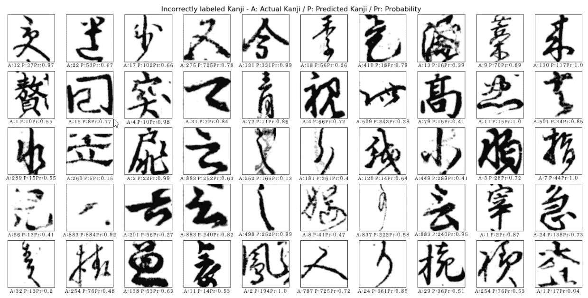

# 使用 fastai 对日本汉字字符进行分类

> 原文：<https://towardsdatascience.com/using-fastai-to-classify-japanese-kanji-characters-47d7edd4d569>

## 如何处理不平衡数据


图片由来自 Pixabay 的 ogamiichiro3 提供

# 介绍

本文描述了如何使用 fastai 进行多类分类，特别是 3，017 类日本汉字字符。除了平假名和片假名，汉字字符是日语书写系统的主要部分。有成千上万个汉字字符，这使得探索多类分类模型成为一种具有挑战性的方法。所有的实验都在 Google Colab 中执行。我在本文中包含了各种代码片段，完整的代码可以在 [GitHub](https://github.com/cgn-shinkirou/kkanji) 上找到。

# 文章焦点

*   如何处理不平衡数据
*   如何使用 fastai 进行日文字符分类

## fastai 有什么优势？

Fastai 是由杰瑞米·霍华德和雷切尔·托马斯创建的开源库。它建立在 PyTorch 之上，是一个非常棒的工具，只需几行代码就可以创建执行机器学习模型。它主要依赖于像 **ResNet152** 这样的预训练模型的迁移学习，这些模型可以在新的任务和数据集上进行训练。为了了解这个库的一切，fast.ai 有一个非常棒的实用课程，完全免费。在他们的官方网站[这里](https://www.fast.ai/)了解更多。

## 数据集

Kuzushiji-Kanji 数据集专注于草书日本字符，已在 Tarin Clanuwat 等人的[本文](https://arxiv.org/abs/1812.01718)中介绍。该数据集由人文科学开放数据中心(CODH)创建，基于日本国立文学研究所创建的 Kuzushiji 数据集。

本文介绍了三个数据集，其中 Kuzushiji-Kanji 数据集是最具挑战性的。总共有 140，426 幅图像(64 x 64 灰度)和 3，832 个独特的汉字字符。数据集以 tar 格式提供，可以使用 tar 文件提取。完整代码在我的笔记本**[**00 _ Split Dataset**](https://github.com/cgn-shinkirou/kkanji/blob/main/00_Split%20Dataset.ipynb)中。**

```
import tarfile
fname = "/MyDrive/Colab Notebooks/fastai/dataset/kkanji.tar"
tar = tarfile.open(fname)
tar.extractall()
tar.close
```

**所有的图像都组织在文件夹中，这些文件夹标有汉字字符代码的 unicode。为了更容易处理数据，所有的图像和标签都用下面的函数转换成 NumPy ndarrays。然后 ndarrays 被保存为 npz 文件。**

```
import pathlib
my_dir = "/content/kkanji"#Dummy black image/label to setup the ndarray
imgs = np.zeros((64,64), np.uint8).reshape(1,64,64) 
labels = np.array(['XXX'])for item in pathlib.Path(my_dir).glob('**/*.png'):
  image = np.array(Image.open(item)).reshape(1,64,64)
  imgs = np.concatenate([imgs,image])
  parent = os.path.dirname(item).split('/')[-1]
  labels = np.concatenate([labels,np.array([parent])])# Delete the dummy picture
imgs = np.delete(imgs,0,0)
labels = np.delete(labels,0,0)# Save as npz file
savez_compressed('/content/kkanj-imgs.npz', imgs)
savez_compressed('/content/kkanji-labels.npz', labels)
```

**不幸的是，该数据集没有官方测试集，因此很难将结果与其他模型进行比较。因此，我们为这个实验创建了一个独特的测试数据集，使用 50/50 分割来分离可用数据。但是有一个问题:数据集非常不平衡，从 1766 个例子到每个类只有一个例子。这意味着对于一个平均的训练/测试分割，每个类至少需要两个例子。结果，815 个汉字字符必须从数据集中删除，因为这些类只有一个可用的例子。**

**使用标签(unicode)创建数据帧，并使用 **value_counts()** 计算标签在数据帧中出现的次数(出现次数)。**

```
# Create a DataFrame with unicode and occurrence
unicode = pd.DataFrame(y,columns=['unicode'])
values = pd.DataFrame(unicode.value_counts(),columns=['occurrence'])
df = pd.merge(unicode,values,on ='unicode')
df
```

****

**每个 unicode 类出现的数据帧**

**然后选择类别出现次数高于 1 的索引列表，并创建新的精简数据集。**

```
# Indexes with occurrence > 1
select_indices = list(np.where(df['occurrence'] > 1)[0])# Reduce the dataset. Characters with occurrence of only 1 are excluded
X_reduced = X[select_indices]
y_reduced = y[select_indices]# Print shape
print(f"X_reduced shape: {X_reduced.shape}")
print(f"y_reduced shape: {y_reduced.shape}")
```

****

**之后，使用 **train_test_split** 创建了一个训练/测试数据集。使用**分层**参数来确保所有等级的比例保持不变是很重要的。**

```
from sklearn.model_selection import train_test_split
testSize = 0.5x_train, x_test, y_train, y_test = train_test_split(X_reduced, y_reduced, test_size=testSize, random_state=1, stratify=y_reduced)# Print shape
print(f"Training Images: {x_train.shape}")
print(f"Test Images: {x_test.shape}")
```

****

**下面的图 1 显示了用于创建训练和测试数据集的步骤的概述。**

****

**图 1**

**GitHub 有 100 MB 的数据存储限制，因此所有数据集都可以在 **Internxt** 上下载:**

****原始数据集**
[kk Anji-Original-labels . npz](https://drive.internxt.com/0874e2b0b393f3f1c529)
[kk Anji-Original-imgs . npz](https://drive.internxt.com/47ce631dc463a7f3d68b)**

****训练/测试数据集**
[kkan Ji-train-imgs . npz](https://drive.internxt.com/ab823b0528b50f87ae06)
[kkan Ji-train-labels . npz](https://drive.internxt.com/2ab2a2954587dde5b7fd)
[kkan Ji-Test-imgs . npz](https://drive.internxt.com/b27946700a4e5b63fa4c)
[kkan Ji-Test-labels . npz](https://drive.internxt.com/a474a9e8fe5837397d90)**

**接下来，重要的是处理数据集中严重不平衡的类的问题。**

## **不平衡数据**

**不平衡的数据集可能会使创建良好的机器学习模型变得非常困难，因为通常，ML 算法是在假设每个类的示例数量相等的情况下设计的。杰森·布朗利对这个话题做了很好的概述。**

**克服这个问题的一个方法是对数据进行重新采样，正如艾米丽·波蒂拉杰·⁴.所描述的图 2 给出了重采样过程的概述。**

****

**图 2**

**最终数据集可以在这里下载:
[kk Anji-final-test-imgs](https://drive.internxt.com/67b0aeda2a76a264e016)
[kk Anji-final-test-labels](https://drive.internxt.com/ed547780a075cc43b8cc)
[kk Anji-final-train-imgs](https://drive.internxt.com/1ca7de49cc6e3480a101)
[kk Anji-final-train-labels](https://drive.internxt.com/8b75117a9b272d0db7f9)**

**数据重采样的完整代码在笔记本[**01 _ 重采样数据**](https://github.com/cgn-shinkirou/kkanji/blob/main/01_ResampleData.ipynb) 中。使用的阈值是 150，这意味着所有的类都以这样一种方式被重新采样，即每个类恰好由 150 个例子组成。如果一个类的实例多于阈值，则使用 **train_test_split** 随机选择 150 个实例，并用于训练数据集(此处: **df_upsampled** )。其余的例子被插入到测试数据集 2 中(这里: **df_rest_upsampled** )。**

```
# indexes of the labels
labelIndexes= df.index.to_numpy()# train and test split --> indexes
training, testing, _, _ = train_test_split(labelIndexes,labelIndexes, test_size=150, random_state=42)# 150 randomly selected rows  
df_upsampled = new_x_train.iloc[testing]# remaining rows, used for test dataset 2
df_rest_upsampled = new_x_train.iloc[training]
```

**一个例子较少的类，通过随机复制已有的图片来扩充。来自 sklearn 库的 [*重采样*](https://scikit-learn.org/stable/modules/generated/sklearn.utils.resample.html) 被用于此。**

```
# resample to 150
df_upsampled = resample(df,random_state=42,n_samples=150,replace=True)
```

**使用与用于训练输入的图像相同的图像可能不是创建执行机器学习模型的好主意。由于这个原因，在训练阶段后期使用数据扩充来转换训练图像。**

**利用这种方法，产生了新的重采样训练数据集，该数据集具有 452，550 幅图像和 3，017 个汉字字符类，其中每个类由正好 150 个例子组成。测试数据集 2 和测试数据集 1 被组合在具有 84，381 个图像的最终测试数据集中。**

# **培养**

**模型训练的代码可在笔记本 [**02_kkanji 模型**](https://github.com/cgn-shinkirou/kkanji/blob/main/02_kkanji%20model.ipynb) 中找到。为了准备数据和训练模型，fastai 需要一个 DataLoaders 对象，它包含一个训练数据加载器和一个验证数据加载器。这方面的挑战是如何使用 NumPy ndarrays 将数据输入 DataLoaders 对象。大多数 fastai 示例通过路径位置传递数据。这个数据加载器对象的创建是基于 Nghia Ho⁵.公司的代码**

```
def make_dataloaders_from_numpy_data(image, label):
    def pass_index(idx):
        return idx def get_x(i):
        return image[i] def get_y(i):
        return label[i] dblock = DataBlock(
        blocks=(ImageBlock, CategoryBlock),
        get_items=pass_index,
        splitter=IndexSplitter(test_index), # stratified split
        get_x=get_x,
        get_y=get_y,
        item_tfms = Resize(IMAGESIZE),
        batch_tfms=aug_transforms(do_flip=False, p_affine=1) 
        )

   # pass in a list of index
    num_images = image.shape[0]
    dls = dblock.dataloaders(list(range(num_images)))
    return dlsdls = make_dataloaders_from_numpy_data(x_train, y_train)
```

```
# StratifiedShuffleSplit for the dataloaders object. This ensures that test and validation dataset include all Kanji charactersfrom sklearn.model_selection import StratifiedShuffleSplitsss = StratifiedShuffleSplit(n_splits=1, test_size=0.5, random_state=2018)for train_index, test_index in sss.split(x_train, y_train):
    X_trainfin, X_testfin = x_train[train_index],x_train[test_index]
    y_trainfin, y_testfin = y_train[train_index],y_train[test_index]
```

**关于自定义数据块，需要注意几个重要事项:**

*   ****splitter** :默认情况下，DataBlock 随机分割数据用于训练和验证，因此训练集可能包含不在验证集中的类，反之亦然。为了避免这种情况，使用了 **stratifiedShuffleSplit** 为验证集创建一个索引拆分，并将其作为参数传递到 **IndexSplitter** 中。**
*   ****item_tfms** :所有图像的大小从 64 调整到 224，因为它改进了模型。**
*   ****batch_tfms** :使用 aug_transforms，图像被转换以创建一组更加多样化的图像，从而改进模型。我设置 **do_flip=False** 不翻转图像，设置 **p_affine=1** ，这增加了应用每个变换和对称扭曲的概率。其他变换应用其默认值。**

**使用 **show_batch** 和参数 **unique=True** ，可以检查增强的训练图像看起来像什么。这些图像稍加变换，就可以得到一个具有更好预测能力的模型(图 3)。**

```
# Display various versions of augmented transformed images
dls.train.show_batch(max_n=50, nrows=10, unique=True,cmap='gray')
```

****

**图 3:增强图像**

**为了开始训练，一个带有 **Resnet152** 模型的 **cnn_learner** 被创建。训练了 10 个纪元，学习率为 0.01。**

**尝试了不同的设置，例如不同的学习率，滑动学习率在训练阶段给出了稍好的结果。最终，在 10 个时期的训练后，以 0.01 的固定学习率实现了最低的训练和有效损失。培训总时间约为 13 小时。**

```
# Create a Learner object
learn = cnn_learner(dls, model, metrics=error_rate)# Train a model for 10 epochs
learn.fit_one_cycle(10, lr_max=0.01)
```

****

**训练时代**

# **结果**

**如下所示，该模型在测试数据集上生成了出色的结果。在 84，381 个样本中，有 4，830 个样本被错误分类，导致 F1 总分为 0.9416。**

****

**但是这个模型在不同的发生范围内会有怎样的表现呢？如前所述，数据集最初非常不平衡，因此，训练数据集中的每个类都被重新采样为 150 的固定大小。这意味着有些字符在训练数据集中只存在过一次(出现次数= 1 ),并且被复制了 149 次。因此，这就引出了一个问题，即该模型是否也能在被人为扩展的类上表现良好。**

**下面的表 1 给出了 **F1 分数**、**准确度**、**示例计数数量**、**独特汉字字符数量**以及**出现范围**的概述。它显示了模型在这些不同范围内的表现。正如所料，F1 分数对于出现范围非常低的字符来说非常差。只有一个例子的字符类的 F1 值为 0.5207。但是，随着事件的增多，分数会提高。如果一个字符在训练数据集中出现至少六次，F1 值就会超过 0.91。这表明创建高性能的分类器不需要大量的例子。**

****

**表 1:结果概述**

## **预测错误的汉字**

****图 4** 显示了使用辅助功能 *display_images* 生成的错误预测汉字字符的图像。每个图像都标有实际字符、预测字符和预测概率。在某些情况下，可以看出实际的和预测的汉字是相似的，因此容易被错误分类。在其他情况下，这可能意味着标签不正确。**

****

**图 4:标签不正确的汉字**

```
# Helper function to display Kanji and label
def display_images (x_figure,y_figure, prediction, probability):
  image_views = len(y_figure)
  columns = 10
  rows = np.ceil(image_views / columns)
  for counter in range(0,image_views):
    plt.subplot(rows,columns,counter + 1)
    plt.xticks([])
    plt.yticks([])
    plt.grid(False)
    plt.xlabel('A:' + str(char_df.iloc[y_figure[counter],3]) + ' P:' + str(char_df.iloc[prediction[counter],3]) + 'Pr:' + str(probability[counter]),fontproperties=fprop,fontsize=12)
    plt.imshow(x_figure[counter],cmap=plt.cm.binary)
```

```
# Display Kanji characters
figure, _ = plt.subplots(figsize=(20,10))
figure.suptitle('Incorrectly labeled Kanji - A: Actual Kanji / P: Predicted Kanji / Pr: Probability', fontsize=16)
figure.tight_layout(pad=3.0)
display_images(x_figure,y_figure,prediction, probability)
```

# **结论**

**如结果所示，不平衡数据集的问题可以通过对训练数据集进行重采样来简单地克服。还证明了由于 fastai 库，创建高性能模型不需要一个类的大量数据。**

## **参考**

**Tarin Clanuwat，Mikel Bober-Irizar，Asanobu 北本，Alex Lamb，Kazuaki Yamamoto，David Ha，日本古典文学深度学习，可从[https://arxiv.org/abs/1812.01718](https://arxiv.org/abs/1812.01718)获得。**

**该数据集可从[https://github.com/rois-codh/kmnist](https://github.com/rois-codh/kmnist)获得，受许可 [CC BY-SA 4.0](https://creativecommons.org/licenses/by-sa/4.0/) 许可，可自由共享和改编。**

**Jason Brownlee，对不平衡分类的温和介绍，机器学习掌握，可从[https://machinelementmastery . com/what-is-unbalanced-Classification/，](https://machinelearningmastery.com/what-is-imbalanced-classification/,)2021 年 12 月 6 日访问。**

**⁴·艾米丽·波蒂拉杰(沃特金斯)，改善图像数据类别不平衡的 4 种方法，走向数据科学，可从[https://towardsdatascience . com/4-ways-to-improve-class-unbalancy-for-image-data-9 adec 8 f 390 f 1](/4-ways-to-improve-class-imbalance-for-image-data-9adec8f390f1)获得，2021 年 12 月 2 日访问。**

**http://nghiaho.com/?p=2741发布，2021 年 11 月 3 日访问。**